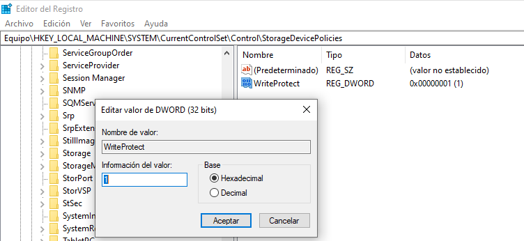
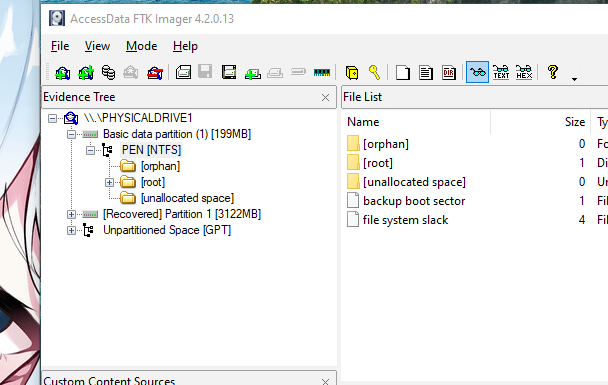
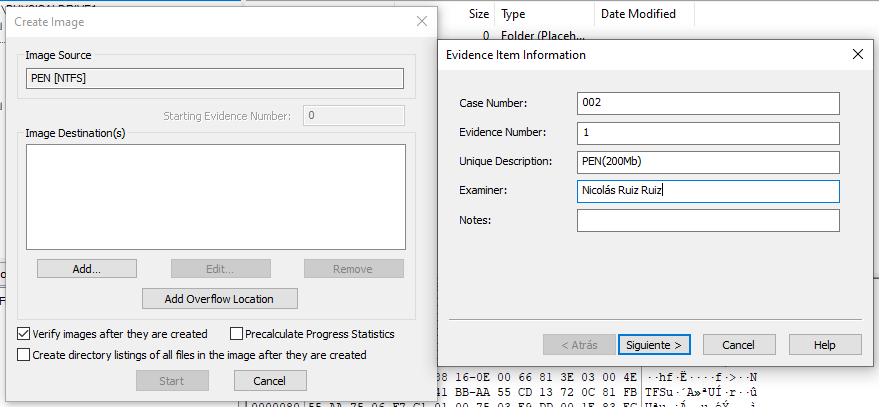
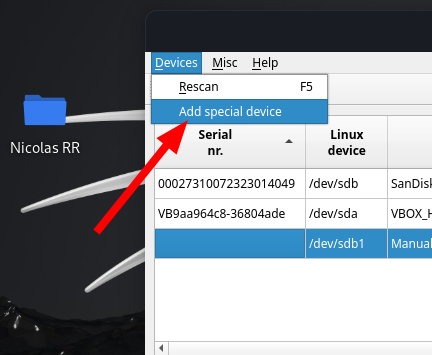
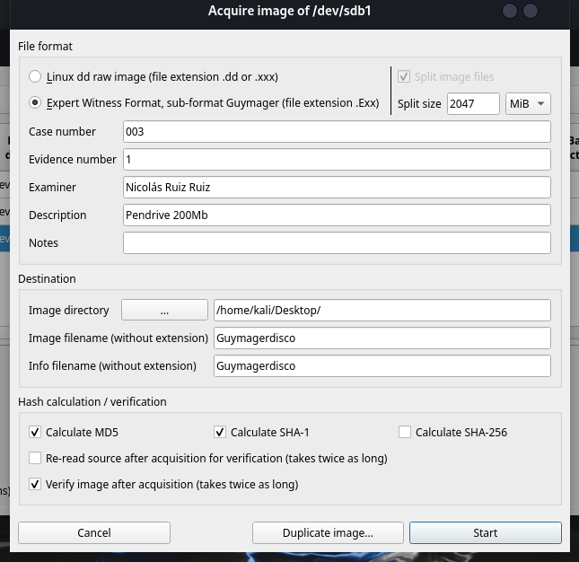
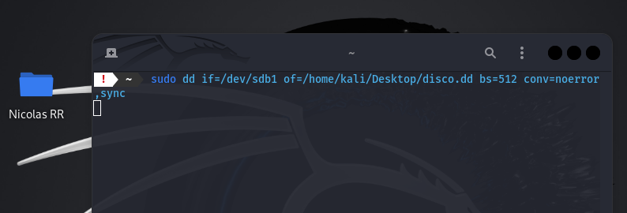

# Adquisición forense de una memoria USB

Para esta práctica, voy a hacer uso de las herramientas proporcionadas, para realizar una adquisición de un pendrive de **200Mb**.

Vamos a suponer que nos encontramos trabajando en nuestro taller forense donde tenemos varios ordenadores con sistemas operativos windows y linux(kali). Teniendo esto en cuenta, empecemos con la adquisición.

## Adquisición usando FTK Imager

Para adquirir usando FTK Imager, voy a usar un ordenador con Windows 10.

Lo primero que haré es crear una politica contra escritura haciendo lo siguiente:



Una vez hecha la política, abrimos la aplicación y añadimos el pendrive.


> Salen 2 particiones, pero solo nos fijaremos en la de 200Mb

Hago click derecho en la partición *PEN* y la exporto como imagen logica.



Terminamos con la adquisición y guardamos el hash:

| Format | HASH |
|-|-|
| MD5 | 0dd417c7a20b09f3f4088c83fe483f07 |
| sha1 | 9a86ec15250b33d473093ba06741a5fec2401b8d |

## Adquisición usando Guymager

Para la siguiente adquisición haré uso de Kali Linux y el programa Guymager.
Al abrir el programa, con super usuario y desde la consola, es posible que no nos salga el dispositvo o la particón, tenemos que hacer lo siguiente:



Y abajo, donde pone *File name:*, ponemos la ruta del disco, por ejemplo */dev/sdb1*
Ahora que ya está añadido, click derecho *Adcquire img/image* y ponemos:



Le damos a start y nos dará 2 archivos: la adquisición y un archivo de información con el HASH.

Terminamos esta parte y guardamos el hash:

| Format | HASH |
|-|-|
| MD5 | 5968f12e57c104c898208a6caeac6c4b |
| sha1 | b9b7346d307b3da585a56f12c0ac8f8ad1f5b7fc |

## Adquisisción usando dd

Para la última adquisición, la haré en Kali nuevamente.
Usaré el siguiente comando:

```bash
dd if=/ruta/disco of=/ruta/para/guardar/dico.dd bs=512 conv=noerror,sync
```

Lo cambiamos un poco para que sirva en nuestro sistema y ejecutamos el comando:



Cuando finalice, tendremos un archivo llamado disco.dd en el escritorio del kali.

Terminamos y guardamos el hash:

| Format | HASH |
|-|-|
| MD5 | 5968f12e57c104c898208a6caeac6c4b |
| sha1 | b9b7346d307b3da585a56f12c0ac8f8ad1f5b7fc |

## Fuentes

- [Link Drive](https://drive.google.com/file/d/1JmnLX9qTO_NjI0ay7lD9WJKr0agKrahV/view?usp=sharing)
- [FTK Imager](https://keepcoding.io/blog/que-es-ftk-imager-y-para-que-sirve/)
- [GuyImager](https://guymager.sourceforge.io/)
- [dd(Linux)](https://man7.org/linux/man-pages/man1/dd.1.html)