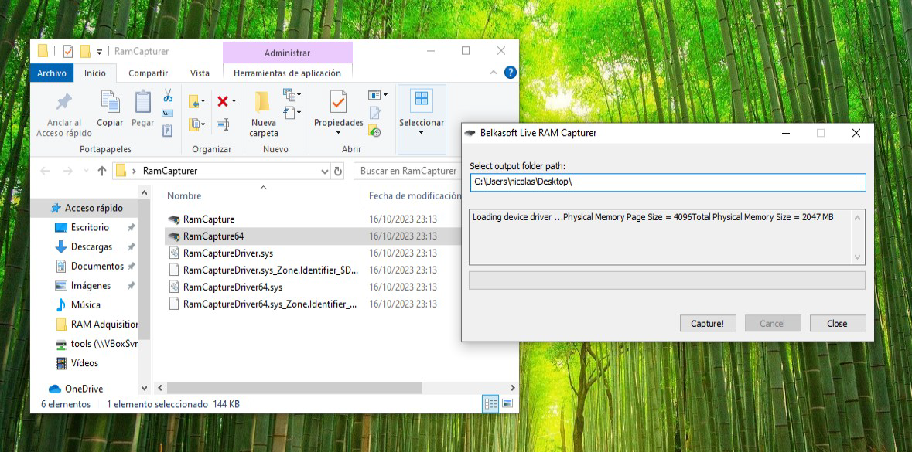
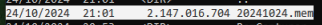
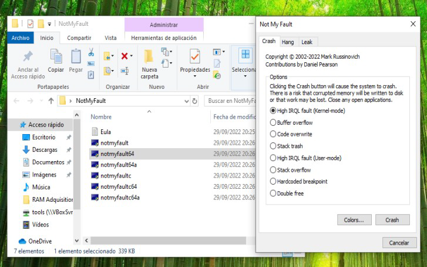
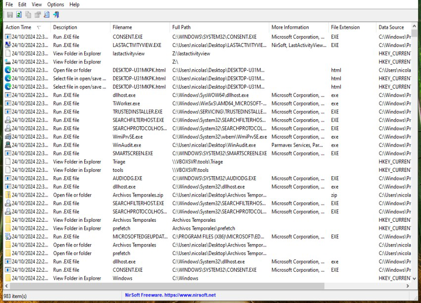
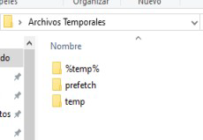
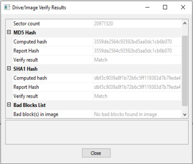
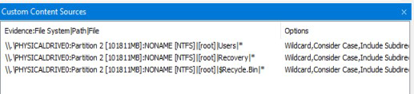
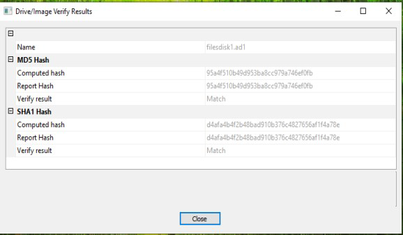
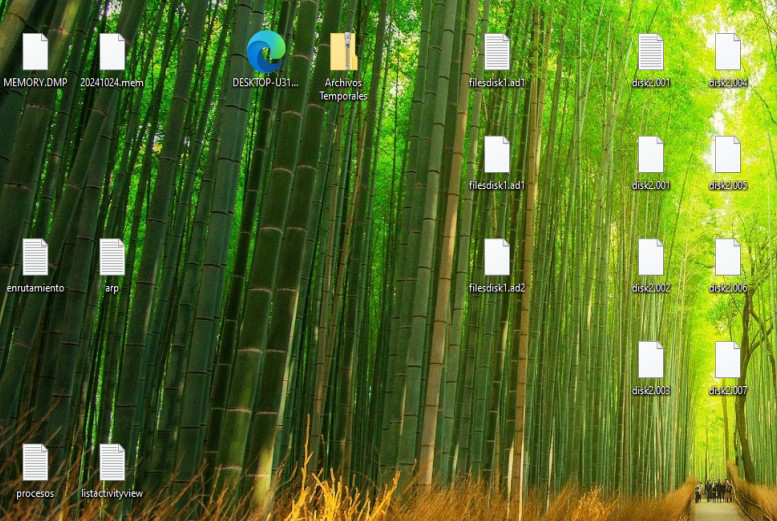
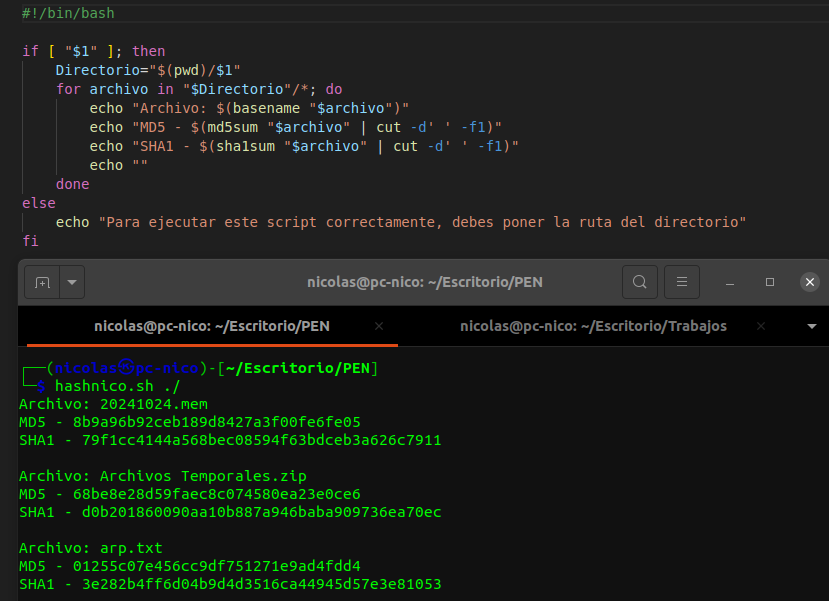

# Adquisición forense en vivo

## Introducción

En esta práctica se pide realizar una adquisición forense (live) de una máquina Windows, en mi caso Windows 10 (memoria volátil y no volátil). Para ello, voy a hacer uso de las herramientas proporcionadas por el profesional Manuel Jesús Rivas Sández, y la metodología propia creada en la práctica anterior.

> [!NOTE]
> Lo siguiente no se trata de un informe de adquisición, esta tarea es previa a la realización de cualquier informe.

## Herramientas

Antes de empezar con la adquisición y poner en práctica nuestra metodología, voy a presentar una selección de las herramientas que voy a utilizar. Es importante tener varias para los casos en los que algunas fallen. Las herramientas a utilizar son:

1. RAMcapture
Hace un volcado completo de la memoria en un archivo del mismo tamaño. Puede ser usado tanto en modo gráfico como por línea de comandos.

2. Notmyfault
Esta aplicación, produce un crasheo en el sistema, haciendo así que Windows cree por si mismo un volcado de la memoria, aunque no lo hace por completo y se usa más bien como ultimo recurso.

3. Lastactivityview
Nos proporciona un listado de todos los servicios abiertos por la máquina en un lapso de tiempo concreto. Es ideal para saber que se hizo a una hora concreta.

4. Winaudit
Genera un reporte de la actividad y el estado del sistema. Este programa se puede utilizar tanto gráficamente como por comandos.

5. FTK Imager
Con esta herramienta podemos hacer volcados de la memoria RAM, imágenes completas del disco o carpetas concretas.

6. CMD con comandos del sistema.

> [!IMPORTANT]
> Es completamente necesario ejecutar todos estos programas como administrador, en caso contrario puede dar fallos.

## Adquisición de las evidencias

Para hacer la adquisición, voy a seguir los pasos de nuestra metodología:

### Preservación de la escena

Bueno, al tratarse de un caso ficticio, donde vamos a probar el uso de las herramientas y la metodología, este paso me lo voy a saltar, pero en un caso real, deberíamos acordonar la zona para que nadie no autorizado pueda entrar y usar guantes para evitar la contaminación de pruebas.

### Identificación de dispositivos

Portátil HP con windows 10 instalado y conectado a la RED.

### Documentación inicial

Con un pequeño vistazo al portátil puedo sacar un poco de información.

- **Parte trasera pantalla[1]**: El portátil HP pertenece a la Junta de Andalucía proporcionado por la unión Europea gracias al “Programa Educa en Digital”. Además podemos apreciar que tiene el identificador “EED-AN-2021-1”.

- **Parte trasera teclado[2]**: Reafirmamos que la máquina es de la Junta de Andalucía, más concretamente del “CAUCE”, encontramos el siguiente número de teléfono 955 06 10 71 y el siguiente código de Artículo: 847/1008 00218/ISE/2021/SC. Apreciamos que se trata de un HP 250 G7 modelo “RTL8872CE” y que está etiquetado con el número 64, probablemente por la unidad escolar.

- **Parte delantera pantalla[3]**: El dispositivo se encuentra encendido y puedo ver el escritorio de Windows 10 completamente vacío a excepción de la papelera de reciclaje.

- **Parte delantera teclado[4]**: Dispone de una pegatina la cual indica que tiene un procesador Intel Core i3

> [1]

> [2]

> [3]

> [4]

### Consideración de la volatilidad

A la hora de recoger las evidencias, tenemos que tener claro el orden de prioridad de estas, debido a la existencia de memorias volátiles como la RAM. Entonces tengo que tener en cuenta esto mismo para recabar la información, y, en base a las pautas de la práctica, podemos establecer el siguiente orden:

1. Contenido de la memoria RAM.
2. Tablas de enrutamiento y caché ARP.
3. Tablas de procesos en ejecución.
4. Archivos temporales del sistema.
5. Contenido de los discos duros.
6. Medios de almacenamiento externo.

### Captura de datos volátiles

Siguiendo el orden del punto anterior, voy a utilizar las herramientas propuestas para la adquisición de la memoria RAM.

- **RAMcapture**

Simplemente ejecutamos el programa, especificamos la ruta de salida y le damos a “capture!”

Y si todo sale bien, nos quedará un archivo como este:

Lo guardamos en un disco duro y continuamos con la adquisición.

- **NotMyFault**

Este programa deberíamos usarlo solo en el último de los casos, ya que reinicia el sistema, entonces deberíamos pensar en si merece la pena o no hacerlo ya que, además, no copia toda la memoria RAM. El método para usarlo es ejecutar el programa, dejar todo por defecto y darle a “crash”:

Al darle al botón, nos crasheará el sistema dando un pantallazo azul, pantallazo el cual nos dará como resultado un archivo con información de la memoria RAM. Una vez adquirida la RAM, podemos pasar a sacar información relevante del sistema con el programa “Winaudit”. Lo ejecutamos y, cuando termine, le damos a guardar, se nos guardará la tabla en formato .html

---

Veamos ahora la adquisición de las tablas de enrutamiento y caché ARP, y para esto vamos  hacer uso de comandos del ``consola``. Abrimos un cmd, siempre como administrador, y escribimos los siguientes comandos:

    route print > enrutamiento.txt
    arp -a > arp.txt

De esta forma crearemos 2 archivos con la información de la tabla de enrutamiento y la caché del ARP.

Copiemos ahora los procesos en ejecución con el siguiente comando:

    tasklist > procesos.txt

Y para los procesos que se han cerrado, usamos “LastActivityView”, el cual también nos permite guardar el resultado en un archivo txt.

Para copiar los archivos temporales del sistema pulsamos “Win + R” y escribimos “temp”, los archivos los copiamos en una carpeta, ahora, ponemos “%temp%” y volvemos a copiar, y por último escribimos “prefetch” y copiamos todo. 

Debería quedarnos una carpeta principal con 3 subcarpetas:

Por último, vamos a hacer una imagen de un disco con “FTK Imager”, añadimos los discos que tenga la máquina, en mi caso 2. Voy a hacer una imagen completa del disco2:

Y carpetas importantes del disco1 (“Users”, “Recovery” y “$Recycle.Bin”):

---

No tenemos dispositivos de almacenamiento externo así que hemos terminado el proceso de adquisición, y tendríamos un escenario como este:

## Tabla de hashes

Solo nos quedaría realizar una tabla con el hash de cada archivo para asegurar la existencia y la integridad de estos:

| Tipo de información | Archivo                | Fecha de recolección -| HASH MD5 - SHA1 |
| ------------------- | ---------------------- | --------------------  | --------------- |
| Memoria RAM         | MEMORY.DMP             | 24/10/24 20:56        | 43ce240f43cf5b31b82d8b03ef395181 6d41546ba4851c184b69b97e25b25b8ca9cada62 |
| Memoria RAM         | 20241024.mem           | 24/10/24 21:01        | 8b9a96b92ceb189d8427a3f00fe6fe05 79f1cc4144a568bec08594f63bdceb3a626c7911 |
| Archivos temporales | ArchivosTemporales.zip | 24/10/24 22:27        | 68be8e28d59faec8c074580ea23e0ce6 d0b201860090aa10b887a946baba909736ea70ec |
| Tablas de enrutamiento | enrutamiento.txt    | 24/10/24 22:10        | 90d82a7854b471ae29ec824b3b124c8f 207e5e052a8e69dc4d18b2b02f97b50586f60069 |
| Caché ARP           | arp.txt                | 24/10/24 22:11        | 01255c07e456cc9df751271e9ad4fdd4 3e282b4ff6d04b9d4d3516ca44945d57e3e81053 |
| Procesos activos    | procesos.txt           | 24/10/24 22:15        | df5f34d4a532759e2f808593e829fef9 55512493254fe57d1f6e916d9def17453aa093e1 |
| Lista de la ultima actividad | listactivityview.txt | 24/10/24 22:37 | f102c96d1bebdb9eb861f38f0a6b6d7c 79dfe236e5b68fc36e3d855ec51544b85e3eeff8 |
| Información del sistema | DESKTOPU31MKPK.html | 24/10/24 22:33       | 5eb43e88ce46e829f95695dff2851e50 4807ef3a6d641eb7e3734be53a0942e64000743b |
| Imagen disco        | disco1.zip             | 25/10/24 10:26        | 4ebc85547b4ab4df2996db9b836b2d0c bc30b3a1bfc5100eb9d8b3317e0084b15b4ca0ab |
| Directorios extraidos | disco2.zip           | 25/10/24 10:26        | 8bc5796a9834dc1c3e12905f0780889c a23ca22420bf10bdfe7f680cbc3a0d8ae4737658 |

---

Para hacer el calculo del HASH e usado un script de bash que busca todos los archivos en una carpeta y ejecuta los comandos md5sum y sha1sum con cada uno de estos.

## Conclusión

De esta forma, ya habría terminado con la adquisición de evidencias digitales cumpliendo con
nuestra metodología. Solo restaría llevar las evidencias a nuestro centro de trabajo para realizar el análisis forense, siempre manteniendo las copias originales de los archivos. 