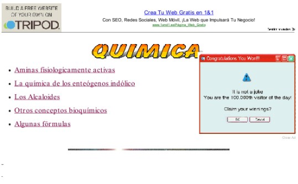
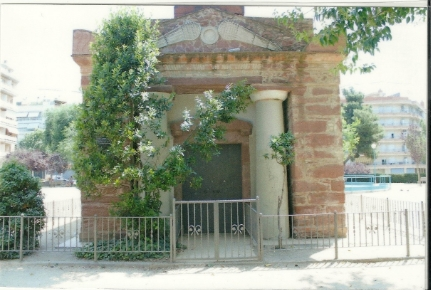
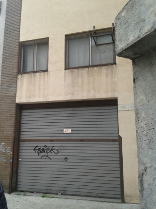
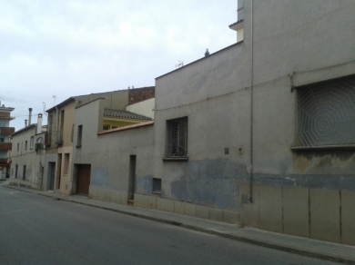

# Análisis forense de una imagen de disco duro

## Datos de contacto

- Autor: Nicolás Ruiz Ruiz
- Correo: nruirui214@g.educaand.es
- Fecha: 09-11-24

## Introducción

En esta ocasión, formo parte de un equipo de peritos informáticos los cuales deben analizar un disco duro proporcionado por la policía. El resumen del caso es el siguiente:

_En una entrada y registro policial en un domicilio compartido por varias personas, se localizó y decomisó un ordenador personal que, quizás, pudiera estar relacionado con un presunto delito de tráfico de sustancias estupefacientes. A raíz del decomiso, una brigada especializada de un cuerpo policial realiza la clonación del disco duro contenido en el ordenador y tramita su imagen forense a tu laboratorio para que realices un informe pericial de su contenido. Para llevar a cabo esta tarea dispones de una autorización del juez que instruye el caso, por la cual puedes analizar cualquier contenido local del disco duro intervenido._

---

## Calculo de hashes

> ![NOTE]
> Para este proyecto, deberemos contestar a las preguntas proporcionadas en el caso práctico.

## Describe el entorno de trabajo que has escogido para realizar la actividad.

Para la realización de esta práctica, voy a usar una máquina virtual(VirtualBox) de Windows 11 instalada en un portátil HP modelo G20.

Las herramientas que voy a utilizar son:

- Autopsy 4.21.0
- MiTec Windows Register Recovery
- http://exifdata.com
- John the Ripper

## Describe, como mínimo, la información siguiente, relacionada con el sistema operativo instalado en el sistema informático que estás analizando

### 1. ¿Qué tamaño tiene la partición a analizar?

La partición a analizar tiene un tamaño de 2623832064 Bytes, unos 2.62 Gb y un tamaño de sector de 512 Bytes.

### 2. Sistema y versión del sistema operativo instalado.

El sistema operativo instalado se trata de un Windows XP.

### 3. Nombre del usuario y organización registrados.

Vemos que el usuario principal es John y que pertenece a la organización home.

### 4. “Product ID” asociado al sistema.

El product ID es 76487-341-1072684-22504

### 5. “Service Pack” instalado.

El Service Pack instalado es el Service Pack 3.

### 6. Fecha y hora de instalación del sistema operativo.

Si extraemos los archivos software y system que se encuentran en la ruta /img_AFI_W.E01/WINDOWS/system32/config, y los abrimos con la herramienta MiTec WRR, nos da el siguiente resultado:

La fecha y hora de instalación del SO fue 18 de Abril de 2013 a las 15:17:02

### 7. Fecha y hora del último “shutdown”.

La fecha y hora del shutdown, es 19/06/2013 2:11:46

## Determina qué usuarios hay definidos en el sistema (sin contar con los usuarios definidos por defecto).

En la sección OS Accounts, podemos encontrar los siguientes usuarios:

Los usuarios del sistema son: John, Ian y Jessy. Para ver más información de los usuarios debemos extraer el archivo SAM de la carpeta anterior y abrirla con el programa WRR.

Con este archivo, podemos sacar la siguiente información:

1. John, se conectó por última vez el 28 de marzo de 2013 a las 3:10:49, cambió su contraseña el 18 de abril de 2013 a las 15:18:44 y su cuenta expira el 30 de diciembre de 1899 a las 2:48:05

2. Ian, se conectó por última vez el 25 de abril de 2013 a las 2:06:52, cambió su contraseña el 18 de abril de 2013 a las 15:18:44 y su cuenta expira el 30 de diciembre de 1899 a las 2:48:05

3. Jessy, se conectó por última vez el 23 de abril de 2013 a las 2:18:56, cambió su contraseña el 18 de abril de 2013 a las 15:18:44 y su cuenta expira el 30 de diciembre de 1899 a las 2:48:05

Con estos datos, se nos crea la siguiente pregunta, si el último inicio de sesión fue el 25 de abril, ¿por qué el equipo no se apagó hasta el 19 de junio? No sé a que puede darse esto pero podemos decir que lo que pasó en ese periodo de casi 2 meses está asociado al usuario Ian.

## Localiza, extrae y relaciona los siguientes hallazgos, asociándose, si es posible, al usuario al cual pertenecen

### 1. Localización y extracción de archivos eliminados

He encontrado un total de 582 archivos eliminados, de los cuales voy a destacar las imágenes de los almacenes de terrassa y mataro:

| | |
|-|-|
|**Ruta y nombre**| /img\_AFI\_W.E01/$OrphanFiles/Almacen mataro.jpg |
|**Tamaño (bits)** | 6998 |
|**Fecha de creación** | 2013-06-19 04:11:24 CEST |
| **MD5** | c7c5a5521ed005ddad94cb9a9b254d6b |
|**Imagen** |  |

|                       |                                                    |
| --------------------- | -------------------------------------------------- |
| **Ruta y nombre**     | /img\_AFI\_W\.E01/\$OrphanFiles/Almacen mataro.jpg |
| **Tamaño (bits)**     | 6998                                               |
| **Fecha de creación** | 2013-06-19 04:11:24 CEST                           |
| **MD5**               | c7c5a5521ed005ddad94cb9a9b254d6b                   |
| **Imagen**            |                    |

|                       |                                                                |
| --------------------- | -------------------------------------------------------------- |
| **Ruta y nombre**     | /img\_AFI\_W\.E01/\$OrphanFiles/Almacen terrassa.jpg           |
| **Tamaño (bits)**     | 9637                                                           |
| **Fecha de creación** | 2013-06-19 04:11:24 CEST                                       |
| **MD5**               | e9bc32019fe6c4bffb1ec9bef18b85aa                               |
| **Imagen**            |  |

|                       |                                                                |
| --------------------- | -------------------------------------------------------------- |
| **Ruta y nombre**     | /img\_AFI\_W\.E01/\$OrphanFiles/Almacen terrassa 3.jpg         |
| **Tamaño (bits)**     | 6943                                                           |
| **Fecha de creación** | 2013-06-19 04:11:24 CEST                                       |
| **MD5**               | 1e6f15394d075ba43308da22ba92059c                               |
| **Imagen**            |  |

|                       |                                                                |
| --------------------- | -------------------------------------------------------------- |
| **Ruta y nombre**     | /img\_AFI\_W\.E01/\$OrphanFiles/fiesta Jorge.jpg               |
| **Tamaño (bits)**     | 8905                                                           |
| **Fecha de creación** | 2013-06-19 04:11:24 CEST                                       |
| **MD5**               | c6661d1558b767f31c1f65242af95118                               |
| **Imagen**            |  |

|                       |                                                                |
| --------------------- | -------------------------------------------------------------- |
| **Ruta y nombre**     | /img\_AFI\_W\.E01/\$OrphanFiles/kasius 2.jpg                   |
| **Tamaño (bits)**     | 5716                                                           |
| **Fecha de creación** | 2013-06-19 04:11:24 CEST                                       |
| **MD5**               | 28f5966b1a4a72cb3b434f688bf8dd0b                               |
| **Imagen**            |  |

|                       |                                                                |
| --------------------- | -------------------------------------------------------------- |
| **Ruta y nombre**     | /img\_AFI\_W\.E01/\$OrphanFiles/kasius.jpg                     |
| **Tamaño (bits)**     | 9175                                                           |
| **Fecha de creación** | 2013-06-19 04:11:24 CEST                                       |
| **MD5**               | d56befec0c93acbad7fe9d48f5415a2b                               |
| **Imagen**            |  |

|                       |                                                                |
| --------------------- | -------------------------------------------------------------- |
| **Ruta y nombre**     | /img\_AFI\_W\.E01/\$OrphanFiles/Maria en negocio Jorge.jpg     |
| **Tamaño (bits)**     | 5083                                                           |
| **Fecha de creación** | 2013-06-19 04:11:24 CEST                                       |
| **MD5**               | 18f5a99105c58f8a71a3405562d2eafa                               |
| **Imagen**            |  |

Además de estas imágenes, hemos encontrado varias fotos del procesamiento de las sustancias:

### 2. Documentos y archivos fotográficos relacionados con presuntas conductas delictivas.

Entre todos los archivo que tenemos, y los que vimos anteriormente, voy a hacer un selección de los que creo que pueden ser más importantes:

|                          |                                                                                                     |
| ------------------------ | --------------------------------------------------------------------------------------------------- |
| **Ruta y nombre**        | /img\_AFI\_W\.E01/Documents and Settings/John/Desktop/coca.pdf                                      |
| **Tamaño (bits)**        | 5,826,655                                                                                           |
| **Fecha de creación**    | 2013-04-23 02:58:42 CEST                                                                            |
| **MD5**                  | e69f1a346f981d322f4ab8105cc3d337                                                                    |
| **Dueño del archivo**    | John                                                                                                |
| **Descripción**          | *DISCUSIÓN CRÍTICA SOBRE LA TAXONOMÍA DE LAS ESPECIES CULTIVADAS DEL GÉNERO ERYTHROXYLUM P. BROWNE* |

|                       |                                                                               |
| --------------------- | ----------------------------------------------------------------------------- |
| **Ruta y nombre**     | /img\_AFI\_W\.E01/RECYCLER/S-1-5-21-1343024091-152049171-7253455 1004/Dc1.xls |
| **Tamaño (bits)**     | 323,584                                                                       |
| **Fecha de creación** | 2013-04-23 04:12:47 CEST                                                      |
| **MD5**               | 8bf95bc38e190d29924815187bf67f88                                              |
| **Dueño del archivo** | Desconocido                                                                   |
| **Imagen**            |                                                       |

|                          |                                                                                     |
| ------------------------ | ----------------------------------------------------------------------------------- |
| **Ruta y nombre**        | /img\_AFI\_W\.E01/Documents and Settings/Ian/My Documents/My Pictures/pedofilia.zip |
| **Tamaño (bits)**        | 8,899,826                                                                           |
| **Fecha de creación**    | 2013-04-23 04:08:36 CEST                                                            |
| **MD5**                  | a54529c01bf3a24963ded1fa74579de5                                                    |
| **Dueño del archivo**    | Ian                                                                                 |
| **Descripción**          | Archivo ZIP protegido con contraseña que contiene **186 imágenes**                  |

|                          |                                                                                  |
| ------------------------ | -------------------------------------------------------------------------------- |
| **Ruta y nombre**        | /img\_AFI\_W\.E01/Documents and Settings/John/Desktop/manufacturing amfetas.link |
| **Tamaño (bits)**        | 133,681                                                                          |
| **Fecha de creación**    | 2013-04-23 02:58:52 CEST                                                         |
| **MD5**                  | 9c555bd582caa34a371fad2487273833                                                 |
| **Dueño del archivo**    | John                                                                             |
| **Descripción**          | Link a foro donde se explica cómo fabricar metanfetamina en casa                 |

|                          |                                                                          |
| ------------------------ | ------------------------------------------------------------------------ |
| **Ruta y nombre**        | /img\_AFI\_W\.E01/Documents and Settings/John/Desktop/manufacturing.link |
| **Tamaño (bits)**        | 669,101                                                                  |
| **Fecha de creación**    | 2013-04-23 02:58:52 CEST                                                 |
| **MD5**                  | 290dfaa70bbb28f0e7a0b4b36b23bd34                                         |
| **Dueño del archivo**    | John                                                                     |
| **Imagen**               |            |

|                          |                                                                     |
| ------------------------ | ------------------------------------------------------------------- |
| **Ruta y nombre**        | /img\_AFI\_W\.E01/Documents and Settings/John/Desktop/providers.ico |
| **Tamaño (bits)**        | 38,400                                                              |
| **Fecha de creación**    | 2013-04-23 02:58:35 CEST                                            |
| **MD5**                  | 4a7c3029c15e632ce560f6cb8654e0a2                                    |
| **Dueño del archivo**    | John                                                                |
| **Descripción**          | Lista de **proveedores de sustancias estupefacientes**              |

### 3. ¿Los ficheros fotográficos contienen algún tipo de metadatos? En caso afirmativo, ¿qué información te permiten obtener?

Hemos encontrado los siguientes archivos con metadatos:

|                          |                                                                                                                                   |
| ------------------------ | --------------------------------------------------------------------------------------------------------------------------------- |
| **Ruta y nombre**        | /img\_AFI\_W\.E01/Documents and Settings/Jessy/Local Settings/Temporary Internet Files/Content.IE5/05O98JOH/Scan\_Pic0005\[1].jpg |
| **Tamaño (bits)**        | 433,694                                                                                                                           |
| **Fecha de creación**    | 2013-04-23 04:20:30 CEST                                                                                                          |
| **MD5**                  | a94c8baedb25d51279f3bb6b1cac787d                                                                                                  |
| **Dueño del archivo**    | Jessy                                                                                                                             |
| **Dispositivo y modelo** | HP oj\_g510g-m                                                                                                                    |
| **Imagen / Descripción** |                                                                    |

|                          |                                                                                                                                     |
| ------------------------ | ----------------------------------------------------------------------------------------------------------------------------------- |
| **Ruta y nombre**        | /img\_AFI\_W\.E01/Documents and Settings/John/Local Settings/Temporary Internet Files/Content.IE5/2BA7G783/emcdda\_building\[1].jpg |
| **Tamaño (bits)**        | 17,951                                                                                                                              |
| **Fecha de creación**    | 2013-04-23 04:01:47 CEST                                                                                                            |
| **MD5**                  | 7442a0dc89c7d2b3a2b9ded2cbe49427                                                                                                    |
| **Dueño del archivo**    | John                                                                                                                                |
| **Dispositivo y modelo** | NIKON D300                                                                                                                          |
| **Imagen / Descripción** |                                                                       |

|                          |                                                                                              |
| ------------------------ | -------------------------------------------------------------------------------------------- |
| **Ruta y nombre**        | /img\_AFI\_W\.E01/Documents and Settings/John/My Documents/mataro store/20130404\_102700.jpg |
| **Tamaño (bits)**        | 3,540,243                                                                                    |
| **Fecha de creación**    | 2013-04-23 02:58:06 CEST                                                                     |
| **MD5**                  | 76fe581ab1493da21b8acc5968efc66e                                                             |
| **Dueño del archivo**    | John                                                                                         |
| **Dispositivo y modelo** | SAMSUNG GT-I8190                                                                             |
| **Imagen / Descripción** |                               |

|                          |                                                                                              |
| ------------------------ | -------------------------------------------------------------------------------------------- |
| **Ruta y nombre**        | /img\_AFI\_W\.E01/Documents and Settings/John/My Documents/mataro store/20130404\_102702.jpg |
| **Tamaño (bits)**        | 3,529,432                                                                                    |
| **Fecha de creación**    | 2013-04-23 02:58:06 CEST                                                                     |
| **MD5**                  | a2fc7b3b4276bcebddc25b1bdfa534c8                                                             |
| **Dueño del archivo**    | John                                                                                         |
| **Dispositivo y modelo** | SAMSUNG GT-I8190                                                                             |
| **Imagen / Descripción** |                               |

|                          |                                                                                              |
| ------------------------ | -------------------------------------------------------------------------------------------- |
| **Ruta y nombre**        | /img\_AFI\_W\.E01/Documents and Settings/John/My Documents/mataro store/20130404\_102715.jpg |
| **Tamaño (bits)**        | 3,476,592                                                                                    |
| **Fecha de creación**    | 2013-04-23 02:58:06 CEST                                                                     |
| **MD5**                  | b63352ab8362d8c51cde10d3112a836f                                                             |
| **Dueño del archivo**    | John                                                                                         |
| **Dispositivo y modelo** | SAMSUNG GT-I8190                                                                             |
| **Coordenadas GPS**      | 41.53260888888889, 2.4372805555555557                                                        |
| **Imagen / Descripción** |                               |

|                          |                                                                                                |
| ------------------------ | ---------------------------------------------------------------------------------------------- |
| **Ruta y nombre**        | /img\_AFI\_W\.E01/RECYCLER/S-1-5-21-1343024091-152049171-7253455 1003/Dc2/20130329\_140030.jpg |
| **Tamaño (bits)**        | 2,828,407                                                                                      |
| **Fecha de creación**    | 2013-04-23 02:58:05 CEST                                                                       |
| **MD5**                  | 2901dd8e2ce041334f2db3f12de93e50                                                               |
| **Dueño del archivo**    | John                                                                                           |
| **Dispositivo y modelo** | SAMSUNG GT-I8190                                                                               |
| **Imagen / Descripción** |                                 |

|                          |                                                                                                |
| ------------------------ | ---------------------------------------------------------------------------------------------- |
| **Ruta y nombre**        | /img\_AFI\_W\.E01/RECYCLER/S-1-5-21-1343024091-152049171-7253455 1003/Dc2/20130329\_140033.jpg |
| **Tamaño (bits)**        | 2,771,280                                                                                      |
| **Fecha de creación**    | 2013-04-23 02:58:05 CEST                                                                       |
| **MD5**                  | 2d5dc2235a854c295150624d2c719ca7                                                               |
| **Dueño del archivo**    | John                                                                                           |
| **Dispositivo y modelo** | SAMSUNG GT-I8190                                                                               |
| **Imagen / Descripción** |                                 |

|                          |                                                                                                |
| ------------------------ | ---------------------------------------------------------------------------------------------- |
| **Ruta y nombre**        | /img\_AFI\_W\.E01/RECYCLER/S-1-5-21-1343024091-152049171-7253455 1003/Dc2/20130329\_140035.jpg |
| **Tamaño (bits)**        | 2,845,749                                                                                      |
| **Fecha de creación**    | 2013-04-23 02:58:06 CEST                                                                       |
| **MD5**                  | c189d1c1e3bf0bc600c39d136b197a68                                                               |
| **Dueño del archivo**    | John                                                                                           |
| **Dispositivo y modelo** | SAMSUNG GT-I8190                                                                               |
| **Imagen / Descripción** |                                 |

La único información relevante es la ubicación donde se tomó la fotografía /img_AFI_W.E01/Documents and Settings/John/My Documents/mataro store/20130404_102715.jpg

### 4. Hojas de calculo

En el disco encontramos las siguientes hojas de calculo:

Y a destacar, tenemos las 3 últimas:

|                       |                                                                             |
| --------------------- | --------------------------------------------------------------------------- |
| **Ruta y nombre**     | /img\_AFI\_W\.E01/Documents and Settings/John/My Documents/contrasenyas.xls |
| **Tamaño (bits)**     | 24064                                                                       |
| **Fecha de creación** | 2013-04-23 02:57:53 CEST                                                    |
| **MD5**               | 0a76cd274e4f4750b69cc57a4aa9a5b0                                            |
| **Dueño del archivo** | John                                                                        |
| **Descripción**       | Tabla con las contraseñas de varios servicios.                              |

|                                                                                           |                                                                               |
| ----------------------------------------------------------------------------------------- | ----------------------------------------------------------------------------- |
| **Ruta y nombre**                                                                         | /img\_AFI\_W\.E01/RECYCLER/S-1-5-21-1343024091-152049171-7253455 1004/Dc1.xls |
| **Tamaño (bits)**                                                                         | 323,584                                                                       |
| **Fecha de creación**                                                                     | 2013-04-23 04:12:47 CEST                                                      |
| **MD5**                                                                                   | 8bf95bc38e190d29924815187bf67f88                                              |
| **Dueño del archivo**                                                                     | Desconocido                                                                   |
| **Imagen**                                                                                |                                                       |

|                          |                                                                     |
| ------------------------ | ------------------------------------------------------------------- |
| **Ruta y nombre**        | /img\_AFI\_W\.E01/Documents and Settings/John/Desktop/Contactes.xls |
| **Tamaño (bits)**        | 14,848                                                              |
| **Fecha de creación**    | 2013-04-23 02:58:27 CEST                                            |
| **MD5**                  | 84f9be74d345e59725a8c793e7370d8f                                    |
| **Dueño del archivo**    | John                                                                |
| **Descripción**          | Tabla Excel cifrada por contraseña.                                 |
| **Imagen / Descripción** |                                  |

### 5. Ficheros comprimidos

Hemos encontrado 18 ficheros comprimidos, de los cuales, el único destacable es el visto anteriormente:

|                       |                                                                                     |
| --------------------- | ----------------------------------------------------------------------------------- |
| **Ruta y nombre**     | /img\_AFI\_W\.E01/Documents and Settings/Ian/My Documents/My Pictures/pedofilia.zip |
| **Tamaño (bits)**     | 8,899,826                                                                           |
| **Fecha de creación** | 2013-04-23 04:08:36 CEST                                                            |
| **MD5**               | a54529c01bf3a24963ded1fa74579de5                                                    |
| **Dueño del archivo** | Ian                                                                                 |
| **Descripción**       | Archivo ZIP protegido con contraseña que contiene 186 imágenes.                     |

### 6. ¿Has localizado algún fichero con contraseña? ¿Has podido acceder a su contenido?

Hemos encontrado 2 ficheros protegidos con contraseña.

El primero es el anterior /img_AFI_W.E01/Documents and Settings/Ian/My Documents/My Pictures/pedofilia.zip, que no hemos sido capaces de sacar la contraseña, pero podemos ver que en el interior hay 186 imágenes, aunque no podemos hacer conclusiones con este fichero.

Y el segundo es /img_AFI_W.E01/Documents and Settings/John/Desktop/Contactes.xls, cuya contraseña es 12345, y su contenido una tabla con contactos:

### 7. Estudio de la navegación a través de internet: históricos de internet, URLs favoritas, búsquedas, etc.

En este punto, tenemos que rebuscar entre de 4500 resultados, por lo que haremos un buen resumen de todo lo que encontremos.

1. Historial de internet
En cuanto al historial de internet, podemos apreciar 2 busquedas principales.
La primera, temas estupefacientes:

|                       |                                                                                                                        |
| --------------------- | ---------------------------------------------------------------------------------------------------------------------- |
| **URL**               | [http://www.bing.com/search?q=pena+delito+trafico+de+droga](http://www.bing.com/search?q=pena+delito+trafico+de+droga) |
| **Dominio**           | bing.com                                                                                                               |
| **Fecha de búsqueda** | 2013-04-25 23:01:13 CEST                                                                                               |
| **MD5**               | d2d527f6b26ff1b2997d6c6e4ed1340e                                                                                       |
| **Dueño del archivo** | John                                                                                                                   |
| **Descripción**       | El usuario realizó una búsqueda relacionada con las penas por tráfico de drogas.                                       |

|                       |                                                                                                                                         |
| --------------------- | --------------------------------------------------------------------------------------------------------------------------------------- |
| **URL**               | [http://www.google.es/search?hl=es\&q=price+cocaine+spain+catalonia](http://www.google.es/search?hl=es&q=price+cocaine+spain+catalonia) |
| **Dominio**           | google.es                                                                                                                               |
| **Fecha de búsqueda** | 2013-04-30 23:01:30 CEST                                                                                                                |
| **MD5**               | 5e2c3bbeb3b4648a053548c73638ea40                                                                                                        |
| **Dueño del archivo** | John                                                                                                                                    |
| **Descripción**       | El usuario buscó información sobre el precio de la cocaína en España, concretamente en Cataluña.                                        |

|                       |                                                                                                                                |
| --------------------- | ------------------------------------------------------------------------------------------------------------------------------ |
| **URL**               | [http://www.youtube.com/results?q=building%20drugs%20at%20home](http://www.youtube.com/results?q=building%20drugs%20at%20home) |
| **Dominio**           | youtube.com                                                                                                                    |
| **Fecha de búsqueda** | 2013-04-30 23:01:30 CEST                                                                                                       |
| **MD5**               | 5e2c3bbeb3b4648a053548c73638ea40                                                                                               |
| **Dueño del archivo** | John                                                                                                                           |
| **Descripción**       | El usuario buscó vídeos sobre cómo fabricar drogas en casa.                                                                    |

La segunda, tema pedofilia:

|                       |                                                                                          |
| --------------------- | ---------------------------------------------------------------------------------------- |
| **URL**               | [http://www.google.es/search?q=porn+pedofil](http://www.google.es/search?q=porn+pedofil) |
| **Dominio**           | google.es                                                                                |
| **Fecha de búsqueda** | 2013-04-23 02:15:52 CEST                                                                 |
| **MD5**               | 5c017d2440863f922ff06c09b4999841                                                         |
| **Dueño del archivo** | Ian                                                                                      |
| **Descripción**       | El usuario Ian realizó una búsqueda en Google relacionada con pornografía infantil.      |

|                       |                                                                                              |
| --------------------- | -------------------------------------------------------------------------------------------- |
| **URL**               | `http://foro.enfemenino.com/forum/f278/__f1186_f278-Pedofilia-consentida.html`               |
| **Dominio**           | foro.enfemenino.com                                                                          |
| **Fecha de búsqueda** | 2013-04-24 01:58:46 CEST                                                                     |
| **MD5**               | 5c017d2440863f922ff06c09b4999841                                                             |
| **Dueño del archivo** | Ian                                                                                          |
| **Descripción**       | El usuario accedió a un foro cuyo título hace referencia explícita a “pedofilia consentida”. |

|                       |                                                                                                            |
| --------------------- | ---------------------------------------------------------------------------------------------------------- |
| **URL**               | [http://www.google.es/search?q=lolitas](http://www.google.es/search?q=lolitas)                             |
| **Dominio**           | google.es                                                                                                  |
| **Fecha de búsqueda** | 2013-04-23 02:16:18 CEST                                                                                   |
| **MD5**               | d28eef7013751a0178b22cbac75d8890                                                                           |
| **Dueño del archivo** | Ian                                                                                                        |
| **Descripción**       | El término "lolitas" es utilizado frecuentemente en contextos relacionados con la atracción hacia menores. |

2. URLs favoritas

De los 24 marcadores guardados en el navegador, solo nos interesa los siguientes:

|                         |                                                                       |
| ----------------------- | --------------------------------------------------------------------- |
| **Título del marcador** | CADCA – Building drug-free communities                                |
| **URL**                 | [http://www.cadca.org](http://www.cadca.org)                          |
| **Dominio**             | cadca.org                                                             |
| **Fecha de creación**   | 2013-04-23 04:01:29 CEST                                              |
| **MD5**                 | 81324cb887be681a3de39b9ae6cedae4                                      |
| **Dueño del archivo**   | John                                                                  |
| **Descripción**         | Marcador a una organización dedicada a prevenir el consumo de drogas. |

|                         |                                                                                                                                |
| ----------------------- | ------------------------------------------------------------------------------------------------------------------------------ |
| **Título del marcador** | Controlled drugs licences, fees and returns – GOV.UK                                                                           |
| **URL**                 | [https://www.gov.uk/controlled-drugs-licences-fees-and-returns](https://www.gov.uk/controlled-drugs-licences-fees-and-returns) |
| **Dominio**             | [www.gov.uk](http://www.gov.uk)                                                                                                |
| **Fecha de creación**   | 2013-04-23 04:01:09 CEST                                                                                                       |
| **MD5**                 | ef65e992d93c6c28a6f693f7184f0f9a                                                                                               |
| **Dueño del archivo**   | John                                                                                                                           |
| **Descripción**         | Información oficial sobre licencias para drogas controladas.                                                                   |

|                         |                                                                                                                            |
| ----------------------- | -------------------------------------------------------------------------------------------------------------------------- |
| **Título del marcador** | EMCDDA – Building a national drugs observatory: a joint handbook                                                           |
| **URL**                 | [http://www.emcdda.europa.eu/publications/joint/ndo-handbook](http://www.emcdda.europa.eu/publications/joint/ndo-handbook) |
| **Dominio**             | europa.eu                                                                                                                  |
| **Fecha de creación**   | 2013-04-23 04:01:50 CEST                                                                                                   |
| **MD5**                 | 10675119df9f1167660e28afa98104c5                                                                                           |
| **Dueño del archivo**   | John                                                                                                                       |
| **Descripción**         | Marcador que apunta a una guía técnica sobre la creación de un observatorio nacional sobre drogas.                         |

3. Búsquedas

Las búsquedas, también las podemos dividir en los 2 grupos anteriores.

- Drogas

|                          |                                                                |
| ------------------------ | -------------------------------------------------------------- |
| **Término**              | `how to building cocaine`                                      |
| **Dominio**              | youtube.com                                                    |
| **Fecha de búsqueda**    | 2013-04-30 23:01:30 CEST                                       |
| **MD5**                  | 5e2c3bbeb3b4648a053548c73638ea40                               |
| **Autor de la búsqueda** | John                                                           |
| **Descripción**          | Búsqueda explícita de contenido que enseña a fabricar cocaína. |

|                          |                                            |
| ------------------------ | ------------------------------------------ |
| **Término**              | `cocaine price`                            |
| **Dominio**              | google.es                                  |
| **Fecha de búsqueda**    | 2013-04-24 01:59:11 CEST                   |
| **MD5**                  | be0e077bb25ff765433d73068bd54675           |
| **Autor de la búsqueda** | John                                       |
| **Descripción**          | Consulta directa sobre precios de cocaína. |

|                          |                                                          |
| ------------------------ | -------------------------------------------------------- |
| **Término**              | `building drugs at home`                                 |
| **Dominio**              | google.es                                                |
| **Fecha de búsqueda**    | 2013-04-23 02:02:43 CEST                                 |
| **MD5**                  | be0e077bb25ff765433d73068bd54675                         |
| **Autor de la búsqueda** | John                                                     |
| **Descripción**          | Búsqueda genérica sobre la producción de drogas caseras. |

- Pedofilia

|                          |                                               |
| ------------------------ | --------------------------------------------- |
| **Término**              | `foros pedofilia`                             |
| **Dominio**              | google.es                                     |
| **Fecha de búsqueda**    | 2013-04-24 01:58:31 CEST                      |
| **MD5**                  | d28eef7013751a0178b22cbac75d8890              |
| **Autor de la búsqueda** | Ian                                           |
| **Descripción**          | Búsqueda de foros relacionados con pedofilia. |

|                          |                                  |
| ------------------------ | -------------------------------- |
| **Término**              | `illegal porn`                   |
| **Dominio**              | google.es                        |
| **Fecha de búsqueda**    | 2013-04-23 02:16:20 CEST         |
| **MD5**                  | d28eef7013751a0178b22cbac75d8890 |
| **Autor de la búsqueda** | Ian                              |
| **Descripción**          | Búsqueda de pornografía ilegal.  |

|                          |                                                       |
| ------------------------ | ----------------------------------------------------- |
| **Término**              | `porn 10 years`                                       |
| **Dominio**              | google.es                                             |
| **Fecha de búsqueda**    | 2013-04-23 02:15:57 CEST                              |
| **MD5**                  | d28eef7013751a0178b22cbac75d8890                      |
| **Autor de la búsqueda** | Ian                                                   |
| **Descripción**          | Término que sugiere interés por pornografía infantil. |

## ¿Has podido localizar alguna otra evidencia relacionada con algún otro tipo delictivo? En caso afirmativo, describe y extrae las evidencias localizadas, y determina y lleva a cabo aquellas acciones que realizarías en calidad de perito.

Si, hemos encontrado evidencias de un supuesto caso de trafico de material pedofilo. Como ya mencionamos la mayoría de los archivos y los detallamos con anterioridad, vamos a comentarlos superficialmente.

### 1. Localización y extracción de archivos eliminados.
No hemos sido capaces de encontrar ningún archivo eliminado relacionado con otro tipo de conducta delictiva que no sea la comercialización de drogas.

### 2. Documentos y archivos fotográficos relacionados con presuntas conductas delictivas.
Encontramos el documento Dc1.xls, el cual comentamos que tenía un listado de material pedofilo.

### 3. ¿Los ficheros fotográficos contienen algún tipo de metadatos? En caso afirmativo, ¿qué información te permiten obtener?
No hemos encontrado ningún fichero con metadatos que no sea del caso de drogas.

### 4. Hojas de cálculo.
Encontramos el documento Dc1.xls, el cual comentamos que tenía un listado de material pedofilo.

### 5. Ficheros comprimidos.
Encontramos el fichero pedofilia.zip, el cual no hemos sido capaces de encontrar la contraseña.

### 6. ¿Has localizado algún fichero con contraseña? ¿Has podido acceder a su contenido?
Si, el fichero pedofilia.zip, pero como dije, no hemos podido acceder a él.

### 7. Estudio de la navegación a través de internet: históricos de internet, URLs favoritas, búsquedas, etc.
Y por último, en cuanto a la navegación, podemos destacar todas las búsquedas que hizo el usuario Ian, las cuales todas giran en torno a la adquisición de material pedofilo y su posterior distribución.