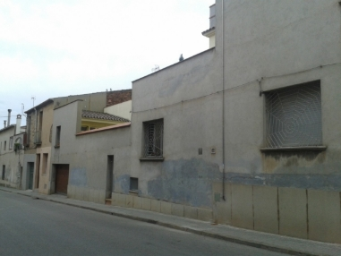

# Análisis forense de una imagen de disco duro Anexo

## Hallazgo número 1: Almacen mataro.jpg
| | |
|-|-|
|**Ruta y nombre**| /img\_AFI\_W.E01/$OrphanFiles/Almacen mataro.jpg |
|**Tamaño (bits)** | 6998 |
|**Fecha de creación** | 2013-06-19 04:11:24 CEST |
| **MD5** | c7c5a5521ed005ddad94cb9a9b254d6b |
|**Imagen** |  |

## Hallazgo número 2: Almacen mataro 2.jpg
|                       |                                                    |
| --------------------- | -------------------------------------------------- |
| **Ruta y nombre**     | /img\_AFI\_W\.E01/\$OrphanFiles/Almacen mataro.jpg |
| **Tamaño (bits)**     | 6998                                               |
| **Fecha de creación** | 2013-06-19 04:11:24 CEST                           |
| **MD5**               | c7c5a5521ed005ddad94cb9a9b254d6b                   |
| **Imagen**            |                    |

## Hallazgo número 3: Almacen terrassa.jpg 
|                       |                                                                |
| --------------------- | -------------------------------------------------------------- |
| **Ruta y nombre**     | /img\_AFI\_W\.E01/\$OrphanFiles/Almacen terrassa.jpg           |
| **Tamaño (bits)**     | 9637                                                           |
| **Fecha de creación** | 2013-06-19 04:11:24 CEST                                       |
| **MD5**               | e9bc32019fe6c4bffb1ec9bef18b85aa                               |
| **Imagen**            |  |

## Hallazgo número 4: Almacen terrassa 3.jpg
|                       |                                                                |
| --------------------- | -------------------------------------------------------------- |
| **Ruta y nombre**     | /img\_AFI\_W\.E01/\$OrphanFiles/Almacen terrassa 3.jpg         |
| **Tamaño (bits)**     | 6943                                                           |
| **Fecha de creación** | 2013-06-19 04:11:24 CEST                                       |
| **MD5**               | 1e6f15394d075ba43308da22ba92059c                               |
| **Imagen**            |  |

## Hallazgo número 5: fiesta Jorge.jpg
|                       |                                                                |
| --------------------- | -------------------------------------------------------------- |
| **Ruta y nombre**     | /img\_AFI\_W\.E01/\$OrphanFiles/fiesta Jorge.jpg               |
| **Tamaño (bits)**     | 8905                                                           |
| **Fecha de creación** | 2013-06-19 04:11:24 CEST                                       |
| **MD5**               | c6661d1558b767f31c1f65242af95118                               |
| **Imagen**            |  |

## Hallazgo número 6: kasius 2.jpg
|                       |                                                                |
| --------------------- | -------------------------------------------------------------- |
| **Ruta y nombre**     | /img\_AFI\_W\.E01/\$OrphanFiles/kasius 2.jpg                   |
| **Tamaño (bits)**     | 5716                                                           |
| **Fecha de creación** | 2013-06-19 04:11:24 CEST                                       |
| **MD5**               | 28f5966b1a4a72cb3b434f688bf8dd0b                               |
| **Imagen**            |  |

## Hallazgo número 7: kasius.jpg
|                       |                                                                |
| --------------------- | -------------------------------------------------------------- |
| **Ruta y nombre**     | /img\_AFI\_W\.E01/\$OrphanFiles/kasius.jpg                     |
| **Tamaño (bits)**     | 9175                                                           |
| **Fecha de creación** | 2013-06-19 04:11:24 CEST                                       |
| **MD5**               | d56befec0c93acbad7fe9d48f5415a2b                               |
| **Imagen**            |  |

## Hallazgo número 8: Maria en negocio Jorge.jpg
|                       |                                                                |
| --------------------- | -------------------------------------------------------------- |
| **Ruta y nombre**     | /img\_AFI\_W\.E01/\$OrphanFiles/Maria en negocio Jorge.jpg     |
| **Tamaño (bits)**     | 5083                                                           |
| **Fecha de creación** | 2013-06-19 04:11:24 CEST                                       |
| **MD5**               | 18f5a99105c58f8a71a3405562d2eafa                               |
| **Imagen**            |  |

## Hallazgo número 9: coca.pdf
|                          |                                                                                                     |
| ------------------------ | --------------------------------------------------------------------------------------------------- |
| **Ruta y nombre**        | /img\_AFI\_W\.E01/Documents and Settings/John/Desktop/coca.pdf                                      |
| **Tamaño (bits)**        | 5,826,655                                                                                           |
| **Fecha de creación**    | 2013-04-23 02:58:42 CEST                                                                            |
| **MD5**                  | e69f1a346f981d322f4ab8105cc3d337                                                                    |
| **Dueño del archivo**    | John                                                                                                |
| **Descripción**          | *DISCUSIÓN CRÍTICA SOBRE LA TAXONOMÍA DE LAS ESPECIES CULTIVADAS DEL GÉNERO ERYTHROXYLUM P. BROWNE* |

## Hallazgo número 10: Dc1.xls
|                       |                                                                               |
| --------------------- | ----------------------------------------------------------------------------- |
| **Ruta y nombre**     | /img\_AFI\_W\.E01/RECYCLER/S-1-5-21-1343024091-152049171-7253455 1004/Dc1.xls |
| **Tamaño (bits)**     | 323,584                                                                       |
| **Fecha de creación** | 2013-04-23 04:12:47 CEST                                                      |
| **MD5**               | 8bf95bc38e190d29924815187bf67f88                                              |
| **Dueño del archivo** | Desconocido                                                                   |
| **Imagen**            |                                                       |

## Hallazgo número 11: pedofilia.zip
|                          |                                                                                     |
| ------------------------ | ----------------------------------------------------------------------------------- |
| **Ruta y nombre**        | /img\_AFI\_W\.E01/Documents and Settings/Ian/My Documents/My Pictures/pedofilia.zip |
| **Tamaño (bits)**        | 8,899,826                                                                           |
| **Fecha de creación**    | 2013-04-23 04:08:36 CEST                                                            |
| **MD5**                  | a54529c01bf3a24963ded1fa74579de5                                                    |
| **Dueño del archivo**    | Ian                                                                                 |
| **Descripción**          | Archivo ZIP protegido con contraseña que contiene **186 imágenes**                  |

## Hallazgo número 12: manufacturing amfetas.link
|                          |                                                                                  |
| ------------------------ | -------------------------------------------------------------------------------- |
| **Ruta y nombre**        | /img\_AFI\_W\.E01/Documents and Settings/John/Desktop/manufacturing amfetas.link |
| **Tamaño (bits)**        | 133,681                                                                          |
| **Fecha de creación**    | 2013-04-23 02:58:52 CEST                                                         |
| **MD5**                  | 9c555bd582caa34a371fad2487273833                                                 |
| **Dueño del archivo**    | John                                                                             |
| **Descripción**          | Link a foro donde se explica cómo fabricar metanfetamina en casa                 |

## Hallazgo número 13: manufacturing.link
|                          |                                                                          |
| ------------------------ | ------------------------------------------------------------------------ |
| **Ruta y nombre**        | /img\_AFI\_W\.E01/Documents and Settings/John/Desktop/manufacturing.link |
| **Tamaño (bits)**        | 669,101                                                                  |
| **Fecha de creación**    | 2013-04-23 02:58:52 CEST                                                 |
| **MD5**                  | 290dfaa70bbb28f0e7a0b4b36b23bd34                                         |
| **Dueño del archivo**    | John                                                                     |
| **Imagen / Descripción** |            |

## Hallazgo número 14: providers.ico
|                          |                                                                     |
| ------------------------ | ------------------------------------------------------------------- |
| **Ruta y nombre**        | /img\_AFI\_W\.E01/Documents and Settings/John/Desktop/providers.ico |
| **Tamaño (bits)**        | 38,400                                                              |
| **Fecha de creación**    | 2013-04-23 02:58:35 CEST                                            |
| **MD5**                  | 4a7c3029c15e632ce560f6cb8654e0a2                                    |
| **Dueño del archivo**    | John                                                                |
| **Imagen / Descripción** | Lista de **proveedores de sustancias estupefacientes**              |

## Hallazgo número 15: Scan_Pic0005[1].jpg
|                          |                                                                                                                                   |
| ------------------------ | --------------------------------------------------------------------------------------------------------------------------------- |
| **Ruta y nombre**        | /img\_AFI\_W\.E01/Documents and Settings/Jessy/Local Settings/Temporary Internet Files/Content.IE5/05O98JOH/Scan\_Pic0005\[1].jpg |
| **Tamaño (bits)**        | 433,694                                                                                                                           |
| **Fecha de creación**    | 2013-04-23 04:20:30 CEST                                                                                                          |
| **MD5**                  | a94c8baedb25d51279f3bb6b1cac787d                                                                                                  |
| **Dueño del archivo**    | Jessy                                                                                                                             |
| **Dispositivo y modelo** | HP oj\_g510g-m                                                                                                                    |
| **Imagen / Descripción** |                                                                    |

## Hallazgo número 16: emcdda\_building[1].jpg
|                          |                                                                                                                                     |
| ------------------------ | ----------------------------------------------------------------------------------------------------------------------------------- |
| **Ruta y nombre**        | /img\_AFI\_W\.E01/Documents and Settings/John/Local Settings/Temporary Internet Files/Content.IE5/2BA7G783/emcdda\_building\[1].jpg |
| **Tamaño (bits)**        | 17,951                                                                                                                              |
| **Fecha de creación**    | 2013-04-23 04:01:47 CEST                                                                                                            |
| **MD5**                  | 7442a0dc89c7d2b3a2b9ded2cbe49427                                                                                                    |
| **Dueño del archivo**    | John                                                                                                                                |
| **Dispositivo y modelo** | NIKON D300                                                                                                                          |
| **Imagen / Descripción** |                                                                       |

## Hallazgo número 17: 20130404\_102700.jpg
|                          |                                                                                              |
| ------------------------ | -------------------------------------------------------------------------------------------- |
| **Ruta y nombre**        | /img\_AFI\_W\.E01/Documents and Settings/John/My Documents/mataro store/20130404\_102700.jpg |
| **Tamaño (bits)**        | 3,540,243                                                                                    |
| **Fecha de creación**    | 2013-04-23 02:58:06 CEST                                                                     |
| **MD5**                  | 76fe581ab1493da21b8acc5968efc66e                                                             |
| **Dueño del archivo**    | John                                                                                         |
| **Dispositivo y modelo** | SAMSUNG GT-I8190                                                                             |
| **Imagen / Descripción** |                               |

## Hallazgo número 18: 20130404\_102702.jpg
|                          |                                                                                              |
| ------------------------ | -------------------------------------------------------------------------------------------- |
| **Ruta y nombre**        | /img\_AFI\_W\.E01/Documents and Settings/John/My Documents/mataro store/20130404\_102702.jpg |
| **Tamaño (bits)**        | 3,529,432                                                                                    |
| **Fecha de creación**    | 2013-04-23 02:58:06 CEST                                                                     |
| **MD5**                  | a2fc7b3b4276bcebddc25b1bdfa534c8                                                             |
| **Dueño del archivo**    | John                                                                                         |
| **Dispositivo y modelo** | SAMSUNG GT-I8190                                                                             |
| **Imagen / Descripción** |                               |

## Hallazgo número 19: 20130404\_102715.jpg
|                          |                                                                                              |
| ------------------------ | -------------------------------------------------------------------------------------------- |
| **Ruta y nombre**        | /img\_AFI\_W\.E01/Documents and Settings/John/My Documents/mataro store/20130404\_102715.jpg |
| **Tamaño (bits)**        | 3,476,592                                                                                    |
| **Fecha de creación**    | 2013-04-23 02:58:06 CEST                                                                     |
| **MD5**                  | b63352ab8362d8c51cde10d3112a836f                                                             |
| **Dueño del archivo**    | John                                                                                         |
| **Dispositivo y modelo** | SAMSUNG GT-I8190                                                                             |
| **Coordenadas GPS**      | 41.53260888888889, 2.4372805555555557                                                        |
| **Imagen / Descripción** |                               |

## Hallazgo número 20: 20130329\_140030.jpg
|                          |                                                                                                |
| ------------------------ | ---------------------------------------------------------------------------------------------- |
| **Ruta y nombre**        | /img\_AFI\_W\.E01/RECYCLER/S-1-5-21-1343024091-152049171-7253455 1003/Dc2/20130329\_140030.jpg |
| **Tamaño (bits)**        | 2,828,407                                                                                      |
| **Fecha de creación**    | 2013-04-23 02:58:05 CEST                                                                       |
| **MD5**                  | 2901dd8e2ce041334f2db3f12de93e50                                                               |
| **Dueño del archivo**    | John                                                                                           |
| **Dispositivo y modelo** | SAMSUNG GT-I8190                                                                               |
| **Imagen / Descripción** |                                 |

## Hallazgo número 21: 20130329\_140033.jpg
|                          |                                                                                                |
| ------------------------ | ---------------------------------------------------------------------------------------------- |
| **Ruta y nombre**        | /img\_AFI\_W\.E01/RECYCLER/S-1-5-21-1343024091-152049171-7253455 1003/Dc2/20130329\_140033.jpg |
| **Tamaño (bits)**        | 2,771,280                                                                                      |
| **Fecha de creación**    | 2013-04-23 02:58:05 CEST                                                                       |
| **MD5**                  | 2d5dc2235a854c295150624d2c719ca7                                                               |
| **Dueño del archivo**    | John                                                                                           |
| **Dispositivo y modelo** | SAMSUNG GT-I8190                                                                               |
| **Imagen / Descripción** |                                 |

## Hallazgo número 22: 20130329\_140035.jpg
|                          |                                                                                                |
| ------------------------ | ---------------------------------------------------------------------------------------------- |
| **Ruta y nombre**        | /img\_AFI\_W\.E01/RECYCLER/S-1-5-21-1343024091-152049171-7253455 1003/Dc2/20130329\_140035.jpg |
| **Tamaño (bits)**        | 2,845,749                                                                                      |
| **Fecha de creación**    | 2013-04-23 02:58:06 CEST                                                                       |
| **MD5**                  | c189d1c1e3bf0bc600c39d136b197a68                                                               |
| **Dueño del archivo**    | John                                                                                           |
| **Dispositivo y modelo** | SAMSUNG GT-I8190                                                                               |
| **Imagen / Descripción** |                                 |

## Hallazgo número 23: contrasenyas.xls
|                       |                                                                             |
| --------------------- | --------------------------------------------------------------------------- |
| **Ruta y nombre**     | /img\_AFI\_W\.E01/Documents and Settings/John/My Documents/contrasenyas.xls |
| **Tamaño (bits)**     | 24064                                                                       |
| **Fecha de creación** | 2013-04-23 02:57:53 CEST                                                    |
| **MD5**               | 0a76cd274e4f4750b69cc57a4aa9a5b0                                            |
| **Dueño del archivo** | John                                                                        |
| **Descripción**       | Tabla con las contraseñas de varios servicios.                              |

## Hallazgo número 24: Dc1.xls
|                                                                                           |                                                                               |
| ----------------------------------------------------------------------------------------- | ----------------------------------------------------------------------------- |
| **Ruta y nombre**                                                                         | /img\_AFI\_W\.E01/RECYCLER/S-1-5-21-1343024091-152049171-7253455 1004/Dc1.xls |
| **Tamaño (bits)**                                                                         | 323,584                                                                       |
| **Fecha de creación**                                                                     | 2013-04-23 04:12:47 CEST                                                      |
| **MD5**                                                                                   | 8bf95bc38e190d29924815187bf67f88                                              |
| **Dueño del archivo**                                                                     | Desconocido                                                                   |
| **Imagen**                                                                                |                                                       |

## Hallazgo número 25: Contactes.xls
|                          |                                                                     |
| ------------------------ | ------------------------------------------------------------------- |
| **Ruta y nombre**        | /img\_AFI\_W\.E01/Documents and Settings/John/Desktop/Contactes.xls |
| **Tamaño (bits)**        | 14,848                                                              |
| **Fecha de creación**    | 2013-04-23 02:58:27 CEST                                            |
| **MD5**                  | 84f9be74d345e59725a8c793e7370d8f                                    |
| **Dueño del archivo**    | John                                                                |
| **Descripción**          | Tabla Excel cifrada por contraseña.                                 |
| **Imagen / Descripción** |                                  |

## Hallazgo número 26: pedofilia.zip
|                       |                                                                                     |
| --------------------- | ----------------------------------------------------------------------------------- |
| **Ruta y nombre**     | /img\_AFI\_W\.E01/Documents and Settings/Ian/My Documents/My Pictures/pedofilia.zip |
| **Tamaño (bits)**     | 8,899,826                                                                           |
| **Fecha de creación** | 2013-04-23 04:08:36 CEST                                                            |
| **MD5**               | a54529c01bf3a24963ded1fa74579de5                                                    |
| **Dueño del archivo** | Ian                                                                                 |
| **Descripción**       | Archivo ZIP protegido con contraseña que contiene 186 imágenes.                     |

## Hallazgo número 27: Historial\_Droga\_1
|                       |                                                                                                                        |
| --------------------- | ---------------------------------------------------------------------------------------------------------------------- |
| **URL**               | [http://www.bing.com/search?q=pena+delito+trafico+de+droga](http://www.bing.com/search?q=pena+delito+trafico+de+droga) |
| **Dominio**           | bing.com                                                                                                               |
| **Fecha de búsqueda** | 2013-04-25 23:01:13 CEST                                                                                               |
| **MD5**               | d2d527f6b26ff1b2997d6c6e4ed1340e                                                                                       |
| **Dueño del archivo** | John                                                                                                                   |
| **Descripción**       | El usuario realizó una búsqueda relacionada con las penas por tráfico de drogas.                                       |

## Hallazgo número 28: Historial\_Droga\_2
|                       |                                                                                                                                         |
| --------------------- | --------------------------------------------------------------------------------------------------------------------------------------- |
| **URL**               | [http://www.google.es/search?hl=es\&q=price+cocaine+spain+catalonia](http://www.google.es/search?hl=es&q=price+cocaine+spain+catalonia) |
| **Dominio**           | google.es                                                                                                                               |
| **Fecha de búsqueda** | 2013-04-30 23:01:30 CEST                                                                                                                |
| **MD5**               | 5e2c3bbeb3b4648a053548c73638ea40                                                                                                        |
| **Dueño del archivo** | John                                                                                                                                    |
| **Descripción**       | El usuario buscó información sobre el precio de la cocaína en España, concretamente en Cataluña.                                        |

## Hallazgo número 29: Historial\_Droga\_3
|                       |                                                                                                                                |
| --------------------- | ------------------------------------------------------------------------------------------------------------------------------ |
| **URL**               | [http://www.youtube.com/results?q=building%20drugs%20at%20home](http://www.youtube.com/results?q=building%20drugs%20at%20home) |
| **Dominio**           | youtube.com                                                                                                                    |
| **Fecha de búsqueda** | 2013-04-30 23:01:30 CEST                                                                                                       |
| **MD5**               | 5e2c3bbeb3b4648a053548c73638ea40                                                                                               |
| **Dueño del archivo** | John                                                                                                                           |
| **Descripción**       | El usuario buscó vídeos sobre cómo fabricar drogas en casa.                                                                    |

## Hallazgo número 30: Historial\_Pedofilia\_1
|                       |                                                                                          |
| --------------------- | ---------------------------------------------------------------------------------------- |
| **URL**               | [http://www.google.es/search?q=porn+pedofil](http://www.google.es/search?q=porn+pedofil) |
| **Dominio**           | google.es                                                                                |
| **Fecha de búsqueda** | 2013-04-23 02:15:52 CEST                                                                 |
| **MD5**               | 5c017d2440863f922ff06c09b4999841                                                         |
| **Dueño del archivo** | Ian                                                                                      |
| **Descripción**       | El usuario Ian realizó una búsqueda en Google relacionada con pornografía infantil.      |

## Hallazgo número 31: Historial\_Pedofilia\_2
|                       |                                                                                              |
| --------------------- | -------------------------------------------------------------------------------------------- |
| **URL**               | `http://foro.enfemenino.com/forum/f278/__f1186_f278-Pedofilia-consentida.html`               |
| **Dominio**           | foro.enfemenino.com                                                                          |
| **Fecha de búsqueda** | 2013-04-24 01:58:46 CEST                                                                     |
| **MD5**               | 5c017d2440863f922ff06c09b4999841                                                             |
| **Dueño del archivo** | Ian                                                                                          |
| **Descripción**       | El usuario accedió a un foro cuyo título hace referencia explícita a “pedofilia consentida”. |

## Hallazgo número 32: Historial\_Pedofilia\_3
|                       |                                                                                                            |
| --------------------- | ---------------------------------------------------------------------------------------------------------- |
| **URL**               | [http://www.google.es/search?q=lolitas](http://www.google.es/search?q=lolitas)                             |
| **Dominio**           | google.es                                                                                                  |
| **Fecha de búsqueda** | 2013-04-23 02:16:18 CEST                                                                                   |
| **MD5**               | d28eef7013751a0178b22cbac75d8890                                                                           |
| **Dueño del archivo** | Ian                                                                                                        |
| **Descripción**       | El término "lolitas" es utilizado frecuentemente en contextos relacionados con la atracción hacia menores. |

## Hallazgo número 33: Marcador\_Droga\_1
|                         |                                                                                                                                                                                                               |
| ----------------------- | --------------------------------------------------------------------- |
| **Título del marcador** | CADCA – Building drug-free communities                                |
| **URL**                 | [http://www.cadca.org](http://www.cadca.org)                          |
| **Dominio**             | cadca.org                                                             |
| **Fecha de creación**   | 2013-04-23 04:01:29 CEST                                              |
| **MD5**                 | 81324cb887be681a3de39b9ae6cedae4                                      |
| **Dueño del archivo**   | John                                                                  |
| **Descripción**         | Marcador a una organización dedicada a prevenir el consumo de drogas. |

## Hallazgo número 34: Marcador\_Droga\_2
|                         |                                                                                                                                |
| ----------------------- | ------------------------------------------------------------------------------------------------------------------------------ |
| **Título del marcador** | Controlled drugs licences, fees and returns – GOV.UK                                                                           |
| **URL**                 | [https://www.gov.uk/controlled-drugs-licences-fees-and-returns](https://www.gov.uk/controlled-drugs-licences-fees-and-returns) |
| **Dominio**             | [www.gov.uk](http://www.gov.uk)                                                                                                |
| **Fecha de creación**   | 2013-04-23 04:01:09 CEST                                                                                                       |
| **MD5**                 | ef65e992d93c6c28a6f693f7184f0f9a                                                                                               |
| **Dueño del archivo**   | John                                                                                                                           |
| **Descripción**         | Información oficial sobre licencias para drogas controladas.                                                                   |

## Hallazgo número 35: Marcador\_Droga\_3
|                         |                                                                                                                                                                                                                        |
| ----------------------- | -------------------------------------------------------------------------------------------------------------------------- |
| **Título del marcador** | EMCDDA – Building a national drugs observatory: a joint handbook                                                           |
| **URL**                 | [http://www.emcdda.europa.eu/publications/joint/ndo-handbook](http://www.emcdda.europa.eu/publications/joint/ndo-handbook) |
| **Dominio**             | europa.eu                                                                                                                  |
| **Fecha de creación**   | 2013-04-23 04:01:50 CEST                                                                                                   |
| **MD5**                 | 10675119df9f1167660e28afa98104c5                                                                                           |
| **Dueño del archivo**   | John                                                                                                                       |
| **Descripción**         | Marcador que apunta a una guía técnica sobre la creación de un observatorio nacional sobre drogas.                         |

## Hallazgo número 36: Busquedas\_Droga\_1
|                          |                                                                |
| ------------------------ | -------------------------------------------------------------- |
| **Término**              | `how to building cocaine`                                      |
| **Dominio**              | youtube.com                                                    |
| **Fecha de búsqueda**    | 2013-04-30 23:01:30 CEST                                       |
| **MD5**                  | 5e2c3bbeb3b4648a053548c73638ea40                               |
| **Autor de la búsqueda** | John                                                           |
| **Descripción**          | Búsqueda explícita de contenido que enseña a fabricar cocaína. |

## Hallazgo número 37: Busquedas\_Droga\_2
|                          |                                            |
| ------------------------ | ------------------------------------------ |
| **Término**              | `cocaine price`                            |
| **Dominio**              | google.es                                  |
| **Fecha de búsqueda**    | 2013-04-24 01:59:11 CEST                   |
| **MD5**                  | be0e077bb25ff765433d73068bd54675           |
| **Autor de la búsqueda** | John                                       |
| **Descripción**          | Consulta directa sobre precios de cocaína. |

## Hallazgo número 38: Busquedas\_Droga\_3
|                          |                                                          |
| ------------------------ | -------------------------------------------------------- |
| **Término**              | `building drugs at home`                                 |
| **Dominio**              | google.es                                                |
| **Fecha de búsqueda**    | 2013-04-23 02:02:43 CEST                                 |
| **MD5**                  | be0e077bb25ff765433d73068bd54675                         |
| **Autor de la búsqueda** | John                                                     |
| **Descripción**          | Búsqueda genérica sobre la producción de drogas caseras. |

## Hallazgo número 39: Busquedas\_Pedofilia\_1
|                          |                                               |
| ------------------------ | --------------------------------------------- |
| **Término**              | `foros pedofilia`                             |
| **Dominio**              | google.es                                     |
| **Fecha de búsqueda**    | 2013-04-24 01:58:31 CEST                      |
| **MD5**                  | d28eef7013751a0178b22cbac75d8890              |
| **Autor de la búsqueda** | Ian                                           |
| **Descripción**          | Búsqueda de foros relacionados con pedofilia. |

## Hallazgo número 40: Busquedas\_Pedofilia\_2
|                          |                                  |
| ------------------------ | -------------------------------- |
| **Término**              | `illegal porn`                   |
| **Dominio**              | google.es                        |
| **Fecha de búsqueda**    | 2013-04-23 02:16:20 CEST         |
| **MD5**                  | d28eef7013751a0178b22cbac75d8890 |
| **Autor de la búsqueda** | Ian                              |
| **Descripción**          | Búsqueda de pornografía ilegal.  |

## Hallazgo número 41: Busquedas\_Pedofilia\_3
|                          |                                                       |
| ------------------------ | ----------------------------------------------------- |
| **Término**              | `porn 10 years`                                       |
| **Dominio**              | google.es                                             |
| **Fecha de búsqueda**    | 2013-04-23 02:15:57 CEST                              |
| **MD5**                  | d28eef7013751a0178b22cbac75d8890                      |
| **Autor de la búsqueda** | Ian                                                   |
| **Descripción**          | Término que sugiere interés por pornografía infantil. |

En Cádiz a 28 de Enero de 2025

Fdo:

