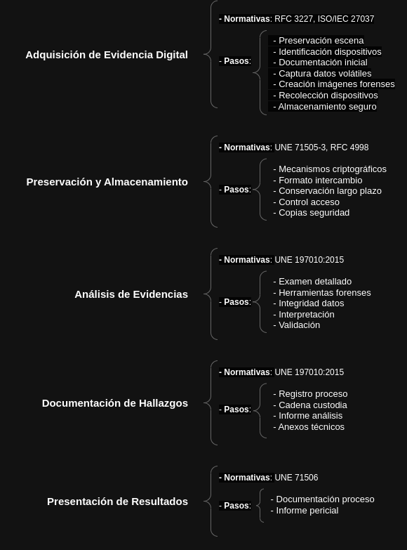

# Proyecto de Análisis Forense Informático

## Índice

- [Introducción](#introducción)
- [Comparativa de normas y estándares](#comparativa-de-normas-y-estándares)
- [Metodología propia](#metodología-propia)
    -  [Adquisición de evidencia digital](#adquisición-de-evidencia-digital)
    -  [Preservación y almacenamiento](#preservación-y-almacenamiento)
    -  [Análisis de evidencias](#análisis-de-evidencias)
    -  [Documentación de hallazgos](#documentación-de-hallazgos)
    -  [Presentación de resultados](#presentación-de-resultados)
- [Resumen de la metodología](#resumen-de-la-metodología)

## Introducción

Nuestro objetivo es diseñar una metodología propia para la recolección, análisis y presentación de evidencias digitales. Para ello, analizaremos diversas normas y estándares forenses, revisaremos sus características y seleccionaremos aquellos que mejor se ajusten a nuestras necesidades. A partir de esta investigación, desarrollaremos un método que nos permita asegurar la integridad de las evidencias, cumplir con los requisitos legales y presentar resultados claros y verificables.

## Comparativa de normas y estándares

| Norma/Estándar | Enfoque principal | Ámbito | Año | Aspectos clave |
|----------------|-------------------|--------|-----|----------------|
| UNE 71505-3 | Gestión de Evidencias Electrónicas | España | 2013 | Formatos y mecanismos técnicos |
| UNE 71506 | Análisis forense de evidencias electrónicas | España | 2013 | Metodología para preservación, adquisición, análisis y presentación |
| UNE 197010 | Informes y dictámenes periciales TIC | España | 2015 | Criterios para elaboración de informes |
| ISO/IEC 27037 | Identificación y preservación de evidencias digitales | Internacional | 2016 | Directrices para recolección y adquisición |
| NIST SP 800-86 | Guía para integrar técnicas forenses | EE.UU. | 2006 | Metodología general para análisis forense |
| RFC 3227 | Recolección y archivado de evidencias | Internacional | 2002 | Directrices para recopilación y almacenamiento |
| RFC 4810 | Preservación a largo plazo | Internacional | 2007 | Requisitos para preservación de información |
| RFC 4998 | Sintaxis de registros de evidencias | Internacional | 2007 | Preservación de información firmada digitalmente |
| RFC 6283 | Sintaxis XML de registros de evidencias | Internacional | 2011 | Extensión de RFC 4998 para formato XML |

#### Coincidencias

- Gestión, preservación y análisis de Evidencias Digitales:

    Todas las normas abordan la necesidad de gestionar, preservar y analizar las evidencias digitales de manera adecuada, asegurando su validez y utilidad .

- Integridad y admisibilidad de las evidencias:

    Todas las normativas enfocan  la importancia de mantener la integridad de las evidencias y su admisibilidad en procedimientos legales, asegurando que las evidencias no sean manipuladas y puedan ser verificadas.

- Metodologías y buenas prácticas:

    Las normas establecen metodologías detalladas y buenas prácticas para la recolección, análisis y conservación de las evidencias, minimizando la pérdida de información y garantizando la autenticidad de los datos.

- Documentación y trazabilidad:

    La documentación detallada y la trazabilidad son fundamentales en todas las normas, incluyendo la cadena de custodia clara para garantizar la fiabilidad de las evidencias.

- Admisibilidad legal:

    Todas las normas tienen como objetivo final asegurar que las evidencias digitales sean admisibles en un proceso judicial, cumpliendo con los requisitos legales para evitar disputas sobre su validez o integridad.

#### Diferencias

1. Ámbito geográfico: Las normas UNE son específicas de España, por el contrario, las ISO/IEC y RFC son de carácter internacional.

2. Enfoque específico: 
   - UNE 71505-3 principalmente se enfocan en formatos y mecanismos técnicos.
   - UNE 71506 Nos da una metodología completa para el análisis forense.
   - UNE 197010 se centra principalmente en la elaboración de informes periciales.
   - ISO/IEC 27037 se especializa en la identificación y preservación de evidencias.
   - Las RFC muestran aspectos específicos, como son la preservación a largo plazo de evidencias digitales y la sintaxis a usar a la hora de la elaboración de registros.

3. Nivel de detalle: Las normas UNE y la ISO/IEC suelen ser más exhaustivas y detalladas, mientras que las RFC son más específicas en cuanto a protocolos y formatos.

4. Actualización: Las normas UNE e ISO/IEC son más recientes y se actualizan con mayor frecuencia que algunas RFC.

## Metodología Propia

Tras haber analizado todas las normas reflejadas en la [tabla comparativa de normas y estandares](#comparativa-de-normas-y-estándares) vista anteriormente, hemos realizado nuestra propia metodología, la cual vamos a exponer a continuación.

### Adquisición de evidencia digital

Para la adquisición de las evidencias digitales, nos basamos en las normativas RFC 3227 e ISO/IEC 27037, ya que a nuestro parecer son las que reúnen los pasos mas adecuados, tendremos en cuenta:

1. **Preservación de la escena**

   Asegurar el lugar del incidente, evitando interferencias y asegurando que nadie pueda manipularla.
   Algunos ejemplos podrían ser: 
      - Acordonar la zona, para establecer un perímetro alrededor de la escena, utilizando cintas de seguridad.
      - Podemos establecer un control de acceso, de modo que solo haya una entrada y una salida y poder controlar el flujo de personas
      - Hacer que todo el mundo use protección contra la contaminación, como guantes, mascarillas, etc.

2. **Identificación de dispositivos**

   Localizar dispositivos digitales relevantes. Lo cual podemos hacerlo siguiendo estos pasos:
      1. Hacemos una inspección visual del área, buscando ordenadores, laptops, tablets, etc. Así como dispositivos de almacenamiento externo como discos duros, unidades USB, etc. Y localizar dispositivos de red como routers, switches, etc.
      2. Buscamos dispositivos que puedan estar ocultos a simple vista, para ello podemos:
         - Revisar cajones y armarios en busca de dispositivos guardados.
         - Examinar áreas como falsos techos, detrás de cuadros, etc.
         - Utilizar detectores de metales o escáneres de radiofrecuencia para localizar dispositivos ocultos como cámaras, micrófonos, etc.
         - Revisar las conexiones de red existentes, para comprobar que no haya equipos conectados a la red que no hayan sido identificados, por ejemplo, podemos:
            - Utilizar herramientas de escaneo de red.
            - Examinar los registros del router para identificar dispositivos que se hayan conectado recientemente.

3. **Documentación inicial**
   - Documentar la presencia de los dispositivos en la escena, así como el estado de los mismos, por ejemplo:
      - Registrando la marca, modelo, número de serie, etc...
      - Anotando la ubicación exacta de cada dispositivo en la escena.
      - Fotografiando cada dispositivo en el lugar en el que se encuentra, antes de moverlo.
      - Anotar si los dispositivos están encendidos o apagados.
      - Registrar cualquier actividad visible en las pantallas de los dispositivos encendidos.
   - Etiquetado de los dispositivos, por ejemplo:
      - Asignando un número o código único a cada dispositivo identificado.
      - Colocación de etiquetas de evidencia en cada dispositivo  sin obstruir puertos o tapar áreas importantes.

4. **Consideración de la volatilidad**

   Tendremos en cuenta este orden de volátilidad:
      1. Registros y caché del procesador.
      2. Contenido de la memoria RAM.
      3. Tablas de enrutamiento y caché ARP.
      4. Tabla de procesos en ejecución.
      5. Archivos temporales del sistema.
      6. Contenido del disco duro.
      7. Ficheros de logs del sistema.
      8. Configuración física y topología de red.
      9. Medios de almacenamiento externo.   

5. **Captura de datos volátiles**

   Para adquirir las evidencias, usaremos herramientas forenses, como por ejemplo:
   - Registros y caché del procesador:
      - Volatility Framework.
      - WinDbg (para sistemas Windows).
      - GDB (para sistemas Linux).
   - Contenido de la memoria RAM:
      - Volatility Framework.
      - FTK Imager.
      - Belkasoft Live RAM Capturer.
      - Magnet RAM Capture.
      - LiME (Linux Memory Extractor).
   - Tablas de enrutamiento y caché ARP:
      - Volatility Framework.
      - Network Miner.
      - Wireshark (con captura en vivo)
   - Tabla de procesos en ejecución:
      - Process Hacker.
      - Process Explorer (Sysinternals)
      - Volatility Framework.
   - Archivos temporales del sistema:
      - FTK Imager.
      - EnCase Forensic.
      - X-Ways Forensics.
   - Contenido del disco duro:
      - DD (para sistemas Unix/Linux).
      - FTK Imager.
      - EnCase Forensic.
      - Cellebrite Digital Collector.
   - Ficheros de logs del sistema:
      - Log Parser (Microsoft).
      - Splunk.
      - ELK Stack (Elasticsearch, Logstash, Kibana).
   - Configuración física y topología de red:
      - Nmap.
      - Wireshark.
      - NetworkMiner.
   - Medios de almacenamiento externo:
      - FTK Imager.
      - EnCase Forensic.
      - Cellebrite UFED.

6. **Creación de imágenes forenses**
   - Realizaremos copias bit a bit sin alterar los dispositivos originales, utilizaremos herramientas forenses como:
      - FTK Imager.
      - EnCase Forensic Imager.
      - Guymager.
      - dc3dd.
      - Paladin.
      - X-Ways Forensics.
   - Utilizaremos herramientas y métodos para asegurar la validez, como bloqueadores de escritura hardware para prevenir modificaciones accidentales.
   - Calcularemos y registraremos hashes (MD5, SHA-256) de los dispositivos o sus contenidos.

7. **Recolección de dispositivos físicos**

   Procederemos a hacer lo siguiente:
      - Recolección cuidadosa de dispositivos:
         - Usaremos guantes anti-estáticos para evitar contaminar o dañar los dispositivos.
         - Desconectaremos los dispositivos de forma segura, siguiendo los procedimientos adecuados para cada tipo.
         - Iniciaremos la cadena de custodia utilizando un formulario estandarizado de cadena de custodia que incluya, al menos:
            - Número de caso o identificador único.
            - Descripción detallada del dispositivo (marca, modelo, número de serie).
            - Fecha, hora y lugar de la recolección.
            - Nombre y firma de quien recolecta el dispositivo.
            - Estado del dispositivo al momento de la recolección.

Este puede ser un ejemplo:

~~~
**Formulario de Cadena de Custodia para Evidencias Digitales**

1. Número de caso / Identificador único: ___________________________

2. Descripción detallada del dispositivo:
   - Tipo de dispositivo: ___________________________________________
   - Marca: _______________________________________________________
   - Modelo: ______________________________________________________
   - Número de serie: ______________________________________________
   - Características adicionales: __________________________________

3. Recolección:
   - Fecha: ___/___/_____
   - Hora: ___:___ hrs
   - Lugar de recolección: _________________________________________

4. Recolector:
   - Nombre completo: ______________________________________________
   - Cargo/Institución: ____________________________________________
   - Firma: ________________________________________________________

5. Estado del dispositivo al momento de la recolección:
   □ Encendido
   □ Apagado
   □ Dañado (especificar): _________________________________________
   □ Otro (especificar): ___________________________________________

   Descripción adicional del estado: _______________________________
   ______________________________________________________________
   ______________________________________________________________

6. Observaciones adicionales:
   ______________________________________________________________
   ______________________________________________________________
   ______________________________________________________________

Certifico que la información proporcionada en este formulario es verdadera y precisa según mi mejor conocimiento.

Firma del recolector: _____________________ Fecha: ___/___/_____
~~~

8. **Documentación detallada**

    Elaboraremos un informe detallado, incluyendo hora, fecha, todos los procedimientos realizados en detalle, etc. De forma que quede todo registrado de la forma mas detallada, precisa y completa posible. Algunos ejemplos de informes pueden ser:

- Registro cronológico detallado:
~~~
Fecha: 18/10/2024
09:15 - Llegada a la escena (oficina 302, edificio central)
09:20 - Fotografía inicial de la disposición de la oficina
09:25 - Identificación de computadora de escritorio (Dell OptiPlex 7090)
09:30 - Verificación del estado: encendido, pantalla bloqueada
09:35 - Captura de memoria RAM iniciada usando Belkasoft Live RAM Capturer
09:50 - Captura de memoria RAM completada, archivo guardado como "RAM_Dell_18102024.mem"
09:55 - Cálculo de hash MD5 del archivo de memoria
10:00 - Apagado controlado del equipo
10:05 - Extracción del disco duro (Seagate Barracuda 2TB)
10:10 - Creación de imagen forense del disco duro iniciada usando FTK Imager
~~~

- Tabla de acciones y resultados:

| Hora  | Acción                           | Herramienta utilizada | Resultado/Observación                    |
|-------|----------------------------------|----------------------|------------------------------------------|
| 09:15 | Aseguramiento de la escena       | N/A                  | Área acordonada, acceso restringido      |
| 09:25 | Identificación de dispositivos   | Inspección visual    | 1 PC, 2 smartphones, 1 tablet encontrados |
| 09:35 | Captura de memoria volátil       | Belkasoft RAM Capturer| Archivo "RAM_Dell_18102024.mem" creado   |
| 09:55 | Verificación de integridad       | Calculadora de hash  | MD5: a1b2c3d4e5f6g7h8i9j0k1l2m3n4o5p6     |
| 10:10 | Creación de imagen de disco duro | FTK Imager           | Imagen E01 iniciada, tiempo est. 3 horas |

- Registro narrativo

~~~
A las 09:15 del 18 de octubre de 2024, el equipo forense llegó a la oficina 302 del edificio central. 
Inmediatamente se procedió a asegurar la escena, restringiendo el acceso a personal no autorizado. 
A las 09:20, se tomaron fotografías detalladas de la disposición de la oficina y la ubicación de los 
dispositivos electrónicos.

A las 09:25, se identificó una computadora de escritorio Dell OptiPlex 7090 como el dispositivo 
principal de interés. El equipo se encontraba encendido pero con la pantalla bloqueada. Siguiendo 
el protocolo de volatilidad, a las 09:35 se inició la captura de la memoria RAM utilizando 
Belkasoft Live RAM Capturer. Este proceso se completó a las 09:50, generando un archivo de memoria 
nombrado "RAM_Dell_18102024.mem".

Inmediatamente después, a las 09:55, se calculó el hash MD5 del archivo de memoria para asegurar 
su integridad. A las 10:00, se procedió con un apagado controlado del equipo para preservar la 
integridad de los datos en el disco duro...
~~~

9. **Empaquetado y etiquetado**

    Empaquetaremos y etiquetaremos todas las evidencias adquiridas de una forma adecuada, para realizar esto de forma correcta, tendremos en cuenta:

    - Empaquetado adecuado

        - Utilizaremos bolsas anti-estáticas para dispositivos electrónicos pequeños como discos duros, memorias USB o tarjetas SD4.
        - Embalaremos ordenadores y laptops en cajas de cartón rígido con material de relleno para evitar daños durante el transporte.
        - Sellaremos las bolsas o cajas con cinta de evidencia numerada para detectar cualquier intento de manipulación.
        - Usaremos contenedores a prueba de golpes y resistentes al agua para el transporte de evidencias sensibles.
        - Emplearemos cajas Faraday para dispositivos móviles, evitando así la posible alteración remota de datos.

    - Etiquetado con información relevante

        - Crearemos una etiqueta única para cada pieza de evidencia que incluya:
            - Número de caso.
            - Fecha y hora de recolección.
            - Ubicación de la recolección.
            - Tipo de dispositivo.
            - Número de serie o identificador único del dispositivo.
            - Nombre del investigador que recolectó la evidencia.
        - Utilizaremos etiquetas resistentes al agua y a la manipulación.
        - Incluiremos un código QR en la etiqueta que enlace a la información detallada del caso en una base de datos segura.
        - Añadiremos una breve descripción del estado del dispositivo al momento de la recolección (encendido, apagado, dañado).
        - Registraremos el hash (MD5 o SHA-256) de la evidencia en la etiqueta para futura verificación de integridad.
        - Incluiremos información sobre el método de adquisición utilizado (por ejemplo, "imagen forense creada con FTK Imager").
        - Agregaremos una sección en la etiqueta para registrar la cadena de custodia, incluyendo espacios para firmas y fechas de cada transferencia.

Un ejemplo de como podrían ser las etiquetas:
~~~
Caso #: 2024-10-18-001
Evidencia #: E001
Fecha/Hora de recolección: 18/10/2024 15:30
Ubicación: Oficina 302, Edificio Central
Dispositivo: Disco Duro Externo Seagate
S/N: ST2000DM001-1ER164
Recolectado por: Inv. Ana Martínez
Estado: Funcional, encontrado conectado a PC
Hash MD5: a1b2c3d4e5f6g7h8i9j0k1l2m3n4o5p6
Método de adquisición: Imagen DD con Write Blocker

Cadena de Custodia:
1. __________ Fecha: __/__/____
2. __________ Fecha: __/__/____
3. __________ Fecha: __/__/____
~~~
10. **Transporte seguro**

    Tras haber empaquetado y etiquetado nuestras evidencias, procederemos a transportarlas al laboratorio de forma segura, de forma que nadie que no esté autorizado pueda tener acceso a las evidencias. Para ello, realizaremos lo siguiente:

    - Usaremos un transporte vigilado y seguro:

        - Asignando personal de seguridad capacitado para acompañar las evidencias.
        - Los vehículos preferiblemente carecerán de marcas identificativas.

    - Tendremos un control de acceso:
        - Limitando el acceso a la evidencia solo a personal autorizado.
        - Mantendremos un registro de quién accede a la evidencia y cuándo.

### Preservación y almacenamiento

Para la preservación y almacenamiento de las evidencias, nos basamos en las normativas UNE 71505-3 y RFC 4998, procediendo de la siguiente manera :

- **Cifrado de datos**
  
    - Utilizar el estándar AES con una clave de 256 bits garantiza una protección avanzada de los datos en reposo. El cifrado simétrico significa que la misma clave se usa para cifrar y descifrar los datos. Este nivel de cifrado es crucial para prevenir accesos no autorizados a la información almacenada.
      
    - Se debe asegurar que tanto las bases de datos como los sistemas de almacenamiento a gran escala (discos duros, SSD, etc.) empleen cifrado completo del disco o cifrado por volumen, lo que significa que todos los datos almacenados están protegidos, no solo archivos individuales.

- **Utilización del formato de intercambio de evidencias electrónicas**

    - Cabecera : Esta sección contiene metadatos esenciales sobre la evidencia digital, incluyendo información como el tipo de datos, fecha de creación, autores o responsables, y las credenciales de seguridad (certificados o firmas digitales) que autentican la integridad y autenticidad de la evidencia.

    - Contenido : Es la parte principal donde se almacena la información digital que representa la evidencia, como logs, imágenes de disco, archivos, entre otros. Es crucial garantizar que este contenido esté debidamente estructurado y protegido para su análisis posterior.

- **Crear una política de conservación a largo plazo**

    - Actualizar el hardware y software periodicamente : Es esencial tener una política que contemple la migración periódica de las evidencias a nuevos sistemas o dispositivos compatibles, evitando la pérdida de acceso debido a la incompatibilidad tecnológica.
      
    - Renovar las claves de encriptación a tiempo : Las claves criptográficas tienen una vida útil limitada y deben renovarse antes de que expiren. Esto implica tener un sistema que controle las fechas de caducidad de las claves y permita la actualización de las mismas sin comprometer la integridad de los datos.

- **Almacenamiento en soportes adecuados**

    - El uso de soportes físicos adecuados (como discos duros externos, medios ópticos, o almacenamiento en la nube con redundancia) es fundamental para garantizar la longevidad y seguridad de las evidencias. Además, se deben usar métodos que eviten la corrupción de datos, como sistemas con control de errores o redundancia.
      
- **Controlar el acceso**

    - Solo el personal autorizado, como los analistas forenses, debe tener acceso a las evidencias. Esto evita la manipulación accidental o malintencionada de los datos y asegura que solo personas cualificadas trabajen con las evidencias. El control de acceso debe implementarse a través de sistemas de autenticación fuertes, como credenciales multi-factor y permisos detallados a nivel de usuario o rol.

- **Realizar imagenes o réplicas de los discos** :

    - Trabajar directamente con los discos originales puede poner en riesgo la integridad de la evidencia. Por eso, se recomienda crear imágenes forenses de los discos (copias exactas bit a bit) para realizar el análisis. Esto garantiza que el original permanece intacto para futuras referencias o inspecciones judiciales. Las réplicas permiten hacer análisis exhaustivos sin riesgo de alterar la evidencia.

### Análisis de evidencias

El análisis de evidencias es una etapa que consiste en la aplicación de métodos rigurosos y el uso de herramientas especializadas para extraer información relevante sin comprometer la integridad de los datos originales. Esta fase es fundamental para descubrir, interpretar y presentar pruebas digitales de manera que sean admisibles en procesos legales o investigaciones internas. Las **fases** de esta etapa son:

1. **Examen meticuloso**: Hacemos un escrutinio detallado de los datos recopilados, utilizando técnicas avanzadas para revelar la información oculta, recuperar datos eliminados y analizar metadatos. Es decir, se analizan estructuras de archivos y sistemas de archivos, se buscan palabras clave y patrones específicos, recuperamos archivos borrados o fragmentados y se analizan espacios no asignados y slack space.
2. **Uso de herramientas forenses**: Empleamos software especializado para el análisis profundo de los sistemas de archivos, registros y logs.

    Software de Análisis Integral:
    - *EnCase*: Permite utilizar análisis detallados de dispositivos de almacenamiento, incluyendo discos duros, USB's y tarjetas de memoria
    - *FTK*: Procesa grandes volúmenes de datos y ofrece capacidades avanzadas de búsqueda e indexación.
    - *X-Ways Forensics*. Gran eficiencia en análisis de datos e interfaz intuitiva.
      
    Herramientas de Análisis Específico.

    - *Cellebrite UFED*: Extracción y análisis de datos en dispositivos móviles.
      
    Herramientas de Código Abierto.

    - *Autopsy*: Recuperación de dados eliminados y análisis de imágenes de disco.
    - *The Sleith Kit*: Conjunto de herramientas de línea de comandos.

3. **Presentación de la integridad**: Se realizan copias bit a bit de los datos, asegurando que la información de la evidencia se mantenga inalterada. Se usan bloqueadores de escritura hardware para prevenir modificaciones accidentales, se calculan y verifican los hashes para garantizar la integridad de las copias y se almacenan de forma segura las evidencias y copias forenses.
4. **Documentación exhaustiva**: Cada paso se documenta meticulosamente para mantener la cadena de costodia y la reproducibilidad de los resultados. Registramos detalladamente las acciones realizadas, hacemos capturas de pantalla de los hallazgos significativos y mantenemos los logs.
5. **Interpretación contextual**: Se buscan patrones, anomalías y conexiones relevantes. Analizamos las líneas de tiempo para reconstruir la secuencia de eventos, correlacionamos los datos de múltiples fientes e identificamos las actividades sosprechosas y anómalas.
6. **Validación de hallazgos**: Se emplean múltiples herramientas y técnicas para corroborar los descubrimientos, asegurando la fiabilidad de las conclusiones. Verificamos de forma cruzada los resultados de las diferentes herramientas, revisamos por pares para confirmar la interpretación de los datos y realizamos pruebas para validar las hipótesis.
7. **Cumplimiento legal**: Todo se realiza conforme a las leyes y regulaciones aplicables, haciendo que sean adminisibles en procesos legales. Se tienen encuenta estándares y las mejores prácticas reconocidas, consideramos los requisitos legales específicos de la jurisdicción y mantenemos la cadena de custodia documentada y verificable.

### Documentación de hallazgos

Para la documentación de hallazgos hemos decidido usar la UNE 197010:2015 ya que proporciona lineamientos clave ello. A la hora de poner en práctica esta norma, la documentación debe seguir ciertos principios fundamentales para garantizar la calidad y validez del informe:

- **Relevancia**: Selecciona y documenta únicamente aquellas evidencias que tienen un impacto directo en el objetivo del informe. En la práctica, esto significa que durante el análisis debes identificar qué evidencia es importante para probar o refutar los hechos. No es necesario incluir datos irrelevantes o redundantes.

- **Fiabilidad**: Los procedimientos seguidos deben estar lo suficientemente documentados para que cualquier otro experto pueda reproducir los resultados bajo las mismas condiciones. En la práctica, asegúrate de detallar paso a paso las herramientas y métodos utilizados, como el uso de hashes MD5 o SHA256 para verificar la integridad de los datos.

- **Suficiencia**: La evidencia presentada debe ser representativa y adecuada para respaldar las conclusiones del informe. A nivel práctico, esto implica presentar todas las pruebas clave necesarias para demostrar el punto central de la investigación sin omitir información crucial que pueda comprometer la conclusión.

- **Oportunidad**: Considera el momento en que se obtuvo la evidencia y las circunstancias del caso. En la práctica, documenta la hora y fecha exactas de la recolección de evidencia, así como el contexto en el que se extrajo (por ejemplo, si fue durante un incidente de seguridad activo).

#### Estructura de la documentación

Para realizar nuestra documentación de los hallazgos, vamos a hacer uso de la norma UNE 197010:2015, la cual recomienda una estructura específica que nos facilita la organización de la información en un informe pericial.

##### Descripción detallada del proceso de adquisición:

Debemos detallar con exactitud cómo se consiguieron la evidencia digital, es decir, debemos detallar que herramientas se utilizaron(como FTK Imager), los sistemas físicos o software que utilicemos y el método para usado para evitar modificar los datos originales.

- Un ejemplo de esta práctica sería, “El 12 de octubre de 2024, se creó una imagen forense del servidor usando FTK Imager, garantizando la integridad de los datos con hashes MD5 y SHA256.”

##### Listado de las evidencias recopiladas:

Tenemos que enumerar todas las evidencias digitales obtenidas en la investigación, especificando la importancia de cada una de estas para el caso que estemos viendo, y verificar sus respectivos hashes.

- Ejemplo, “Se recopilaron los archivos de logs /var/log/auth.log y /var/log/apache2/access.log, ambos verificados con hash SHA256 para garantizar la integridad.”

##### Cadena de custodia:

Documentamos cada paso en el manejo de la evidencia, dejando claro quien es el responsable de cada acción, cuando se realizó y bajo que condiciones.

- Por ejemplo, “John Doe, perito forense, adquirió los discos el 12 de octubre a las 16:00 horas, y se almacenaron en el repositorio seguro a las 17:00 horas.”

##### Análisis y resultados:

Debemos describir el análisis realizado y los resultados que hemos obtenido, las herramientas que hemos empleado y los pasos seguidos para realizar la replicación.

- Un ejemplo de esto sería, “Utilizando Autopsy, se analizaron los logs y se encontró evidencia de múltiples intentos de acceso no autorizado desde la IP 192.168.1.100.”

### Presentación de resultados

La norma UNE 71506 establece una fase específica de presentación como parte del proceso de análisis forense de evidencias electrónicas. Siguiendo esta normativa estableceremos los siguientes pasos a seguir:

- **Documentación del proceso**: 

    - Documentar el proceso desde el inicio del análisis hasta el envío del informe pericial

    - Incluir todos los procesos realizados y las herramientas utilizadas, siguiendo una secuencia temporal definida.

- **Elaboración del informe pericial** : 

    - Redactar un informe detallado : Realizado con toda la información obtenida durante el proceso de análisis y escrito en un lenguaje comprensible por parte de un público no técnico.

## Resumen de la metodología

