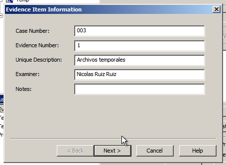

# Informe técnico de adquisición de datos

## Datos de contacto

- Autor: Nicolás Ruiz Ruiz
- Correo: nruirui214@g.educaand.es
- Fecha: 09-11-24

## Introducción

Este documento pretende recoger la toma de datos que se realizó al equipo durante la adquisición, por supuesto, no es un informe de análisis forense.

---

Empiezo el análisis a las 12:28 PM, el estado inicial de la máquina es encendido y se ve así:

Una vez visto el estado inicial de la máquina, debemos acordonar la zona y bloquear la entrada, dejando solo pasar al personal autorizado: resto del equipo CSIRT, supervisores, jefes, etc.

En este caso, no es necesario el uso de equipo anti-contaminación, ya que la adquisición la voy a realizar en el puesto del propio trabajador, lo que si sería necesario es el uso de bolsas anti estáticas para el transporte final de los discos duros donde guardemos la adquisición.

La máquina consta de un Windows Vista, un monitor PHILIPS periféricos como cascos, ratón y teclado, y una torre con un adaptador conectado a la red de la empresa. No tiene dispositivos de almacenamiento conectados ni en los alrededores.

Continuo con la adquisición de datos a las 13:30 y lo haré según el orden de volatilidad descrito en nuestra metodología, además, haré uso de diversas herramientas que nombraré cuando las utilice.

1. Contenido de la memoria RAM.
    Hora de Inicio: 13:35
    Programa utilizado: RamCapture
    Modo de adquisición:
    Ejecutamos la aplicación desde el Pen, en este caso, elegimos la versión de 64 bits y nos aparecerá la siguiente ventana:

| Nombre del archivo | Fecha de adquisición | Hash |
|-|-|-|
| 20241109.mem       | 09-11-24 13:57       | 875E36D7D85A30B6311425A2A14632FD 35A0781E0FCFDA06132A8A5197E0D454750A62F7 |

2. Tablas de enrutamiento y caché ARP.

    Hora de inicio: 14:06
    Programa utilizado: Comando “route print” y “arp -a”
    Modo de adquisición:
    Para capturar la tabla de enrutamiento y y caché ARP, debemos hacer uso de la consola de comandos y poner los siguientes comandos:

| Nombre del archivo | Fecha de adquisición | Hash |
|-|-|-|
| enrutamiento.txt    | 09-11-24 14:14       | C721C3C0847F8CF902DD453899AC4CFE 1D294D48930AEADDD8BD5D8F1E58A3FC6D737DE6 |
| arp.txt            | 09-11-24 14:14       | F15B89D5E0990F36C1BDA18CCF4BB740 C3B60EDB9C4309E986E5CA7C93E442F51C7966DD |

3. Tabla de procesos en ejecución.

    Hora de inicio: 14:19
    Programa utilizado: LastActivityView
    Modo de adquisición:
    Ejecutamos el programa desde el Pen drive y nos aparecerá la siguiente ventana:

| Nombre del archivo | Fecha de adquisición | Hash |
|-|-|-|
| report.html        | 09-11-24 14:28       | 002EE4D380E9BE711B012FE955612D74 47C20CEDA2960712E3640D30668B80F76AB97E1C |

4. Archivos temporales del sistema.
    Hora de inicio: 15:00
    Programa utilizado: FTK Imager
    Modo de adquisición:
    Para la adquisición de archivos temporales, abriremos FTK Imager y añadiremos las 3 siguientes carpetas:

    C:\Users\Administrador\AppData\Local\Temp
    C:\Windows\Temp
    C:\Windows\Prefetch

    Le damos clic derecho a las rutas(no a los nombre) y las añadimos al contenido de imagen personalizada:

    Una vez ahí, le damos a crear imagen y la guardamos en el Pen drive.

    Le damos a Finish y terminamos con la adquisición de archivos temporales.

| Nombre del archivo | Fecha de adquisición | Hash |
|-|-|-|
| ArchivosTemporales.ad1 | 09-11-24 15:30   | 43E2E703EC3E049BA7763973AE5870A7 4C4DCE33486243694B7577C0F933DAC75C873265 |

5. Contenido del disco duro.
    Hora de inicio: 15:36
    Programa utilizado: FTK Imager
    Modo de adquisición:
    Para la adquisición del disco, voy a utilizar el mismo programa que antes. Ejecutamos el programa, le doy a unidad física y añado el disco:

    Hacemos clic derecho en el nombre del disco(no en las particiones) y le damos a exportar imagen del disco. Elegimos la extensión E01, ya que es la más compatible, en el resto de opciones pondré lo siguiente:

| Nombre del archivo | Fecha de adquisición | Hash |
| DiscoCompleto.E01  | 09-11-24 16:17       | 8483EDF792247BBD235F527C6D7714FF AACD22E4A14AFD67CA0CE07B69F8F4501C004844 |
| DiscoCompleto.E02  | 09-11-24 16:17       | 5CC1FC4955102FA552CEBDE380A7B720 1D9C665F7BB1BDB075FA5840167CCAD9488DAB43 |
| DiscoCompleto.E03  | 09-11-24 16:17       | 895680D27627E985AF0261CF12868605 E9270057913F6EEA8D9EDFDB314D0481557EDCF3 |
| DiscoCompleto.E04  | 09-11-24 16:17       | 1D7CF3BA9A347A7AD728D8F14222451B FACDD70BA7E314BF21C7CC75CEBA794CA8B30F1B |

6. Medios de almacenamiento externo.
    Por último tenemos los dispositivos de almacenamiento externos que, en este caso, no vemos ninguno en la escena.

Una vez acabado el proceso de adquisición de datos, vamos a hacer apta de la cadena de custodia:

| Fecha y hora  | Persona que entrega | Persona que recibe | Nombre del archivo     | Hash sha1                                | Firma del entregador | Firma del receptor |
| ------------- | ------------------- | ------------------ | ---------------------- | ---------------------------------------- | -------------------- | ------------------ |
| 9-11-24 15:00 | Nicolás Ruiz Ruiz   | (Quien sea)        | 20241109.mem           | 35A0781E0FCFDA06132A8A5197E0D454750A62F7 | Nicolás Ruiz Ruiz    | (Quien sea)        |
| 9-11-24 15:00 | Nicolás Ruiz Ruiz   | (Quien sea)        | enrutamiento.txt       | 1D294D48930AEADDD8BD5D8F1E58A3FC6D737DE6 | Nicolás Ruiz Ruiz    | (Quien sea)        |
| 9-11-24 15:00 | Nicolás Ruiz Ruiz   | (Quien sea)        | arp.txt                | C3B60EDB9C4309E986E5CA7C93E442F51C7966DD | Nicolás Ruiz Ruiz    | (Quien sea)        |
| 9-11-24 15:00 | Nicolás Ruiz Ruiz   | (Quien sea)        | report.html            | 47C20CEDA2960712E3640D30668B80F76AB97E1C | Nicolás Ruiz Ruiz    | (Quien sea)        |
| 9-11-24 15:00 | Nicolás Ruiz Ruiz   | (Quien sea)        | ArchivosTemporales.ad1 | 4C4DCE33486243694B7577C0F933DAC75C873265 | Nicolás Ruiz Ruiz    | (Quien sea)        |
| 9-11-24 15:00 | Nicolás Ruiz Ruiz   | (Quien sea)        | DiscoCompleto.E01      | AACD22E4A14AFD67CA0CE07B69F8F4501C004844 | Nicolás Ruiz Ruiz    | (Quien sea)        |
| 9-11-24 15:00 | Nicolás Ruiz Ruiz   | (Quien sea)        | DiscoCompleto.E02      | 1D9C665F7BB1BDB075FA5840167CCAD9488DAB43 | Nicolás Ruiz Ruiz    | (Quien sea)        |
| 9-11-24 15:00 | Nicolás Ruiz Ruiz   | (Quien sea)        | DiscoCompleto.E03      | E9270057913F6EEA8D9EDFDB314D0481557EDCF3 | Nicolás Ruiz Ruiz    | (Quien sea)        |
| 9-11-24 15:00 | Nicolás Ruiz Ruiz   | (Quien sea)        | DiscoCompleto.E04      | FACDD70BA7E314BF21C7CC75CEBA794CA8B30F1B | Nicolás Ruiz Ruiz    | (Quien sea)        |