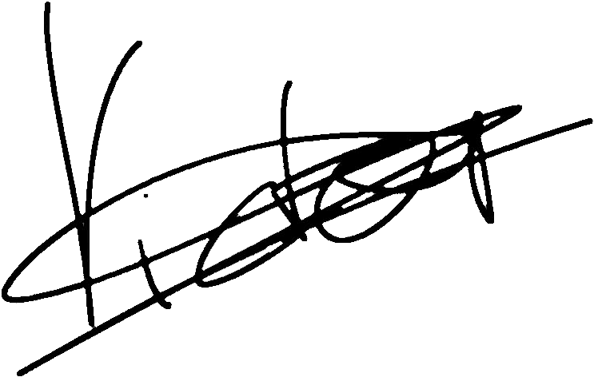

# Proyecto 3: Unfaithful Employee - Anexos

## Declaración de abstención y tacha

Nosotros, Grupo 3, con identificación _011002-A_, en calidad de Equipo Pericial Informático, declaramos formalmente lo siguiente:

### 1. Abstención

No tenemos interés directo ni indirecto en los hechos objeto del presente informe pericial, ni relación alguna con las partes involucradas que pueda comprometer nuestra imparcialidad, conforme a lo establecido en la normativa _ISO-27000_.

### 2. Tacha

Declaramos que no existen motivos de tacha que afecten nuestra idoneidad, independencia o credibilidad como peritos en este caso. No poseemos vínculos familiares, laborales ni de cualquier otra índole con las partes intervinientes.

### 3. Confirmación de Imparcialidad

Nuestros análisis, conclusiones y opiniones periciales se fundamentan exclusivamente en las evidencias digitales recibidas y en las metodologías técnicas reconocidas por la disciplina de informática forense, sin influencia externa de ningún tipo.

En virtud de lo anterior, asumimos la responsabilidad de actuar con total objetividad y profesionalismo en la elaboración y presentación del presente informe.

En virtud de lo anterior, asumo la responsabilidad de actuar con total objetividad y profesionalismo en la elaboración y presentación del presente informe.

## Juramento de promesa

Nosotros, Grupo 3, identificados con _011002-A_, en calidad de Equipo de Peritaje Forense Informático, bajo juramento, prometemos solemnemente lo siguiente:

1. Realizar el análisis técnico del presente caso conforme a los principios de objetividad, veracidad y rigurosidad científica propios de la disciplina de informática forense.

2. Garantizar que todas las conclusiones presentadas en el informe pericial se sustenten exclusivamente en las evidencias digitales analizadas y las metodologías técnicamente válidas, sin alteraciones ni omisiones deliberadas.

3. Actuar de manera independiente e imparcial, sin recibir presiones, influencias externas o intereses personales que puedan comprometer la integridad de mi labor.

4. Cumplir con las disposiciones legales y éticas vigentes aplicables al ejercicio de la pericia forense en el marco del acuerdo, la confidencialidad de los datos y cumplimiento de los requisitos del proceso.

Declaro bajo juramento que honraré este compromiso en la ejecución de mis funciones como perito en este caso.

En Cádiz a 28 de Enero de 2025

Fdo:

## Figuras

### Figura 1. Calculo de hashes

## Hallazgo

### Hallazgo 1

### Hallazgo 2

### Hallazgo 3

### Hallazgo 4

### Hallazgo 5

### Hallazgo 6

### Hallazgo 7

### Hallazgo 8

### Hallazgo 9

### Hallazgo 10

### Hallazgo 11

### Hallazgo 12

### Hallazgo 13

### Hallazgo 14

### Hallazgo 15

### Hallazgo 16

### Hallazgo 17

### Hallazgo 18

### Hallazgo 19

### Hallazgo 20

### Hallazgo 21

### Hallazgo 22

### Hallazgo 23

### Hallazgo 24

### Hallazgo 25

### Hallazgo 26

### Hallazgo 27

### Hallazgo 28

### Hallazgo 29

### Hallazgo 30

---

