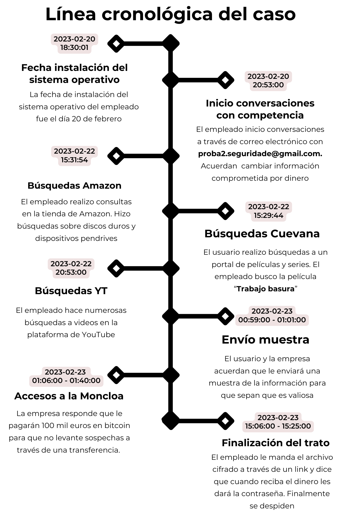
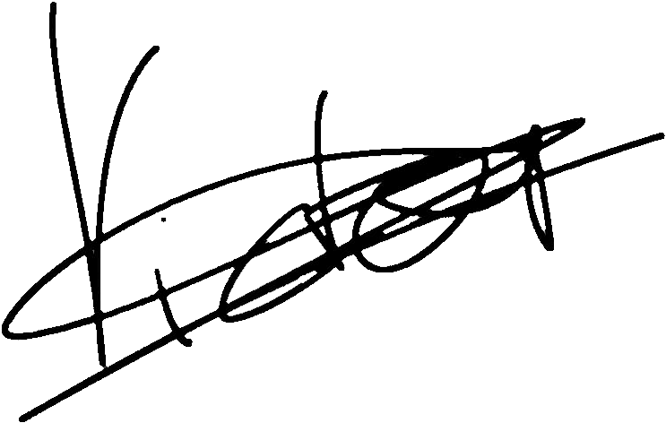

# Proyecto 3: Unfaithful Employee - Informe Pericial

**Código**: P03

**Nombre**: Unfaithful Employee

**Equipo pericial**: Grupo 3

**Fecha**: 28/01/2025

## 1. Resumen Ejecutivo

El análisis forense del disco duro de Richard Warner confirma múltiples violaciones a las políticas de seguridad de InnovaTech Solutions, incluyendo el uso de dispositivos USB no autorizados, la instalación de software no permitido y la navegación en sitios ajenos a su labor durante el horario de trabajo. A través de la verificación de hashes, se detectaron inconsistencias que sugieren una posible manipulación de la imagen forense. Además, se identificaron comunicaciones con una empresa competidora en las que Warner facilitó información confidencial a cambio de beneficios económicos, empleando métodos como almacenamiento en la nube y correos electrónicos encriptados. Se realizó un análisis detallado de la línea de tiempo, el historial de navegación y las actividades del usuario en el sistema, permitiendo evidenciar la exfiltración de datos y el incumplimiento de normativas internas. Toda la evidencia ha sido documentada para respaldar posibles acciones disciplinarias o legales y garantizar la integridad del proceso investigativo.

## 2. Glosario de términos

- **Hash**: Función criptográfica que convierte datos en una cadena única de caracteres. Se usa para verificar la integridad de archivos y detectar manipulaciones.
- **Imagen** forense: Copia exacta de un dispositivo de almacenamiento, creada para análisis sin alterar el original.
- **Logon/Shutdown**: Momentos registrados por el sistema que indican cuándo un usuario inicia o cierra sesión en un dispositivo.

## 3. Introducción

### 3.1 Datos del equipo

El equipo pericial responsable de la redacción de este informe es el Grupo 3. Los peritos especializados en ciberseguridad en entornos de las tecnologías de la información que conforman dicho equipo son los siguientes:

- Víctor Jiménez Corada, <vjimcor955@g.educaand.es>
- Nicolás Ruiz Ruiz, <nruirui@g.educaand.es>
- Israel Valderrama García, <ivalgar260@g.educaand.es>
- Alejandro Seoane Martínez, <aseomar110@g.educaand.es>
- Alejandro Díaz Barea, <adiabar0510@g.educaand.es>

### 3.2. Antecedentes

InnovaTech Solutions ha solicitado un análisis forense del disco duro de Richard Eduardo Warner, un ex empleado que mostró un comportamiento sospechoso antes de su salida. Se busca determinar si accedió indebidamente a información confidencial, utilizó recursos de la empresa de forma inapropiada o filtró datos.

### 3.3. Objetivos

Los objetivos son identificar cualquier información relevante que confirme o desmienta las sospechas. Analizar la actividad del usuario en el sistema, incluyendo accesos, modificaciones de archivos y uso de dispositivos externos, además de detectar intentos de exfiltración de datos por correo, almacenamiento en la nube o USB

### 3.4. Verificación

Tras el cálculo de los hashes de tipo MD5, SHA-1 y SHA-256, hemos llegado a la conclusión de que existen discrepancias entre los hashes resultantes de nuestros cálculos y los entregados junto a la copia de la imagen. Pueden verse en la Figura 1.

## 4. Fuente de información

### 4.1 Cadena de custodia

#### **1. INFORMACIÓN DEL CASO**

| **Sección**           | **Campo**                            |
| --------------------- | ------------------------------------ |
| Número de Caso        | P03                                  |
| Tipo de Investigación | Análisis Forense                     |
| Fecha de Adquisición  | 23 de enero de 2025 a las 08:45      |
| Lugar de Adquisición  | C/ Amiel, s/n – 11012, Cádiz (Cádiz) |

#### **2. DESCRIPCIÓN EVIDENCIA EN ORIGINAL**

| **Sección**                   | **Campo**                                                                                                                                                                |
| ----------------------------- | ------------------------------------------------------------------------------------------------------------------------------------------------------------------------ |
| Tipo de Dispositivo           | Imagen de disco (53687091200 bytes \= 53.69 GB)                                                                                                                          |
| Hash de la Evidencia Original | MD5: dfdfba2231e3fa409676b1b737474208   SHA1: f476a81089a10f9d5393aa8c2f8bbccdb87f7d3c   SHA-256: 66d6ee7a61ea7a986e8f6bb54b9986f79d95b5a0278bef86678ed42ace320d96 |

#### **3. PRESERVACIÓN DE LA EVIDENCIA ORIGINAL**

| **Sección**             | **Campo**                            |
| ----------------------- | ------------------------------------ |
| Fecha de Entrega        | 23 de enero de 2025                  |
| Hora de Entrega         | 09:00                                |
| Recibido por            | Manuel Jesús Rivas Sández            |
| Ubicación en el Juzgado | C/ Amiel, s/n – 11012, Cádiz (Cádiz) |

#### **4. CREACIÓN Y VERIFICACIÓN DE COPIAS**

| **Sección**                | **Campo**                                                                                                                                                      |
| -------------------------- | -------------------------------------------------------------------------------------------------------------------------------------------------------------- |
| Fecha y Hora de Creación   | 26 de enero de 2025 a las 09:00 A.M                                                                                                                            |
| Técnico Responsable        | Grupo3                                                                                                                                                         |
| Hash de la Copia           | MD5: dfdfba2231e3fa409676b1b737474288 SHA1: f476a81089a10f9d5393aa8c2f8bbccdb87f7d3c SHA-256: 66d6ee7a61ea7a986e8f6bb54b9986f79d95b5a0278bef86678ed42ace320d9b |
| Verificación de Integridad | No, los hashes calculados no se corresponden con los que nos han sido entregados.                                                                              |
| Entregado a                | Manuel Jesús Rivas Sández                                                                                                                                      |
| Fecha y Hora de Entrega    | 29 de enero de 2025 a las 23:59                                                                                                                                |

## 5. Análisis

### 5.1. Metodología

Primero se le ha calculado el hash del disco duro que se nos ha entregado, para mantener la integridad de los datos que contiene. Se ha hecho uso de la herramienta FTK imager en su versión 4.2.0.13 y MiTeC WIndows Registry Recovery con su versión 1.6.1.0 para obtener la información referente al caso y calcular los hashes de las evidencias presentadas.

Posteriormente, se realizó un análisis forense de la imagen del disco, incluyendo una inspección del sistema operativo, historial de navegación y de los correos del usuario.

## 6. Procesos

### 6.1 Sistema Operativo

Se han extraído los archivos del referentes al sistema operativo, a partir de los cuales se ha podido extraer la siguiente información:

- El sistema operativo es un **Windows 10 Pro Education N**.
- El nombre del equipo es **LADRONERA**.
- El único usuario del equipo es **Richard** y su ultimo inicio de sesión fue el día **22 de Febrero de 2023 a las 13:55:18**.
- Dicho usuario introdujo un dispositivo USB con id **4D36E967-E325-11CE-BFC1-08002BE10318** y cuya última conexión fue el **22 de Febrero de 2023 a las 00:27:42**.

### 6.2 Navegación a través de internet

Tras realizar un estudio de la navegación a través de internet por parte de **Richard** hemos podido recoger la siguiente información:

- Accedió a páginas como _redeldemule.com_, _cine24h.com_ y _mi.com_ para ver la película _Trabajo basura_.
- Buscaba dispositivos USB en Amazon.
- Su historial de navegación de Opera refleja numerosas búsquedas relacionadas con **fútbol** y **videos de YouTube**.
- Tras su salida de la empresa, Richard buscó vuelos baratos a **ciudades europeas** y hoteles en **Las Palmas de Gran Canaria**.
- Los navegadores que se inician al arrancar el equipo son **Microsoft Edge** y **Opera**.

### 6.3 Correos electrónicos

Hemos encontrado 32 correos del usuario de los cuales sólo son relevantes 6 correos los cuales parecen que estan todos relacionados ya que como podemos ver en los hallazgo del 25 al 27, Richard tiene una conversación con Tom y hablan para que Richard se vaya a la empresa de Tom y además parece que hablan de una posible filtración de datos por parte de Richard a la empresa de Tom y por ello le pagan un plus.

Como se ve en el hallazgo 29 tenemos que el usuario Richard le pasa una cartera de bitcoin y un enlace a un drive pero necesita una contraseña para acceder al contenido. Richard le dice que hasta que no le paguen no le pasa la contraseña para acceder al contenido y Tom le contesta diciendo que ya está todo pagado.

Tambien tiene otra conversación con un compañero de trabajo en la que dice que se viene una gorda en la empresa y que se va a ir de la empresa y que desaparecerá durante un tiempo y luego se irá de vacaciones como podemos ver en el hallazgos 28 y 30

### 6.4 Línea del tiempo

En este apartado se ha creado una línea de tiempo de los pasos más importantes que se han identificado que realizó el usuario del ordenador.  

## 7. Conclusión

El análisis forense del disco duro de Richard Warner confirma múltiples violaciones a las políticas de seguridad de la empresa. Se ha verificado el uso de dispositivos USB no autorizados, la instalación de software no permitido y la navegación en sitios ajenos a su labor durante el horario de trabajo. Además, las evidencias recopiladas demuestran que mantuvo comunicación con una empresa competidora, a la cual presuntamente facilitó información confidencial a cambio de beneficios económicos.

## 8. Anexos

La Declaración de abstención y tacha, el Juramento de promesa, así como las figuras y hallazgos relacionados con el caso, se encuentran recogidos en el siguiente anexo:

[Proyecto 3: Unfaithful Employee - Anexos](./Anexos.md)

