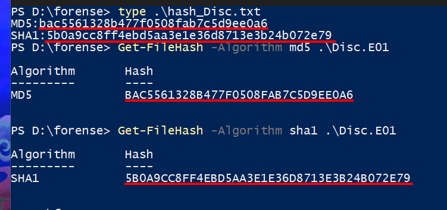
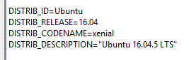
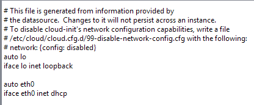
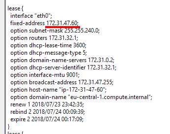
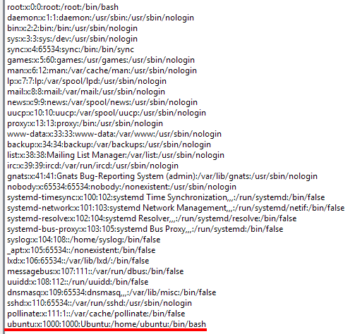
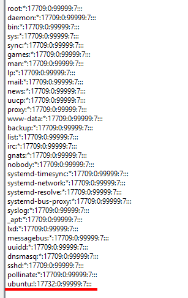
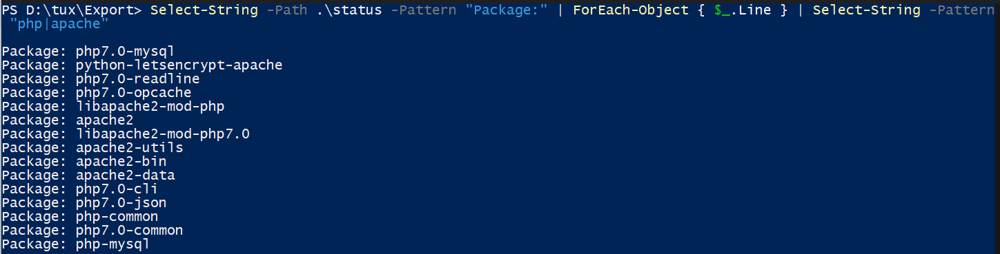
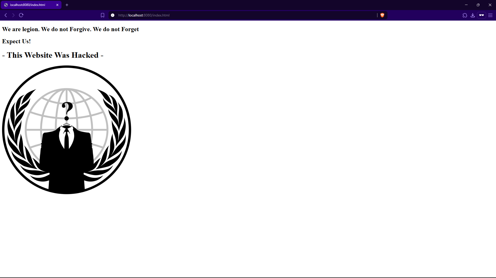

# Análisis Disco

## Comprobación de HASHES

Los hashes calculados corresponden con los proporcionados.

# Análisis

Para el análisis del disco voy a utilizar la herramienta 'Autopsy'.

## Versión del sistema operativo

/etc/lsb-release > 05ceff0ccddc1202b2dfcc14740ca7e1ccf96f3b030ccc5dd21d8b080d7a6b6c
Modified:
2018-07-17 12:19:16 CEST
Accessed:
2018-07-23 05:41:54 CEST
Created:
2018-07-20 11:17:06 CEST
Changed:
2018-07-20 11:17:12 CEST

> Ubuntu 16.04.5 LTS

## Interfaces de red

/etc/networks/interfaces.d/50-cloud-init.cfg > 41a79e120d042435525658f37590efefc113e2e339cc47bb16b2637b6cf2723b
Modified:
2018-07-20 11:10:32 CEST
Accessed:
2018-07-20 11:10:33 CEST
Created:
2018-07-20 11:10:32 CEST
Changed:
2018-07-20 11:10:32 CEST

> Solo 1, eth0 y en DHCP

## IP de la máquina(dhcp)

/var/lib/dhcp/dhcpclient.eth0.leases > f0691c4026c3f85b89801449dadc785640560c800dd464f1d964c02b5bb728b0
Modified:
2018-07-24 07:06:20 CEST
Accessed:
2018-07-20 11:10:33 CEST
Created:
2018-07-20 11:10:33 CEST
Changed:
2018-07-24 07:06:20 CEST

> 172.31.47.60

## Usuarios del sistema

/etc/passwd > c186d3bdf3b416c05224972a46716095cce01ea54877d9d0bd2201afe1eb0d84
Modified:
2018-07-20 11:10:34 CEST
Accessed:
2018-07-23 11:17:01 CEST
Created:
2018-07-20 11:10:34 CEST
Changed:
2018-07-20 11:10:34 CEST

> Aparte del usuario `root` se encuentra el usuario `ubuntu`

/etc/shadow > ec873901be609941716590e5e80a9ca7c9d12cc4f6b11a0ff7a8f33cf11e3e26 
Modified:
2018-07-20 11:10:34 CEST
Accessed:
2018-07-23 11:17:01 CEST
Created:
2018-07-20 11:10:34 CEST
Changed:
2018-07-20 11:10:34 CEST

> La exclamación indica que el ususario no tiene contraseña, ya que inicia sesión por ssh mediante clave pública.

## Paquetes instalados

/var/lib/dpkg/status > 7f61aa3bfe133c75b3b0ed76b236788dea8fc291dbb6aca62ea1e4ccdbf3c768
Modified:
2018-07-20 11:40:11 CEST
Accessed:
2018-07-23 05:41:55 CEST
Created:
2018-07-20 11:40:11 CEST
Changed:
2018-07-20 11:40:11 CEST

> No encuentro nada extremadamente peligroso, pero encontramos php y apache.

## Logs

### Sistema

Nada relevante

### Apache

/var/log/apache2/access.log > 46bf61392de369143890ae080e91502050f9478cd3d1dcb063c8223a6e58662e
Modified:
2018-07-24 07:19:11 CEST
Accessed:
2018-07-23 08:25:01 CEST
Created:
2018-07-23 08:25:01 CEST
Changed:
2018-07-24 07:19:11 CEST

| Hora (UTC) | IP            | Acción                        | Detalle                                                                        | Sospechoso |
|------------|---------------|-------------------------------|--------------------------------------------------------------------------------|------------|
|  10:26:45  | 94.242.54.22  | Carga masiva de archivos WP   | "Accede a /wp-content/, /wp-includes, temas, plugins desde ganga.site"         | Sí         |
|  10:26:45  | 18.185.130.70 | POST a wp-cron.php            | Podría estar ejecutando código persistente malicioso                           | Sí         |
|  06:50:11  | 66.249.66.72  | GET /robots.txt               | Googlebot o bot falso tanteando configuración                                  | No         |
|  10:51:31  | 94.242.54.22  | Nuevos intentos a /wordpress/ | Busca más rutas vulnerables o instalación secundaria                           | Sí         |
|  08:11:52  | 47.203.95.204 | GET a dominio externo         | "Pide http://httpheader.net/, usado a veces por atacantes para fingerprinting" | Moderado   |

/var/log/apache2/error.log > a8f34244c110114462935045c11c9208f846b54abe47ea69909ebbd46518eaec
Modified:
2018-07-23 13:10:16 CEST
Accessed:
2018-07-23 08:25:01 CEST
Created:
2018-07-23 08:25:01 CEST
Changed:
2018-07-23 13:10:16 CEST

| Hora (UTC) | IP           | Descripción                                                                                 | Relevancia |
|------------|--------------|---------------------------------------------------------------------------------------------|------------|
| 06:25:02   | —            | Apache inicia correctamente                                                                 | Normal     |
| 11:08:46   | 94.242.54.22 | Intenta ejecutar `searchreplacedb2.php` y `emergency.php`, típicos de exploits o shells     | Muy alta   |
| 11:08:48   | 94.242.54.22 | Error por función PHP inexistente (`_deprecated_file()`) en un archivo `rss-functions.php`  | Alta       |
| 11:10:16   | 94.242.54.22 | Error por `get_header()` faltante en `index.php` del theme `twentyseventeen`                | Alta       |

> searchreplacedb2.php es una herramienta legítima de migración de bases de datos en WP, pero muy usada por atacantes cuando no está bien eliminada.
> emergency.php es otro archivo que algunos dejan para acceso de emergencia (backdoor).
> Los errores PHP indican que el WordPress está roto o corrupto.

## Ficheros Wordpress

/var/www/html/wordpress/index.html > 2907cf78336f19cdf9b99ded5344b511fa933f1ab6236526f0bcaf1c63263228
Modified:
2018-07-23 14:00:18 CEST
Accessed:
2018-07-23 14:00:25 CEST
Created:
2018-07-23 14:00:15 CEST
Changed:
2018-07-23 14:00:18 CEST

 

> Imagen descifrada.

## Página montada en docker

> Solo funcionan archivos .html, parece que la configuración está rota.