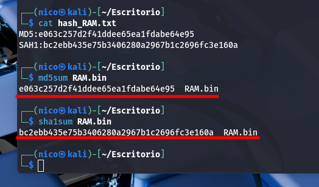

> [!NOTE]
> Los resultados son demasiado largos como para tomar capturas de ellos.

# Calculo de hashes



Calculamos la integridad de los archivos entregados y comprovamos que son correctos.

---

# Procesos activos y jerarquía

```bash
python3 volatility3/vol.py -f RAM.bin --single-location=file://$(pwd)/RAM.bin linux.pslist > pslist.txt
```

| Recolector        | Nombre del archvivo | Fecha        | Hora  | HASH                                                                                 |
| ----------------- | ------------------- | ------------ | ----- | ------------------------------------------------------------------------------------ |
| Nicolás Ruiz Ruiz | pslist.txt          | 5-Abril-2025 | 11:35 | MD5: 1b1f6b75ca82839406544cb685da3b75 SHA1: dc969efa309bc58870d17410ec06097c13f990fd |

[**pslist.txt**](./Anexos/pslist.txt)

```bash
python3 volatility3/vol.py -f RAM.bin --single-location=file://$(pwd)/RAM.bin linux.pstree > pstree.txt
```

| Recolector        | Nombre del archvivo | Fecha        | Hora  | HASH                                                                                 |
| ----------------- | ------------------- | ------------ | ----- | ------------------------------------------------------------------------------------ |
| Nicolás Ruiz Ruiz | pstree.txt          | 5-Abril-2025 | 11:35 | MD5: 1b1f6b75ca82839406544cb685da3b75 SHA1: dc969efa309bc58870d17410ec06097c13f990fd |

[**pstree.txt**](./Anexos/pstree.txt)

## Información de interes

    $ grep -Ei 'bash|sh|python|php|wget|curl|nc|scp|ftp|index|tmp|nginx|apache|httpd' pslist.txt 

    0x88003d4fd280	11	    11	    2	    kdevtmpfs	0	0	0	0	2018-07-20 09:10:25.276000 UTC	Disabled
    0x88003bd8c4c0	1340	1340	1	    sshd	    0	0	0	0	2018-07-20 09:10:37.096384 UTC	Disabled
    0x88000348ee00	27428	27428	1	    apache2	    0	0	0	0	2018-07-20 10:04:02.724797 UTC	Disabled
    0x880036fd8dc0	5573	5573	27428	apache2	    33	33	33	33	2018-07-23 06:25:02.027052 UTC	Disabled
    0x880036f91b80	5763	5763	27428	apache2	    33	33	33	33	2018-07-23 06:50:13.697322 UTC	Disabled
    0x88003c975280	6196	6196	27428	apache2	    33	33	33	33	2018-07-23 10:26:46.767477 UTC	Disabled
    0x88000348a940	6262	6262	27428	apache2	    33	33	33	33	2018-07-23 10:51:35.362918 UTC	Disabled
    0x88000348e040	6266	6266	27428	apache2	    33	33	33	33	2018-07-23 10:51:54.387685 UTC	Disabled
    0x8800366f6040	6281	6281	27428	apache2	    33	33	33	33	2018-07-23 11:08:42.512891 UTC	Disabled
    0x8800366f44c0	6285	6285	27428	apache2	    33	33	33	33	2018-07-23 11:08:44.517880 UTC	Disabled
    0x8800366f2940	6286	6286	27428	apache2	    33	33	33	33	2018-07-23 11:08:44.518256 UTC	Disabled
    0x880036f96040	6287	6287	27428	apache2	    33	33	33	33	2018-07-23 11:08:44.518570 UTC	Disabled
    0x8800366f5280	9054	9054	27428	apache2	    33	33	33	33	2018-07-24 05:18:49.670230 UTC	Disabled
    0x8800366f6e00	9055	9055	1340	sshd	    0	0	0	0	2018-07-24 05:24:16.058132 UTC	Disabled
    0x880022833700	9118	9118	9055	sshd	    1000	1000	1000	1000	2018-07-24 05:24:18.705764 UTC	Disabled
    0x880022830dc0	9126	9126	9118	bash	    1000	1000	1000	1000	2018-07-24 05:24:19.275234 UTC	Disabled

Vemos un inicio de sesión por el usuario (UID 1000), seguido de un interprete de comandos bash, lo que indica una conexión remota al sistema.
Los procesos de `apache2` indican que el servidor estaba siendo utilizado en ese momentos.
El proceso `kdevtmpfs` coincide con el nombre usado comúnmente para malwares.

---

# Procesos lanzados por comandos

```bash
python3 volatility3/vol.py -f RAM.bin --single-location=file://$(pwd)/RAM.bin linux.psaux > psaux.txt
```

| Recolector        | Nombre del archvivo | Fecha        | Hora  | HASH                                                                                 |
| ----------------- | ------------------- | ------------ | ----- | ------------------------------------------------------------------------------------ |
| Nicolás Ruiz Ruiz | psaux.txt           | 5-Abril-2025 | 11:36 | MD5: 10a928f9e4f2b163904c37c26cce8ae8 SHA1: f24af7696503e27b2eabee07846156913bfdb07c |

[**psaux.txt**](./Anexos/psaux.txt)

## Información de interes

    $ grep -Ei 'bash|sh|python|php|wget|curl|nc|scp|ftp|index|tmp|nginx|apache|httpd' psaux.txt 

    11	2	kdevtmpfs	[kdevtmpfs]
    560	1	systemd-timesyn	/lib/systemd/systemd-timesyncd
    1340	1	sshd	/usr/sbin/sshd -D
    27428	1	apache2	/usr/sbin/apache2 -k start
    5573	27428	apache2	/usr/sbin/apache2 -k start
    5763	27428	apache2	/usr/sbin/apache2 -k start
    6196	27428	apache2	/usr/sbin/apache2 -k start
    6262	27428	apache2	/usr/sbin/apache2 -k start
    6266	27428	apache2	/usr/sbin/apache2 -k start
    6281	27428	apache2	/usr/sbin/apache2 -k start
    6285	27428	apache2	/usr/sbin/apache2 -k start
    6286	27428	apache2	/usr/sbin/apache2 -k start
    6287	27428	apache2	/usr/sbin/apache2 -k start
    9054	27428	apache2	/usr/sbin/apache2 -k start
    9055	1340	sshd	sshd: ubuntu [priv] 
    9118	9055	sshd	sshd: ubuntu@pts/0  
    9126	9118	bash	-bash

Reforzamos lo que vimos en el punto anterior.

---

# Historial de comandos

```bash
python3 volatility3/vol.py -f RAM.bin --single-location=file://$(pwd)/RAM.bin linux.bash > bash.txt
```

| Recolector        | Nombre del archvivo | Fecha        | Hora  | HASH                                                                                 |
| ----------------- | ------------------- | ------------ | ----- | ------------------------------------------------------------------------------------ |
| Nicolás Ruiz Ruiz | bash.txt            | 5-Abril-2025 | 11:37 | MD5: 4f67ddebf54ea7747842c81bce19f8d9 SHA1: 14767178c3ba924c510662741b00d2390063ddf1 |

[**bash.txt**](./Anexos/bash.txt)

## Información de interes

    $ grep -Ei 'wget|curl|echo|cat|rm|nano|vi|vim|/tmp|/var/www|index\.html|base64|xxd' bash.txt 

    9126	bash	2018-07-24 05:24:19.000000 UTC	sudo vi 000-default.conf 
    9126	bash	2018-07-24 05:24:19.000000 UTC	sudo vi ../apache2.conf 
    9126	bash	2018-07-24 05:24:19.000000 UTC	sudo vi ../ports.conf 
    9126	bash	2018-07-24 05:24:19.000000 UTC	sudo service apache2 restart
    9126	bash	2018-07-24 05:24:19.000000 UTC	sudo letsencrypt --authenticator webroot --installer apache --webroot-path /var/www/html -d ganga.site -d www.ganga.site
    9126	bash	2018-07-24 05:24:19.000000 UTC	sudo letsencrypt --authenticator webroot --installer apache --webroot-path /var/www/html -d ganga.site -d www.ganga.site
    9126	bash	2018-07-24 05:24:19.000000 UTC	sudo letsencrypt --authenticator webroot --installer apache --webroot-path /var/www/html -d ganga.site -d www.ganga.site
    9126	bash	2018-07-24 05:24:19.000000 UTC	sudo vi /etc/apache2/sites-available/000-default.conf 
    9126	bash	2018-07-24 05:24:19.000000 UTC	sudo service apache2 restart
    9126	bash	2018-07-24 05:24:19.000000 UTC	sudo vi /etc/apache2/sites-enabled/000-default-le-ssl.conf 
    9126	bash	2018-07-24 05:24:19.000000 UTC	sudo rm index.html 
    9126	bash	2018-07-24 05:24:19.000000 UTC	sudo service apache2 restart
    9126	bash	2018-07-24 05:24:19.000000 UTC	sudo vi /etc/apache2/sites-enabled/000-default-le-ssl.conf 
    9126	bash	2018-07-24 05:24:19.000000 UTC	find /etc/apache2 -type f -exec grep -i Logformat {} \;
    9126	bash	2018-07-24 05:24:19.000000 UTC	find /etc/apche2 -type f -exec grep -i Logformat {} \;
    9126	bash	2018-07-24 05:24:19.000000 UTC	sudo vi /etc/apache2/sites-enabled/000-default-le-ssl.conf 
    9126	bash	2018-07-24 05:24:19.000000 UTC	find /etc/apache2 -type f -exec grep -Hi Logformat {} \;
    9126	bash	2018-07-24 05:24:19.000000 UTC	sudo service apache restart
    9126	bash	2018-07-24 05:24:19.000000 UTC	sudo vi /etc/apache2/sites-enabled/000-default-le-ssl.conf 
    9126	bash	2018-07-24 05:24:19.000000 UTC	sudo service apache2 restart
    9126	bash	2018-07-24 05:24:19.000000 UTC	sudo service apache2 restart
    9126	bash	2018-07-24 05:24:19.000000 UTC	cd /var/www/html
    9126	bash	2018-07-24 05:24:19.000000 UTC	sudo vi /etc/apache2/sites-enabled/000-default-le-ssl.conf 
    9126	bash	2018-07-24 05:24:19.000000 UTC	sudo service apache2 restart
    9126	bash	2018-07-24 05:24:19.000000 UTC	sudo vi /etc/apache2/sites-enabled/000-default-le-ssl.conf 
    9126	bash	2018-07-24 05:27:03.000000 UTC	sudo insmod ./lime-4.4.0-1061-aws.ko  "path=memoria.bin format=lime"

El uso de vi y rm sobre archivos web sugiere interacción directa con el contenido de la página.
No tiene porque ser algo malo, lo puede haber editado el administrador, pero que todos los archivos se editen al mismo segundo, es un poco raro.
El comando insmod ./lime... indica una intención clara de realizar una captura forense de la memoria RAM.

---

# Archivos abiertos por procesos

```bash
python3 volatility3/vol.py -f RAM.bin --single-location=file://$(pwd)/RAM.bin linux.lsof > lsof.txt
```

| Recolector        | Nombre del archvivo | Fecha        | Hora  | HASH                                                                                 |
| ----------------- | ------------------- | ------------ | ----- | ------------------------------------------------------------------------------------ |
| Nicolás Ruiz Ruiz | lsof.txt            | 5-Abril-2025 | 11:37 | MD5: b47fdb539e64636becdd92235ae7ff73 SHA1: 21da9f61530f7ad19713639ae59e5448ae2d81b0 |

[**lsof.txt**](./Anexos/lsof.txt)

## Información de interes

    $ grep -Ei '/var/www|/html|index\.html|\.php|\.sh|\.py|/tmp|/dev/shm' lsof.txt 

    27428	27428	apache2	14	/tmp/.ZendSem.3AKgTp	202:1	51275	REG	-rw-rw-rw-	2018-07-23 06:25:02.050329 UTC	2018-07-23 06:25:02.050329 UTC	2018-07-23 06:25:02.050329 UTC0
    5573	5573	apache2	14	/tmp/.ZendSem.3AKgTp	202:1	51275	REG	-rw-rw-rw-	2018-07-23 06:25:02.050329 UTC	2018-07-23 06:25:02.050329 UTC	2018-07-23 06:25:02.050329 UTC0
    5763	5763	apache2	14	/tmp/.ZendSem.3AKgTp	202:1	51275	REG	-rw-rw-rw-	2018-07-23 06:25:02.050329 UTC	2018-07-23 06:25:02.050329 UTC	2018-07-23 06:25:02.050329 UTC0
    6196	6196	apache2	14	/tmp/.ZendSem.3AKgTp	202:1	51275	REG	-rw-rw-rw-	2018-07-23 06:25:02.050329 UTC	2018-07-23 06:25:02.050329 UTC	2018-07-23 06:25:02.050329 UTC0
    6262	6262	apache2	14	/tmp/.ZendSem.3AKgTp	202:1	51275	REG	-rw-rw-rw-	2018-07-23 06:25:02.050329 UTC	2018-07-23 06:25:02.050329 UTC	2018-07-23 06:25:02.050329 UTC0
    6266	6266	apache2	14	/tmp/.ZendSem.3AKgTp	202:1	51275	REG	-rw-rw-rw-	2018-07-23 06:25:02.050329 UTC	2018-07-23 06:25:02.050329 UTC	2018-07-23 06:25:02.050329 UTC0
    6281	6281	apache2	14	/tmp/.ZendSem.3AKgTp	202:1	51275	REG	-rw-rw-rw-	2018-07-23 06:25:02.050329 UTC	2018-07-23 06:25:02.050329 UTC	2018-07-23 06:25:02.050329 UTC0
    6285	6285	apache2	14	/tmp/.ZendSem.3AKgTp	202:1	51275	REG	-rw-rw-rw-	2018-07-23 06:25:02.050329 UTC	2018-07-23 06:25:02.050329 UTC	2018-07-23 06:25:02.050329 UTC0
    6286	6286	apache2	14	/tmp/.ZendSem.3AKgTp	202:1	51275	REG	-rw-rw-rw-	2018-07-23 06:25:02.050329 UTC	2018-07-23 06:25:02.050329 UTC	2018-07-23 06:25:02.050329 UTC0
    6287	6287	apache2	14	/tmp/.ZendSem.3AKgTp	202:1	51275	REG	-rw-rw-rw-	2018-07-23 06:25:02.050329 UTC	2018-07-23 06:25:02.050329 UTC	2018-07-23 06:25:02.050329 UTC0
    9054	9054	apache2	14	/tmp/.ZendSem.3AKgTp	202:1	51275	REG	-rw-rw-rw-	2018-07-23 06:25:02.050329 UTC	2018-07-23 06:25:02.050329 UTC	2018-07-23 06:25:02.050329 UTC0

Encontramos este archivo en una carpeta temporal, el cuál ha sido creado y accedido por el proceso `apache`.
Por lo que hemos investigado, es un archivo temporal que crea `wordpress`, por lo que no tendría porque ser malicioso.

---

# Archivos cacheados en RAM

```bash
python3 volatility3/vol.py -f RAM.bin --single-location=file://$(pwd)/RAM.bin linux.pagecache.Files > page.Files.txt
```

| Recolector        | Nombre del archvivo | Fecha        | Hora  | HASH                                                                                 |
| ----------------- | ------------------- | ------------ | ----- | ------------------------------------------------------------------------------------ |
| Nicolás Ruiz Ruiz | page.Files.txt      | 5-Abril-2025 | 11:39 | MD5: 6eb9cd07bccb8aeeff7ce94c3c4cac47 SHA1: 141b4f3768d8a8ba7d6bb43052f0300e9e970e7b |

[**page.Files.txt**](./Anexos/page.Files.txt)

## Información de interes

Nada de interes

---

# Sistema de archivos cacheado

```bash
python3 volatility3/vol.py -f RAM.bin --single-location=file://$(pwd)/RAM.bin linux.pagecache.RecoverFs > page.RecoverFs.txt
```

| Recolector        | Nombre del archvivo | Fecha        | Hora  | HASH                                                                                 |
| ----------------- | ------------------- | ------------ | ----- | ------------------------------------------------------------------------------------ |
| Nicolás Ruiz Ruiz | page.RecoverFs.txt  | 5-Abril-2025 | 11:41 | MD5: 28fcdbb73583a595dc4b87bb713bb52f SHA1: 6e6f210204ad8f2425643f2c1fd10ae3125e10bc |

[**page.RecoverFs.txt**](./Anexos/page.RecoverFs.txt)

## Información de interes

Nada de interes

---


# ACLARACIÓN

Creo que he entendido mal lo que hacen los 2 comandos previos, porque al hacer un string de la memoria, si que me salen arhivos, o al menos las rutas más comunes(/home,/var/www,/...)

# Adaptadores de red

```bash
python3 volatility3/vol.py -f RAM.bin --single-location=file://$(pwd)/RAM.bin linux.ip.Addr > ip.Addr.txt
```

| Recolector        | Nombre del archvivo | Fecha        | Hora  | HASH                                                                                 |
| ----------------- | ------------------- | ------------ | ----- | ------------------------------------------------------------------------------------ |
| Nicolás Ruiz Ruiz | ip.Addr.txt         | 5-Abril-2025 | 12:25 | MD5: 597176688eecb7b23b25693d3cdb1a9f SHA1: 2f2756e8cb304b9f618b709d5755eb0c14bc6801 |

[**ip.Addr.txt**](./Anexos/ip.Addr.txt)

## Información de interes

    $ cat ip.Addr.txt              
    Volatility 3 Framework 2.26.1

    NetNS	Index	Interface	MAC	Promiscuous	IP	Prefix	Scope Type	State

    4026531993	1	lo	00:00:00:00:00:00	False	127.0.0.1	8	host	UNKNOWN
    4026531993	1	lo	00:00:00:00:00:00	False	::1	128	host	UNKNOWN
    4026531993	2	eth0	06:1d:7a:bb:a9:04	False	172.31.47.60	20	global	UP
    4026531993	2	eth0	06:1d:7a:bb:a9:04	False	fe80::41d:7aff:febb:a904	64	link	UP

La máquina tiene un solo adaptador de red con la IP `172.31.47.60`

---

# Conexiones de red

```bash
python3 volatility3/vol.py -f RAM.bin --single-location=file://$(pwd)/RAM.bin linux.sockstat > sockstat.txt
```

| Recolector        | Nombre del archvivo | Fecha        | Hora  | HASH                                                                                 |
| ----------------- | ------------------- | ------------ | ----- | ------------------------------------------------------------------------------------ |
| Nicolás Ruiz Ruiz | sockstat.txt        | 5-Abril-2025 | 11:42 | MD5: 2cc29a0a1df2e5938b9db80c7bc419a5 SHA1: 3c76c4434560c353e8641f31bbdd3ba58e6a5418 |

[**sockstat.txt**](./Anexos/sockstat.txt)

## Información de interes

    $ cat sockstat.txt | grep -iE '172.31.47.60'
    4026531993	sshd	9055	9055	3	0x8800367e1680	AF_INET	STREAM	TCP	172.31.47.60	22	23.226.128.37	42760	ESTABLISHED	-
    4026531993	sshd	9118	9118	3	0x8800367e1680	AF_INET	STREAM	TCP	172.31.47.60	22	23.226.128.37	42760	ESTABLISHED	-

Encontramos una conexión remota al servicio `sshd` de la máquina con el host `23.226.128.37`

---

# Módulos del kernel

```bash
python3 volatility3/vol.py -f RAM.bin --single-location=file://$(pwd)/RAM.bin linux.lsmod > lsmod.txt
```

| Recolector        | Nombre del archvivo | Fecha        | Hora  | HASH                                                                                 |
| ----------------- | ------------------- | ------------ | ----- | ------------------------------------------------------------------------------------ |
| Nicolás Ruiz Ruiz | lsmod.txt           | 5-Abril-2025 | 11:44 | MD5: fb06c709ae8eeb86c5a15de12e07d6f1 SHA1: f79774732126814549ba2598083e26037c037036 |

[**lsmod.txt**](./Anexos/lsmod.txt)

## Información de interes

Nada de interes

---

# Variables de entorno

```bash
python3 volatility3/vol.py -f RAM.bin --single-location=file://$(pwd)/RAM.bin linux.envars > envars.txt
```

| Recolector        | Nombre del archvivo | Fecha        | Hora  | HASH                                                                                 |
| ----------------- | ------------------- | ------------ | ----- | ------------------------------------------------------------------------------------ |
| Nicolás Ruiz Ruiz | envars.txt          | 5-Abril-2025 | 11:45 | MD5: 6ff64c5ec196643638dc29b6cd16a737 SHA1: e7694640183fa202f19f64dc1302f78ac429ed73 |

[**envars.txt**](./Anexos/envars.txt)

## Información de interes

Nada de interes

---

# Código malicioso inyectado

```bash
python3 volatility3/vol.py -f RAM.bin --single-location=file://$(pwd)/RAM.bin linux.malfind > malfind.txt
```

| Recolector        | Nombre del archvivo | Fecha        | Hora  | HASH                                                                                 |
| ----------------- | ------------------- | ------------ | ----- | ------------------------------------------------------------------------------------ |
| Nicolás Ruiz Ruiz | malfind.txt         | 5-Abril-2025 | 11:46 | MD5: 76c44c94261f1a233df90920bb8672d0 SHA1: 0e440f61cbaa14a2ba985615ceedce018e449f38 |

[**malfind.txt**](./Anexos/malfind.txt)

## Información de interes

    $ head malfind.txt
    Volatility 3 Framework 2.26.1

    PID	Process	Start	End	Path	Protection	Hexdump	Disasm

    5573	apache2	0x7f0663ff3000	0x7f0664033000	Anonymous Mapping	rwx	
    b8 17 00 00 00 00 00 00 00 00 00 00 00 00 00 00 ................
    53 41 57 41 56 41 55 55 48 8b df 48 81 ec 20 01 SAWAVAUUH..H.. .
    00 00 48 8b 43 10 48 83 e8 01 48 8d 74 24 38 48 ..H.C.H...H.t$8H
    c7 c1 11 00 00 00 48 89 46 08 48 8d 76 08 48 83 ......H.F.H.v.H.	
    0x7f0663ff3000:	mov	eax, 0x17

Se ha detectado una región de memoria con permisos rwx (lectura, escritura y ejecución) dentro del proceso apache2 (PID 5573), la cual está marcada como un Anonymous Mapping, es decir, no está asociada a ningún archivo físico del sistema.


---

# Strings a la memoria

Como última opción, hemos análizado el archivo de la RAM directamente y hemos encontrado lo siguiente:

---
    $ strings RAM.bin | grep 'wordpress' | grep -i 'wp-content/uploads' | grep -iE '201[0-9]' | grep -iE '.php' | grep -Ev '\(' | sort | uniq

    /html/wordpress/wp-content/uploads/2018/07/XLPYhlEtQOyiMKb.php
    nga.si/var/www/html/wordpress/wp-content/uploads/2018/07/XLPYhlEtQOyiMKb.php
    /var/www/html/wordpress/wp-content/uploads/2018/07/PSMOfbPom.php
    /var/www/html/wordpress/wp-content/uploads/2018/07/vmGAbaiewrSSuMs.php
    /var/www/html/wordpress/wp-content/uploads/2018/07/XLPYhlEtQOyiMKb.php
    /var/www/html/wordpress/wp-content/uploads/2018/07/yDdoSpsx.php

---
    $ strings RAM.bin | grep -iE 'user' | grep 'UID=1000' 

    Jul 20 09:10:35 ip-172-31-47-60 useradd[1111]: new user: name=ubuntu, UID=1000, GID=1000, home=/home/ubuntu, shell=/bin/bash
    20 09:10:34 useradd[1111]: new user: name=ubuntu, UID=1000, GID=1000, home=/home/ubuntu, shell=/bin/bash
    MESSAGE=new user: name=ubuntu, UID=1000, GID=1000, home=/home/ubuntu, shell=/bin/bash

---
    $ strings RAM.bin | grep -iE '23.226.128.37' | grep 'ssh2'
    Jul 20 09:35:47 ip-172-31-47-60 sshd[26368]: Accepted publickey for ubuntu from 23.226.128.37 port 39256 ssh2: RSA SHA256:Q27pW6dDYPJ8N0mBX6L8SO8OQ7LVSdNdm1xxzyBT23Y
    Jul 24 05:24:18 ip-172-31-47-60 sshd[9055]: Accepted publickey for ubuntu from 23.226.128.37 port 42760 ssh2: RSA SHA256:Q27pW6dDYPJ8N0mBX6L8SO8OQ7LVSdNdm1xxzyBT23Y
    Jul 24 05:24:18 ip-172-31-47-60 sshd[9055]: Accepted publickey for ubuntu from 23.226.128.37 port 42760 ssh2: RSA SHA256:Q27pW6dDYPJ8N0mBX6L8SO8OQ7LVSdNdm1xxzyBT23Y
    Jul 20 09:35:47 ip-172-31-47-60 sshd[26368]: Accepted publickey for ubuntu from 23.226.128.37 port 39256 ssh2: RSA SHA256:Q27pW6dDYPJ8N0mBX6L8SO8OQ7LVSdNdm1xxzyBT23Y
    Jul 20 09:35:47 ip-172-31-47-60 sshd[26368]: Accepted publickey for ubuntu from 23.226.128.37 port 39256 ssh2: RSA SHA256:Q27pW6dDYPJ8N0mBX6L8SO8OQ7LVSdNdm1xxzyBT23Y
    Jul 20 09:35:47 ip-172-31-47-60 sshd[26368]: Accepted publickey for ubuntu from 23.226.128.37 port 39256 ssh2: RSA SHA256:Q27pW6dDYPJ8N0mBX6L8SO8OQ7LVSdNdm1xxzyBT23Y
    MESSAGE=Accepted publickey for ubuntu from 23.226.128.37 port 36840 ssh2: RSA SHA256:Q27pW6dDYPJ8N0mBX6L8SO8OQ7LVSdNdm1xxzyBT23Y
    MESSAGE=Accepted publickey for ubuntu from 23.226.128.37 port 39256 ssh2: RSA SHA256:Q27pW6dDYPJ8N0mBX6L8SO8OQ7LVSdNdm1xxzyBT23Y
    MESSAGE=Accepted publickey for ubuntu from 23.226.128.37 port 42760 ssh2: RSA SHA256:Q27pW6dDYPJ8N0mBX6L8SO8OQ7LVSdNdm1xxzyBT23Y
    Jul 20 09:16:45 ip-172-31-47-60 sshd[1859]: Accepted publickey for ubuntu from 23.226.128.37 port 36840 ssh2: RSA SHA256:Q27pW6dDYPJ8N0mBX6L8SO8OQ7LVSdNdm1xxzyBT23Y
    MESSAGE=Accepted publickey for ubuntu from 23.226.128.37 port 36840 ssh2: RSA SHA256:Q27pW6dDYPJ8N0mBX6L8SO8OQ7LVSdNdm1xxzyBT23Y
    MESSAGE=Accepted publickey for ubuntu from 23.226.128.37 port 42760 ssh2: RSA SHA256:Q27pW6dDYPJ8N0mBX6L8SO8OQ7LVSdNdm1xxzyBT23Y

---

Con esto último, sacamos varias cosas:

1. Archivos con nombres poco usuarles en el directorio ``wordpress``
2. El usuario (UID 1000) que vimos anteriormente se trata de ``ubuntu``
3. La conexsión remota se hizo mediante clave pública.

# Cronología

- 2018-07-20 09:10:25 – Se inicia el proceso kdevtmpfs (PID 11).

- 2018-07-20 09:35:47 – Primera conexión SSH exitosa desde 23.226.128.37 usando clave pública RSA SHA256:Q27pW6dDYPJ8N0mBX6L8SO8OQ7LVSdNdm1xxzyBT23Y.

- 2018-07-23 06:25:02 – Se lanza uno de los procesos apache2 (PID 5573). Todos los procesos Apache comienzan a acceder al archivo temporal /tmp/.ZendSem.3AKgTp.

- 2018-07-24 05:24:16 – Se inicia un nuevo proceso sshd (PID 9055), aceptando conexión desde 23.226.128.37.

- 2018-07-24 05:24:18 – El usuario ubuntu (UID 1000) inicia sesión remotamente desde esa IP mediante clave pública previamente aceptada.

- 2018-07-24 05:24:19 – Se lanza el intérprete de comandos bash (PID 9126), lo que confirma sesión interactiva activa.

- 2018-07-24 05:24:19 – Se realizan múltiples modificaciones del sistema a través del bash:

    - Edición de archivos de configuración de Apache: 000-default.conf, apache2.conf, ports.conf, 000-default-le-ssl.conf.

    - Eliminación de index.html.

    - Ejecución de comandos para emitir certificados TLS para el dominio ganga.site usando Let's Encrypt.

    - Repetidos reinicios del servicio Apache.

    - Cambios al directorio web /var/www/html.

    - Búsquedas relacionadas con el formateo de logs.

- 2018-07-24 05:24:19 – Se inspecciona la configuración de Apache (grep -i Logformat).

- 2018-07-24 05:27:03 – La herramienta forense LIME se ejecuta para capturar la memoria RAM.