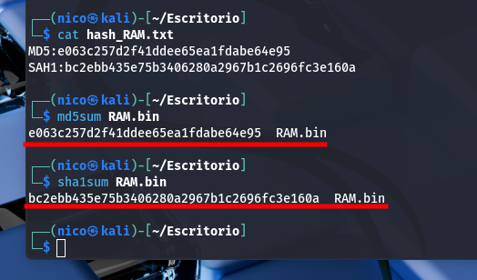

> [!NOTE]
> Los resultados son demasiado largos como para tomar capturas de ellos.

# Calculo de hashes



# Procesos activos y jerarquía

```bash
python3 volatility3/vol.py -f RAM.bin --single-location=file://$(pwd)/RAM.bin linux.pslist > pslist.txt
```

| Recolector        | Nombre del archvivo | Fecha        | Hora  | HASH                                                                                 |
| ----------------- | ------------------- | ------------ | ----- | ------------------------------------------------------------------------------------ |
| Nicolás Ruiz Ruiz | pslist.txt          | 5-Abril-2025 | 11:35 | MD5: 1b1f6b75ca82839406544cb685da3b75 SHA1: dc969efa309bc58870d17410ec06097c13f990fd |

```bash
python3 volatility3/vol.py -f RAM.bin --single-location=file://$(pwd)/RAM.bin linux.pstree > pstree.txt
```

| Recolector        | Nombre del archvivo | Fecha        | Hora  | HASH                                                                                 |
| ----------------- | ------------------- | ------------ | ----- | ------------------------------------------------------------------------------------ |
| Nicolás Ruiz Ruiz | pstree.txt          | 5-Abril-2025 | 11:35 | MD5: 1b1f6b75ca82839406544cb685da3b75 SHA1: dc969efa309bc58870d17410ec06097c13f990fd |

# Procesos lanzados por comandos

```bash
python3 volatility3/vol.py -f RAM.bin --single-location=file://$(pwd)/RAM.bin linux.psaux > psaux.txt
```

| Recolector        | Nombre del archvivo | Fecha        | Hora  | HASH                                                                                 |
| ----------------- | ------------------- | ------------ | ----- | ------------------------------------------------------------------------------------ |
| Nicolás Ruiz Ruiz | psaux.txt           | 5-Abril-2025 | 11:36 | MD5: 10a928f9e4f2b163904c37c26cce8ae8 SHA1: f24af7696503e27b2eabee07846156913bfdb07c |

# Historial de comandos

```bash
python3 volatility3/vol.py -f RAM.bin --single-location=file://$(pwd)/RAM.bin linux.bash > bash.txt
```

| Recolector        | Nombre del archvivo | Fecha        | Hora  | HASH                                                                                 |
| ----------------- | ------------------- | ------------ | ----- | ------------------------------------------------------------------------------------ |
| Nicolás Ruiz Ruiz | bash.txt            | 5-Abril-2025 | 11:37 | MD5: 4f67ddebf54ea7747842c81bce19f8d9 SHA1: 14767178c3ba924c510662741b00d2390063ddf1 |

# Archivos abiertos por procesos

```bash
python3 volatility3/vol.py -f RAM.bin --single-location=file://$(pwd)/RAM.bin linux.lsof > lsof.txt
```

| Recolector        | Nombre del archvivo | Fecha        | Hora  | HASH                                                                                 |
| ----------------- | ------------------- | ------------ | ----- | ------------------------------------------------------------------------------------ |
| Nicolás Ruiz Ruiz | lsof.txt            | 5-Abril-2025 | 11:37 | MD5: b47fdb539e64636becdd92235ae7ff73 SHA1: 21da9f61530f7ad19713639ae59e5448ae2d81b0 |

# Archivos cacheados en RAM

```bash
python3 volatility3/vol.py -f RAM.bin --single-location=file://$(pwd)/RAM.bin linux.pagecache.Files > page.Files.txt
```

| Recolector        | Nombre del archvivo | Fecha        | Hora  | HASH                                                                                 |
| ----------------- | ------------------- | ------------ | ----- | ------------------------------------------------------------------------------------ |
| Nicolás Ruiz Ruiz | page.Files.txt      | 5-Abril-2025 | 11:39 | MD5: 6eb9cd07bccb8aeeff7ce94c3c4cac47 SHA1: 141b4f3768d8a8ba7d6bb43052f0300e9e970e7b |

# Sistema de archivos cacheado

```bash
python3 volatility3/vol.py -f RAM.bin --single-location=file://$(pwd)/RAM.bin linux.pagecache.RecoverFs > page.RecoverFs.txt
```

| Recolector        | Nombre del archvivo | Fecha        | Hora  | HASH                                                                                 |
| ----------------- | ------------------- | ------------ | ----- | ------------------------------------------------------------------------------------ |
| Nicolás Ruiz Ruiz | page.RecoverFs.txt  | 5-Abril-2025 | 11:41 | MD5: 28fcdbb73583a595dc4b87bb713bb52f SHA1: 6e6f210204ad8f2425643f2c1fd10ae3125e10bc |

# Adaptadores de red

```bash
python3 volatility3/vol.py -f RAM.bin --single-location=file://$(pwd)/RAM.bin linux.ip.Addr > ip.Addr.txt
```

| Recolector        | Nombre del archvivo | Fecha        | Hora  | HASH                                                                                 |
| ----------------- | ------------------- | ------------ | ----- | ------------------------------------------------------------------------------------ |
| Nicolás Ruiz Ruiz | ip.Addr.txt         | 5-Abril-2025 | 12:25 | MD5: 597176688eecb7b23b25693d3cdb1a9f SHA1: 2f2756e8cb304b9f618b709d5755eb0c14bc6801 |

# Conexiones de red

```bash
python3 volatility3/vol.py -f RAM.bin --single-location=file://$(pwd)/RAM.bin linux.sockstat > sockstat.txt
```

| Recolector        | Nombre del archvivo | Fecha        | Hora  | HASH                                                                                 |
| ----------------- | ------------------- | ------------ | ----- | ------------------------------------------------------------------------------------ |
| Nicolás Ruiz Ruiz | sockstat.txt        | 5-Abril-2025 | 11:42 | MD5: 2cc29a0a1df2e5938b9db80c7bc419a5 SHA1: 3c76c4434560c353e8641f31bbdd3ba58e6a5418 |

# Módulos del kernel

```bash
python3 volatility3/vol.py -f RAM.bin --single-location=file://$(pwd)/RAM.bin linux.lsmod > lsmod.txt
```

| Recolector        | Nombre del archvivo | Fecha        | Hora  | HASH                                                                                 |
| ----------------- | ------------------- | ------------ | ----- | ------------------------------------------------------------------------------------ |
| Nicolás Ruiz Ruiz | lsmod.txt           | 5-Abril-2025 | 11:44 | MD5: fb06c709ae8eeb86c5a15de12e07d6f1 SHA1: f79774732126814549ba2598083e26037c037036 |

# Variables de entorno

```bash
python3 volatility3/vol.py -f RAM.bin --single-location=file://$(pwd)/RAM.bin linux.envars > envars.txt
```

| Recolector        | Nombre del archvivo | Fecha        | Hora  | HASH                                                                                 |
| ----------------- | ------------------- | ------------ | ----- | ------------------------------------------------------------------------------------ |
| Nicolás Ruiz Ruiz | envars.txt          | 5-Abril-2025 | 11:45 | MD5: 6ff64c5ec196643638dc29b6cd16a737 SHA1: e7694640183fa202f19f64dc1302f78ac429ed73 |

# Código malicioso inyectado

```bash
python3 volatility3/vol.py -f RAM.bin --single-location=file://$(pwd)/RAM.bin linux.malfind > malfind.txt
```

| Recolector        | Nombre del archvivo | Fecha        | Hora  | HASH                                                                                 |
| ----------------- | ------------------- | ------------ | ----- | ------------------------------------------------------------------------------------ |
| Nicolás Ruiz Ruiz | malfind.txt         | 5-Abril-2025 | 11:46 | MD5: 76c44c94261f1a233df90920bb8672d0 SHA1: 0e440f61cbaa14a2ba985615ceedce018e449f38 |