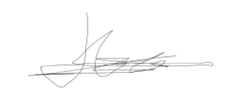

#  Incident on Linux Server I - Anexos

## Declaración de abstención y tacha

Nosotros, Grupo 3, con identificación _011002-A_, en calidad de Equipo Pericial Informático, declaramos formalmente lo siguiente:

### 1. Abstención

No tenemos interés directo ni indirecto en los hechos objeto del presente informe pericial, ni relación alguna con las partes involucradas que pueda comprometer nuestra imparcialidad, conforme a lo establecido en la normativa _ISO-27000_.

### 2. Tacha

Declaramos que no existen motivos de tacha que afecten nuestra idoneidad, independencia o credibilidad como peritos en este caso. No poseemos vínculos familiares, laborales ni de cualquier otra índole con las partes intervinientes.

### 3. Confirmación de Imparcialidad

Nuestros análisis, conclusiones y opiniones periciales se fundamentan exclusivamente en las evidencias digitales recibidas y en las metodologías técnicas reconocidas por la disciplina de informática forense, sin influencia externa de ningún tipo.

En virtud de lo anterior, asumimos la responsabilidad de actuar con total objetividad y profesionalismo en la elaboración y presentación del presente informe.

En virtud de lo anterior, asumo la responsabilidad de actuar con total objetividad y profesionalismo en la elaboración y presentación del presente informe.

## Juramento de promesa

Nosotros, Grupo 3, identificados con _011002-A_, en calidad de Equipo de Peritaje Forense Informático, bajo juramento, prometemos solemnemente lo siguiente:

1. Realizar el análisis técnico del presente caso conforme a los principios de objetividad, veracidad y rigurosidad científica propios de la disciplina de informática forense.

2. Garantizar que todas las conclusiones presentadas en el informe pericial se sustenten exclusivamente en las evidencias digitales analizadas y las metodologías técnicamente válidas, sin alteraciones ni omisiones deliberadas.

3. Actuar de manera independiente e imparcial, sin recibir presiones, influencias externas o intereses personales que puedan comprometer la integridad de mi labor.

4. Cumplir con las disposiciones legales y éticas vigentes aplicables al ejercicio de la pericia forense en el marco del acuerdo, la confidencialidad de los datos y cumplimiento de los requisitos del proceso.

Declaramos bajo juramento que honraré este compromiso en la ejecución de mis funciones como perito en este caso.

En Cádiz a 26 de Marzo de 2025

Fdo:

## Figuras

### Figura 1. Calculo de hashes

### Figura 2. RAM

### Figura 3. Información sistema

- Versión del sistema  

- Nombre hostname  

### Último inicio de sesión

## Hallazgo

### Hallazgo 1

| Ruta | `/var/log/apache2/access.log` |
| :---- | :---- |
| **Contenido del fichero** |  |
| **MAC** | 2022:05:20 15:21:03 |
| **Tamaño** | 3.494 bytes |
| **HASH SHA256** | 03fc3dec1392a16c17dc00bd7de982e7a4465a4ca5a3e4e04d6d0bec3241fa4c |
| **HASH SHA1** | 640b5541fb9d263389b923ad786701ab149f84f9 |
| **HASH MD5** | a71e80bd1ad541352d5907628f1bb3ce |

### Hallazgo 2

| Ruta | `/var/www/ping.php` |
| :---- | :---- |
| **Contenido del fichero** |  |
| **MAC** | 2022:05:20 15:09:37 |
| **Tamaño** | 542 bytes |
| **HASH SHA256** | 3d3befe46220f2915bf3a32ee03ea71ab5ddbb13d4c048d78d1bfdca889e192b |
| **HASH SHA1** | 525132ce24328226594b0f97d0ef2d3f8b7a422e |
| **HASH MD5** | d3f424335dac2d8af26ad3f0a99a1a7d |

### Hallazgo 3

| Ruta | `/var/www/passwd.txt` |
| :---- | :---- |
| **Contenido del fichero** |  |
| **MAC** | 2022:05:20 15:13:49 |
| **Tamaño** | 1626 bytes |
| **HASH SHA256** | bd48fa58f2995305249ed3b8b8161034228e9f6e2753a8e324430a7f194b47ac |
| **HASH SHA1** | 2d8c72a744c486342f5ec770ac27e8dd7b2f2ee0 |
| **HASH MD5** | 7cd7b33f99cc526d01473b553e1042d5 |

---

