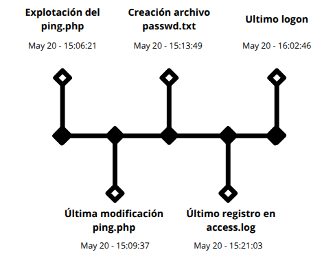

# Incident on Linux Server I - Informe Pericial

**Código**: P05

**Nombre**:  Incident on Linux Server I

**Peritos**: Alejandro Díaz Barea, Alejandro Seoane Martínez, Nicolás Ruiz Ruiz

**Fecha**: 24/03/2025

## 1. Resumen Ejecutivo

Este informe resume la investigación tras detectar un acceso no autorizado a uno de los servidores de la empresa. Se nos entregó al equipo de análisis forense tras una alerta por posible robo de información. Al revisar los registros del sistema y la memoria del equipo, se comprobó que un atacante logró aprovechar un fallo en una aplicación web instalada en el servidor.

Por esta vulnerabilidad, el atacante entró al sistema y copiar un archivo que contiene información sensible del equipo. Se ha identificado la dirección desde la cual se realizó el ataque, así como los pasos exactos que siguió.

## 2. Glosario de términos

- **Hash**: Función criptográfica que convierte datos en una cadena única de caracteres. Se usa para verificar la integridad de archivos y detectar manipulaciones.
- **Imagen forense**: Copia exacta de un dispositivo de almacenamiento, creada para análisis sin alterar el original.
- **Logon/Shutdown**: Momentos registrados por el sistema que indican cuándo un usuario inicia o cierra sesión en un dispositivo.
- **Command Injection**: Vulnerabilidad que permite a un atacante ejecutar comandos arbitrarios en el sistema operativo a través de una aplicación web mal protegida.
- **MAC (Modified, Accessed, Created)**: Fechas y horas que indican cuándo un archivo fue modificado, accedido o creado. Son clave para el análisis de la línea temporal de un incidente.
- **Volatility**: Herramienta de análisis forense de memoria RAM que permite extraer procesos, conexiones de red, usuarios activos, entre otros datos.
- **FTK Imager**: Aplicación que permite capturar, visualizar y analizar imágenes forenses sin alterar los datos originales.

## 3. Introducción

### 3.1 Datos del equipo

Los peritos especializados en ciberseguridad en entornos de las tecnologías de la información que conforman dicho equipo son los siguientes:

- Alejandro Díaz Barea, <adiabar0510@g.educaand.es>
- Nicolás Ruiz Ruiz, <nruirui@g.educaand.es>
- Alejandro Seoane Martínez, <aseomar110@g.educaand.es>

### 3.2. Antecedentes

Tras detectarse un acceso no autorizado a un servidor Linux que tenía una aplicación web vulnerable. La alerta fue creada por un intento de exfiltración de datos, lo que activó al equipo de respuesta de incidentes.

La aplicación, que se utiliza para escaneos de red, contenía una vulnerabilidad que pudo ser explotada por un atacante. La empresa nos ha facilitado una imagen del disco del servidor, una captura de memoria RAM, el perfil correspondiente y los hashes de verificación.

### 3.3. Objetivos

El objetivo de este análisis es aclarar lo ocurrido durante el incidente. Se busca identificar la vulnerabilidad, rastrear la actividad del atacante (incluyendo su IP, sistema operativo y navegador), encontrar los archivos comprometidos y,por último, recopilar pruebas que me permita inculpar al responsable del ataque.

### 3.4. Verificación

Tras el cálculo de los hashes SHA-256 de los archivos, se ha comprobado que los valores coinciden con los hashes entregados junto a las evidencias. Confirmamos que los archivos no han sido modificados ni alterados desde su adquisición original.

## 4. Fuente de información

### 4.1 Cadena de custodia

#### **1. INFORMACIÓN DEL CASO**

| **Sección**           | **Campo**                            |
| --------------------- | ------------------------------------ |
| Número de Caso        | P05                                  |
| Tipo de Investigación | Análisis Forense                     |
| Fecha de Adquisición  | 23 de marzo de 2025 a las 08:45      |
| Lugar de Adquisición  | C/ Amiel, s/n – 11012, Cádiz (Cádiz) |

#### **2. DESCRIPCIÓN EVIDENCIA EN ORIGINAL**

| **Sección** | **Campo** |
| - | - |
| Tipo de Dispositivo | perfil_memoria.zip (345635 bytes \= 338KB) |
| Hash de la Evidencia Original | MD5: 61ed3695b280e7f0c5742271df5a1f90 <br> SHA-256: 18b30b973223b8ab233aa1581bccd35bef6c678b29e671b3fe3a7ee5ea24b076 |
| Tipo de Dispositivo | captura_ram.lime.zip (224424789 bytes \= 215MB) |
| Hash de la Evidencia Original | MD5: 35dc79f4be849e6e523c4620774d5175 <br> SHA-256: 632d3d95260753029d7c9ade15e0dcab69b8fe7eb08d7001d9f923b22ddf003f |
| Tipo de Dispositivo | captura_ram.lime (1073282112 bytes \= 1.0GB) |
| Hash de la Evidencia Original | MD5: 64381bfe96d147c5c75735b14666dff3 <br> SHA-256: 0f5d751208b08450e298b8d27f22451dd2ae158dfc1cb80b974f360e9a88ff05 |
| Tipo de Dispositivo | imagen_disco.dd.zip (1656779434 bytes \= 1.6GB) |
| Hash de la Evidencia Original | MD5: 292d2fee828bd714b0dd2e3daa5d5bda <br> SHA-256: b0189203fa682fd086ed3c52a3723ac46ab896a2fb8e4daf49ed6228bc7d3b76 |
| Tipo de Dispositivo | imagen_disco.dd (8083398656 bytes \= 7.6GGB) |
| Hash de la Evidencia Original | MD5: 886ea7e7496fc012a48dc8ece3771b8d <br> SHA-256: 9f2b2dace6cfebec1b6f956fc231e199c00f39e05d50286b8f284043537d65d9 |

#### **3. PRESERVACIÓN DE LA EVIDENCIA ORIGINAL**

| **Sección**             | **Campo**                            |
| ----------------------- | ------------------------------------ |
| Fecha de Entrega        | 23 de marzo de 2025                  |
| Hora de Entrega         | 09:00                                |
| Recibido por            | Manuel Jesús Rivas Sández            |
| Ubicación en el Juzgado | C/ Amiel, s/n – 11012, Cádiz (Cádiz) |

#### **4. CREACIÓN Y VERIFICACIÓN DE COPIAS**

| **Sección** | **Campo** |
| - | - |
| Fecha y Hora de Creación | 26 de marzo de 2025 a las 09:00 A.M |
| Técnico Responsable | Alejandro Díaz |
| perfil_memoria.zip | MD5: 61ed3695b280e7f0c5742271df5a1f90 <br> SHA-256: 18b30b973223b8ab233aa1581bccd35bef6c678b29e671b3fe3a7ee5ea24b076 |
| captura_ram.lime.zip | MD5: 35dc79f4be849e6e523c4620774d5175 <br> SHA-256: 632d3d95260753029d7c9ade15e0dcab69b8fe7eb08d7001d9f923b22ddf003f |
| captura_ram.lime | MD5: 64381bfe96d147c5c75735b14666dff3 <br> SHA-256: 0f5d751208b08450e298b8d27f22451dd2ae158dfc1cb80b974f360e9a88ff05 |
| imagen_disco.dd.zip | MD5: 292d2fee828bd714b0dd2e3daa5d5bda <br> SHA-256: b0189203fa682fd086ed3c52a3723ac46ab896a2fb8e4daf49ed6228bc7d3b76 |
| imagen_disco.dd | MD5: 886ea7e7496fc012a48dc8ece3771b8d <br> SHA-256: 9f2b2dace6cfebec1b6f956fc231e199c00f39e05d50286b8f284043537d65d9 |
| Verificación de Integridad | Los hashes proporcionados coinciden con los calculados durante el análisis. |
| Entregado a | Manuel Jesús Rivas Sández |
| Fecha y Hora de Entrega    | 26 de marzo de 2025 a las 23:45 PM |

## 5. Análisis

### 5.1. Metodología

El proceso de análisis comenzó con la verificación de la integridad de las evidencias. Para ello, se calcularon los valores hash de cada archivo utilizando algoritmos como SHA-256 y se compararon con los proporcionados. 

Para examinar la imagen del disco duro, se utilizó la herramienta FTK Imager en su versión 4.2.0.13, que permitió acceder al contenido. En cuanto a la memoria RAM, se optó por trabajar directamente con los comandos `strings` y `grep`, ya que la herramienta Volatility presentó problemas de compatibilidad con el perfil del sistema analizado.

## 6. Procesos

### 6.1 Sistema Operativo

Tras analizar los archivos del sistema operativo, se obtuvo la siguiente información:

- El sistema operativo instalado es **Ubuntu 8.04**.
- El nombre del equipo es **metasploitable**.
- Los usuarios encontrados son **user** y **msfadmin**.
- El último inicio de sesión del usuario msfadmin fue el **20 de mayo a las 12:00:33**.

### 6.2 Logs del sistema

Como se nos comentó, hay un servidor web vulnerado mediante un ataque hacia Apache2. Al revisar los logs de Apache, se puede ver que el atacante con la IP `192.168.1.28` accedió al archivo `ping.php`. Esto se puede ver referenciado en el documento anexo como **hallazgo 1**.

En los registros del servidor se observa que el atacante interactuó varias veces con `ping.php`, lo cual se detalla en el **hallazgo 2**. Debido a esto, procedimos a analizar la captura de memoria RAM, donde encontramos evidencia (ver figura 1) de que el atacante manipuló el campo de entrada del formulario para inyectar un comando. De esta forma, logró ejecutar un comando del sistema:

```bash
cat /etc/passwd > passwd.txt
```

Esto le permitió exfiltrar el contenido del archivo de contraseñas del sistema.

Este archivo `passwd.txt` se encuentra también en el sistema comprometido, como se muestra en el **hallazgo 3**, lo que confirma la ejecución del comando y la posterior extracción de datos sensibles.

Cabe destacar que, si bien el archivo */etc/passwd* fue exfiltrado, este no contiene información sensible como hashes de contraseñas desde sistemas modernos. Para obtener dichas credenciales habría sido necesario acceder al archivo */etc/shadow*, el cual no fue comprometido, lo que limita el impacto del ataque.

### 6.4 Línea del tiempo

En este apartado se ha creado una línea de tiempo de los pasos más importantes que se han identificado que realizó el usuario del ordenador.  



## 7. Conclusión

Tras el análisis forense realizado sobre las evidencias proporcionadas, se confirma que el servidor Linux fue comprometido a través de una vulnerabilidad de tipo **Command Injection**, clasificada dentro del estándar **OWASP A03:2021 - Injection**. Esta vulnerabilidad fue explotada mediante un archivo web vulnerable (`ping.php`), el cual permitía al atacante ejecutar comandos arbitrarios del sistema.La actividad maliciosa fue llevada a cabo desde la dirección IP `192.168.1.28`, que interactuó en múltiples ocasiones con dicho archivo. A través del análisis de los registros del servidor y de la memoria RAM, se pudo reconstruir la secuencia exacta de acciones, incluyendo la ejecución del comando:`cat /etc/passwd > passwd.txt`

Este comando permitió al atacante copiar el archivo /etc/passwd, que contiene la lista de usuarios del sistema. Aunque este archivo es legible por cualquier usuario y no contiene contraseñas, su exfiltración representa una fuga de información útil para el reconocimiento del sistema por parte del atacante.

## 8. Anexos

La Declaración de abstención y tacha, el Juramento de promesa, así como las figuras y hallazgos relacionados con el caso, se encuentran recogidos en el siguiente anexo:

[Proyecto 5: Incident on Linux Server - Anexos](./Anexos.md)


