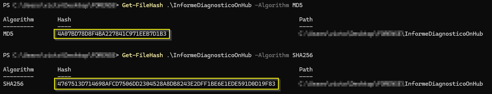
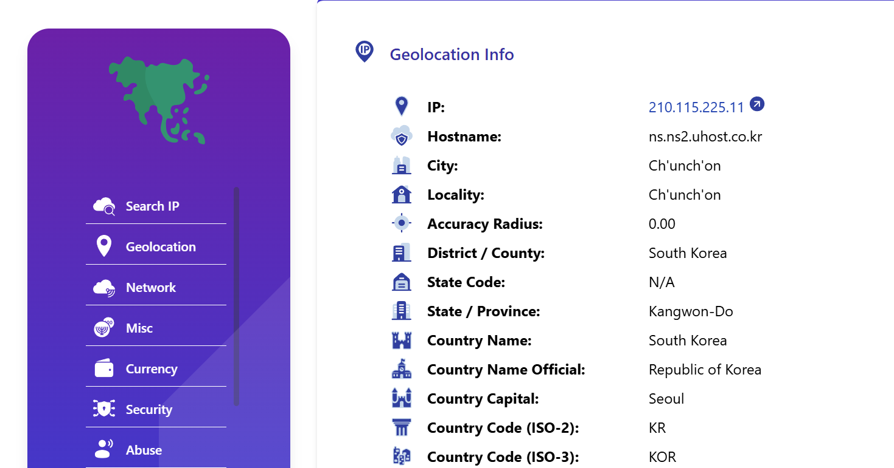
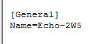

# Proyecto P05.2: Defacement Attack - Anexo

## Índice

1. [Declaración de abstención y tacha](#1-declaración-de-abstención-y-tacha)
2. [Juramento de promesa](#2-juramento-de-promesa)
3. [Figuras](#3-figuras)
4. [Hallazgos](#4-hallazgos)

## 1. Declaración de abstención y tacha

Nosotros, Grupo 3, con identificación _011002-A_, en calidad de Equipo Pericial Informático, declaramos formalmente lo siguiente:

1. Abstención

   No tenemos interés directo ni indirecto en los hechos objeto del presente informe pericial, ni relación alguna con las partes involucradas que pueda comprometer nuestra imparcialidad, conforme a lo establecido en la normativa _ISO-27000_.

2. Tacha

   Declaramos que no existen motivos de tacha que afecten nuestra idoneidad, independencia o credibilidad como peritos en este caso. No poseemos vínculos familiares, laborales ni de cualquier otra índole con las partes intervinientes.

3. Confirmación de Imparcialidad

   Nuestros análisis, conclusiones y opiniones periciales se fundamentan exclusivamente en las evidencias digitales recibidas y en las metodologías técnicas reconocidas por la disciplina de informática forense, sin influencia externa de ningún tipo.

En virtud de lo anterior, asumimos la responsabilidad de actuar con total objetividad y profesionalismo en la elaboración y presentación del presente informe.

## 2. Juramento de promesa

Nosotros, Grupo 3, identificados con _011002-A_, en calidad de Equipo de Peritaje Forense Informático, bajo juramento, prometemos solemnemente lo siguiente:

1. Realizar el análisis técnico del presente caso conforme a los principios de objetividad, veracidad y rigurosidad científica propios de la disciplina de informática forense.

2. Garantizar que todas las conclusiones presentadas en el informe pericial se sustenten exclusivamente en las evidencias digitales analizadas y las metodologías técnicamente válidas, sin alteraciones ni omisiones deliberadas.

3. Actuar de manera independiente e imparcial, sin recibir presiones, influencias externas o intereses personales que puedan comprometer la integridad de mi labor.

4. Cumplir con las disposiciones legales y éticas vigentes aplicables al ejercicio de la pericia forense en el marco del acuerdo, la confidencialidad de los datos y cumplimiento de los requisitos del proceso.

Declaro bajo juramento que honraré este compromiso en la ejecución de mis funciones como perito en este caso.

En Cádiz a 28 de Enero de 2025

Fdo:


## 3. Figuras

_Hashes de la adquisición._

- Figura 1: Informe de diagnóstico de Google OnHub.



- Figura 2: Tráfico de red del SmartHome por COAP.


- Figura 3: Tráfico de red del SmartHome por IP.


- Figura 4: Datos de Amazon Echo Alexa.


- Figura 5: Smartphone de la víctima.


- Figura 6: Smartphone del marido de la víctima


- Figura 7: Raspberry Pi (TV Inteligente).


Figura 8 : Archivo encargado de resgistros sesiones de inicio (`/var/log/wtmp`)


Figura 9 : DNS encontrada en el dispositivo Google On Hub



Figura 10: Historial de navegación del marido


Figura 11: Dispositivo bluetooth vinculado a los móviles(Alexa echo)


Figura 12: Modelo del móvil del marido de la víctima


Figura 13: Dispositivo bluetooth conectada a los móviles y al televisor(Pulsera inteligente)


Figura 14: Modelo de móvil de la víctima


Hallazgo 15: Dispositivo bluetooth conectada al móvil del marido de la víctima


## 4. Hallazgos

### 4.2 Alexa

- Hallazgo 1: Interacción crítica con el dispositivo Alexa

| Campo                 | Valor                                                                                                                                                                                                                             |
| --------------------- | --------------------------------------------------------------------------------------------------------------------------------------------------------------------------------------------------------------------------------- |
| Tipo de evidencias    | Archivos de audio (.wav) y archivos JSON                                                                                                                                                                                          |
| Contenido del fichero | 14 grabaciones de voz (órdenes a Alexa), imágenes de historial                                                                                                                                                                    |
| MAC time              | 17/Jul/2017 entre las 15:01 y 15:20 (hora local aproximada)                                                                                                                                                                       |
| Observaciones         | Se registran órdenes clave como: "call ambulance", "turn off TV", "turn on Pandora". También se detectan frases de conflicto entre dos personas. Las órdenes coinciden con el intervalo de tiempo en que se produjo el incidente. |

### 4.3 Google on hub

- Hallazgo 2: Análisis del tráfico y configuración del router

| Campo                         | Valor                                                                                                                                                                                                                                                                                                                                                                                                                                                                                                                                                                                   |
| ----------------------------- | --------------------------------------------------------------------------------------------------------------------------------------------------------------------------------------------------------------------------------------------------------------------------------------------------------------------------------------------------------------------------------------------------------------------------------------------------------------------------------------------------------------------------------------------------------------------------------------- |
| Tipo de evidencias            | Configuración del sistema, interfaces de red, tabla ARP                                                                                                                                                                                                                                                                                                                                                                                                                                                                                                                                 |
| Ruta de localización completa | `/etc/*`, `/proc/net/arp`, y capturas del sistema                                                                                                                                                                                                                                                                                                                                                                                                                                                                                                                                       |
| Contenido del fichero         | Archivos de configuración, imágenes del sistema y salida de comandos                                                                                                                                                                                                                                                                                                                                                                                                                                                                                                                    |
| Observaciones                 | El dispositivo opera sobre Chrome OS versión 9460.40.5. Se detecta el uso de servidores DNS públicos (8.8.8.8 y 8.8.4.4) y uno anómalo (210.115.225.11) con origen en Corea del Sur. Se identificaron tres redes SSID activas y múltiples interfaces de red, entre ellas `br-lan` y `br-guest`, con direcciones IP asignadas. A través de la tabla ARP se comprobó que al menos 8 dispositivos estaban conectados a la red principal, 1 a la red de invitados y 2 presentaban IPs fuera de rango esperado. Esto podría indicar conexiones irregulares o configuraciones no autorizadas. |

### 4.4 Dispositivo móvil marido

Hallazgo 3: Información forense del dispositivo móvil

| Campo                         | Valor                                                                                                                                                                                                                                                                                                                                                                                                                                                                                                                                                      |
| ----------------------------- | ---------------------------------------------------------------------------------------------------------------------------------------------------------------------------------------------------------------------------------------------------------------------------------------------------------------------------------------------------------------------------------------------------------------------------------------------------------------------------------------------------------------------------------------------------------- |
| Tipo de evidencias            | Información del sistema, notas, registros de red y dispositivos                                                                                                                                                                                                                                                                                                                                                                                                                                                                                   |
| Ruta de localización completa | Diversas rutas internas del sistema Android y particiones de usuario                                                                                                                                                                                                                                                                                                                                                                                                                                                                                       |
| Contenido del fichero         | Capturas, metadatos del dispositivo, notas personales, redes conocidas, dispositivos bluetooth emparejados                                                                                                                                                                                                                                                                                                                                                                                                                                                 |
| MAC time                      | Último check-in: 15/Jul/2017 16:00:04 UTC                                                                                                                                                                                                                                                                                                                                                                                                                                                                                                                  |
| Observaciones                 | El dispositivo Samsung SHV-E250S (modelo coreano) tenía activado Knox, Android 4.4.2 y estaba configurado en inglés, con zona horaria de Corea. Se identificaron redes conocidas como "HOME" y dispositivos emparejados como el móvil de la víctima (`Betty`), un Amazon Echo (`Echo-2W5`), una pulsera inteligente (`MI1A`) y unos auriculares LG (`LG HBS900`). Las notas personales y elementos multimedia indican actividad laboral y familiar normal, sin indicios directos de actividad maliciosa, pero con vínculos clave al entorno de la víctima. |

### 4.5 Dispositivo móvil víctima

Hallazgo 4: Información forense del dispositivo móvil

| Campo                         | Valor                                                                                                                                                                                                                                                                                                                                                                                                                                                                                                                                                  |
| ----------------------------- | ------------------------------------------------------------------------------------------------------------------------------------------------------------------------------------------------------------------------------------------------------------------------------------------------------------------------------------------------------------------------------------------------------------------------------------------------------------------------------------------------------------------------------------------------------ |
| Tipo de evidencias            | Metadatos del sistema, configuración Bluetooth, correos electrónicos                                                                                                                                                                                                                                                                                                                                                                                                                                                                                   |
| Ruta de localización completa | `USERDATA/data/com.android.email/`, `USERDATA/misc/bluedroid/bt_config.xml`                                                                                                                                                                                                                                                                                                                                                                                                                                                                            |
| Contenido del fichero         | Información del dispositivo, correos en coreano, dispositivos Bluetooth emparejados                                                                                                                                                                                                                                                                                                                                                                                                                                                                    |
| MAC time                      | Último timestamp registrado: 13/07/2017 16:27:41 KST (compilación del sistema)                                                                                                                                                                                                                                                                                                                                                                                                                                                                         |
| Observaciones                 | El dispositivo es un Samsung SHV-E250L con Android 4.4.2, Knox activado y zona horaria configurada en Asia/Seoul. Se identificaron múltiples redes conocidas, y tres dispositivos emparejados por Bluetooth: el móvil del marido (`Simon`), un Amazon Echo (`Echo-2W5`) y un dispositivo identificado como pulsera inteligente (`MI1A`). En el correo electrónico no se encontró contenido relevante tras la traducción desde el coreano. Esta información refuerza el vínculo entre ambos móviles y otros dispositivos clave del entorno investigado. |

### 4.6 Raspberry Pi (TV Inteligente)

- Hallazgo 5: Ejecución Película

| Campo                         | Valor                                                             |
| ----------------------------- | ----------------------------------------------------------------- |
| Ruta de localización completa | `/home/osmc/.kodi/temp/kodi.log`                                  |
| Contenido del fichero         |   |
| MAC time                      | 17/Jul/2017:06:19:37 +0000                                        |

- Hallazgo 6: Dispositivos bluetooth

| Campo                         | Valor                                                                                              |
| ----------------------------- | -------------------------------------------------------------------------------------------------- |
| Ruta de localización completa | `/var/lib/bluetooth/B8:27:EB:E6:8D:79/cache`                                                       |
| Contenido del fichero         |    |
| MAC time                      | 15/Jul/2017 23:52:00 +0000 15/Jul/2017 23:41:00 +0000                                              |

### 4.7 Dispositivos vinculados por bluetooth al dispositvo de la víctima

Hallazgo 7: Dispositivo Amazon Echo

| Campo                         | Valor                                                                                              |
| ----------------------------- | -------------------------------------------------------------------------------------------------- |
| Tipo de evidencias            | Dispositivo Amazon Echo                                                                              |
| Ruta de localización completa | USERDATA/misc/bluedroid/bt_config.xml                                                              |
| Contenido del fichero         | ```<N1 Tag="74:c2:46:88:5d:09"><N1 Tag="Name" Type="string">Echo-2W5</N1><N2 Tag="Manufacturer" Type="int">69</N2><N3 Tag="LmpVer" Type="int">5</N3><N4 Tag="LmpSubVer" Type="int">0</N4><N5 Tag="DevClass" Type="int">787476</N5><N6 Tag="DevType" Type="int">1</N6><N7 Tag="LinkKeyType" Type="int">4</N7><N8 Tag="PinLength" Type="int">0</N8><N9 Tag="LinkKey" Type="binary">964318898948219dfe49005bf025256e</N9><N10 Tag="Service" Type="string">0000110a-0000-1000-8000-00805f9b34fb 0000110b-0000-1000-8000-00805f9b34fb 0000110e-0000-1000-8000-00805f9b34fb 4e72b490-1d0f-bf92-0e47-a84e01000000 </N10></N1>``` |
| Observaciones                 | Podemos ver el dispositivo Echo-2W5 con MAC 74:c2:46:88:5d:09. Este podemos ver que es un dispositivo como el Alexa que consta en el informe pericial.|

Hallazgo 8: Dispositivo móvil del marido

| Campo                         | Valor                                                                                              |
| ----------------------------- | -------------------------------------------------------------------------------------------------- |
| Tipo de evidencias            | Dispositivo móvil de la víctima                                                                    |
| Ruta de localización completa | USERDATA/misc/bluedroid/bt_config.xml                                                              |
| Contenido del fichero         | ```<N2 Tag="50:f5:20:a5:7d:cc"><N1 Tag="Timestamp" Type="int">1499931539</N1><N2 Tag="Name" Type="string">Simon (SHV-E250S)</N2><N3 Tag="DevClass" Type="int">5898764</N3><N4 Tag="DevType" Type="int">1</N4><N5 Tag="AddrType" Type="int">0</N5></N2>``` |
| Observaciones                 | Podemos ver como al dispositivo móvil del marido llamado Simon (SHV-E250S) con MAC 50:f5:20:a5:7d:cc|

Hallazgo 9: Pulsera inteligente

| Campo                         | Valor                                                                                              |
| ----------------------------- | -------------------------------------------------------------------------------------------------- |
| Tipo de evidencias            | Pulsera inteligente                                                                                |
| Ruta de localización completa | USERDATA/misc/bluedroid/bt_config.xml                                                              |
| Contenido del fichero         | ```<N3 Tag="88:0f:10:f6:c8:b7"><N1 Tag="Name" Type="string">MI1A</N1><N2 Tag="DevClass" Type="int">7936</N2><N3 Tag="DevType" Type="int">2</N3><N4 Tag="AddrType" Type="int">0</N4><N5 Tag="Manufacturer" Type="int">0</N5><N6 Tag="LmpVer" Type="int">0</N6><N7 Tag="LmpSubVer" Type="int">0</N7><N8 Tag="Timestamp" Type="int">1499933446</N8></N3>```                                                              |
| Observaciones                 | Podemos ver el último dispositivo que aparece llamado MI1A con MAC 88:0f:10:f6:c8:b7. |

### 4.8 Dispositivos vinculados por bluetooth al dispositvo del marido de la víctima

Hallazgo 10: Dispositivo móvil de la víctima

| Campo                         | Valor                                                                                              |
| ----------------------------- | -------------------------------------------------------------------------------------------------- |
| Tipo de evidencias            | Dispositivo móvil de la víctima                                                                    |
| Ruta de localización completa | USERDATA/misc/bluedroid/bt_config.xml                                                              |
| Contenido del fichero         | ```<N1 Tag="1c:af:05:9e:19:74"><N1 Tag="Timestamp" Type="int">1499931533</N1><N2 Tag="Name" Type="string">Betty (SHV-E250L)</N2><N3 Tag="DevClass" Type="int">5898764</N3><N4 Tag="DevType" Type="int">1</N4><N5 Tag="AddrType" Type="int">0</N5></N1>``` |
| Observaciones                 | Aquí podemos el dispositivo móvil de la mujer del marido llamado Betty (SHV-E250L) con MAC 1c:af:05:9e:19:74.|

Hallazgo 11: Dispositivo Amazon Echo

| Campo                         | Valor                                                                                              |
| ----------------------------- | -------------------------------------------------------------------------------------------------- |
| Tipo de evidencias            | Dispositivo Amazon Echo                                                                              |
| Ruta de localización completa | USERDATA/misc/bluedroid/bt_config.xml                                                              |
| Contenido del fichero         | ```<N1 Tag="74:c2:46:88:5d:09"><N1 Tag="Name" Type="string">Echo-2W5</N1><N2 Tag="Manufacturer" Type="int">69</N2><N3 Tag="LmpVer" Type="int">5</N3><N4 Tag="LmpSubVer" Type="int">0</N4><N5 Tag="DevClass" Type="int">787476</N5><N6 Tag="DevType" Type="int">1</N6><N7 Tag="LinkKeyType" Type="int">4</N7><N8 Tag="PinLength" Type="int">0</N8><N9 Tag="LinkKey" Type="binary">964318898948219dfe49005bf025256e</N9><N10 Tag="Service" Type="string">0000110a-0000-1000-8000-00805f9b34fb 0000110b-0000-1000-8000-00805f9b34fb 0000110e-0000-1000-8000-00805f9b34fb 4e72b490-1d0f-bf92-0e47-a84e01000000 </N10></N1>``` |
| Observaciones                 | Podemos ver el dispositivo Echo-2W5 con MAC 74:c2:46:88:5d:09. Este podemos ver que es un dispositivo como el Alexa que consta en el informe pericial.|

Hallazgo 12: Pulsera inteligente

| Campo                         | Valor                                                                                              |
| ----------------------------- | -------------------------------------------------------------------------------------------------- |
| Tipo de evidencias            | Pulsera inteligente                                                                                |
| Ruta de localización completa | USERDATA/misc/bluedroid/bt_config.xml                                                              |
| Contenido del fichero         | ```<N3 Tag="88:0f:10:f6:c8:b7"><N1 Tag="Name" Type="string">MI1A</N1><N2 Tag="DevClass" Type="int">7936</N2><N3 Tag="DevType" Type="int">2</N3><N4 Tag="AddrType" Type="int">0</N4><N5 Tag="Manufacturer" Type="int">0</N5><N6 Tag="LmpVer" Type="int">0</N6><N7 Tag="LmpSubVer" Type="int">0</N7><N8 Tag="Timestamp" Type="int">1499933446</N8></N3>```                                                              |
| Observaciones                 | Podemos ver el último dispositivo que aparece llamado MI1A con MAC 88:0f:10:f6:c8:b7. |

Hallazgo 13: Auriculares inalámbricos:

| Campo                         | Valor                                                                                              |
| ----------------------------- | -------------------------------------------------------------------------------------------------- |
| Tipo de evidencias            | Auriculares inalámbricos                                                                              |
| Ruta de localización completa | USERDATA/misc/bluedroid/bt_config.xml                                                              |
| Contenido del fichero         | ```<N5 Tag="b8:ad:3e:01:5b:6a"><N1 Tag="Timestamp" Type="int">1500193456</N1><N2 Tag="Name" Type="string">LG HBS900</N2><N3 Tag="DevClass" Type="int">2360324</N3><N4 Tag="DevType" Type="int">1</N4><N5 Tag="AddrType" Type="int">0</N5><N6 Tag="Manufacturer" Type="int">10</N6><N7 Tag="LmpVer" Type="int">6</N7><N8 Tag="LmpSubVer" Type="int">8648</N8><N9 Tag="LinkKeyType" Type="int">4</N9><N10 Tag="PinLength" Type="int">0</N10><N11 Tag="LinkKey" Type="binary">29fb76aa459555ea59f8cede4aabba7e</N11><N12 Tag="Service" Type="string">00001101-0000-1000-8000-00805f9b34fb 00001108-0000-1000-8000-00805f9b34fb 0000111e-0000-1000-8000-00805f9b34fb 0000110b-0000-1000-8000-00805f9b34fb 0000110e-0000-1000-8000-00805f9b34fb </N12></N5>```                                                              |
| Observaciones                 | Podemos ver un dispositivo llamado LG HBS900 con MAC b8:ad:3e:01:5b:6a. |
