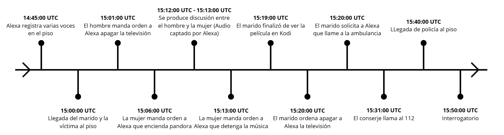

# Proyecto 9: Murder investigation

**Código**: P09

**Nombre**: Murder investigation

**Equipo forense**: Grupo 3

**Fecha**: 11/05/2025

## Índice

1. [Resumen Ejecutivo](#1-resumen-ejecutivo)
2. [Glosario de términos](#2-glosario-de-términos)
3. [Introducción](#3-introducción)  
   3.1. [Datos del equipo](#31-datos-del-equipo)  
   3.2. [Antecedentes](#32-antecedentes)  
   3.3. [Objetivos](#33-objetivos)  
   3.4. [Verificación](#34-verificación)
4. [Fuente de información](#4-fuente-de-información)  
   4.1. [Cadena de custodia](#41-cadena-de-custodia)
5. [Análisis](#5-análisis)  
   5.1. [Herramientas](#51-herramientas)  
   5.2. [Metodología](#52-metodología)
6. [Procesos](#6-procesos)
7. [Línea de tiempo](#7-línea-de-tiempo)
8. [Limitaciones](#8-limitaciones)
9. [Conclusión](#9-conclusión)
10. [Anexo](#10-anexos)

## 1. Resumen Ejecutivo

El presente informe forense, elaborado por el Grupo 3 de expertos en ciberseguridad, documenta la investigación de un homicidio ocurrido el 17 de julio de 2017. La víctima fue hallada en su domicilio con múltiples puñaladas, y el principal testigo, su esposo, alegó estar viendo una película con auriculares en otra habitación durante el suceso.

La investigación se centró en el análisis de dispositivos electrónicos y fuentes digitales relevantes recogidas en la escena, incluyendo smartphones de la víctima y su esposo, un altavoz inteligente Amazon Echo, una SmartTV (Raspberry Pi), registros de tráfico de red del entorno Smart Home y el GoogleOnHub. Se emplearon herramientas especializadas como Autopsy, FTK Imager, VLC y Wireshark para garantizar la integridad y el análisis exhaustivo de las evidencias.

El análisis de los dispositivos móviles permitió reconstruir la interacción tecnológica entre los habitantes de la vivienda, identificando emparejamientos Bluetooth entre los teléfonos, el Amazon Echo y una pulsera inteligente. No se detectaron comunicaciones sospechosas ni búsquedas relevantes para el caso en los historiales de navegación o mensajería.

En la SmartTV, los registros confirmaron la finalización de la reproducción de una película coincidiendo con el horario declarado por el esposo. Sin embargo, no se encontraron auriculares conectados por Bluetooth a la SmartTV.

El análisis del Amazon Echo reveló la existencia de grabaciones de audio y comandos realizados en los momentos cercanos al crimen, proporcionando información adicional sobre la actividad en el domicilio.

## 2. Glosario de términos

**SmartTV:**
Televisor inteligente que, además de mostrar contenido tradicional, permite conectarse a internet y ejecutar aplicaciones como servicios de streaming, navegación web, etc.

**Bluetooth:**
Tecnología inalámbrica de corto alcance utilizada para la transmisión de datos entre dispositivos electrónicos, como teléfonos móviles, auriculares y altavoces.

**Altavoz inteligente (Amazon Echo):**
Dispositivo que integra un asistente virtual (como Alexa), capaz de ejecutar comandos de voz, reproducir música, controlar otros dispositivos y grabar interacciones.

**Evidencia digital:**
Cualquier información almacenada o transmitida en formato electrónico que pueda ser utilizada en una investigación.

**Emparejamiento Bluetooth:**
Proceso mediante el cual dos dispositivos habilitados para Bluetooth se reconocen y se conectan para intercambiar datos.

**Grabaciones de comandos:**
Registros de las órdenes de voz emitidas a dispositivos inteligentes, almacenadas para su posterior consulta o análisis.

**Registro de actividad:**
Historial de acciones realizadas en un dispositivo, como reproducción de contenido, conexiones, búsquedas o comandos ejecutados.

**Búsquedas relevantes:**
Consultas realizadas en internet o en aplicaciones que pueden aportar información significativa para la investigación.

## 3. Introducción

### 3.1 Datos del equipo

El equipo pericial responsable de la redacción de este informe es el Grupo 3. Los peritos especializados en ciberseguridad en entornos de las tecnologías de la información que conforman dicho equipo son los siguientes:

- Víctor Jiménez Corada, <vjimcor955@g.educaand.es>
- Nicolás Ruiz Ruiz, <nruirui@g.educaand.es>
- Israel Valderrama García, <ivalgar260@g.educaand.es>
- Alejandro Seoane Martínez, <aseomar110@g.educaand.es>
- Alejandro Díaz Barea, <adiabar0510@g.educaand.es>

### 3.2. Antecedentes

El 17 de julio de 2017, a las 15:31, un conserje del edificio alertó a la policía tras recibir el aviso de un vecino, quien informó que había encontrado a su esposa fallecida en su domicilio, presentando signos de múltiples puñaladas. La policía llegó al lugar a las 15:40, hallando el cuerpo sin vida de la víctima en el salón de la vivienda. Posteriormente, los agentes procedieron a interrogar tanto al conserje como al marido de la víctima.

El esposo declaró que él se había mudado recientemente al piso. Según su testimonio, antes de encontrar el cuerpo, estaba viendo una película en el dormitorio con auriculares puestos, ya que su mujer había puesto música y no podía oír nada del exterior. Una vez finalizada la película, se dirigió al salón, donde encontró a su esposa sin vida y avisó al conserje para que llamara a la policía.

### 3.3. Objetivos

El objetivo de este informe forense es realizar una investigación de las evidencias aportadas que expliquen los hechos ocurridos para informar adecuadamente sobre los mismos.

### 3.4. Verificación

Como se puede ver desde la _Figuras 1_ y la _Figura 7_ adjuntas en el [anexo](#10-anexos), el cálculo de los hashes de tipo MD5 y SHA256 coinciden en todas las evidencias dadas.

## 4. Fuente de información

### 4.1 Cadena de custodia

#### 1. Información del caso

| **Sección**           | **Campo**                            |
| --------------------- | ------------------------------------ |
| Número de Caso        | P09                                  |
| Tipo de Investigación | Análisis Forense                     |
| Fecha de Adquisición  | 28 de Abril de 2025, 08:45           |
| Lugar de Adquisición  | C/ Amiel, s/n – 11012, Cádiz (Cádiz) |
| Recibido por          | Manuel Jesús Rivas Sández            |

#### 2. Descripción de las evidencias

| **Sección**         | **Campo**                                                        |
| ------------------- | ---------------------------------------------------------------- |
| Tipo de Dispositivo | Router de Google                                                 |
| Nombre del archivo  | InformeDiagnosticoOnHub                                          |
| Hash MD5            | 4a07bd78d8f4ba227841c971eeb7d1b3                                 |
| Hash SHA256         | 4767513d714698afcd7506dd2304528a8db8243e2dff1be6e1ede591d0d19f83 |
| ------------------- | ---------------------------------------------------------------- |
| Tipo de Dispositivo | Medio de almacenamiento                                          |
| Nombre del archivo  | Tráfico_SmartHome_PorCOAP.pcap                                   |
| Hash MD5            | 67ab09760148a66402aa7d9b0abaa322                                 |
| Hash SHA256         | f5ad42a50ca0d16261c1ca4742d78fd99c9e7fc6ab67fdb3a53909ff7f786ce0 |
| ------------------- | ---------------------------------------------------------------- |
| Tipo de Dispositivo | Medio de almacenamiento                                          |
| Nombre del archivo  | Tráfico_SmartHome_PorIP.pcap                                     |
| Hash MD5            | 8fb0edb521c9ad191adf55054203a6f4                                 |
| Hash SHA256         | a4664f1719d26382edd6d352cc8715fea3ee73bbb00245d71943fbacbbeeca3e |
| ------------------- | ---------------------------------------------------------------- |
| Tipo de Dispositivo | Altavoz inteligente con asistente virtual (Amazon Echo)          |
| Nombre del archivo  | Alexa.zip                                                        |
| Hash MD5            | 4a07bd78d8f4ba227841c971eeb7d1b3                                 |
| Hash SHA256         | 4767513d714698afcd7506dd2304528a8db8243e2dff1be6e1ede591d0d19f83 |
| ------------------- | ---------------------------------------------------------------- |
| Tipo de Dispositivo | Smartphone                                                       |
| Nombre del archivo  | smartphone_victima.zip                                           |
| Hash MD5            | 8daf9d23e39675452f99c5099a72b317                                 |
| Hash SHA256         | c3e334c996b811c51067e9e0657cb621523576f15eb2c19ec52c32bf36e3e5ff |
| ------------------- | ---------------------------------------------------------------- |
| Tipo de Dispositivo | Smartphone                                                       |
| Nombre del archivo  | smartphone_marido_victima.zip                                    |
| Hash MD5            | 1472be511173e7e0f4919958b1c96ffe                                 |
| Hash SHA256         | 5a46acdf7fb5a70734a2e0e39a8c9b5cc9b7ee799fe800a0a7512af08e15c025 |
| ------------------- | ---------------------------------------------------------------- |
| Tipo de Dispositivo | Televisión                                                       |
| Nombre del archivo  | TV_Inteligente.zip                                               |
| Hash MD5            | d9d2b3b3048a836289cec02c6353b6e9                                 |
| Hash SHA256         | 5423ea3f60d4ad0874346d3ba31c8783e5f2ce4b15b261ba0085e07f11e650e6 |

## 5. Análisis

### 5.1. Herramientas

Las herramientas utilizadas durante la investigación han sido las siguientes:

- Autopsy 4.21.0
- FTK imager 7.5
- VLC 3.0.16
- Wireshark 4.4.6

### 5.2. Metodología

En primer lugar se ha verificado la integridad de las evidencias obtenidas en vista de mantener la integridad de los datos que estas contienen.
Tras ello se ha procedido al análisis de las dos adquisiciones móviles que se nos da con Autopsy, se ha analizado los archivos de la SmartTV con FTK Imager, se han analizado los audios de Alexa con VLC y por último hemos utilizado Wireshark para analizar el tráfico de red del SmartHome.

## 6. Procesos

### 6.1 Análisis móvil victima

#### 6.1.1 Introducción

En el análisis del movil de la víctima se tiene como objetivo recopilar el mayor número de información dentro del teléfono que pueda ser relevante en la investigación del caso. Se ha seguido un procedimiento sistemático para asegurar la integridad de la evidencia y obtener resultados fiables, centrando el análisis de las bases de datos donde se encontro la mayoría de información relevante, aunque tambíen se encontrarón algunos archivos con configuraciones.

#### 6.1.2 Información general del dispositivo

El modelo que se ha analizado corresponde con un Samsung SHV-E250L (Note II versión coreana) con sistema operativo Android 4.4.2 (KitKat) y número de serie 4300d1b15be8b061.
El nombre del dispositivo es Betty (SHV-E250L) el cuál tiene una cuenta de correo asociada: <bettyhallym@gmail.com>.
La última actividad registrada fue el día en el que ocurrieron los echos (15 julio de 2017).

#### 6.1.3 Dispositivos vinculados por Bluetooth

Se han identificado los siguientes dispositivos emparejados en el dispositivo:

- Amazon Echo:

```txt
   <N1 Tag="74:c2:46:88:5d:09">
         <N1 Tag="Name" Type="string">Echo-2W5</N1>
         <N2 Tag="Manufacturer" Type="int">69</N2>
         <N3 Tag="LmpVer" Type="int">5</N3>
         <N4 Tag="LmpSubVer" Type="int">0</N4>
         <N5 Tag="DevClass" Type="int">787476</N5>
         <N6 Tag="DevType" Type="int">1</N6>
         <N7 Tag="LinkKeyType" Type="int">4</N7>
         <N8 Tag="PinLength" Type="int">0</N8>
         <N9 Tag="LinkKey" Type="binary">964318898948219dfe49005bf025256e</N9>
         <N10 Tag="Service" Type="string">0000110a-0000-1000-8000-00805f9b34fb 0000110b-0000-1000-8000-00805f9b34fb 0000110e-0000-1000-8000-00805f9b34fb 4e72b490-1d0f-bf92-0e47-a84e01000000 </N10>
     </N1>
```


- Móvil marido:

```txt
  <N2 Tag="50:f5:20:a5:7d:cc">
        <N1 Tag="Timestamp" Type="int">1499931539</N1>
        <N2 Tag="Name" Type="string">Simon (SHV-E250S)</N2>
        <N3 Tag="DevClass" Type="int">5898764</N3>
        <N4 Tag="DevType" Type="int">1</N4>
        <N5 Tag="AddrType" Type="int">0</N5>
    </N2>
```


- Pulsera inteligente (No se sabe con exactitud si es el objeto mencionado):

```txt
    <N3 Tag="88:0f:10:f6:c8:b7">
        <N1 Tag="Name" Type="string">MI1A</N1>
        <N2 Tag="DevClass" Type="int">7936</N2>
        <N3 Tag="DevType" Type="int">2</N3>
        <N4 Tag="AddrType" Type="int">0</N4>
        <N5 Tag="Manufacturer" Type="int">0</N5>
        <N6 Tag="LmpVer" Type="int">0</N6>
        <N7 Tag="LmpSubVer" Type="int">0</N7>
        <N8 Tag="Timestamp" Type="int">1499933446</N8>
    </N3>
```


### 6.2 Análisis móvil marido de la victima

#### 6.2.1 Introducción

El objetivo es identificar y recopilar información relevante almacenada en el teléfono que pueda aportar datos útiles para la investigación. Se ha seguido un procedimiento sistemático para asegurar la integridad de la evidencia y obtener resultados fiables, centrando el análisis en las aplicaciones, notas, historial y dispositivos vinculados al móvil.

#### 6.2.2 Información general del dispositivo

El dispositivo analizado corresponde a un Samsung SHV-E250S (Note II versión coreana) con sistema operativo Android 4.4.2 (KitKat). El dispositivo cuenta con la plataforma Exynos 4 y tiene activado el sistema de seguridad Knox. El nombre asignado al dispositivo es "Simon (SHV-E250S)" y está asociado a la cuenta `simonhallym@gmail.com`. La última actividad registrada data del 15 de julio de 2017.

#### 6.2.3 Aplicaciones Instaladas

Entre las aplicaciones instaladas destacan:

- ChatOn: Mensajería de Samsung (sin uso registrado).

- Google Talk (Hangouts), Gmail, Chrome: Uso habitual.

- AlexaCommands, Dropbox, Kodi: Potencial relevancia para la investigación.

El análisis de los directorios de ChatOn y Gmail no ha revelado comunicaciones relevantes, salvo varios mensajes de spam de aerolíneas.

#### 6.2.4 Historial de Navegación

Muestra búsquedas relacionadas con programación, lo que refuerza el perfil profesional del usuario como programador. No se han detectado búsquedas sospechosas ni relacionadas con el caso. Ver la  __Figura 10__ del Anexo

#### 6.2.5 Dispositivos vinculados por Bluetooth

Se han identificado los siguientes dispositivos emparejados:

- Móvil de la victima(desarrollado en el punto anterior):

```txt
<N1 Tag="1c:af:05:9e:19:74">
    <N1 Tag="Timestamp" Type="int">1499931533</N1>
    <N2 Tag="Name" Type="string">Betty (SHV-E250L)</N2>
    <N3 Tag="DevClass" Type="int">5898764</N3>
    <N4 Tag="DevType" Type="int">1</N4>
    <N5 Tag="AddrType" Type="int">0</N5>
</N1>
```


- Amazon Echo:

```txt
<N2 Tag="74:c2:46:88:5d:09">
    <N1 Tag="Timestamp" Type="int">1500194150</N1>
    <N2 Tag="DevClass" Type="int">787476</N2>
    <N3 Tag="DevType" Type="int">1</N3>
    <N4 Tag="AddrType" Type="int">0</N4>
    <N5 Tag="Name" Type="string">Echo-2W5</N5>
    <N6 Tag="Manufacturer" Type="int">69</N6>
    <N7 Tag="LmpVer" Type="int">5</N7>
    <N8 Tag="LmpSubVer" Type="int">0</N8>
    <N9 Tag="LinkKeyType" Type="int">4</N9>
    <N10 Tag="PinLength" Type="int">0</N10>
    <N11 Tag="LinkKey" Type="binary">234da2cdf7a5b993987432e337c6e005</N11>
    <N12 Tag="Service" Type="string">0000110a-0000-1000-8000-00805f9b34fb 0000110b-0000-1000-8000-00805f9b34fb 0000110e-0000-1000-8000-00805f9b34fb 4e72b490-1d0f-bf92-0e47-a84e01000000 </N12>
</N2>
```


- Pulsera inteligente:

```txt
<N4 Tag="88:0f:10:f6:c8:b7">
    <N1 Tag="Name" Type="string">MI1A</N1>
    <N2 Tag="DevClass" Type="int">7936</N2>
    <N3 Tag="DevType" Type="int">2</N3>
    <N4 Tag="AddrType" Type="int">0</N4>
    <N5 Tag="Timestamp" Type="int">1500194153</N5>
</N4>
```


- Auriculares inalámbricos:

```txt
<N5 Tag="b8:ad:3e:01:5b:6a">
    <N1 Tag="Timestamp" Type="int">1500193456</N1>
    <N2 Tag="Name" Type="string">LG HBS900</N2>
    <N3 Tag="DevClass" Type="int">2360324</N3>
    <N4 Tag="DevType" Type="int">1</N4>
    <N5 Tag="AddrType" Type="int">0</N5>
    <N6 Tag="Manufacturer" Type="int">10</N6>
    <N7 Tag="LmpVer" Type="int">6</N7>
    <N8 Tag="LmpSubVer" Type="int">8648</N8>
    <N9 Tag="LinkKeyType" Type="int">4</N9>
    <N10 Tag="PinLength" Type="int">0</N10>
    <N11 Tag="LinkKey" Type="binary">29fb76aa459555ea59f8cede4aabba7e</N11>
    <N12 Tag="Service" Type="string">00001101-0000-1000-8000-00805f9b34fb 00001108-0000-1000-8000-00805f9b34fb 0000111e-0000-1000-8000-00805f9b34fb 0000110b-0000-1000-8000-00805f9b34fb 0000110e-0000-1000-8000-00805f9b34fb </N12>
</N5>
```


#### 6.2.6 Conclusión

El análisis inicial del dispositivo no revela comunicaciones sospechosas ni indicios directos de implicación en el incidente investigado. La vinculación con el móvil de la víctima y otros dispositivos del hogar refuerza la convivencia y la interacción tecnológica habitual.

### 6.3 Análisis SmartTV

Se analizó la Raspberry Pi utilizada como Smart TV. Se puede ver en el archivo `/var/log/wtmp` que se encarga de los registros de sessiones de inicio, un log a las 3PM, ver **figura 8**

En los registros de Kodi (/home/osmc/.kodi/temp/kodi.log) se ha encontrado que se finalizó la reproducción de una película el 17/07/2017 a las 06:19:37 UTC, ver **Hallazgo 5**.

Además, en la ruta `/var/lib/bluetooth/B8:27:EB:E6:8D:79/cache` se identificaron dos dispositivos Bluetooth emparejados, Echo-2W5 y MI1A, con actividad registrada el 15/07/2017. El primero es un Amazon Echo y el segundo es una pulsera xiaomi, ver **Hallazgo 6**. Se puede ver que por lo menos de forma bluetooth no hay cascos conectado, como referenció el marido de la víctima.

### 6.4 Análisis Alexa

#### 6.4.1 Descripción del Material Analizado

Se ha recibido para análisis un conjunto de evidencias extraídas de un dispositivo Amazon Alexa, consistentes en:

- 14 archivos de audio en formato WAV, grabados por el dispositivo.

- Varias imágenes del historial de consultas realizadas al dispositivo.

- 4 archivos en formato JSON asociados a las grabaciones.

- Imágenes adicionales del historial de comandos.

#### 6.4.2 Análisis de los Archivos de Audio

A continuación, se detallan los archivos de audio, la hora registrada y el contenido relevante de cada uno:

| Archivo | Hora    | Voz                  | Contenido                                                                                               | Observaciones                                 |
| ------- | ------- | -------------------- | ------------------------------------------------------------------------------------------------------- | --------------------------------------------- |
| 1.wav   | 3:20 PM | Masculina            | "Alexa, call ambulance!"                                                                                |                                               |
| 2.wav   | 3:20 PM | Masculina            | "Alexa, call ambulance!"                                                                                | Idéntico a 1.wav                              |
| 3.wav   | 3:20 PM | Masculina            | "Alexa, turn off TV"                                                                                    |                                               |
| 4.wav   | 3:20 PM | Masculina            | "Alexa, turn off TV"                                                                                    | Idéntico a 3.wav                              |
| 5.wav   | 3:13 PM | Femenina             | "Alexa, ... stop"                                                                                       | Pausa entre "Alexa" y "stop", música de fondo |
| 6.wav   | 3:12 PM | Femenina             | "Alexa, ... stop"                                                                                       | Idéntico a 5.wav                              |
| 7.wav   | 3:12 PM | Femenina y Masculina | "Alexa, ... stop" / "I can't believe you're doing this to me. We said we would. What are you thinking?" | JSON vacío, solo imagen de historial          |
| 8.wav   | 3:12 PM | Femenina y Masculina | "Alexa, ... stop" / "How can you do this? What are you thinking?"                                       |
| 9.wav   | 3:06 PM | Femenina             | "Alexa, turn on Pandora"                                                                                | Pandora es una app de música                  |
| 10.wav  | 3:06 PM | Femenina             | "Alexa, turn on Pandora"                                                                                | Idéntico a 9.wav                              |
| 11.wav  | 3:01 PM | Masculina            | "Alexa, turn on TV"                                                                                     |                                               |
| 12.wav  | 3:01 PM | Masculina            | "Alexa, turn on TV"                                                                                     | Idéntico a 11.wav                             |
| 13.wav  | 2:45 PM | Varias               | Conversación informal, parece una demostración del dispositivo a invitados                              |                                               |
| 14.wav  | 2:57 PM | Masculina            | Incomprensible                                                                                          |                                               |

#### 6.4.3 Análisis de Archivos JSON e Imágenes del Historial

Se analizaron los archivos JSON y las imágenes del historial de consultas. Se identificaron los siguientes eventos adicionales:

- Consultas al dispositivo a las 2:31 PM, 12:07 PM, 11:57 AM, y 8:24 PM del 16 de abril de 2017.

- El 17 de abril de 2017, fecha de la muerte de la víctima, se concentran los eventos relevantes entre las 15:00 y las 15:31.

#### 6.4.4 Cronología de los Hechos Relevantes (17 de abril de 2017)

A partir del análisis de los audios y el historial, se ha reconstruido la siguiente secuencia temporal:

- Antes de las 15:00: Se detecta la presencia de varias personas en la vivienda.

- 15:01: Un hombre ordena encender la televisión.

- 15:06: Una mujer solicita encender la aplicación de música Pandora.

- 15:12 - 15:13: Se produce una discusión entre el hombre y la mujer.

- 15:13: La mujer ordena detener la música.

- 15:20: El hombre ordena apagar la televisión.

- 15:20: El hombre solicita llamar a una ambulancia.

#### 6.4.5 Conclusiones del Análisis de Alexa

El análisis forense del dispositivo Alexa revela que había presencia y actividad de varias personas en la vivienda antes de las 15:00. Los registros de audio muestran interacciones desde las 14:45, seguidas de una secuencia de comandos y conversaciones que culminan con una solicitud de llamada a una ambulancia a las 15:20. Esta cronología aporta contexto relevante sobre los hechos investigados y sugiere la necesidad de revisar y contrastar la hora de llegada mencionada en el enunciado con otras fuentes de evidencia.

### 6.5 Análisis tráfico de red SmartHome

Se analizaron los archivos de captura de tráfico con extensión .pcap correspondientes a las comunicaciones de los dispositivos SmartHome, específicamente los ficheros Trafico_SmartHome_PorIP.pcap y Tráfico_SmartHome_PorCOAP.pcap.

El objetivo era identificar posibles interacciones, comandos o patrones de comportamiento relevantes alrededor del 17 de julio de 2017. Para ello, se inspeccionaron protocolos como CoAP (Constrained Application Protocol), comúnmente utilizado en entornos IoT, así como los paquetes de red entre direcciones IP internas que podrían estar asociadas a dispositivos domóticos presentes en la vivienda.

Durante el análisis no se detectaron eventos concluyentes que permitan inferir interacciones significativas entre los usuarios y los dispositivos SmartHome en la franja horaria crítica. Tampoco se identificaron patrones anómalos ni comandos susceptibles de haber sido emitidos hacia los dispositivos del hogar inteligente.

Esta ausencia de hallazgos podría explicarse por diversas razones, entre ellas:

- Limitación en la capacidad de los dispositivos para registrar o transmitir eventos.

- Tráfico cifrado o encapsulado no interpretable con la información disponible.

- Eliminación previa o inactividad de los dispositivos en los momentos relevantes.

No obstante, se confirma que existió tráfico de red asociado a dispositivos IoT en el entorno doméstico, lo que valida su presencia operativa durante el periodo analizado, aunque sin que se haya podido extraer información útil para reconstruir acciones concretas.

### 6.6 Análisis informe diagnóstico Google OnHub

Para el análisis se extrajeron evidencias del dispositivo Google On Hub (ver **hallazgo 2** ), un router con sistema operativo basado en Chrome OS, desarrollado por Google en colaboración con TP-Link y ASUS. La figura 9 muestra el panel inicial con información clave obtenida del sistema, como la versión del sistema operativo (CHROMEOS_RELEASE_VERSION=9460.40.5) y las DNS configuradas. Entre ellas, destaca la dirección 210.115.225.11, cuya geolocalización en Corea del Sur no corresponde con un servicio DNS habitual, lo que sugiere una posible configuración alterada.

Luego hemos analizado las configuraciones de red del sistema, donde se identificaron tres SSID activos: HOME, HOME-guest y 4E2F1AD, tal como se observa en la figura 11. Estos nombres corresponden a redes domésticas principales, de invitados y en malla, lo que refuerza el papel del dispositivo como punto de acceso múltiple.

Se documenta la lista completa de adaptadores de red presentes en el sistema, donde se observa que las interfaces br-lan y br-guest tienen direcciones IP asignadas en subredes diferentes, lo cual concuerda con la segmentación entre red principal y de invitados.

Por último se miró la tabla ARP del sistema , donde encontramos conexiones de al menos 11 dispositivos. Del total, 8 se encuentran en la red principal (br-lan), 1 en la red de invitados y 2 presentan direcciones IP anómalas, fuera del rango habitual, una de ellas dentro del espacio link-local (169.254.x.x). Esta distribución puede indicar conexiones no autorizadas o configuraciones irregulares dentro del entorno de red del dispositivo.

## 7. Línea de tiempo

Tras el análisis hemos creado la siguiente linea del tiempo con los hechos acontecidos:



## 8. Limitaciones

No se han encontrado limitaciones en el proceso de investigación de este caso.

## 9. Conclusión

A partir del análisis forense realizado sobre los dispositivos electrónicos y fuentes digitales asociados al caso, se han obtenido datos relevantes que permiten reconstruir parcialmente los acontecimientos ocurridos en el periodo investigado. La revisión de la SmartTV indica que se estaba reproduciendo una película durante el intervalo de interés, y los registros de los dispositivos móviles y del altavoz inteligente muestran actividad habitual, sin evidencias de comunicaciones o búsquedas anómalas en ese periodo.

No se hallaron pruebas concluyentes sobre la utilización de auriculares conectados a la SmartTV en el momento de los hechos. Asimismo, los registros de emparejamiento Bluetooth y las grabaciones del altavoz inteligente aportan información complementaria sobre la dinámica en la vivienda, sin que se detecten elementos que permitan establecer de manera definitiva la secuencia completa de los hechos.

En conclusión, la evidencia digital analizada proporciona información relevante sobre la actividad tecnológica en el domicilio durante el periodo investigado, pero no permite establecer afirmaciones concluyentes sobre la totalidad de los hechos ocurridos. Se recomienda complementar estos hallazgos con otras fuentes de investigación para lograr una visión más completa y objetiva del caso.

## 10. Anexos

La Declaración de abstención y tacha, el Juramento de promesa, así como las figuras y hallazgos relacionados con el caso, se encuentran recogidos en el anexo [P09-Anexo-G3.md](https://github.com/IES-Rafael-Alberti/GRUPO_3/blob/main/An%C3%A1lisis%20Forense/P09-Murder%20Investigation/P09-Anexo-G3.md#1-declaraci%C3%B3n-de-abstenci%C3%B3n-y-tacha)

---

Documento redactado por el equipo de peritos forenses informático _Grupo 3_.

Fdo:


