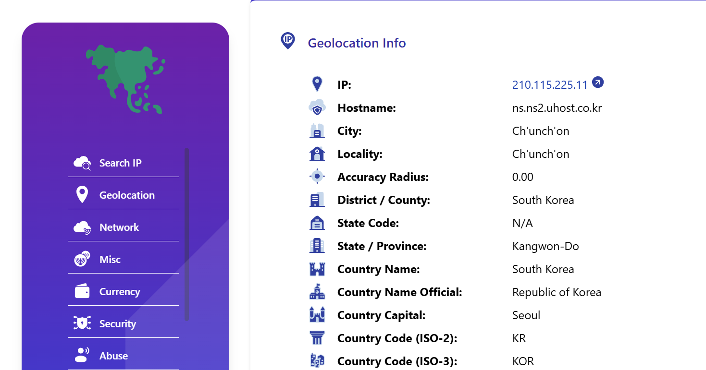
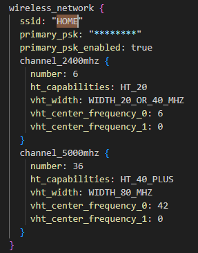
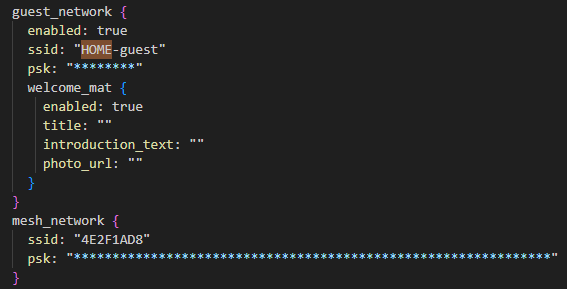

# Dispositivo Google On Hub

El dispositivo se trata de un router desarrollado por Google en colaboración con TP-Link y ASUS, y funciona sovre una versión modificada de Chrome OS.

El análisis principal sacó la siguiente información a cerca de este:

- CHROMEOS_RELEASE_NAME=Chrome OS
- CHROMEOS_RELEASE_VERSION=9460.40.5
- CHROMEOS_RELEASE_BOARD=whirlwind-signed-mpkeys
- DNS configurados: 8.8.8.8, 8.8.4.4, y 210.115.225.11

_Esta última IP, no se reconoce como una DNS conocida, además, se trata de una IP de origen sur coreano_



Se encuentran además los siguientes SSID(nombres de redes wifi):

- HOME
- HOME-guest
- 4E2F1AD




También tenemos los siguientes adaptadores de red:

| Adaptador       | Dirección IP(Si tiene) |
|-----------------|------------------------|
| lo              | 127.0.0.1/8            |
| wan0            | 192.168.165.9/24       |
| lan0            | ---                    |
| qca-nss-dev0    | ---                    |
| br-lan          | 192.168.86.1/24        |
| br-guest        | 192.168.87.1/24        |
| br-setup-guest  | ---                    |
| br-station-mode | ---                    |
| wlan-2400mhz    | ---                    |
| wlan-5000mhz    | ---                    |
| aux-radio0      | ---                    |
| guest-2400mhz   | ---                    |
| guest-5000mhz   | ---                    |

Se encontró la siguiente tabla ARP con las siguientes MACs e IPs:

```bash
/proc/net/arp�192.168.86.28    0x1         0x0         109266000026          *        br-lan
192.168.86.20    0x1         0x0         50f520000027          *        br-lan
192.168.86.25    0x1         0x2         b827eb000028          *        br-lan
192.168.86.26    0x1         0x0         50f520000027          *        br-lan
192.168.1.167    0x1         0x2         2016d800001f          *        br-guest
192.168.86.24    0x1         0x0         1caf05000022          *        br-lan
192.168.86.29    0x1         0x2         2016d800001f          *        br-lan
169.254.3.229    0x1         0x2         2016d800001f          *        br-guest
192.168.86.21    0x1         0x2         a002dc000020          *        br-lan
192.168.86.22    0x1         0x2         18b430000021          *        br-lan
192.168.165.1    0x1         0x2         909f33000025          *        wan0
192.168.87.20    0x1         0x0         2016d800001f          *        br-guest
192.168.86.27    0x1         0x2         d052a8000023          *        br-lan
```

Relacionando esto con los adaptadores sacamos:

    En la red habían conectados 8 equipos a la red principal, 1 equipo conectado a la red de invitados, y 2 equipos con IPs fuera de rango.
