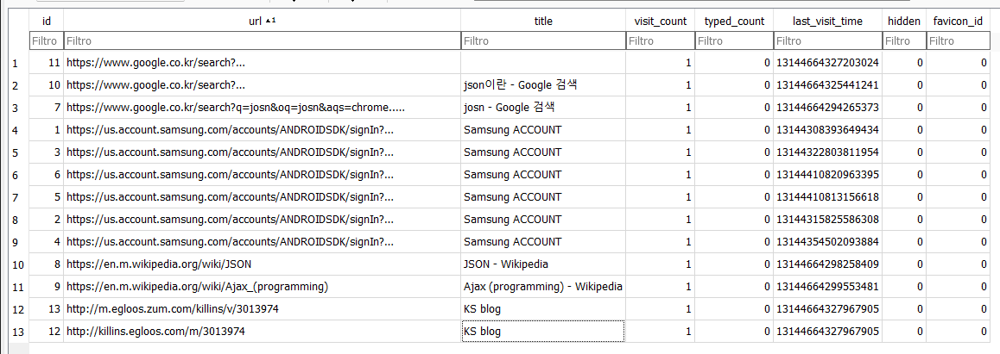
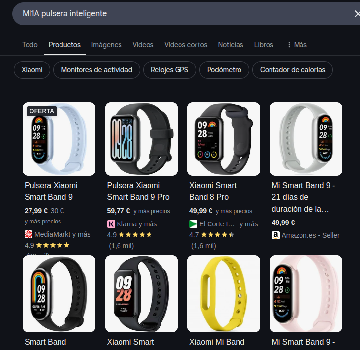

# Investigación del móvil del marido de la victima

## Comprobación del Hash

![Imagen que aún no existe]

Para el análisis del dispositivo móvil del marido, voy a usar esta [seetcheat](https://pbs.twimg.com/media/FL-GAXBUUAEJRZq.jpg) de móvil. Voy a hacer una amalgama de información y al final hago un resumen de todo.

| Dato | Valor |
|-|-|
| Modelo | SHV-E250S |
| Fabricante | Samsung |
| Nombre interno | t0lteskt (Note II versión coreana) |
| Versión de Android | 4.4.2 (KitKat) |
| SDK | 19 |
| Fecha de compilación | 24 agosto 2015 - 16:21:59 KST |
| Región | Reino Unido (en-GB) |
| Idioma del sistema | Inglés (en) |
| Densidad de pantalla | 320 dpi (ro.sf.lcd_density) |
| CPU ABI | armeabi-v7a / armeabi |
| Plataforma | Exynos 4 (SMDK4X12_PRIME) |
| Knox | Activado (ro.config.knox=1) |
| Zona horaria del build | KST (Korea Standard Time) |
| Fingerprint | samsung/t0lteskt/t0lteskt:4.4.2/KOT49H/E250SKSUKOH4:user/release-keys |
| timezoneInstance | Asia/Seoul |
| localTimezone | Asia/Seoul |
| account_name | simonhallym@gmail.com |
| fifi_p2p_devide_name | Simon (SHV-E250S) |
| device_name | Simon (SHV-E250S) |
| handwriting_language_list | ko_KR;en_US; |
| Última hora de check-in | 1500103204379 15/07/2017 16:00:04 UTC |
| Hora de última tarea programada | 1500103102206 15/07/2017 15:48:22 UTC|
| auth_zen_enable | true |
| location:ulr_enable_wifi_batching | false |
| auth_credentials_api_is_enabled | true |
| pubkey_blacklist | Censurado ||abcdef1234567890|| |
| facelock_max_center_movement | 15 |
| date_format | yyyy-MM-dd |
| networks | "T wifi zone_secure", "T wifi zone", "U+zone", "IoTLab_WAN", "IoTLab", "neo_house5", "home", "setupEBC2", "HOME" |

Vale, creo que con esta información inicial del telefono será suficiente, voy a empezar a investigar los archivos en busca de información relevante para poder hacer una línea del tiempo. Lo haré por orden de encontrado y luego lo ordenaré todo.

- Notas del teléfono:

Se encuentra una nota de lo que parece ser un diario: El autor, lleva a sus hijos(Jasin y otro) a "Fantasy World" para ver "Carnival Fantasy" el día 05/09/2012

Un posible mapa:


Se encuentra una nota con la siguiente información: Viaje a "Abbey Sacred" 05/09/2012

Se encuentra un folleto de "Fantasy Parade"


Se encuentran varias entradas relacionadas con el trabajo del autor:


Se encuentra una nota del trabajo que indica una reunión el día 29 de abril de 2012 a las 4 p.m.


- Aplicaciones instaladas:

> Carácteristica de "Autopsy"

Hay un montón de aplicaciones, pero las que más pueden interesar son:

ChatOn(El WhatsApp de Samsumng)
Google Talk(Hangouts)
Gmail
Chrome
Alexacommands
Dropbox
Kodi

- Conversaciones:

> /data/data/com.sec.chaton

Parece que la aplicación "ChatOn" nunca se usó, ya que el directorio no contine los archivos necesarios.

> /data/data/com.google.anroid.gm

Tampoco se encuentra información relevante, más que muchos mensajes de spam de vuelos.

- Historial de navegación:



Lo único interesante que sacamos son las busquedas relacionadas con la programación, que junto con las notas anteriores, podemos teorizar que el usurio es programador.

En el archivo "Coockies" encontramos entradas normales, servicios de google, samsung, etc.


- Móvil de la víctima:

```
<N1 Tag="1c:af:05:9e:19:74">
    <N1 Tag="Timestamp" Type="int">1499931533</N1>
    <N2 Tag="Name" Type="string">Betty (SHV-E250L)</N2>
    <N3 Tag="DevClass" Type="int">5898764</N3>
    <N4 Tag="DevType" Type="int">1</N4>
    <N5 Tag="AddrType" Type="int">0</N5>
</N1>
```

Aquí podemos el dispositivo móvil de la mujer del marido llamado `Betty (SHV-E250L)` con MAC `1c:af:05:9e:19:74`.


- Amazon Echo:

```
<N2 Tag="74:c2:46:88:5d:09">
    <N1 Tag="Timestamp" Type="int">1500194150</N1>
    <N2 Tag="DevClass" Type="int">787476</N2>
    <N3 Tag="DevType" Type="int">1</N3>
    <N4 Tag="AddrType" Type="int">0</N4>
    <N5 Tag="Name" Type="string">Echo-2W5</N5>
    <N6 Tag="Manufacturer" Type="int">69</N6>
    <N7 Tag="LmpVer" Type="int">5</N7>
    <N8 Tag="LmpSubVer" Type="int">0</N8>
    <N9 Tag="LinkKeyType" Type="int">4</N9>
    <N10 Tag="PinLength" Type="int">0</N10>
    <N11 Tag="LinkKey" Type="binary">234da2cdf7a5b993987432e337c6e005</N11>
    <N12 Tag="Service" Type="string">0000110a-0000-1000-8000-00805f9b34fb 0000110b-0000-1000-8000-00805f9b34fb 0000110e-0000-1000-8000-00805f9b34fb 4e72b490-1d0f-bf92-0e47-a84e01000000 </N12>
</N2>
```

Podemos ver el dispositivo `Echo-2W5` con MAC `74:c2:46:88:5d:09`. Este podemos ver que es un dispositivo como el Alexa que consta en el informe pericial.


- Pulsera inteligente (No se sabe con exactitud):

```
<N4 Tag="88:0f:10:f6:c8:b7">
    <N1 Tag="Name" Type="string">MI1A</N1>
    <N2 Tag="DevClass" Type="int">7936</N2>
    <N3 Tag="DevType" Type="int">2</N3>
    <N4 Tag="AddrType" Type="int">0</N4>
    <N5 Tag="Timestamp" Type="int">1500194153</N5>
</N4>
```

Creemos que este dispositivo llamado `MI1A` con MAC `88:0f:10:f6:c8:b7` puede ser la pulsera inteligente que consta en el informe pericial.



- Auriculares inalámbricos:

```
<N5 Tag="b8:ad:3e:01:5b:6a">
    <N1 Tag="Timestamp" Type="int">1500193456</N1>
    <N2 Tag="Name" Type="string">LG HBS900</N2>
    <N3 Tag="DevClass" Type="int">2360324</N3>
    <N4 Tag="DevType" Type="int">1</N4>
    <N5 Tag="AddrType" Type="int">0</N5>
    <N6 Tag="Manufacturer" Type="int">10</N6>
    <N7 Tag="LmpVer" Type="int">6</N7>
    <N8 Tag="LmpSubVer" Type="int">8648</N8>
    <N9 Tag="LinkKeyType" Type="int">4</N9>
    <N10 Tag="PinLength" Type="int">0</N10>
    <N11 Tag="LinkKey" Type="binary">29fb76aa459555ea59f8cede4aabba7e</N11>
    <N12 Tag="Service" Type="string">00001101-0000-1000-8000-00805f9b34fb 00001108-0000-1000-8000-00805f9b34fb 0000111e-0000-1000-8000-00805f9b34fb 0000110b-0000-1000-8000-00805f9b34fb 0000110e-0000-1000-8000-00805f9b34fb </N12>
</N5>
```
Por último, podemos ver un dispositivo llamado `LG HBS900` con MAC `b8:ad:3e:01:5b:6a`.


