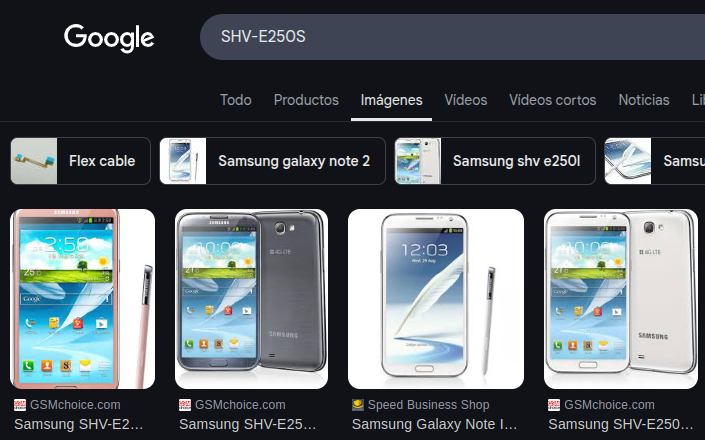

# Investigación del móvil del marido de la victima

Para el análisis del móvil de la victima, hemos usado esta [seetcheat](https://pbs.twimg.com/media/FL-GAXBUUAEJRZq.jpg) de móvil donde podemos encontrar archivos de interés.

Hemos recogido está información importante:

| Dato | Valor |
|-|-|
| Modelo | SHV-E250L |
| Fabricante | Samsung |
| Nombre interno | t0ltelgt |
| Versión de Android | 4.4.2 |
|Nº serie | 4300d1b15be8b061 |
| Fecha de compilación | Mon Aug 24 16:27:41 KST 2015 |
| Región | Reino Unido (en-GB) |
| Idioma del sistema | Inglés (en) |
| Plataforma | Exynos 4 (SMDK4X12_PRIME) |
| Knox | Activado (ro.config.knox=1) |
| Zona horaria del build | KST (Korea Standard Time) |
| timezoneInstance | Asia/Seoul |
| localTimezone | Asia/Seoul |
| account_name | bettyhallym@gmail.com |
| fifi_p2p_devide_name | Simon (SHV-E250S) |
| device_name | Simon (SHV-E250S) |
| handwriting_language_list | ko_KR;en_US; |
| auth_zen_enable | true |
| location:ulr_enable_wifi_batching | false |
| auth_credentials_api_is_enabled | true |
| date_format | yyyy-MM-dd |
| networks | "DFIRE", "HOME", "home" |

Esta es la información de interés que hemos encontrado.
Posteriormente nos pusimos a investigar sobre información que pudiesemos encontrar de interés.

En la ruta `USERDATA/data/com.android.email/databases/EmailProvider.db`. En esta base de datos encontramos unos mensajes en coreano, trás una traducción vimos que no había ningún mensaje que pareciese relevante.

```text
참고 -> Referencia / Para tu información
나중에 전화하겠습니다. -> Te llamaré más tarde.
이메일을 보내 주셔서 감사합니다. -> Gracias por enviarme el correo electrónico.
제 휴대폰으로 연락 바랍니다. -> Por favor, contáctame a mi teléfono móvil.
나중에 회신하겠습니다. -> Responderé más tarde.
부재 중입니다. 회사로 돌아가면 바로 이메일에 회신하겠습니다. -> Estoy ausente. Te responderé al correo electrónico en cuanto regrese a la oficina.
잘 지내지? -> ¿Cómo has estado? / ¿Estás bien?
첨부파일을 확인하세요. -> Por favor, revisa el archivo adjunto.
만나서 점심 먹자. -> Vamos a almorzar juntos.
나중에 알려 주세요. -> Avísame más tarde.
```

Hemos investigado si había datos en las aplicaciones que aparecen en el dispositivo pero no se ha encontrado nada relevante.

En la ruta `USERDATA/misc/bluedroid/bt_config.xml` hemos encontrado registros de archivos bluetooth que se han conectado al móvil. Podemos ver los siguientes dispositivos:

- Amazon Echo: 

```
   <N1 Tag="74:c2:46:88:5d:09">
         <N1 Tag="Name" Type="string">Echo-2W5</N1>
         <N2 Tag="Manufacturer" Type="int">69</N2>
         <N3 Tag="LmpVer" Type="int">5</N3>
         <N4 Tag="LmpSubVer" Type="int">0</N4>
         <N5 Tag="DevClass" Type="int">787476</N5>
         <N6 Tag="DevType" Type="int">1</N6>
         <N7 Tag="LinkKeyType" Type="int">4</N7>
         <N8 Tag="PinLength" Type="int">0</N8>
         <N9 Tag="LinkKey" Type="binary">964318898948219dfe49005bf025256e</N9>
         <N10 Tag="Service" Type="string">0000110a-0000-1000-8000-00805f9b34fb 0000110b-0000-1000-8000-00805f9b34fb 0000110e-0000-1000-8000-00805f9b34fb 4e72b490-1d0f-bf92-0e47-a84e01000000 </N10>
     </N1>
```

Podemos ver el dispositivo `Echo-2W5` con MAC `74:c2:46:88:5d:09`. Este podemos ver que es un dispositivo como el Alexa que consta en el informe pericial.


- Móvil marido:

```
  <N2 Tag="50:f5:20:a5:7d:cc">
        <N1 Tag="Timestamp" Type="int">1499931539</N1>
        <N2 Tag="Name" Type="string">Simon (SHV-E250S)</N2>
        <N3 Tag="DevClass" Type="int">5898764</N3>
        <N4 Tag="DevType" Type="int">1</N4>
        <N5 Tag="AddrType" Type="int">0</N5>
    </N2>
```

Podemos ver como al dispositivo móvil del marido llamado `Simon (SHV-E250S)` con MAC `50:f5:20:a5:7d:cc`.



- Pulsera inteligente (No se sabe con exactitud):

```
    <N3 Tag="88:0f:10:f6:c8:b7">
        <N1 Tag="Name" Type="string">MI1A</N1>
        <N2 Tag="DevClass" Type="int">7936</N2>
        <N3 Tag="DevType" Type="int">2</N3>
        <N4 Tag="AddrType" Type="int">0</N4>
        <N5 Tag="Manufacturer" Type="int">0</N5>
        <N6 Tag="LmpVer" Type="int">0</N6>
        <N7 Tag="LmpSubVer" Type="int">0</N7>
        <N8 Tag="Timestamp" Type="int">1499933446</N8>
    </N3>
```

Podemos ver el último dispositivo que aparece llamado `MI1A` con MAC `88:0f:10:f6:c8:b7`.

