# Toma de datos

Este documento sirve para recoger como se obtuvieron los datos necesarios para la elavoración del incidentes.

# 0. Previo a las preguntas

Lo primero que tenemos que hacer antes de empezar a analizar la memoria RAM es comprobar la tabla de hashes:

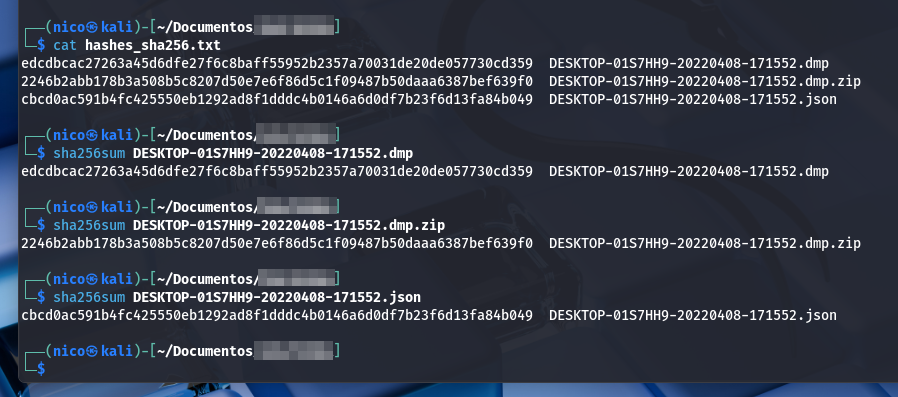
> Todos coinciden.

Ahora, debemos comprobar cual es el perfil que vamos a usar para analizar:

```bash
vol.py -f fichero.ram imageinfo
```

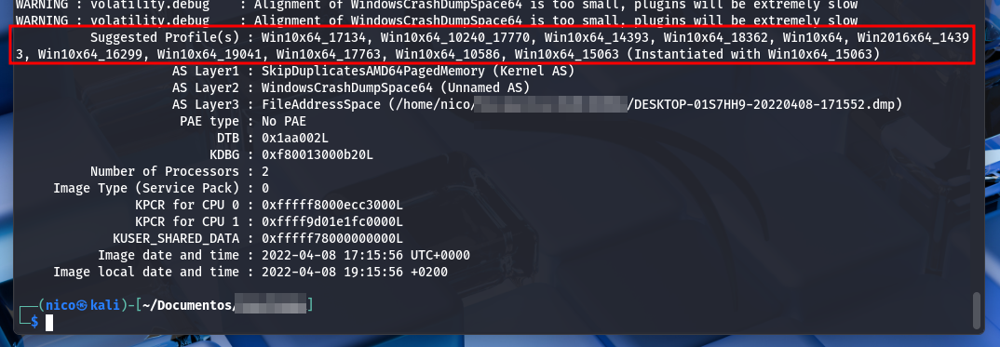
> Me dan varios perfiles.

Tenemos que probarlos todos hasta que uno de ellos nos de un resultado con sentido:

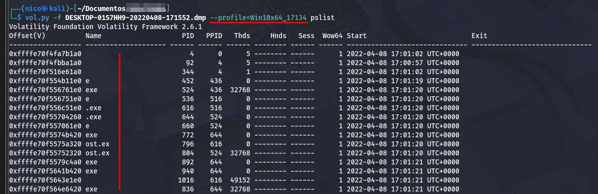
> Resultados erroneos e incompletos.

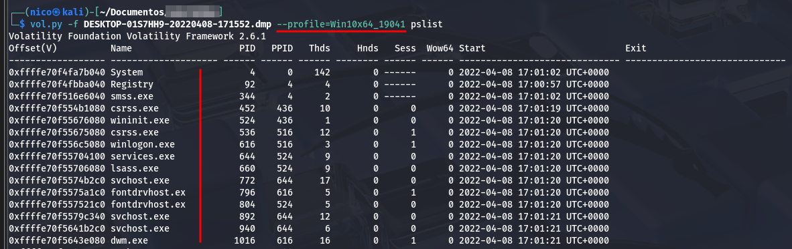
> Este es el correcto.

Con el perfil, ya podemos trabajar y resolver las preguntas planteadas.

# 1. Confirmar si la imagen de memoria pertenece al ordenador del alumno, identificado como "DESKTOP-01S7HH9".

Para comprobar el nombre del ordenador, podemos hacer 2 cosas:

1. Ver los registros de windows y buscar *ComputerName*.

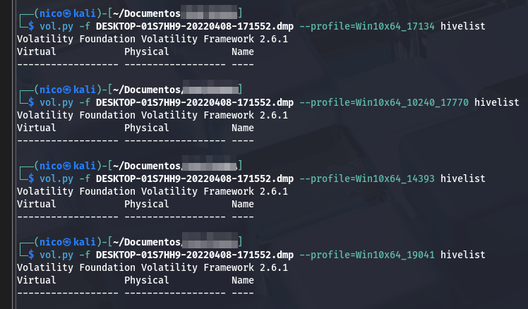
> Pruebo varios por si me equivoqué al elegir el perfil.

2. Comprobar las variables de entorno y veri si existe un *ComputerName*.

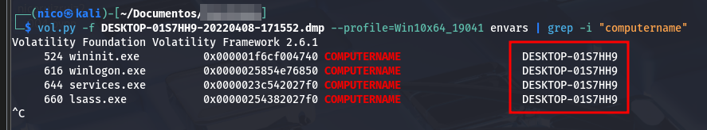
> Paro el comando para no ensuciar de más la terminal.

Queda comprovado que el nombre del PC es **DESKTOP-01S7HH9**

# 2. Determinar el PID del proceso de la aplicación utilizada para visualizar documentos PDF y establecer cuál es su proceso padre.

Para hacer esto, vamos a listar los procesos activos de la ram con un pslist, psscan o pstree:

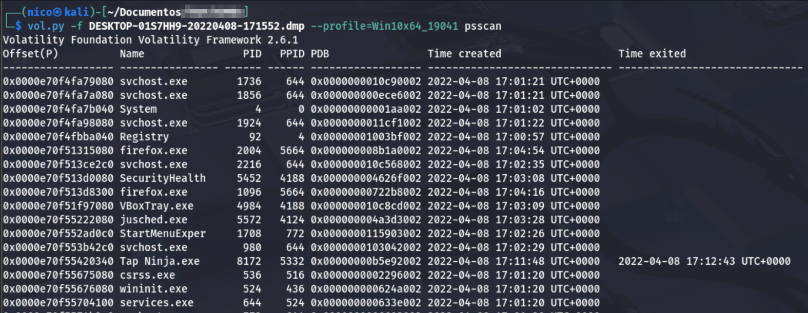
> Salen una barbaridad de procesosos, y como no sabemos  el nombre, tenemos que ver proceso por proceso.

Hay uno que me llama la atención, (no me suena de nada):

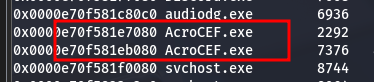
> Buscando un poco, enocntré que es el nombre del proceso que tiene adobe acrobat.

Perfecto, pero aparece 2 veces, y los 2 tienen un PID y PPID diferentes, cambió el escaner a un pstree:

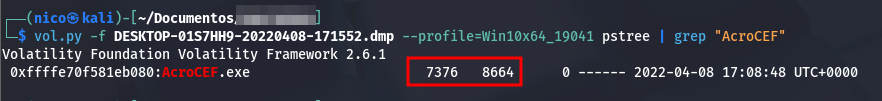
> Ahora si, solo aparece 1.

El proceso hijo es 7376, y el proceso padre 8664.
Por curiosidad, vamos a comprobar a que proceso pertenece ese PPID:

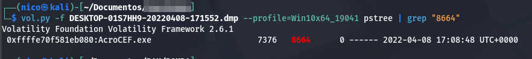
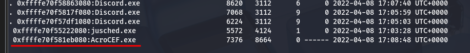
> En el resultado de pstree, no aparece nada arriba de él.

# 3. A través de los manejadores, identificar qué documento estaba siendo editado por el alumno durante la intervención policial.

Tengo que usar el parámetro handle, esto da muchas líneas de resultado, por lo que tengo que filtrar bastante:

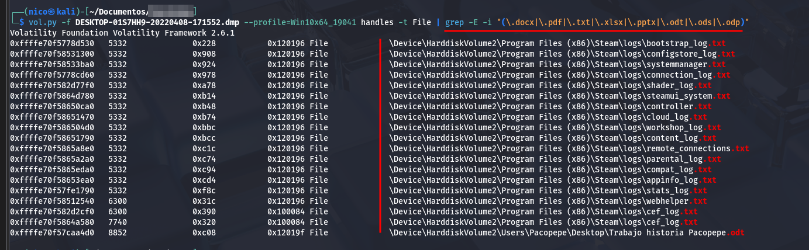

Encontramos todos estos archivos que estaban siendo editados durante la intervención policial, quitaría los archivos de la carpera steam, ya que este abre muchos procesos cuando se está ejecutando.

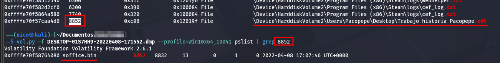
> Compruebo que el proceso padre estuviera activo también.

# 4. Buscar en el volcado de memoria pruebas que vinculen al usuario del equipo con la realización de la falsa amenaza de bomba.

Durante el analisis, me he fijado en que Pacopepe tenía Discord instalado, por lo que podrían haber conversaciones relacionadas con la palabra *bomba*:

```bash
strings -a -t d fichero.ram | grep -i "bomba"
```

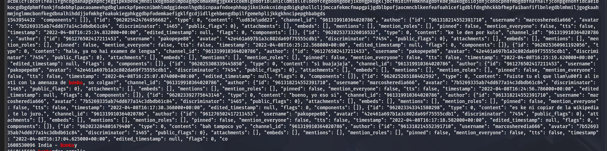
> Ahora la vemos mejor.

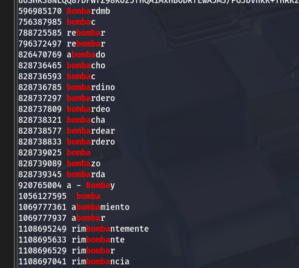
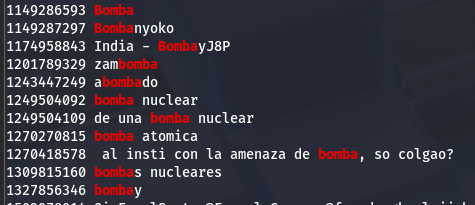
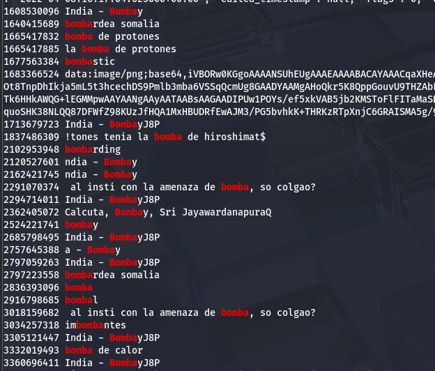
> Este hombre tiene un problema con las bombas.

Encontramos una conversación con un tal *marcosheredia666*. Utilizando la herramienta online [jsonformatter](https://jsonformatter.org/), consigo el siguiente [resultado](./conversacion.json), que trascrito queda así:

```txt
marcosheredia666:
2022-04-08T16:17:04.625000+00:00: "bah tampoco yo"

pakopepe88:
2022-04-08T16:17:18.582000+00:00: "es ke ni copiar de la wikipedia, te lo juro."

marcosheredia666:
2022-04-08T16:17:30.368000+00:00: "bueno, yo eso si"
2022-04-08T16:24:56.786000+00:00: "Fuiste tu el que llamó al insti con la amenaza de bomba, so colgao?"

pakopepe88:
2022-04-08T16:25:07.074000+00:00: "si buajajaja"
2022-04-08T16:25:19.620000+00:00: "hala, ya no hai examen de lengua"
2022-04-08T16:25:22.568000+00:00: "ke le den por kulo"

marcosheredia666:
2022-04-08T16:25:34.832000+00:00: "🤣"
```