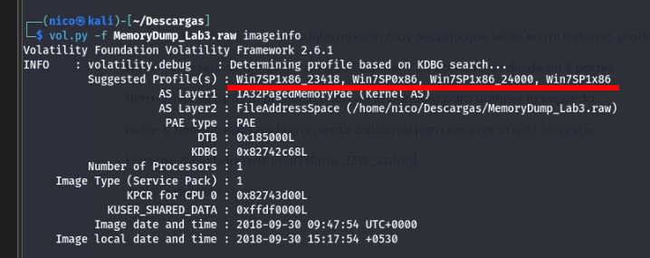
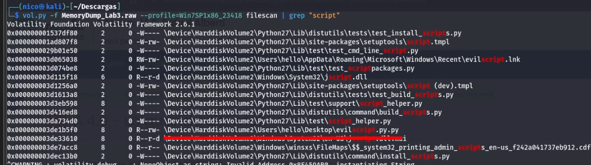
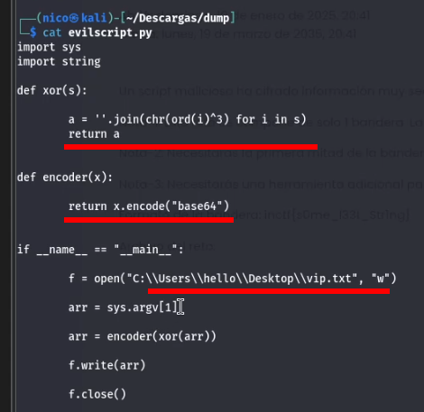
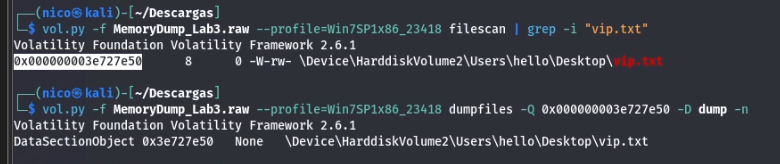
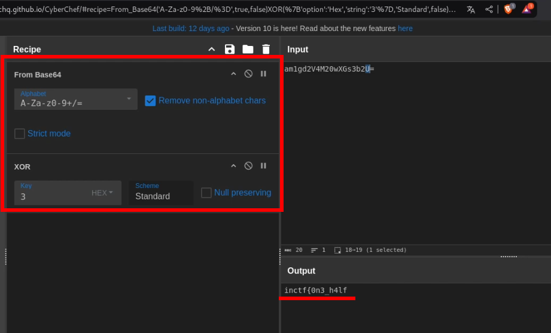
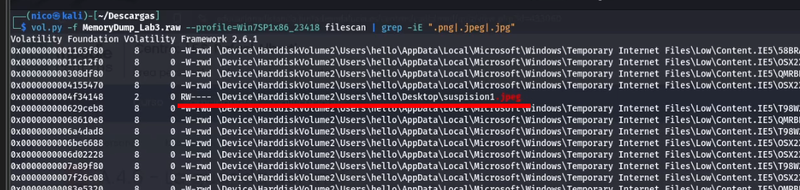
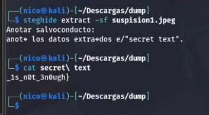

# La suerte del principiante

```
Un script malicioso ha cifrado información muy secreta que tenía en mi sistema. ¿Podrías recuperar la información por mí, por favor?

Nota-1: Este reto se compone de solo 1 bandera. La bandera se divide en 2 partes.

Nota-2: Necesitarás la primera mitad de la bandera para obtener la segunda.

Nota-3: Necesitarás una herramienta adicional para resolver el reto: steghide
```

## Procedimiento

Analizamos la imágen en busca el perfil correcto:



La tarea nos da una pista muy importante, un **script** ha cifrado información del equipo, por lo que podríamos empezar por buscar eso, un script:


> evilscript

Nos descargamos el script y lo análizamos:



El script lo que hace es:

    1. Almacena el archivo vip.txt
    2. Lo cifra un xor3
    3. Lo cifra un base64
    4. Lo guarda de nuevo en vip.txt, ya cifrado
Vamos a buscar el archivo, e intentar descifrarlo:




Ya tenemos la primera mitad, para encontrar la segunda, me he fijado en el enunciado, *steghide*, que sirve para **esconder** información a la *vista*, por ejemplo en una imágen. Busco imágenes que llamen la atención en la RAM:


> suspision1.jpeg


Le hacemos un steghide y nos pedirá una contraseña, la cuál es la primera mitad de la flag:



Y ya estaría, la flag completa queda:

inctf{0n3_h4lf_1s_n0t_3n0ugh}