# La suerte del principiante

```
El ordenador de mi hermana ha "crasheado". Tuvimos mucha suerte de tener volcado de memoria. Tu trabajo es obtener algunos archivos importantes del sistema. 

Te cuento un poco lo que recordamos, de repente vimos una ventana negra que apareció con algo ejecutándose. Cuando ocurrió el crash, ella estaba tratando de dibujar algo. Eso es todo lo que recordamos desde el momento del pronlema.

Nota: Este reto está compuesto por 3 banderas.
```

## Procedimiento

Empezamos haciendo un análisis de los posibles perfíles del sistema:

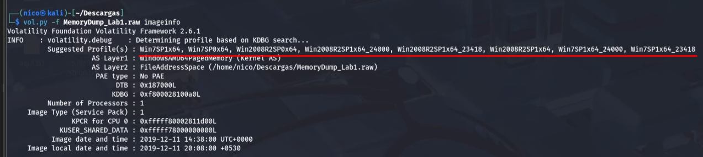
> Es el primero.

La *pista* nos dice 3 cosas a tener en cuenta:

- archivos importantes
- ventana negra(cmd?)
- paint

Vamos a buscar en el sistema algo que tenga que ver con una de estas 3.

### archivo importante:

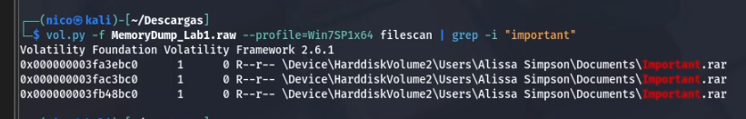
> Los 3 son el mismo archivo.

Al intentar extraer el contenido nos sale lo siguiente:

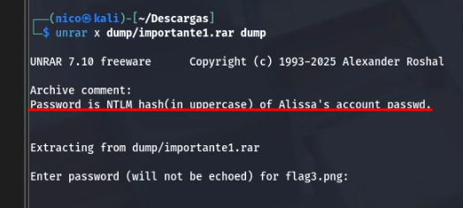

Buscamos el hash de la contraseña de Alissa con hashdump:

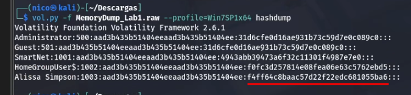
> Hash NLTM es lo que está señalado en la imágen.

Pegamos eso en el comando anterior(TODO EN MAYUSCULAS):

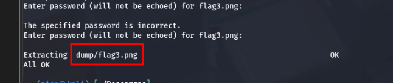

> Tercera flag encontrada.

# Ventana negra

Con ventana negra con algo ejecuandose, entiendo que es una CMD, voy a buscar procesos del *CMD*:

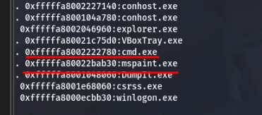
> El paint es para luego.

Vemos que se estaba ejecutando la CMD cuando el PC crasheo. Vamos a ver qué se estaba ejecutando con **consoles**:

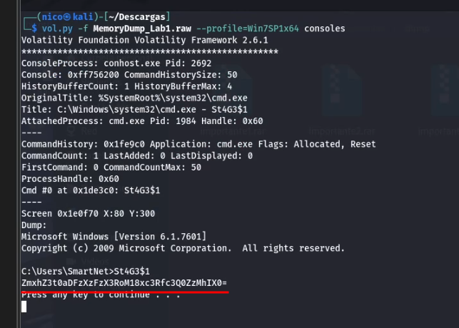
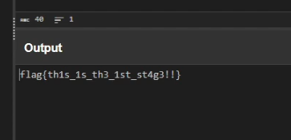
> Primera flag encontrada.

# Paint

Como vimos en una imágen anterior, el paint se estába ejecutando en el momento del crasheo:

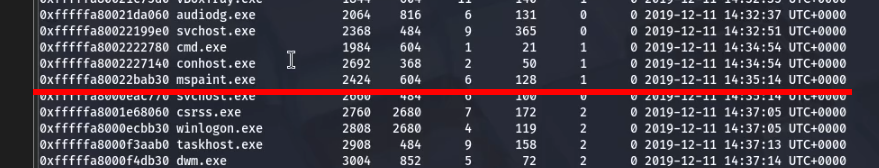

Vamos a dumpear ese proceso y ver qué sacamos:

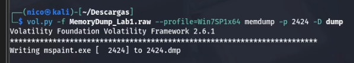

Nos devuelve un archivo en un formato que no se puede abrir, le cambiamos la extensión a *.data*, y la abrimos con **gimp**.

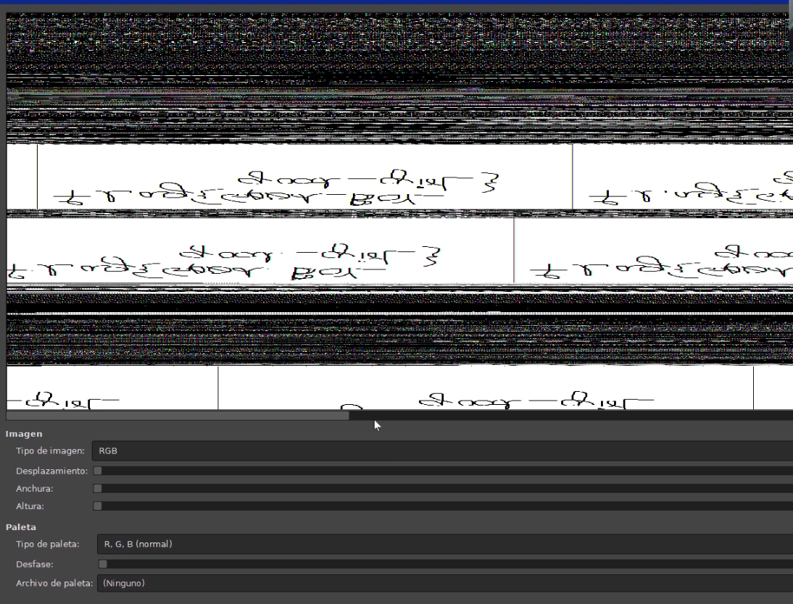
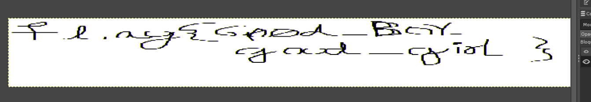
> Sí, es la segunda flag...