# Un nuevo mundo

```
Uno de los clientes de nuestra empresa perdió el acceso a su sistema debido a un error desconocido. Supuestamente, es un "environmental activist"  muy popular. Como parte de la investigación, nos dijo que sus aplicaciones principales son navegadores, sus gestores de contraseñas, etc. 

Esperamos que puedas analizar este volcado de memoria y encontrar sus cosas importantes para devolvérnoslas.

Nota: Este reto está compuesto por 3 banderas.
```

## Procedimiento

Empezamos haciendo un análisis de los posibles perfíles del sistema:

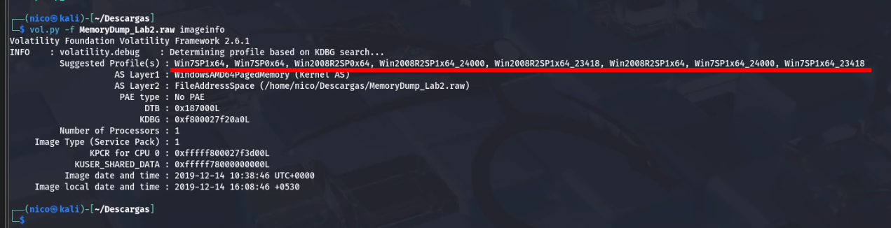

Con la *pista* podemos sacar en claro 3 cosas:

- *environmental activist*(variables de entorno)
- Navegador
- Gestor de contraseñas

### Variables de entorno 

Mostramos las variables de entorno con el siguiente comando:

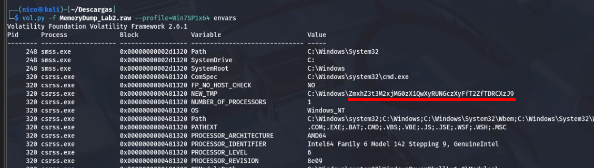
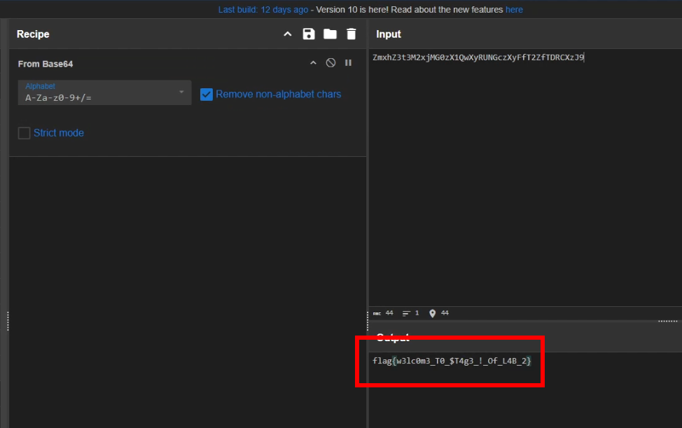
> Primera flag.

### Navegador

Lo único que se me ocurre que podamos hacer con el navegador es intentar exportar el historial y sacar algo de él:

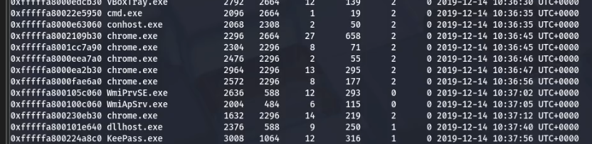
> Resultado del pslist.

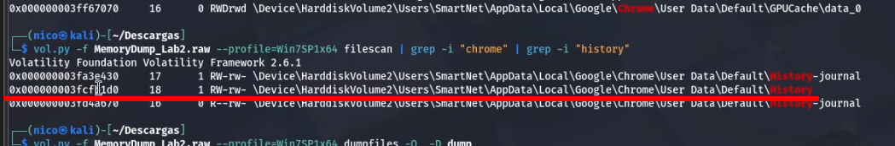

Dumpeamos el archivo, y lo abrimos con *sqlitebrowser*:

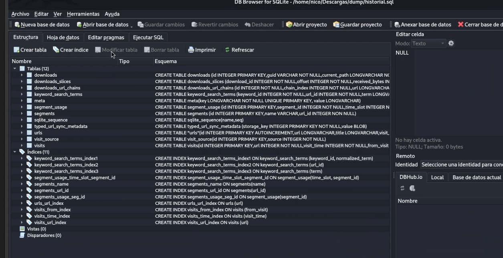

Ponemos la siguiente *Query* para ver el historial:

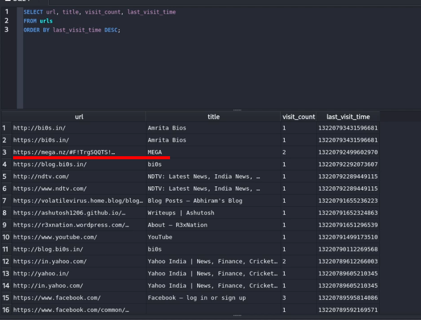

Y sacamos un enlace de mega, el cuál contiene un archivo zip, que al intentar extraerlo, nos pedirá una contraseña. La contraseña es el *sha1* de la flag del laboratorio *La suerte del principiante*:

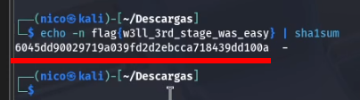
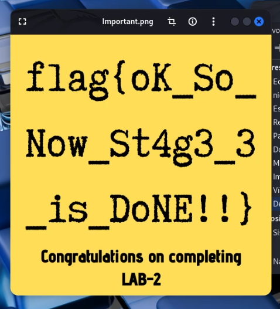
> Tercera flag encontrada.

### Gestores de contraseñas

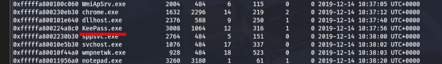
> pslist.

Rebuscando por la memoria, encontré este archivo:

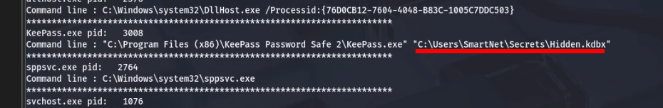
>cmdline

Lo buscamos con filesacan y lo exportamos con dumpfiles:

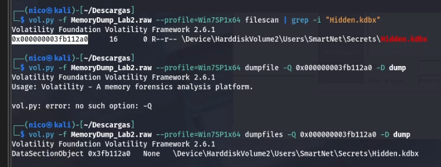

Se nos habrá dumpeado un archivo con una extención rara, se la cambiamos a .kdbx y la abrimos con *keepass2*:

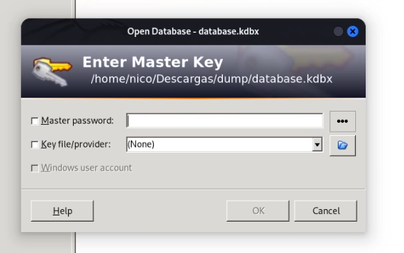

Nos pide una contraseña que aún no tenemos, vamos a buscarla con filesacan:

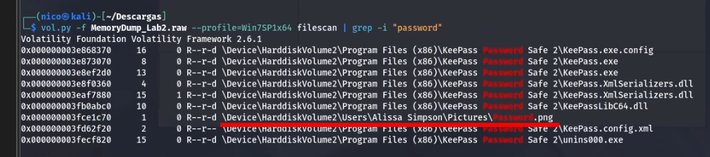
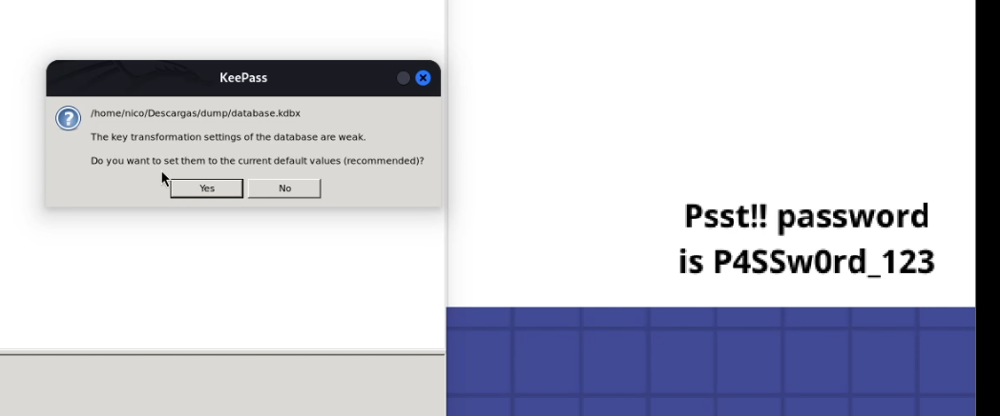
> Encontramos la contraseña de la base de datos del keepass.

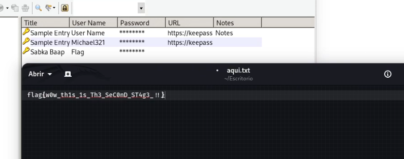
> Y la segunda flag.