# PfBlockerNG

Para la configuración de Pfblocker, necesitaremos tener instalado el siguiente paquete:

`System > Package Manager`

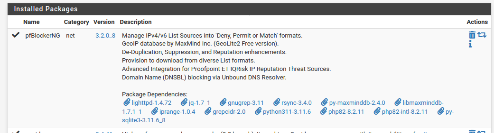

PfBlockerNG sirve para denegar/permitir el tráfico saliente o entrante, lo que es un firewall vaya, pero lo facilita bastante e incluye algunas mejoras.

A partir de aquí, vamos a editar los siguientes parámetros:

`Firewall > pfBlockerNG`

    La primera vez que entras te dice que configures unos parámentros iniciales, todo por defecto, si dudas, la primera opción _WAN_ la segunda _LAN_.

`General`

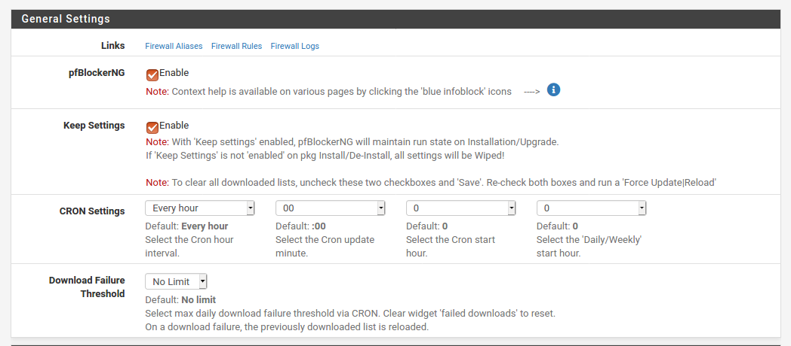

> Obvaimente, tenemos que habilitar el pfBlockerNG.
> Habilitamos mantener la configuración en caso de actualizar(no lo creo).

`IP`

` `

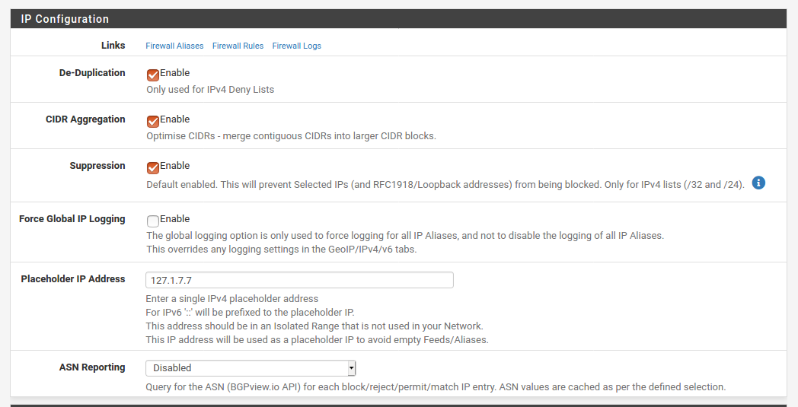

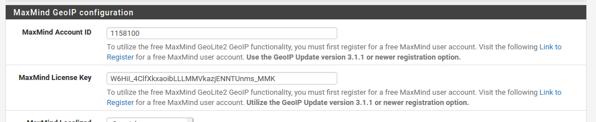

> Para este apartado tienes que darte de alta en [maxmind](https://www.maxmind.com/en/geolite2/signup).
> [MaxMind Account ID](../../../MaxMind_confg) <- Solo está en mi PC.

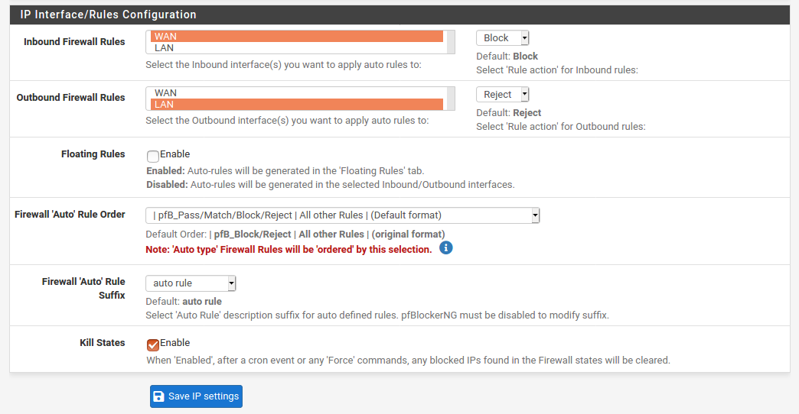

_Todo esto es una configuración inicial para que todo funcione correctamente, vamos a emoezar a bloquear IPs y DNSs_

`IP`

`IPv4`

En esta sección podremos crear listas de IPs para hacer con ellas lo que queramos. Por defecto, ya hay una creada que, podemos dejarla ahí, pero vamos a crear una nosotros:

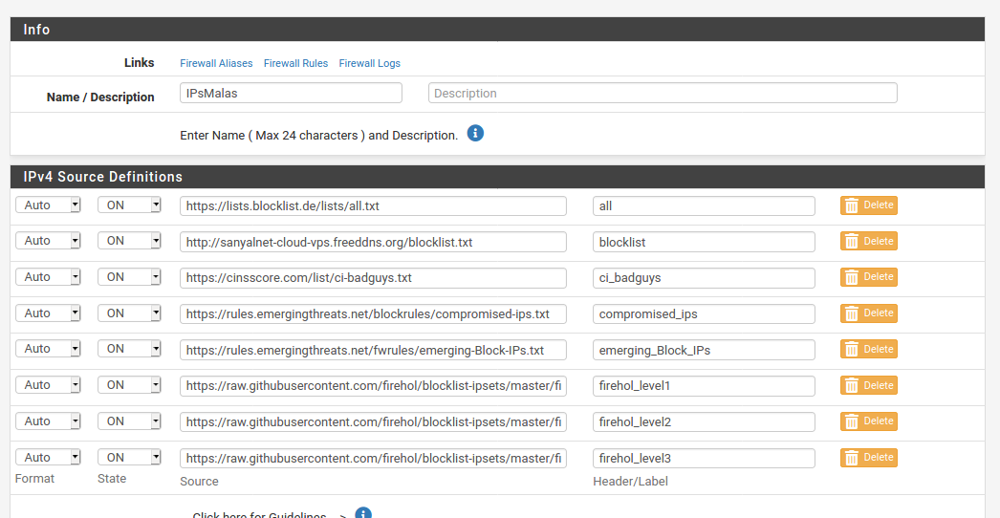

Todas estas URLs son listas de IPs que se utilizan para esto precisamente, bloquearlas todas directamente. Son demasidas para contar y no se porque están en estás _blacklist_.

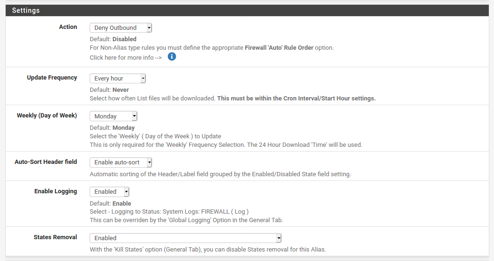

Esto es un poco _depende_, pero la **Action** hay que ponerla en _Deny Outbound_.

Por último, abajo del todo hay una sección de _IPv4 Custom-List_, que se usa para crear nuestras propias listas de IPs.

`IP`

`GeoIP`

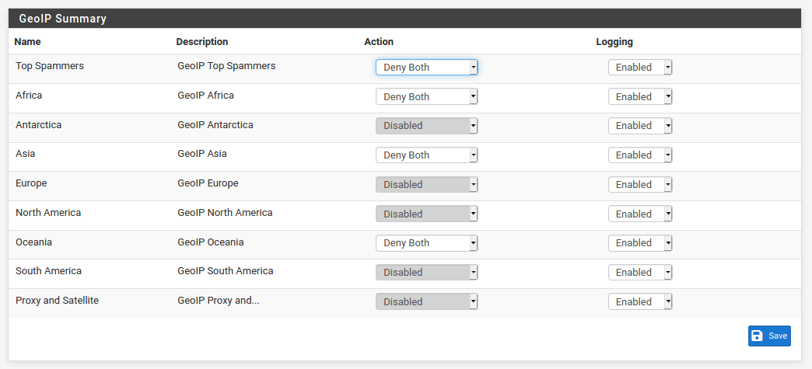

Aquí, depende de la versión del paquete, puedes elegir entre en continentes o paises. Permite denegar/permitir el acceso de _X_ continentes.

`DNSBL`

` `

Aquí no me acuerdo que toqué exactamente. Esta parte sirve para lo mismo que la anterior, pero para nombres de dominio.

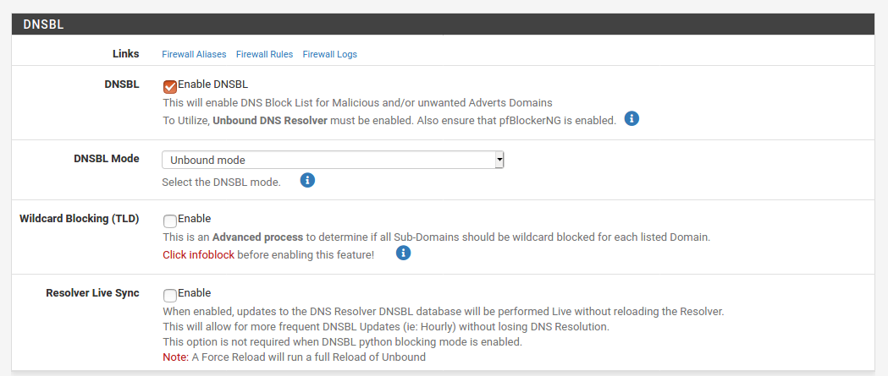

> La _Virtual IP Address_ tiene que ser fuera del rango de IPs que tengas.

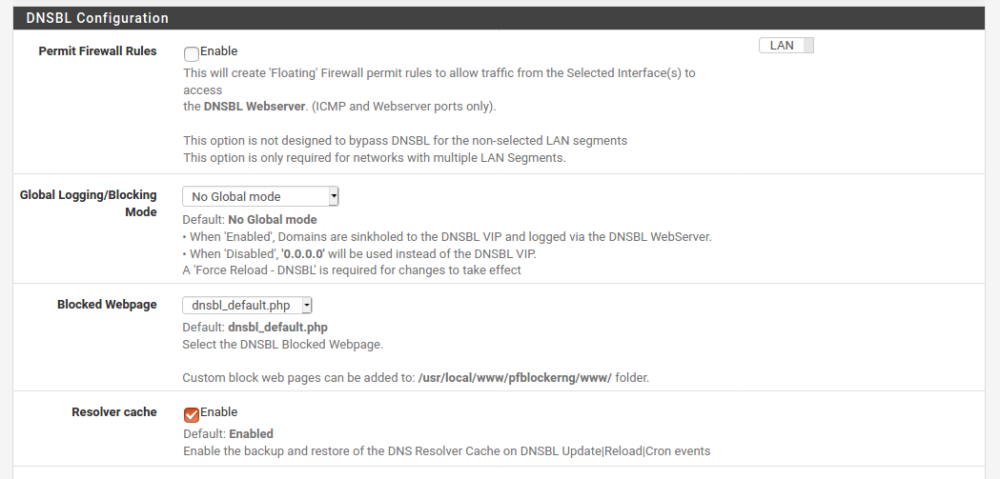

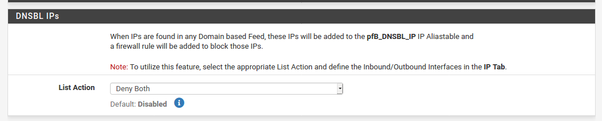

`DNSBL`

`DNSBL Groups`

Igual que antes, tenemos una lista por defecto, la dejamos y creamos una nueva de 0.

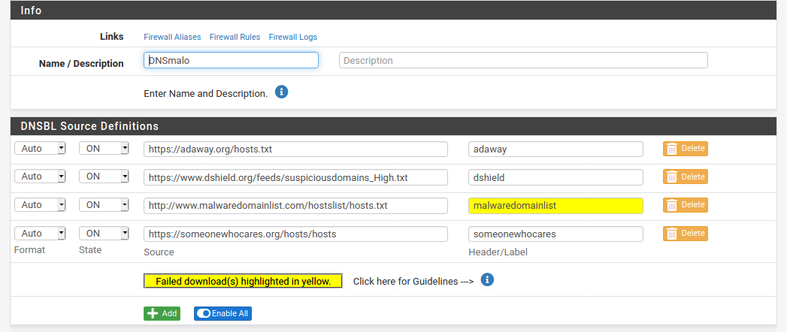

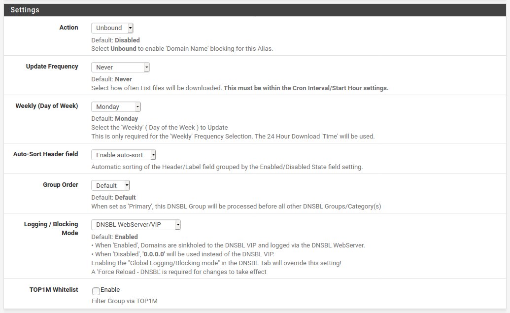

Y ya.