# Squid

Usaremos Squid como proxy para inspeccionar el tráfico https.

Para la configuración de Squid, necesitaremos tener instalado el siguiente paquete:

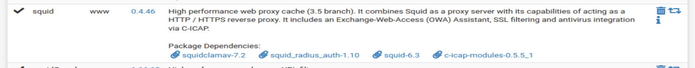

Lo primero que vamos a hacer es configurar los certificados.

`System > Certificate`

Creamos una _CA_ (Authorities):

> [NOTE]
> Sin tildes

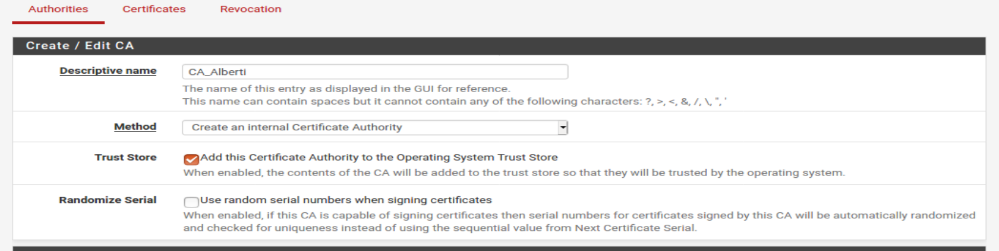

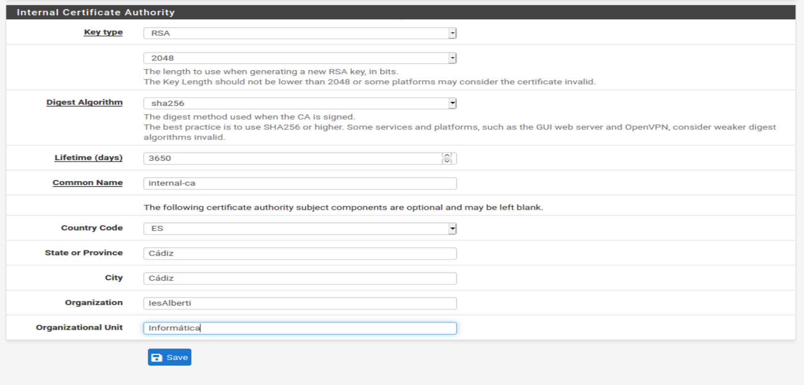

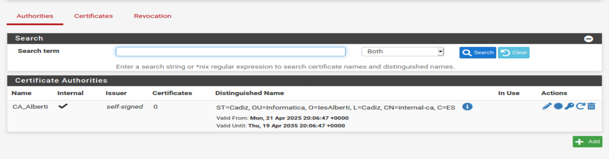

> Quedaría así.

Ahora tenemos que configurar el proxy:

`Services > Squid Proxy Server`

`Local cahce`

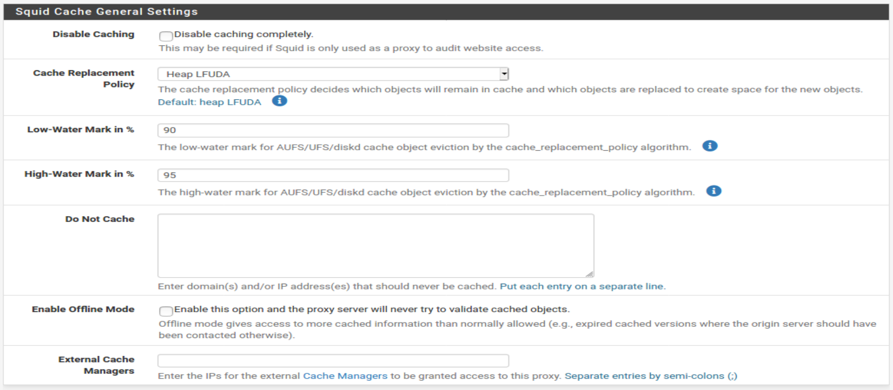

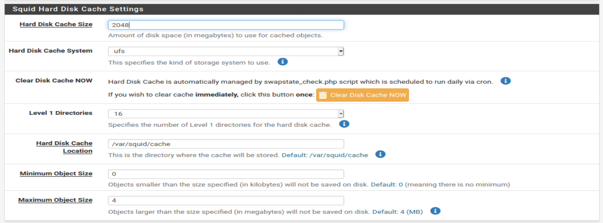

> Estas configuraciones son un poco _depende_, esto es como _lo general_.

Dejamos el resto como está y volvemos a `general` para activar el proxy:

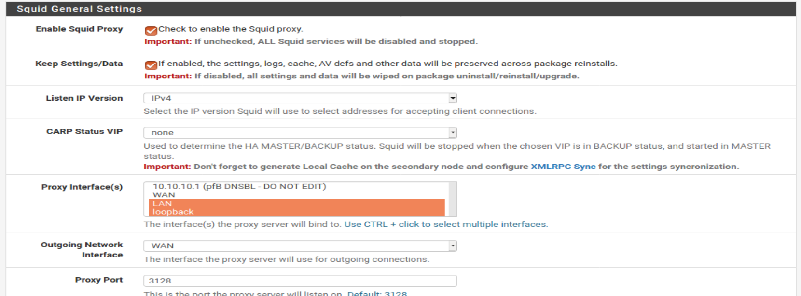

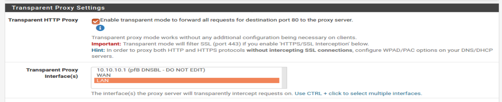

> De esta forma, camuflamos el proxy para que no sea visible.

Para análizar y filtrar el tráfico HTTP/HTTPS, marcamos y ponemos nuestra _CA_:

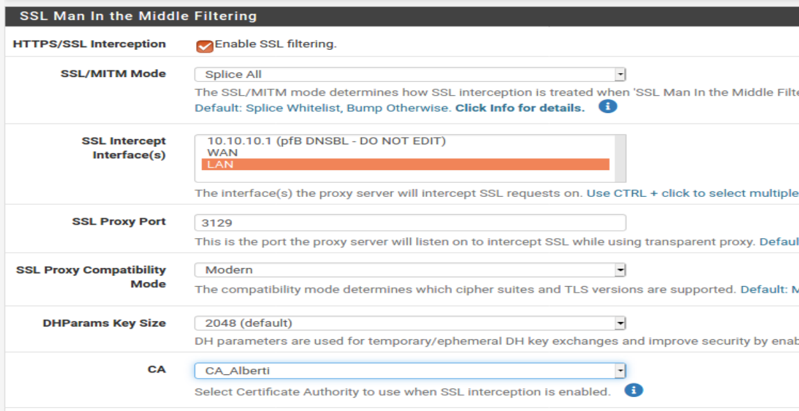

Activamos los logs:

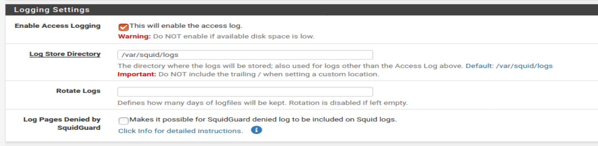

POr último, modificamos estas pijadas para los logs:

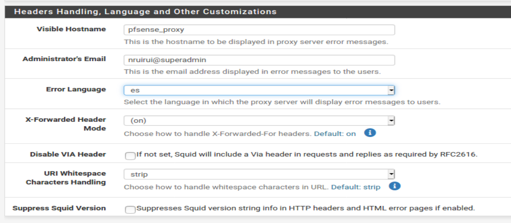

En la pestaña `ACLs`, podemos elegir quienes pueden usar el proxy.

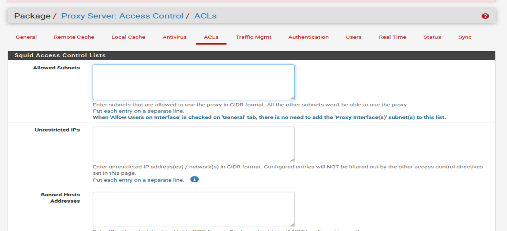

En `Traffic Mgmt` configuramos cosas como el tamaño máximo de descarga o subida.

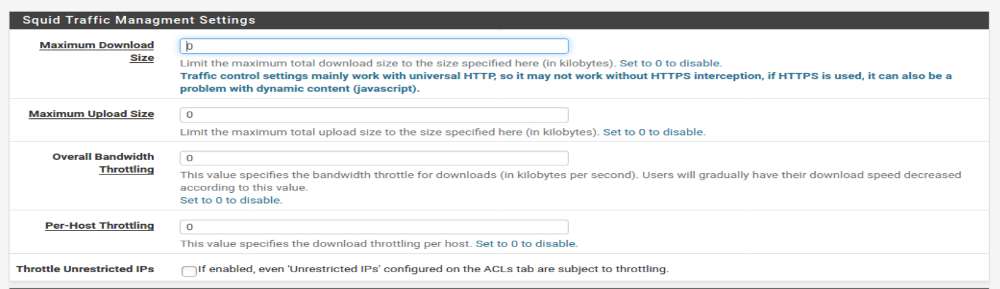

Por último, en `Real Time` y en `Status` podemos ver el estado real del proxy:

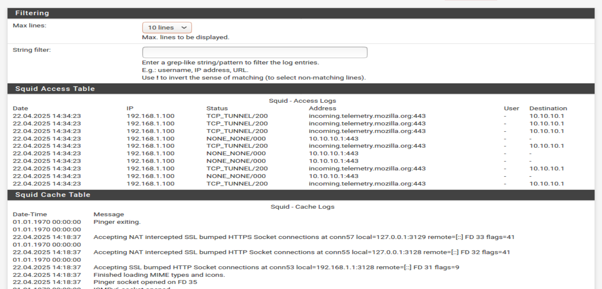

## Chequeo de Tráfico con Antivirus

En la pestaña de `Antivirus` activamos `Enable AV` para activar el antivirus de _Squid_. `Client Forward Options` sirve para enviar la IP y el nombre del usuario al antivirus. En `Scan Type` dejamos `All` para que analice todo el tráfico de la aplicaciones web. `Exclude Audio/Video Streams` sirve para **NO** analizar el tráfico de videos o sonidos

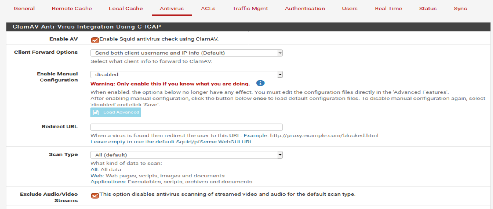