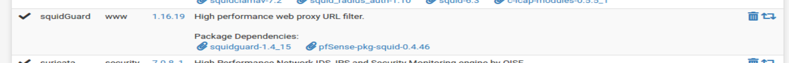
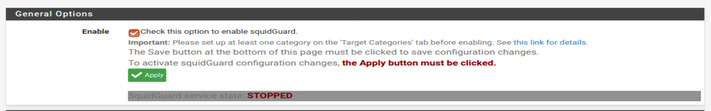
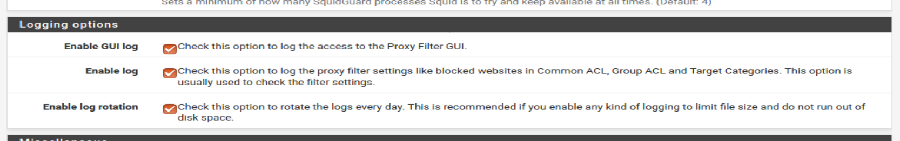
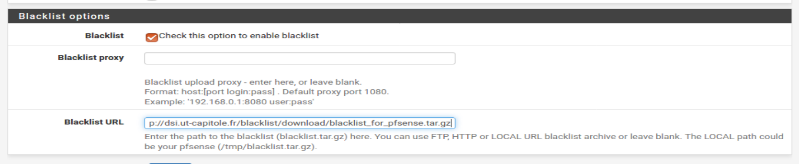
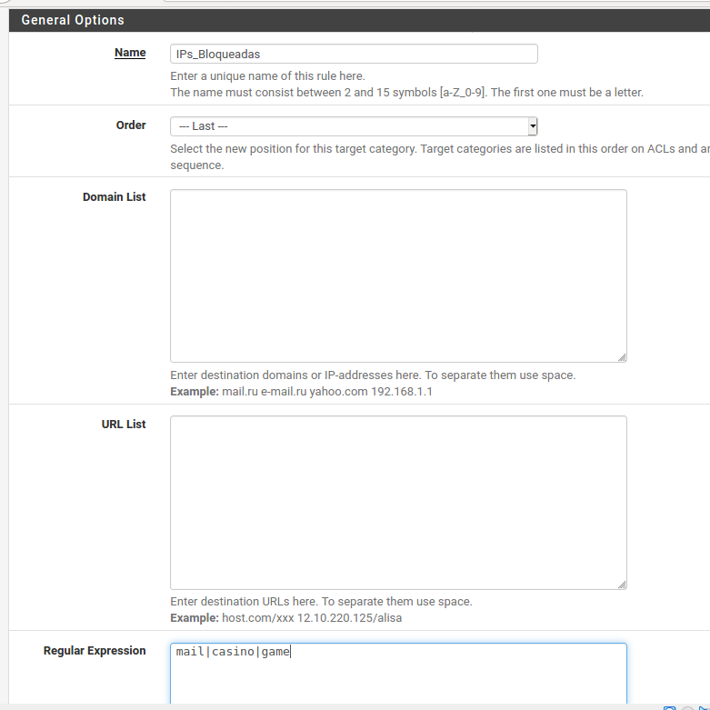
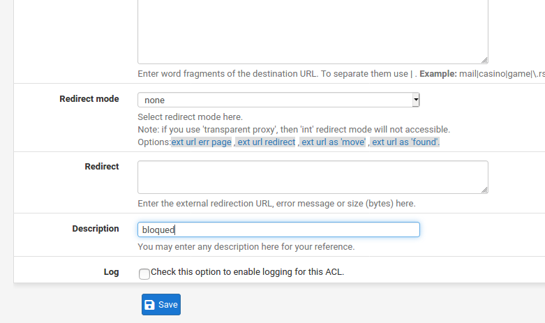
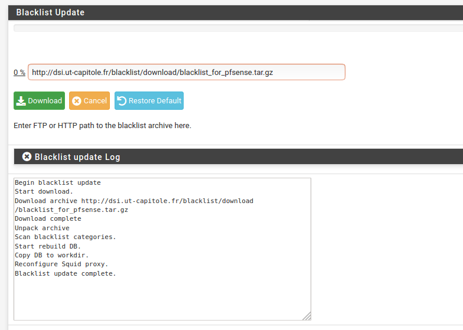
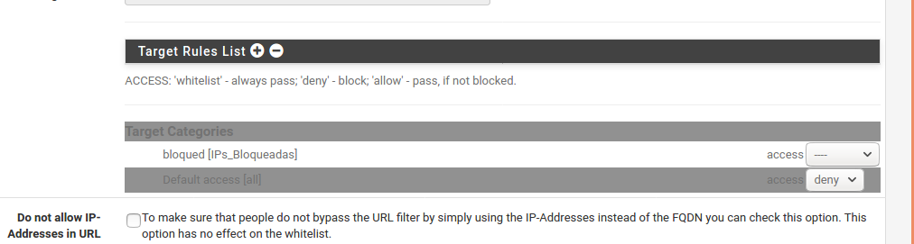
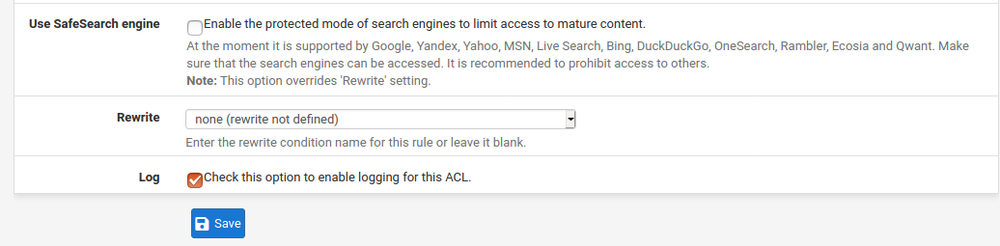

# SquidGuard

Para acabar, vamos a configutar el paquete SquidGuard, para ello, necesitamos tener intalado el siguiente paquete:

Entramos en la configuración y vamos viendo:

`Services > SquidGuard Proxy Filter`

`General Settings`

Obviamente, habilitamos  el squidGuard, y habilitamos también el log para que registre actividad:

Aactivamos las `Blacklist` y ponemos la siguiente en `Blacklist URL`:

`Target categories`

Vamos a crear 2 categorias: _IPs bloqueadas_ y _IPs permitidas_.

> Me da to la pereza poner las IPs.

Basicamente hemos hecho una lista de IPs y palabras concretas que no se pueden buscar dentro de la RED.

Tambien se puede crear una lista de IPs permitidas... aunque no entiendo para que, puede ser que sirva en caso de bloquear todo y solo permitir las de esa lista idk.

`Blacklist`

Aquí podremos descargarnos la lista de que pusimos antes. Le damos a descargar y en `Common ACL` agregamos la lista:

> Aquí deberían aparecernos un montón de listas, pero la URL proporcionada ni si quiera existe...

Activamos los logs como siempre.

Y ya :)