# Suricata

Suricata es un SIEM que usa SNORT de fondo para crear las alertas.

Para la configuración de Suricata, necesitaremos tener instalado el siguiente paquete:

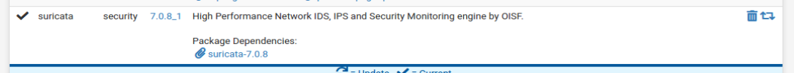

Debemos crearnos una cuenta en [snort](https://snort.org/) ya que haremos uso del _oinkmaster_ clave de licencia para poder usar distintas versionas de snort.

Una vez registrados nos vamos a:

`Services > Suricata`

`Global Settings`

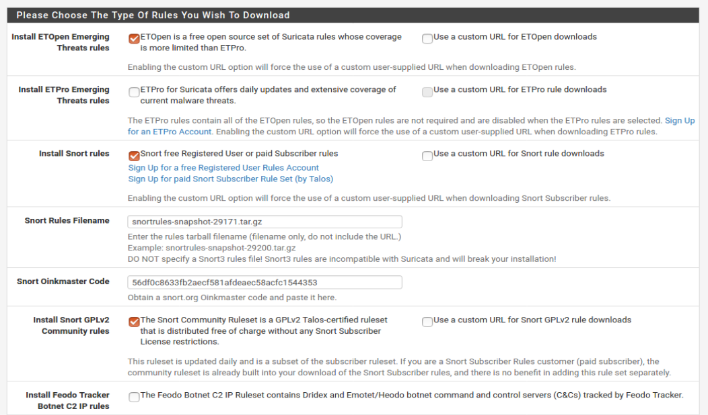

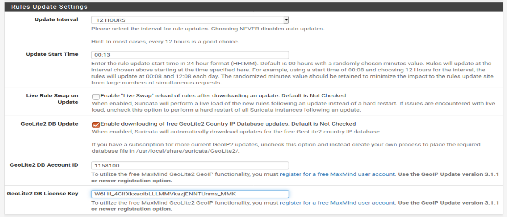

> Tenemos que darnos de alta en [maxmind](https://www.maxmind.com/en/geolite2/signup) y generar una _License Key_.

[GeoLite2 Credentials](../../../../MaxMind_confg)

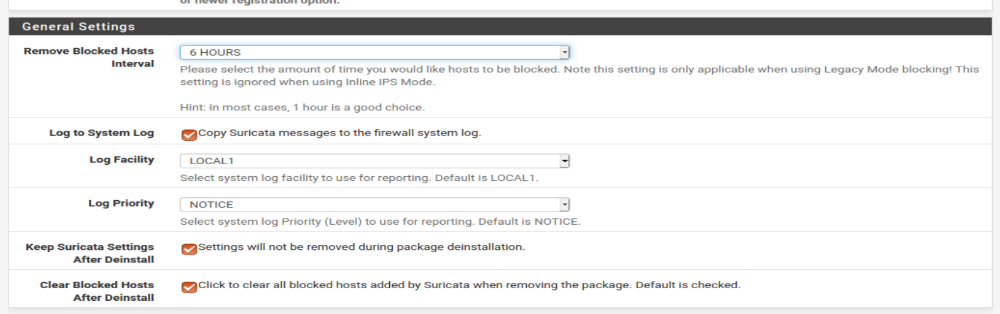

`Services > Suricata`

`Updates`

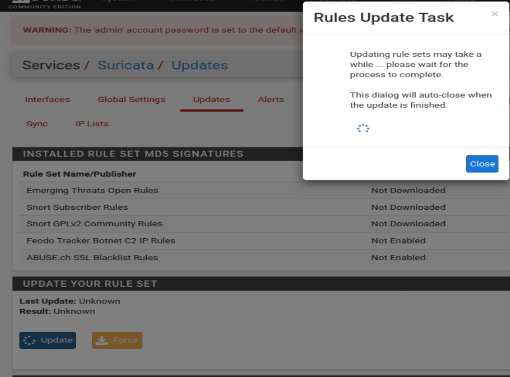

> Botón grande que pone `Update`, y ya.

`Services > Suricata`

`Interfaces`

Le damos a añadir para entrar a _WAN Settings_

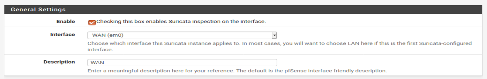

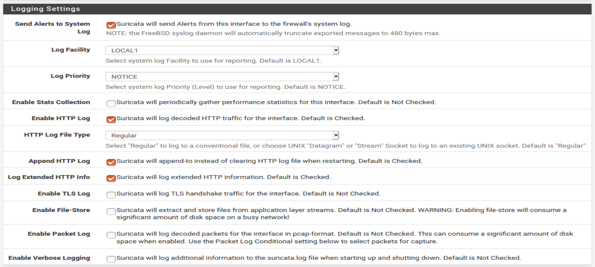

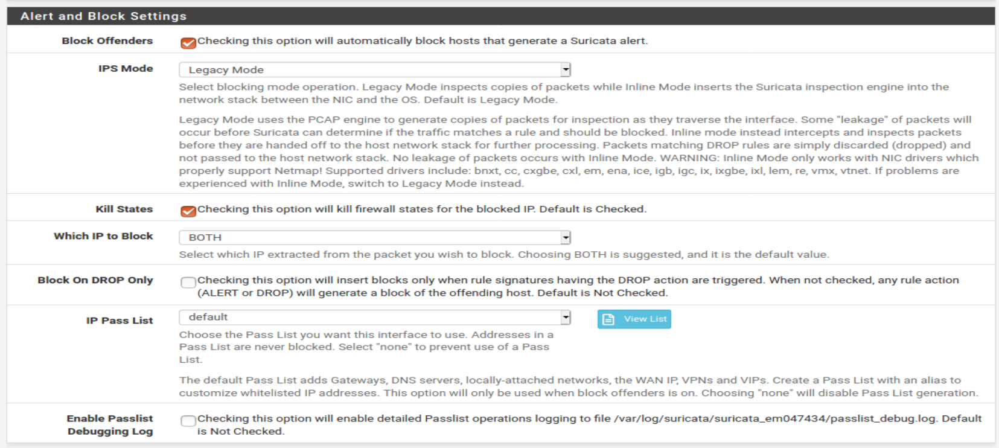

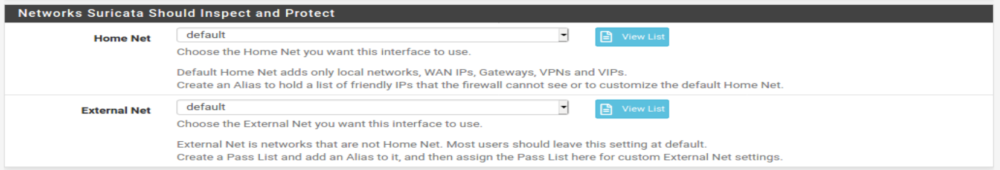

> Aquí puedes poner que IPs no se bloqueen o les hagan alertas.

En _WAN Categories_, activamos las categorías de los ficheros que hemos descargado:

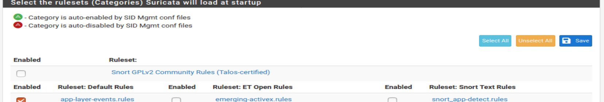

> Le damos a select all y ya.

En _WAN Rules_ tenemos las reglas del **SNORT** que podemos aplicar o no. Por defecto están todas activadas, lo suyo es ir viendo cual necesitamos y cuales no.

en _WAN IP Rep_ se bloquean IPs tambien, como en pfBlockerNG. Como ya lo tenemos ahí, no lo tocamos.

Ahora que ya está todo configurado, solo nos queda activar Suricata en la interfaz:

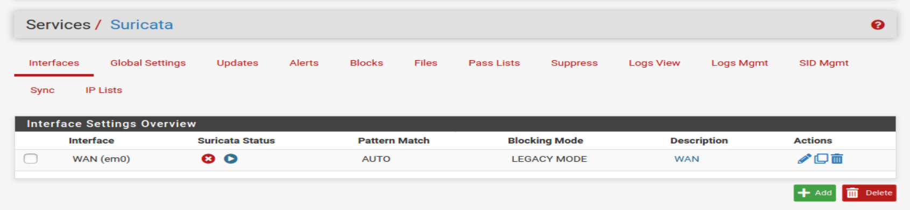

> Le damos al botón azul del _play_.

Y ya :)