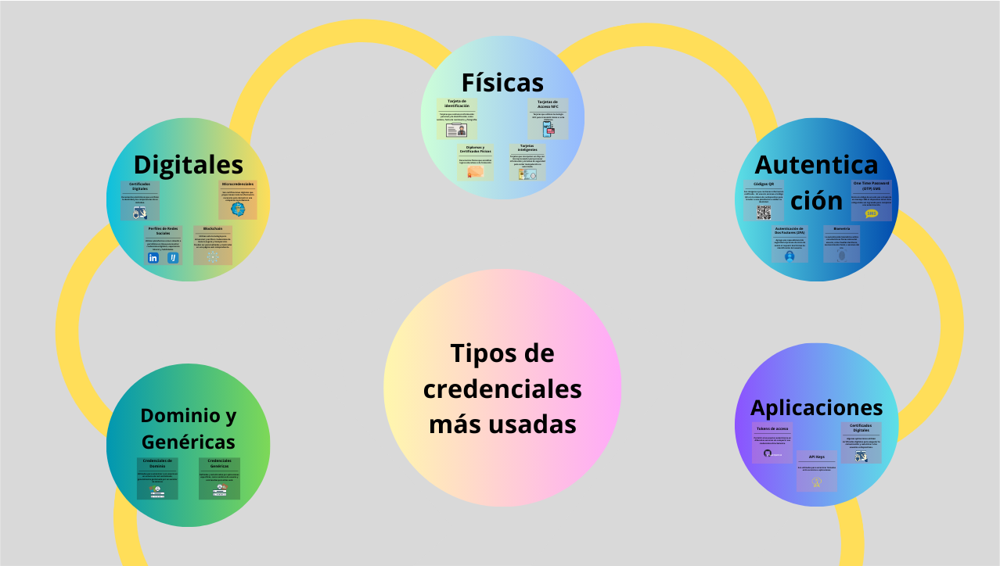
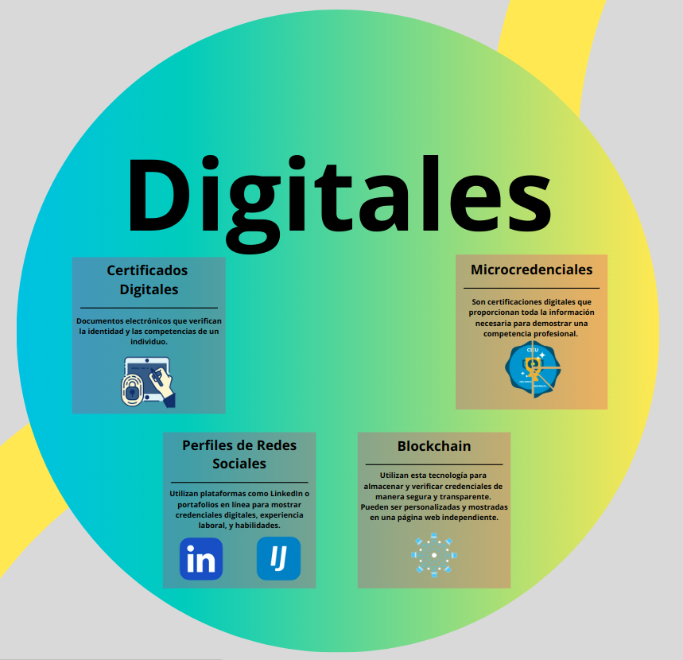
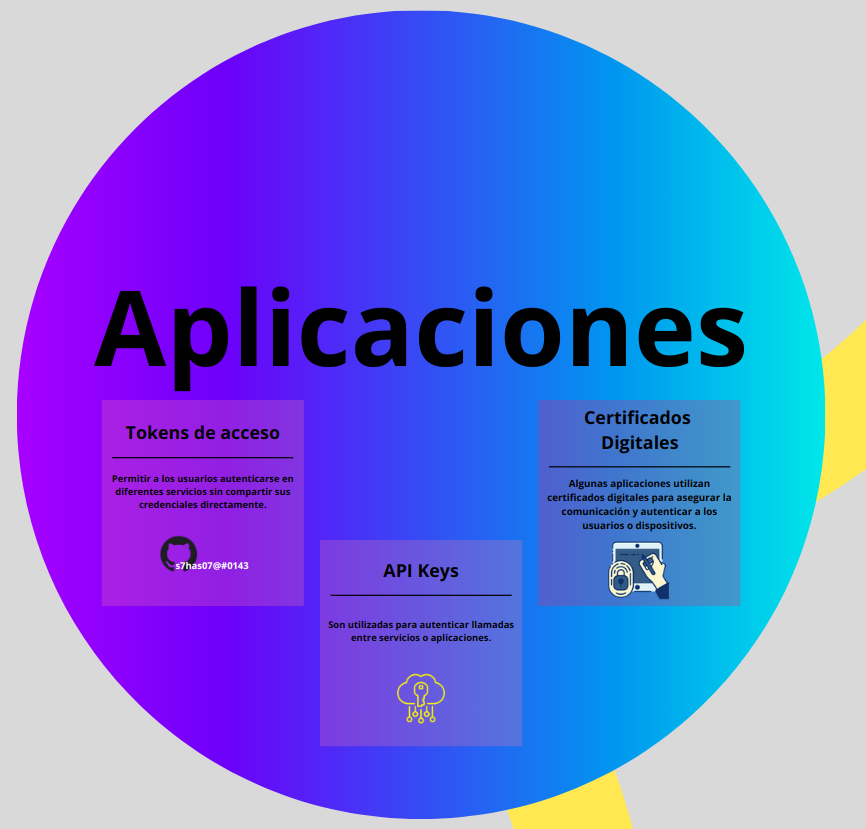

# Tipos de credenciales más utilizados

Para un vistazo más detallado, hacer clic [aquí](https://www.canva.com/design/DAGZpMGmk5g/JTf7r5AWpK2lm-0JeFix7A/edit)

## Físicas

Utilizan dispositivos físicos o elementos tangibles que se usan para identificar la identidad de una persona. Estas credenciales están asociadas a mecanismos de control de acceso y pueden incorporar tecnologías como chips, códigos de barras o bandas magnéticas para aumentar su seguridad. 
Hemos encontrado estos 4 ejemplos de credenciales físicas:
  

- Tarjeta de identificación
- Tarjetas de acceso NFT
- Diplomas y certificados
- Tarjetas inteligentes

## Digitales

Utilizan elementos intangibles o virtuales que sirven para verificar la identidad de una persona en entornos digitales. Estas credenciales están ligadas a sistemas de control de acceso y pueden incluir tecnologías como contraseñas, certificados digitales o autenticación biométrica para reforzar su seguridad. 
Hemos identificado estos 4 ejemplos de credenciales digitales:
  

- Certificados digitales
- Microcredenciales
- Perfiles de redes sociales
- Blockchain

## Autenticación

Es en el proceso de verificar la identidad de un usuario o sistema antes de permitir el acceso a recursos protegidos. La autenticación puede utilizar diversos métodos para asegurar que solo personas o entidades autorizadas puedan acceder, garantizando la seguridad de la información. 
Hemos investigado los 4 siguientes ejemplos:
  

- Códigos QR
- OTP password
- 2FA
- Biometría

## Dominio y genérica

Las credenciales de dominio se emplean para validar la identidad de un usuario en un entorno de red centralizado, comúnmente administrado por un servidor de dominio.

Por otro lado, las credenciales genéricas son gestionadas y autenticadas por aplicaciones específicas, como los nombres de usuario y contraseñas utilizados para acceder a sitios web.

## Aplicación

Por último, tenemos las credenciales de aplicaciones, que son un mecanismo que proporcionan las propias aplicaciones para autenticarte en estas aplicaciones.
Hemos encontrado estos 3 ejemplos de credenciales en aplicaciones:
  

- Tokens de acceso
- API keys
- Certificados digitales
