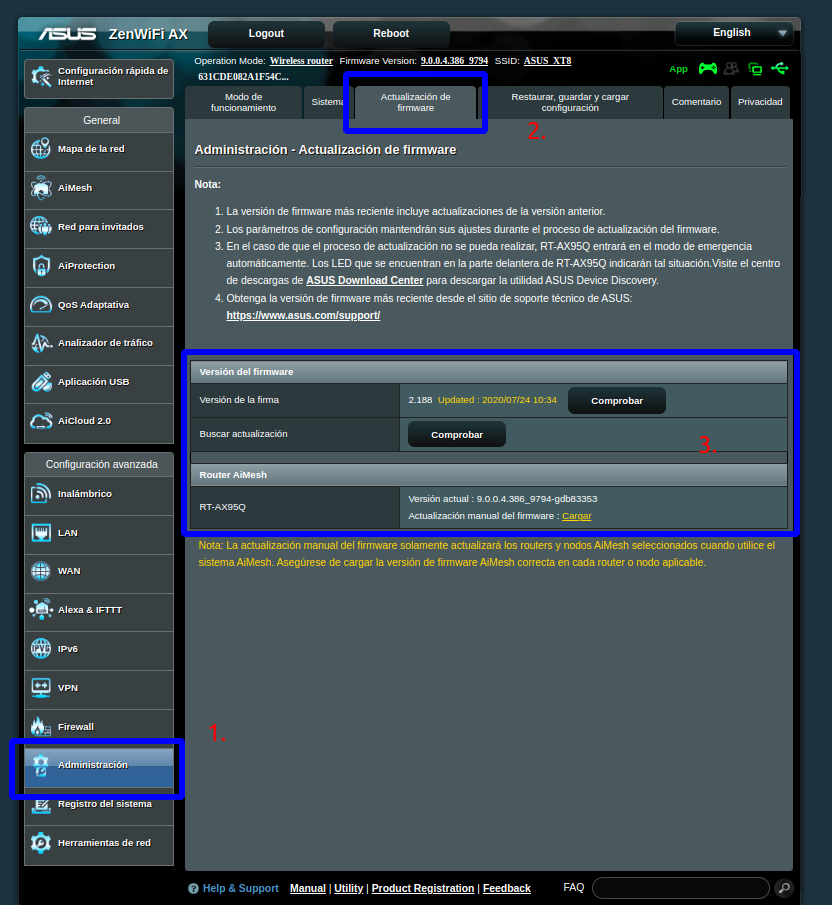
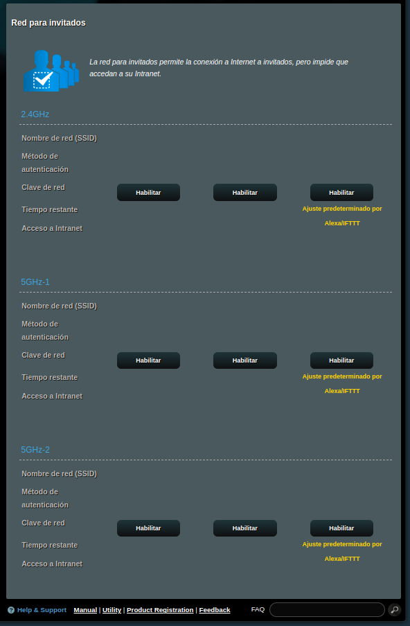
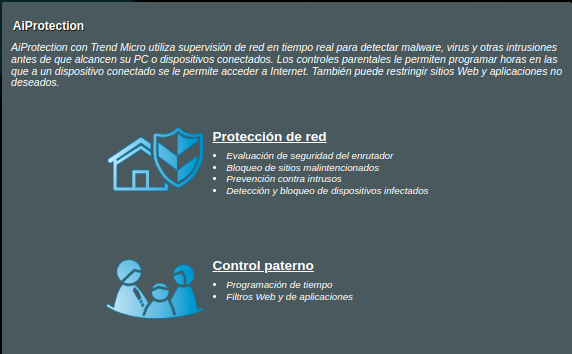
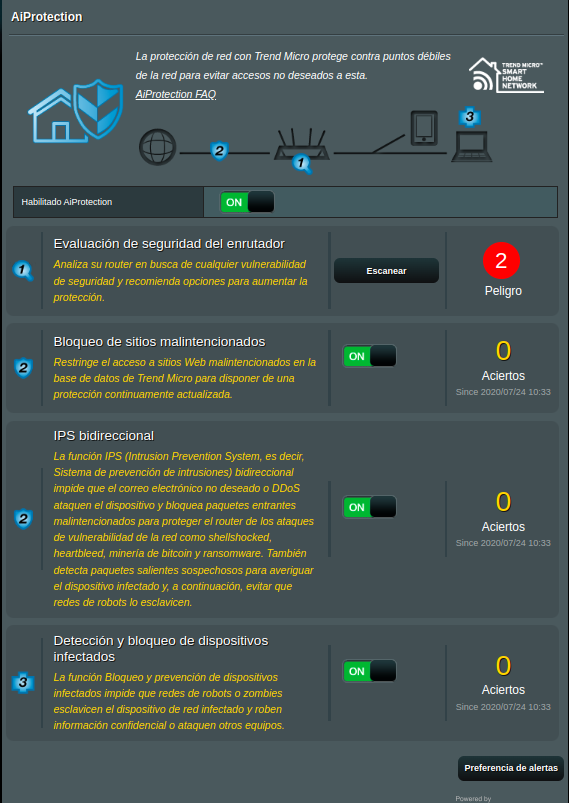
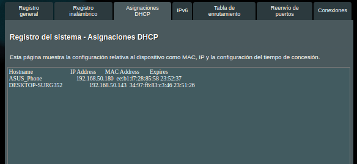

# Hardening a un router

## Introducción

Para esta primera parte del proyecto, se nos pide utilizar un emulador de routers reales y realizar una guía de bastionado de este.
He decidido usar el emulador online de [ASUS](https://demoui.asus.com/ES/)

## Previo

Primero que nada, vamos a tener en cuenta algunos puntos básicos. En estos puntos encontramos:

**1. Actualización del firmware**

Tener instaladas las últimas versiones del firmware ayuda a evitar y corregir las vulnerabilidades.

**2. Cambiar las credenciales por defecto**

Muchos routers usan la misma contraseña por defecto para iniciar sesión en su web. Esto genera un problema de seguridad en el que cualquier usuario que conozca esa contraseña por defecto, puede acceder a él, y por tanto a la red.

También podemos aprovechar y cambiar la contraseña del wifi, que podría tener el mismo problema que la de inicio de sesión.

**3. Quitar servicios innecesarios**

Innecesarios es bastante relativo, ya que, depende de la empresa, puede usar algunos servicios u otros, pero podríamos desacticar el AiCloud, ya que solo sirve para *compartir* archivos mediante USB conectados al router. Teniendo equipos NAS o carpetas compartidas, lo veo bastante innecesario.

## Bastionado

En esta parte, vamos a ver y tratar todas las secciones y pestañas que podamos encontrar en el router.

### General

**1. Mapa de la red**

En esta sección, vemos el típico home de los routers donde podemos ver información de los equipos conectados:

Además de poder cambiar configuraciones de seguridad del wifi:

Podemos cambiar el nombre de la red(SSID), el modo de autenticación, encriptación y contraseña del wifi. En modo de autenticación, podemos poner WPA empresarial y crear usuarios.

**2. AiMesh**

El AiMesh sirve para conectar varios routers y crear una red Wifi en malla para toda la empresa/hogar. O sea, utilizar routers como puntos de acceso para liberar la carga de los routers. No se puede quitar, tampoco lo veo necesario, y para crear un nodo, solo tendremos que enchufar el router a la corriente y a la red y poner la IP de este en el router:

**3. Red para invitados**

Esta red está aparte de la red de la empresa, por lo que no es peligroso dejarlo habilitado, lo que sí, podría ocasionar problemas de rendimiento en el router. Podemos desactivarlo en el siguiente panel:

> Por defecto viene desactivado.

**4. AiProtection**

Supervisa en tiempo real la red para detectar malwares e intrusiones antes de que alcancen los dispositivos críticos. Tenemos 2 apartados:

**4.1. Protección de red**

Recomiendo dejarlo activado ya que proporciona protección a los equipos de la red. 

**4.2. Control paterno**

Sinceramente lo desactivaría, no bloquea contenido malicioso solo adulto. Esto no es realmente necesario, y además el router gasta recursos al bloquear estas páginas.

**5. Adaptive QoS**

Es solo un monitor de ancho de banda.

**6. Traffic Analyzer**

Analiza el tráfico de la red y muestra los equipos(MAC) y las aplicaciones más utilizadas.

**7. USB applications**

Vamos a desactivar los dispositivos USB en el siguiente punto.

**8. AiCloed 2.0**

Desactivamos el *Cloud Disk* y el *Smart Access*, ya que, en caso que tengan un NAS en la empresa, se compartirá a través de IP no desde el router.

### Configuración avanzada

**1. Wireless**

Si fuera necesario tener el Wifi activado, tendriamos que poner la autenticación WPA2 Enterprise

Y en la pestaña de configuración de RADIUS, especificar la IP de este y su clave simétrica:

**2. LAN**

Aquí podemos cambiar muchas cosas:

La IP y máscara del Red.

Como se hace el asignamiento de IPs(DHCP) y el rango de este, si se desactiva, habría que añadir las IPs una a una a través de la MAC.

**3. WAN**

EL protocolo WAN es para tener *internet* en los equipos conectados, obviamente lo activamos.

**4. Alexa & IFTTT**

**¡¡NO!!**

**5. IPv6**

No está tan estandarizado aún como para activarlo.

**6. VPN**

Si tuvieran trabajadores en *home office*, podríamos activar el servicio VPN:

**7. Firewall**

El firewall sirve para bloquear paquetes que vengan y vayan a cualquier dirección y a cualquier puerto.

Por lo que veo, no podemos rechazar peticiones que vengan desde fuera, solo podemos hacer el redireccionamiento de puertos, el cual solo se recomienda si tenemos un servidor VPN en local.

> Ejemplo de redireccionamiento

Tamién podemos bloquear URLs específicas:

**8. Administration**

En esta sección podremos modificar aspectod como la autenticidad para acceder al router, actualizar el firmware y crear/guardar/cargar copias de seguridad:

> Para este último, tendremos que activar el USB para guardarlos en él.

**9. System Log**

En esta sección, veremos varias pestañas donde pondremos ver logs del router de diferente indole:

**10. Network Tools**

No aplica en esta documentación.

## Conclusión

De esta forma, habríamos acabado con el bastionado al router de ASUS.
Evidentemente, lo he configurado de la forma que yo creo correcto, cada organización es un mundo y muchas opciones que yo he desactivado, pueden ser útiles o necesarias en la empresa, lo suyo es ir comparando las necesidades con esta guía.