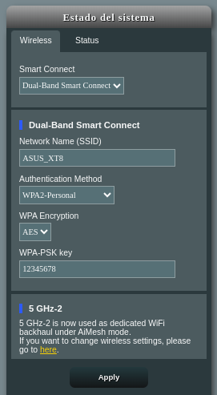

# Hardening a un router

## Introducción

Para esta primera parte del proyecto, se nos pide utilizar un emulador de routers reales y realizar una guía de bastionado de este.
He decidido usar el emulador online de [ASUS](https://demoui.asus.com/ES/)

## Previo

Primero que nada, vamos a tener en cuenta algunos puntos básicos. En estos puntos encontramos:

**1. Actualización del firmware**

Tener instaladas las últimas versiones del firmware ayuda a evitar y corregir las vulnerabilidades.

**2. Cambiar las credenciales por defecto**

Muchos routers usan la misma contraseña por defecto para iniciar sesión en su web. Esto genera un problema de seguridad en el que cualquier usuario que conozca esa contraseña por defecto, puede acceder a él, y por tanto a la red.

También podemos aprovechar y cambiar la contraseña del wifi, que podría tener el mismo problema que la de inicio de sesión.

**3. Quitar servicios innecesarios**

Innecesarios es bastante relativo, ya que, depende de la empresa, puede usar algunos servicios u otros, pero podríamos desacticar el AiCloud, ya que solo sirve para *compartir* archivos mediante USB conectados al router. Teniendo equipos NAS o carpetas compartidas, lo veo bastante innecesario.

## Bastionado

En esta parte, vamos a ver y tratar todas las secciones y pestañas que podamos encontrar en el router.

**1. Mapa de la red**

En esta sección, vemos el típico home de los routers donde podemos ver información de los equipos conectados:

Además de poder cambiar configuraciones de seguridad del wifi:

Podemos cambiar el nombre de la red(SSID), el modo de autenticación, encriptación y contraseña del wifi.

**2. AiMesh**

El AiMesh sirve para conectar varios routers y crear una red Wifi en malla para toda la empresa/hogar. O sea, utilizar routers como puntos de acceso para liberar la carga de los routers. No se puede quitar, tampoco lo veo necesario, y para crear un nodo, solo tendremos que enchufar el router a la corriente y a la red y poner la IP de este en el router:

**3. Red para invitados**

Esta red está aparte de la red de la empresa, por lo que no es peligroso dejarlo habilitado, lo que sí, podría ocasionar problemas de rendimiento en el router. Podemos desactivarlo