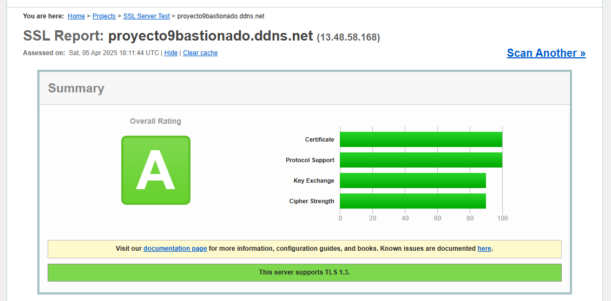
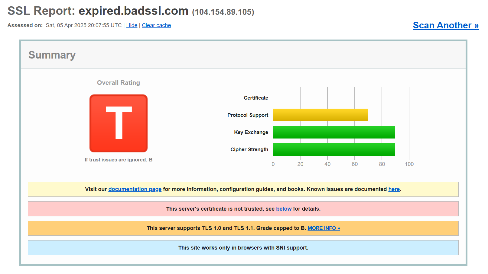
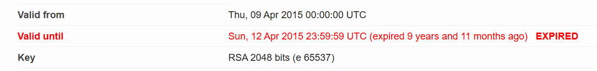
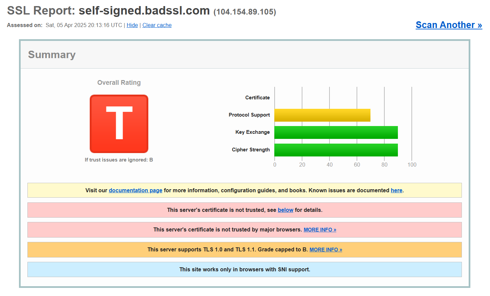
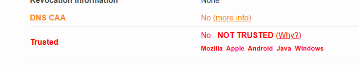
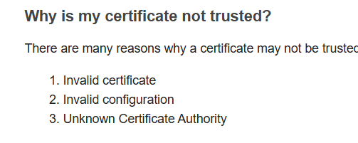
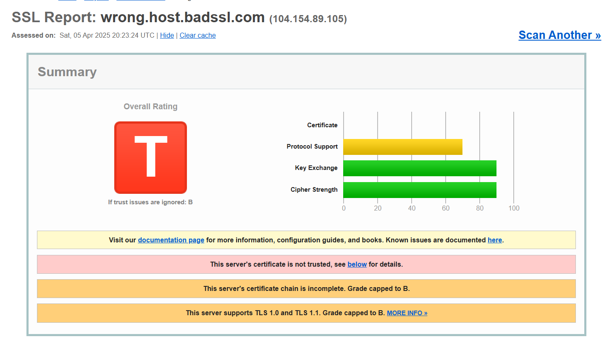
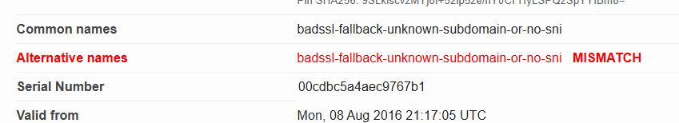

# Parte 3 - ¿Qué hace que un certificado sea válido?

En esta última parte voy a analizar en detalle el certificado que generé anteriormente y explicar por qué se considera válido. Para ello, utilizaré la herramienta online propuesta: [ssllabs/](https://www.ssllabs.com/ssltest/).

Al importarlo directamente (usando su URL pública), obtengo el siguiente resultado:

Una **A**, sobresaliente en validez, pero *¿por qué?* Pues se debe a lo siguiente:

## CA confiable

La Autoriidad de Certificación es **Let's Encrypt**, reconocida y aceptada por todos los navegadores modernos.

## Nombre de dominio coincide

El **Common Name** (CN) coincide con el de la página, o sea, que está ligada al dominio correcto.

## No está caducado

La fecha de validez acaba el 4 de julio de 2025(90 días desde hpy).

## No ha sido revocado

El estado OCSP y CRL dicen que el certificado está en estado "Good (not revoked)".

## Usa algoritmos y clave segura

Utiliza ECDSA con SHA384 y una clave EC de 256 bits, una configuración moderna que lo hace bastante seguro y robusto.

## Soporte para TLS moderno

El certificado soporta las versiones más modernas de **TLS**, **1.2**, **1.3**; y además, no permite las veriones antiguas.

## Cifrado fuerte

Usa cifrado **AES-256-GCM**, **CHACHA20-POLY305** y curvas **ECDH** como **x25519** y **secp256r1**

## No tiene vulnerabilidades conocidas

## Los sistemas más comunes lo entienden como fiable

Marcado como *Trusted* por **Mozilla**, **Apple**, **Android**, **Java**, y **Windows**

Es curioso lo *fácil* (y gratuito) que es obtener un certificado válido para una web. Pero también un poco preocupante: el certificado solo garantiza que la conexión está cifrada, no que el sitio sea seguro o confiable.

## Análisis de sitios con errores de certificados

A continuación, analizo tres páginas que presentan errores de certificado y explico el motivo:

- https://expired.badssl.com/

Motivo: La fecha de validez a caducado.

- https://self-signed.badssl.com/

Motivo: No es fiable por los sistemas actuales, puede ser porque el certificado sea inválido, no esté bien configurado o que la Autoridad Certificadora sea desconocida(o por el propio dueño de la página).

- https://wrong.host.badssl.com/

Motivo: El nombre del dominio no coincide con el que aparece en el certificado.

