# Parte 2 - Configurar certificado para permitir conexión HTTPS

En esta segunda parte del proyecto, debemos instalar y configurar un servidor web para que permita conexión segura HTTPS.
Voy a montar el servicio web con nginx para cambiar un poco y probar configuraciones nuevas.

## Instalación

Bueno, antes de instalar nada, necesito un servidor donde hacer los pasos necesarios. Haré uso del servidor instalado en la [parte 1](./Parte1.md).

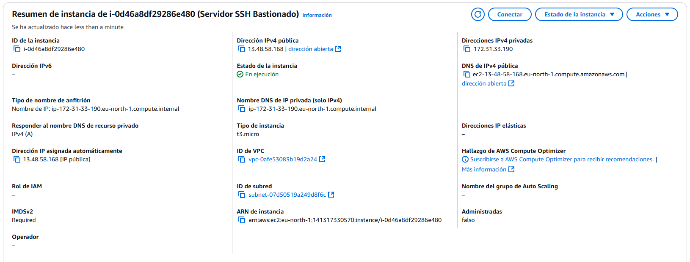

Ahora sí, comencemos con la instalación. 

1. Actualimos los paquetes `yum`:

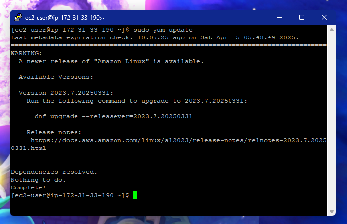

2. Instalamos nginx con:

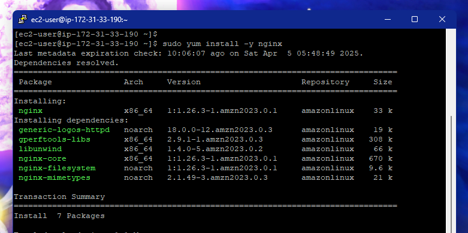

3. E iniciamos el servicio con:

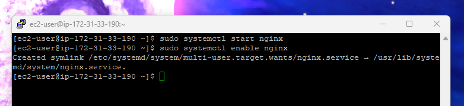

Una vez instaldo, tenemos que abrir los puertos del grupo de seguridad de la instancia, es un poco rollo de explicar pero los grupos de seguridad funcionan como los `firewall`, permiten o deniegan el tráfico entrante y saliente.

Hacemos lo siguiente:

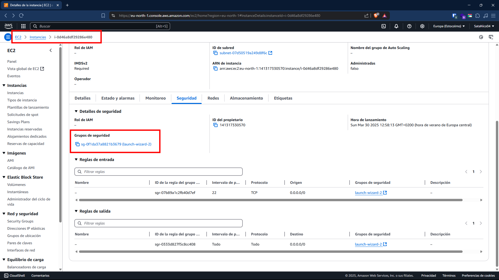

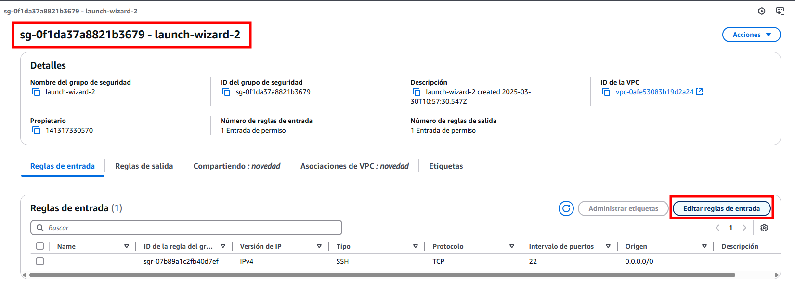

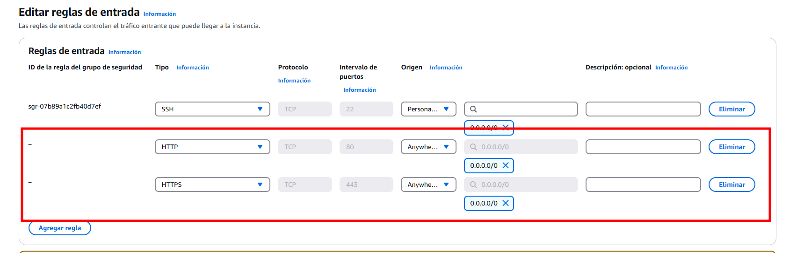

Agregamos estas 2 reglas, y, si ahora intentamos entrar en la dirección IP nos sale esto:

[http://13.48.58.168/](http://13.48.58.168/)

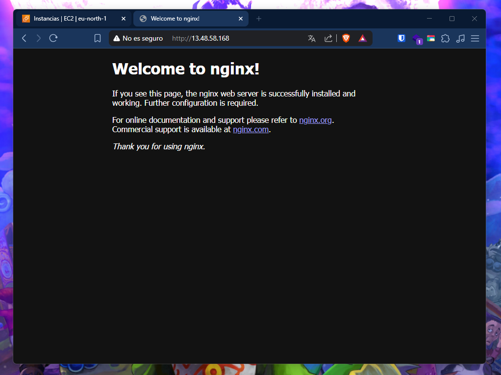

El servidor web y las nuevas reglas están funcionado correctamente.

## Configuración

Ya tenemos el servidor lanzado y escuchando en el puerto 80, ahora toca instalar un certificado autofirmado y configurarlo para permitir la conexión segura.

Para este apartado necesitamos:

1. Un dominio apuntando a la IP pública de tu instancia.
2. Puerto 80 y 443 abiertos en el Security Group.
3. Un certificado autofirmado.

Para el dominio, voy a utilizar la web [No-IP](https://my.noip.com/). Simplemente le damos a crear un nuevo `Hostname`, ponemos el nombre que queramos y la `IP` a la que debe apuntar:

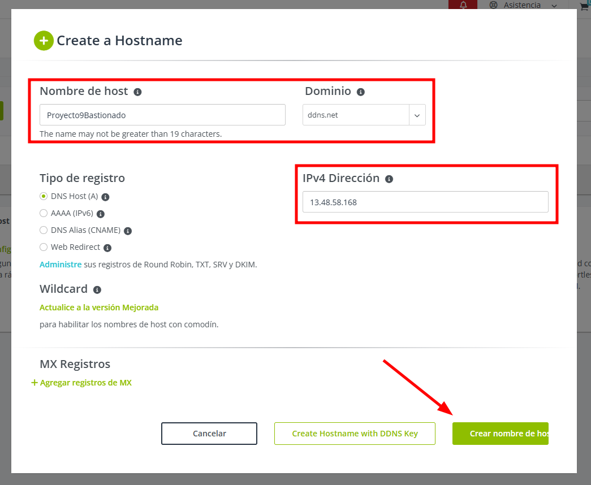

Y comprobamos que funciona y que apunta al mismo sitio.

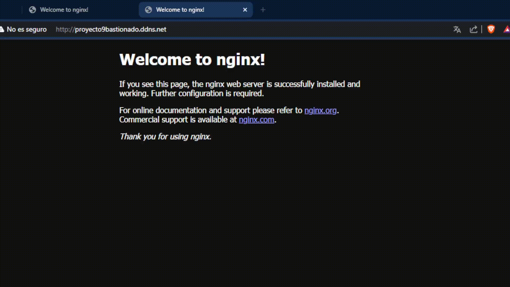

Los puertos 80 y 443 ya están abiertos y no hay que configurarlos más.

Y para el certificado autofirmado, voy a utilizar `certbot`, una herramienta que agiliza mucho la instalación. Seguimos los siguientes pasos:

### 1. Instalamos `certbot` y las dependecias para `nginx`:

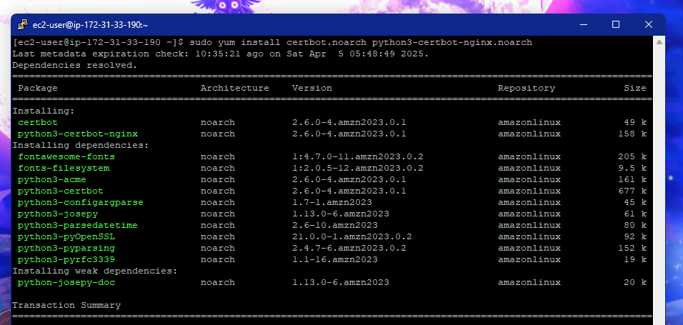

### 2. Ponemos el dominio en la configuración del `nginx`:

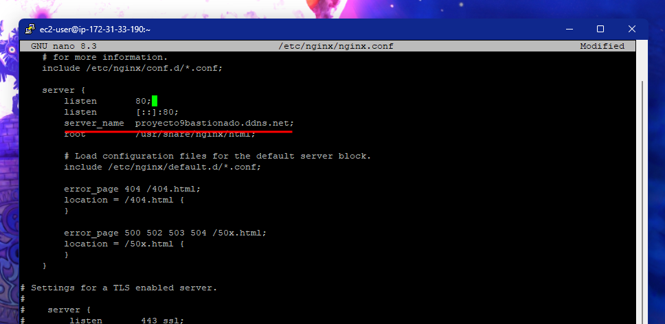

### 3. Ejecutamos la herramienta especificando el servidor que vamos a utilizar:

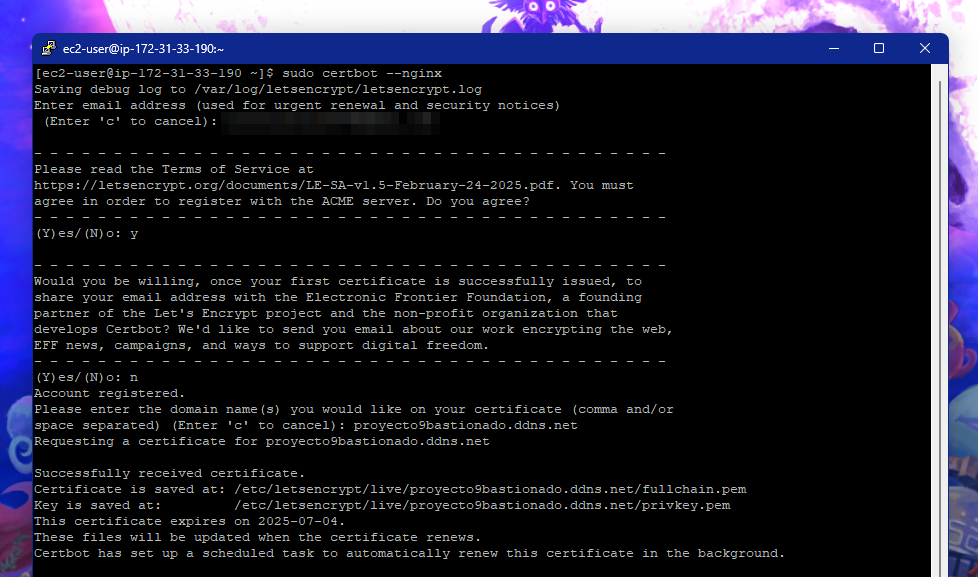

### 4. Por último, comprobamos como la configuración se ha creado de manera automática y la conexión segura está funcionando:

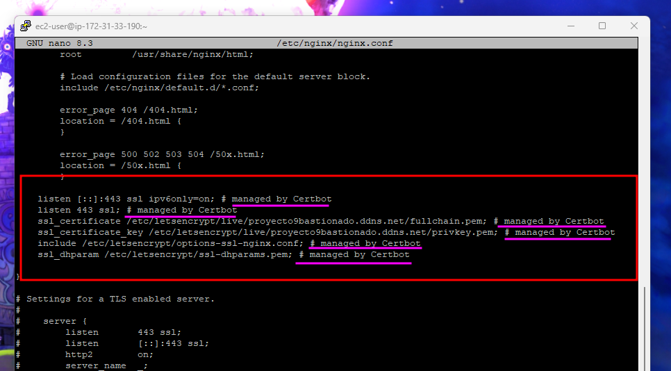

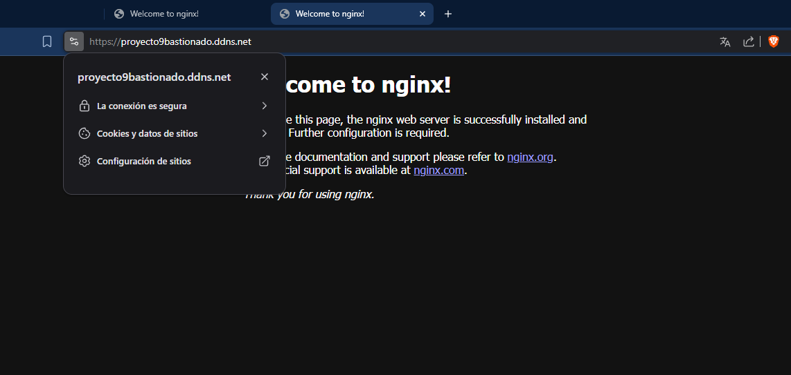

## Comparación

Para la parte de la comprobación, lo voy a hacer con la web de [nintendo.es](https://www.nintendo.com/es-es/):

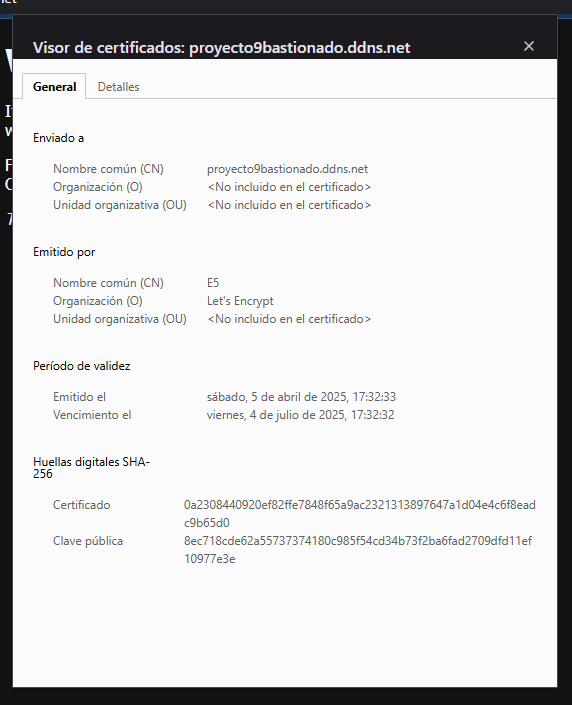

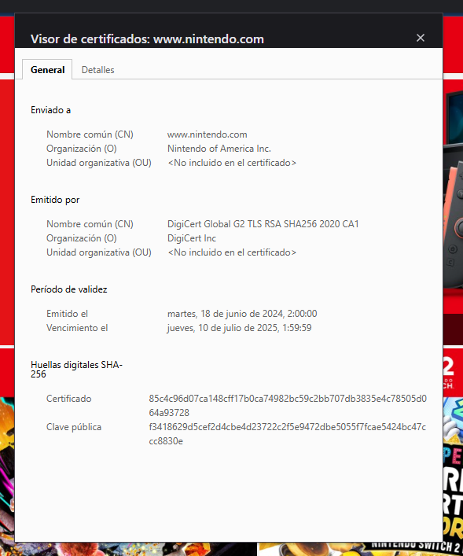

Información a destacar es:

| Certificado | Personal                      | Nintendo                                   |
| Alg. cifra. | Firma X9.62 ECDSA con SHA-384 | PKCS #1 SHA-256 con cifrado RSA            |
| CN          | E5                            | DigiCert Global G2 TLS RSA SHA256 2020 CA1 |
| O           | Let's Encrypt                 | DigiCert Inc                               |
| C           | US                            | US                                         |
| Validez     | 90 días                       | 386 días                                   |