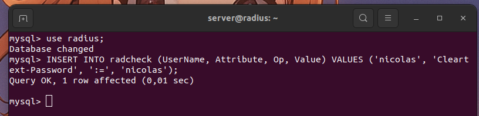

# Guía de instalación

## Introducción

Un servidor Radius sirve para identificar usuarios en una red Wifi sin la necesidad de usar la contraseña de la red. En lugar de esta, se usaran usuarios y contraseñas.

Esta guía de instalación está basada en la guía que proporcionó [DavidLMS](https://davidlms.github.io/Practicas/SERRED/RadiusUbuntu18.html) que, a su vez, está apoyada en la guía de [jmramirez](https://www.jmramirez.pro/tutorial/wifi-mas-seguro-con-freeradius/). Ví algunos puntos que no se trataban de la manera correcta y quiero mejorarlos en esta guía de instalación. Como los anteriores, haré la instalación y configuración en un servidor Ubuntu 18.04.

## Instalación

Como dije antes, partimos de un servidor Ubuntu 18.04 completamente actualizado y con 2 adaptadores de RED. Esto último no es realmente necesario, pero al hacerlo con máquinas virtuales, necesito un adaptador para tener internet y otro para acceder a ella por SSH.


Por si no lo habéis hecho ya, tenemos que actualizar los paquetes del sistema:

```bash
sudo apt update
```

O el respectivo a vuestro sistema claro. Ahora vamos a instalar las herramientas que vamos a utilizar durante la explicación:

```bash
sudo apt install mysql-server freeradius freeradius-mysql freeradius-utils -y
```

Como estamos en un ambiente de pruebas, vamos a usar contraseñas inseguras y fáciles de recordar, pero en ambientes profesionales, por favor, no pongais `1234` de contraseña, y ejecutad la instalación de seguridad de mysql:

```bash
sudo mysql_secure_installation
```

Aclarado esto y estando listo para configurarlo todo, vamos a hacer una pequeña prueba de funionamiento. Ahora mismo, el servidor Radius está operativo:


(En el caso que no lo esté, lo iniciamos)

```bash
sudo service freeradius enable
sudo service freeradius start
```

Y funcionando con un archivo que debemos editar manualmente, esto lo cambiaremos luego pero ahora me sirve para explicar el funcionamiento interno de este. El archivo en cuestión se encuentra en la siguiente ruta:

```
/etc/freeradius/3.0/users
```

Si accedemos a él, encontraremos lo siguiente:


Esta es la configuración de un usuario por defecto en el servidor Radius. Podemos editarlo a nuestro gusto y probar que todo funcione correctamente:


> Como vamos a usar muchos usuarios y contraseñas, voy a poner misma contraseña que nombre de usuario, así no nos liamos.

Hemos creado este usuario con la siguiente contraseña, vamos a probar que funcionan nuestros cambios:


Funciona correctamente, vamos a desglosar lo que vemos en la imágen.

- radtest: Es la funcionalidad del radius para hacer "tests".
- nico nico: usuario y contraseña, las que pusimos antes.
- localhost 1812: dirección IP del servidor y el puerto donde está escuchando el servidor radius. `localhost` se puedo cambiar por _127.0.0.1_ o la ip dentro de la red.
- testing123: se trata de la clave secreta compartida entre el cliente y el servidor, digamos que es una contraseña para que el servidor pueda verificar que el que está haciendo los tests, sea la persona que debe.

Esta última se puede cambiar en el siguiente archivo:

```
/etc/freeradius/3.0/clients.conf
```


> Hay muuuuuuuchos comentarios, pero las líneas de configuración están ahí.


Hemos cambiado la contraseña en el archivo y funciona perfectamente, no tenemos que cambiar nada más.

De esta forma, podemos añadir usuarios de manera manual, pero vamos a complicarlo un poco más para facilitarlo en el futuro, ¿cómo lo hacemos? conectando el Radius con mysql.

Para ello debemos crear 2 cosas:

- Una base de datos con el nombre `radius`
- Un usuario `radius` con permisos de administrador en esa base de datos.

Primero, tenemos que acceder al mysql como `root` y crear la nueva base de datos:


Y ahora, creamos al usuario nuevo y le damos los permisos necesarios:

create user 'radius'@'localhost' identified by 'radius';
grant all privileges on radius.* to 'radius'@'localhost';
flush privileges;


Si ahora iniciamos sesión con eĺ, solo deberíamos ver 2 bases de datos, a diferencia de las 5 que ve el root:


Ahora debemos ejecutar el script de base de datos que tiene el propio servidor radius para preparar nuestro entorno de trabajo, para ello, debemos iniciar sesión como root, para no tener ningún problema, y ejecutar el siguiente comando:


De esta forma, ya tendríamos las tablas necesarias creadas en la base de datos:


Ahora tenemos que activar el módulo de sql del servidor, para ello, tenemos que crear el siguiente enlace simbólico:


Con este simple comando hemos habilitado, en parte, el uso de sql en el servidor, ahora tenemos que editar los siguientes archivos:

```
/etc/freeradius/3.0/sites-available/default
/etc/freeradius/3.0/sites-enabled/inner-tunnel
```

Aquí tenemos que descomentar las línea donde ponga `sql` o `-sql` y comentar las líneas donde ponga `files` en los parámetros `authorize{}` y `accounting{}`. No puedo añadir una imagen ya que el archivo es demasiado largo.

Por último, tenemos que editar el módulo que enlazamos anteriormente, y configurarlo para que pille nuestra base de datos:

```
/etc/freeradius/3.0/mods-available/sql
```


Y arriba del todo, modificamos este parámetro:


Genial, ya estaría todo configurado y no queda nada para empezar a probar, primero, para probar que lo hemos escrito todo bien, vamos a ejecutar el siguiente comprobador:

```bash
sudo freeradius -XC
```

Si diera algún error, lo corregimos antes de avanzar.

Ahora debemos crear un usuario en la base de datos, lo hacemos de la siguiente forma:

INSERT INTO radcheck (UserName, Attribute, Op, Value) VALUES ('nicolas', 'Cleartext-Password', ':=', 'nicolas');



Si nos fijamos, son los mismos parámetros que en el archivo `users` que configuramos al principio:


Si volvemos a ejecutar el test, nos dará el siguiente resultado:


# OJO la parte del punto de acceso se hace en clase.

Aceptado. Ya tendríamos instalado Radius en nuestro sistema, ahora vamos a instalar el soporte web para poder configurarlo más cómodamente.

Para ello seguimos la siguiente [guía](https://computingforgeeks.com/how-to-install-freeradius-and-daloradius-on-ubuntu/):

```bash
sudo apt install apache2 php libapache2-mod-php php-gd php-common php-mail php-mail-mime php-mysql php-pear php-db php-mbstring php-xml php-curl -y
```

En caso de no tener certificado, vamos a desactivarlo desde los archivos de configuración:

```
/etc/freeradius/3.0/mods-enabled/sql
```


> En mi caso, viene comentado por defecto.

Y cambiamos el grupo de los siguientes archivos con este comando:


