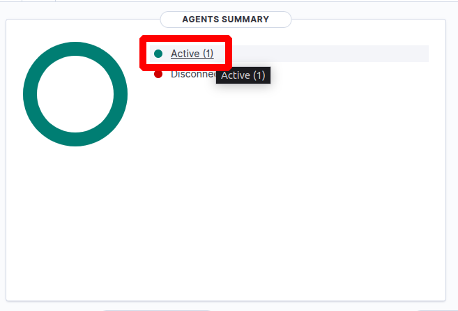

# Guía de Instalación de Wazuh

> Empezamos con un update y la instalación de curl.

`sudo apt update && sudo apt install curl`

> Nos descargamos el script de instalación del wazuh.

`curl -sO https://packages.wazuh.com/4.11/wazuh-install.sh`

> Ejecutamos el script de manera automática e ignorando los requisitos mínimos.

`sudo bash ./wazuh-install.sh -a -i`

> Esperamos a que se termine de instalar el script(10 minutos).

> Guardamos la contraseña.

> Entramos a https://{ip_server}:443 

> Añadimos un nuevo agente.

> Especificamos los datos necesarios y ejecutamos los 2 bloques de comanodos en el cliente.

> Reiniciamos el wazuh en el servidor.

`sudo systemctl restart wazuh-manager.service`

> Veremos un cliente activo.

> Le damos clic.

> Y pulsamos en Configuration Assessment.

> Y aquí empezamos a bastionar los servicios.