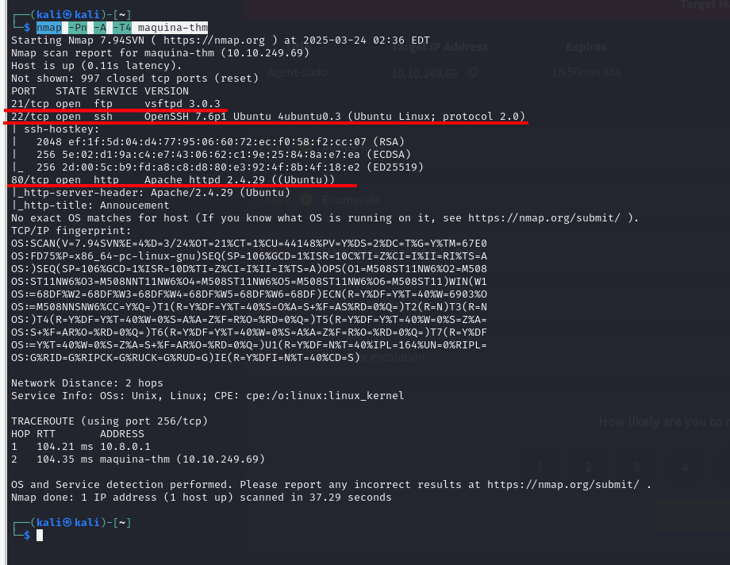

# Agent Sudo

En esta ocasión, voy a implementar una mecánica que debería haber hecho desde el principio, añadir una línea en el `/etc/hosts` con la IP y un nombre, así, si la máquina peta, o la apago y cambio la IP, no tengo que rehacer todo el write up.

# Análisis

Como siempre, empezamos haciendo un escaneo de los puertos de la máquina, vamos a hacer 2, uno simple que esperaré a que termine, y uno más complejo que dejaré de fondo:

Los *único* interesante es un servidor http en el puerto 80, el ssh y el ftp también lo son, pero para más adelante en el reto.

