# Anthem

Esta máquina de Try Hack Me, nos guía en todo momento, así que vamos a ir haciendola poco a poco.

# Análisis

> Por lo que se ve en el THM, la máquina es bastante sencilla, me limitaré a seguir las preguntas pero desarrollando.

Empezamos el análisis con un escaneo de puertos simple:

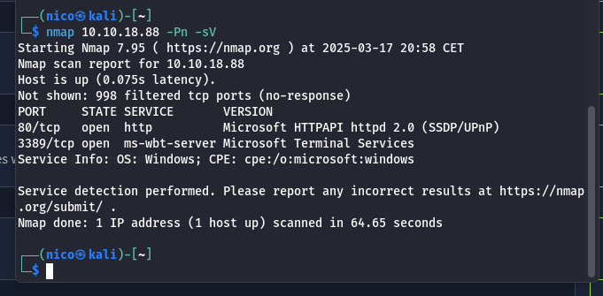

Vemos un servicio web en el puerto 80, y un escritorio remoto en el 3389.

Si entramos en el servicio web, apreciamos una especie de bolg personal:

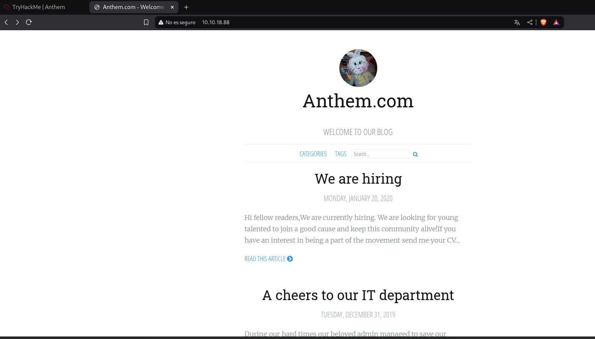

Metiendome en enlaces del propio bolg, he sacado esta flag:

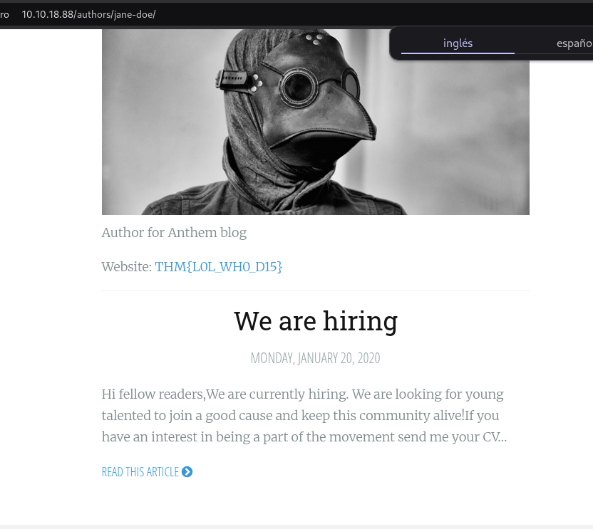
> THM{L0L_WH0_D15}

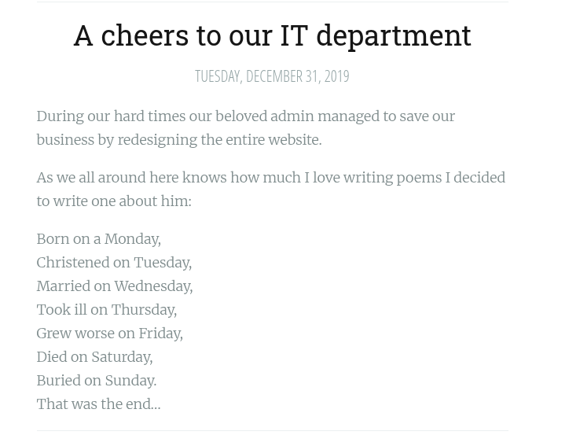
> Un poema(?)
> Parece que es muy conocido en CTFs

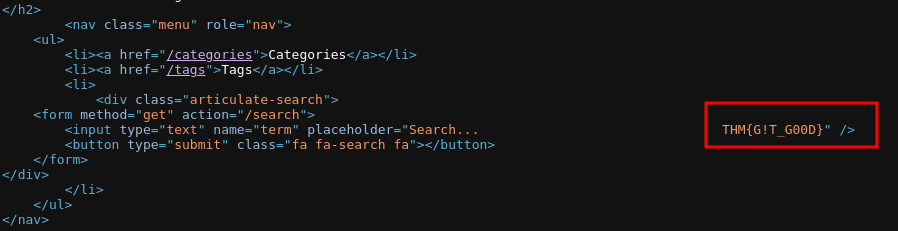
> THM{G!T_G00D}

Y poco más, voy a hacer un fuzzeo a ver que sale:

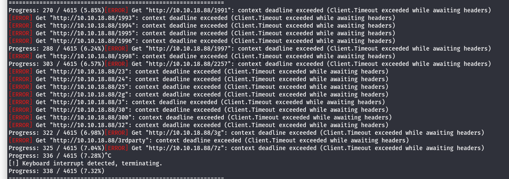
> Me he cargado gobuster(?)

Mis herramientas de fuzzeo parece que no funcionan, pruebo con los direcorios típicos y sale esto:

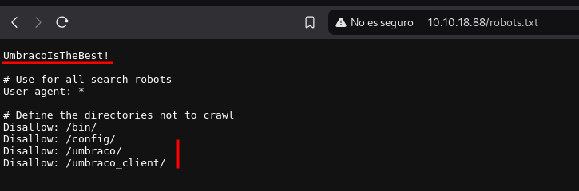
> Lo que parece una contraseña
> El CMS *umbraco*

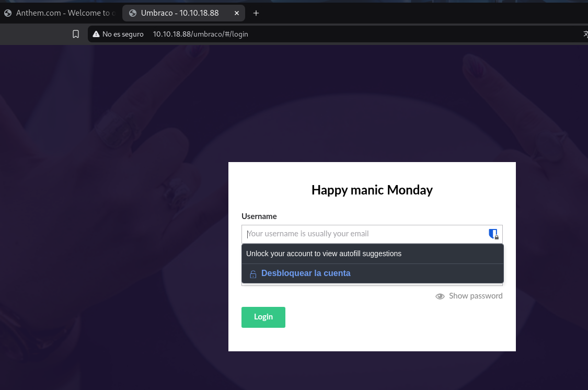

Esto nos redirige a un login, tenemos la contraseña, falta el usuario:

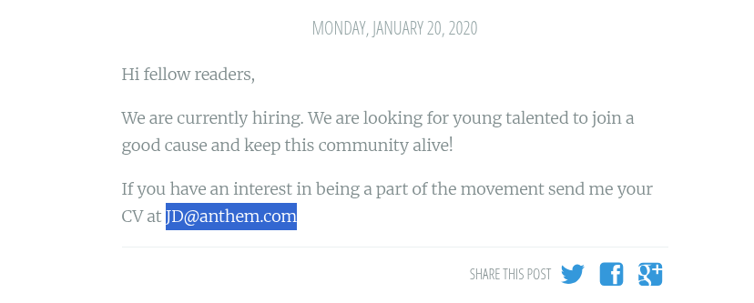

No es ni este, ni otro que he deducido usando la misma lógica: jh@anthem.com

La única pista que tengo es el poema de antes, chatGPT dice que se trata de un poema de *Solomon Grundy*.(sg@anthem.com)(?)

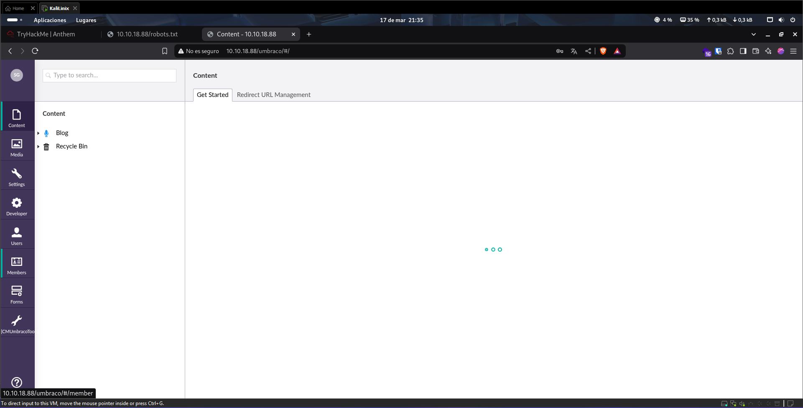
> Un poco rebuscado la verdad...

---

Segunda sección del try hack me, donde tendremos que encontrar las flags(entiendo que las que se encuentran en la web)

Ya encontre 2 antes, las pongo aquí:

> flag 3
> THM{L0L_WH0_D15}

> flag 2
> THM{G!T_G00D}

Para el resto, parece que vamos a tener que seguir buscando.

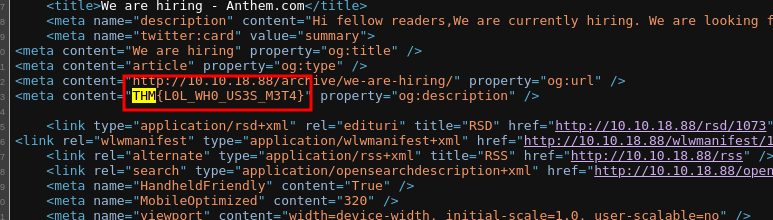
> flag 1
> THM{L0L_WH0_US3S_M3T4}

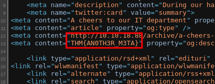
> flag 4
> THM{AN0TH3R_M3TA}

Literalmente, todas las flags se pueden encontrar desde un principio, solo hay que inspeccionar el código fuente de la página.

---

Tercera y última sección, aquí tendremos que entrar en la máquina y escalar privilegios.

En el análisis de puertos, vimos que el servidor tiene un escritorio remoto, vamos a intentar iniciar sesión con las credenciales que tenemos:

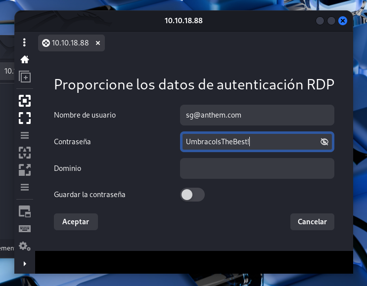
> Claro, así da error, un usuario de windows no puede tener un dominio de correos, poner solo sg en el campo usuario.

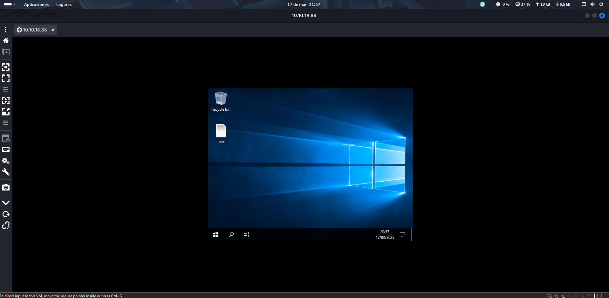

Ya hemos iniciado sesión con un usuario normal en la máquina, y en el escritorio tenemos la primera flag:

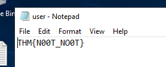

THM nos da una pista para encontrar la contraseña del administrado: *It is hidden*, pruebo a mostrar los archivos ocultos desde el explorador:

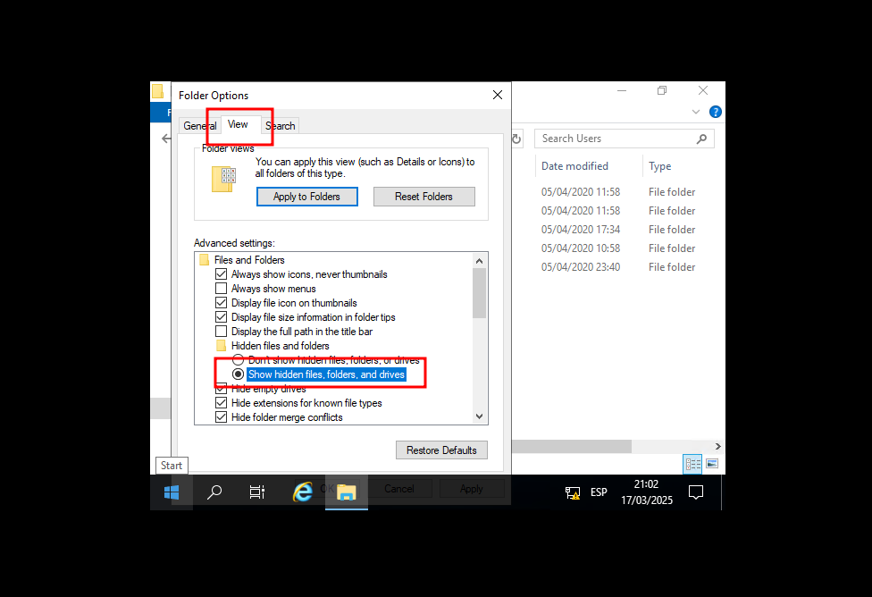
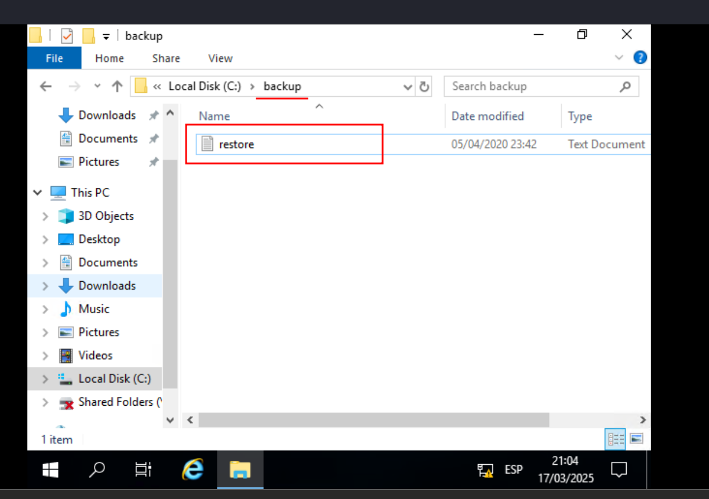

Encontramos un archivo en una carpeta oculta, pero no podemos abrirlo por temas de permisos.

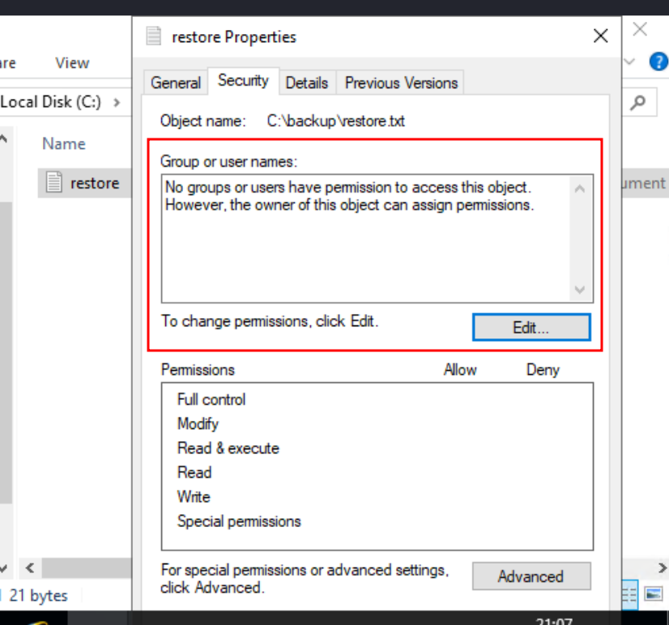

Nadie tiene permisos para ver/editar el archivo(OK), lo editamos y añadimos a SG:

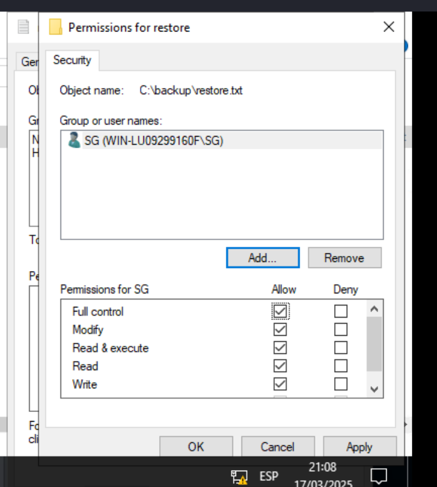
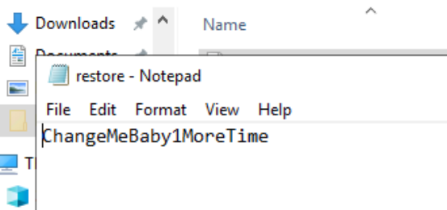
> Contraseña del root

Ahora podriamos cerrar sesión SG e iniciar con Administrator:

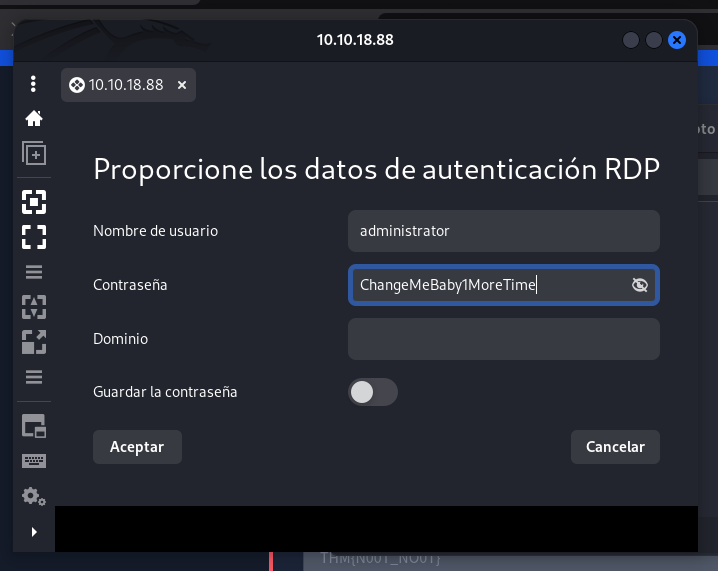
> ChangeMeBaby1MoreTime

Y ya estaría, una forma extraña de escalar privilegios.

