# Brooklym Nine Nine

_This room is aimed for beginner level hackers but anyone can try to hack this box. There are two main intended ways to root the box._

## Análisis

Esta máquina nos da rienda suelta para hacer lo que queramos, solo nos pide iniciar sesión como usuario y escalar privilegios.

Empezamos como siempre, haciendo un escaneo de los puertos abiertos de la máquina:

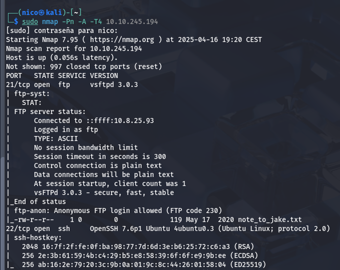
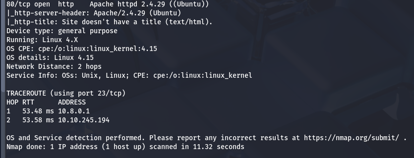

Tenemos 3 puertos abiertos, veamos el 80:

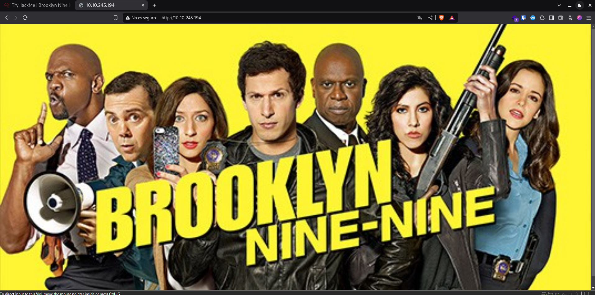

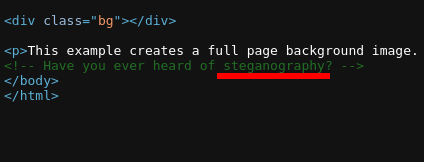

El código fuente nos dice que usemos _stenografía_

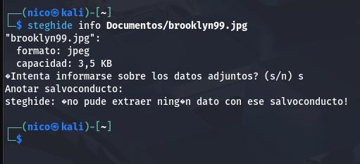

Efectivamente, hay algo ahí, pero no tenemos el salvoconducto.

Podemos usar la herramienta `stegcracker`, que es como `john` pero para stenografía:

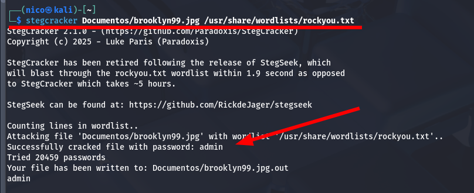

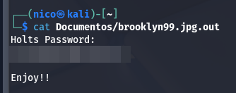

Encontramos la contraseña de holt. Iniciamos sesión con estas credenciales por ssh:

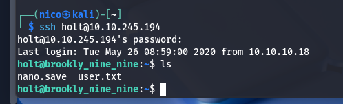

Ya estamos dentro del sistema con un usuario normal, hora de escalar privilegios.

Vamos a ver los permisos que tiene _holt_:

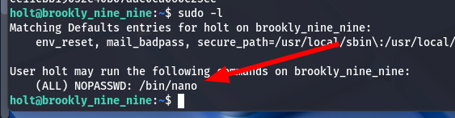

Si podemos usar `nano` con altos privilegios, podríamos cambiar los permisos del archivo sudoers:

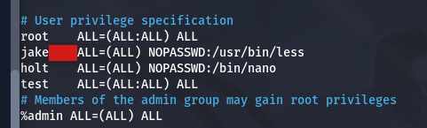
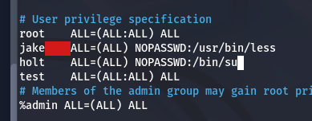

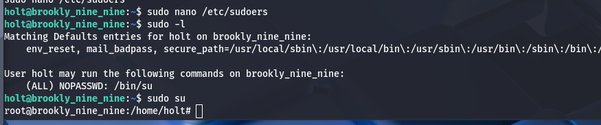

Y ya, jeje.