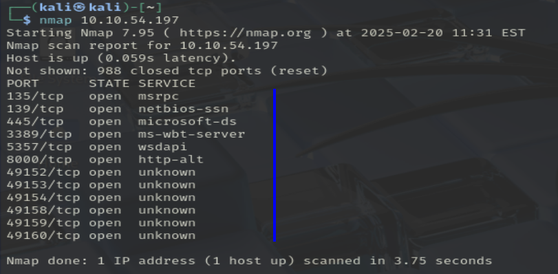
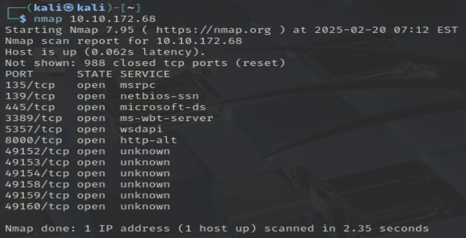
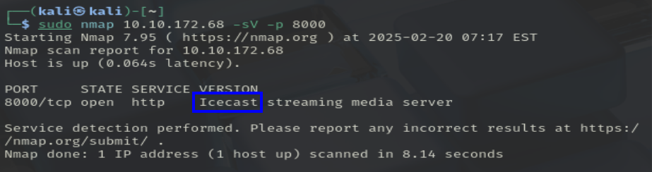

# Ice

One of the more interesting ports that is open is Microsoft Remote Desktop (MSRDP). What port is this open on?

> puerto 3389

What service did nmap identify as running on port 8000? (First word of this service)

> icecast

What does Nmap identify as the hostname of the machine? (All caps for the answer)

What is the Impact Score for this vulnerability?
