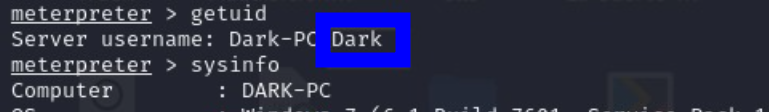

# Ice

Está máquina se parece mucho a la anterior(quizá porque lo creó el mismo usuario...), nos lleva muy de la mano y nos deja claro lo que tenemos que hacer. Por eso mismo, lo haré igual que la documentación anterior, responderé a las preguntas con una imágen y una oración.

# Proceso

Empecemos el análisis con un escaneo simple de los puertos:

> Encontramos 6 puertos con servicios conocidos.

 

La página nos pregunta, ¿cuál es el puerto asociado al servicio Microsoft Remote Desktop (MSRDP)?

> En realidad, en la imágen no se ve el servicio MSRDP. Si -sV no me da la versión, no se como sacarlo.

 

Veamos ahora el servicio activo en el puerto 8000:

> icecast(un servidor de transmisión de video y audio)

 

¿Cuál es el hostname de la máquina objetivo?

> Podemos ver el hostname con -A -T4

 

Sabiendo el servicio *instalado* en el puerto 8000, podemos buscar información del CVE asociado y de su peligrosidad.

> Si le preguntamos a chatGPT, nos dice que está asociado al cve CVE-2004-1561 y la peligrosidad es de 6.4

 

Si buscamo el servicio en metasploit, sacamos el siguiente exploit

> exploit/windows/http/icecast_header

 

Usando ese exploit, y mostrando las opciones, podemos ver cuales son las requeridas por el exploit

> Pasa lo mismo que en la máquina anterior, LHOST usa la ip del vmware

 

Cambiamos el RHOST y el LHOST por los necesarios, e iniciamos el exploit

> set RHOST {ip_target} / set LHOST tun0

 

Nos fijamos que el nombre de la shell es meterpreter, por lo que podremos usar comandos de linux

 

Vamos a listar los procesos activos y ver que usuario está usando icecast

> El proceso de la imágen no es el que pide el enunciado

 

Ver la buil del sistema operativo

 

Y la arquitectura de este

 

El creador de la room nos recomienda usar el siguiente comando

> run post/multi/recon/local_exploit_suggester

 

El comando anterior, nos proporcionará varios exploits que podemos usar para escalar privilegios. Para esta room usaremos el de la imágen:

> exploit/windows/local/bypassuac_eventvwr

 

Ahora que hemos encontrado el exploit para escalar privilegios, enviemos la sesión al background

 

Usamos el exploit anterior

 

Configuramos las opciones necesarias

> La siguiente respuesta es: "LHOST"

 

Y corremos el exploit:

 

En la nueva shell, podemos usar `getprivs` para ver los privilegios que tenemos

 

Y listar los procesos con `ps`

 

Vamos a intentar sacar las contraseñas de los usuarios. Cambiamos nuestro proceso a otro del usuario NT AUTHORITY\SYSTEM

 

 

 

Vamos a utilizar una nueva herramienta `kiwi`, con la que sacaremos los hashes de todos los usuarios de la máquina:

 

Con este comando, podemos sacar los hashes de los usuarios:

 

> No me funciona creds_all, lo hago con hashdump

 

Crackeamos las contraseñas con john the reaper

 

Por último, vamos a ver algunos comandos de kiwi bastante interesantes:

Ver la pantalla del usuario:

 

Grabar el micrófono del sistema:

 

Modificar la MAC de los archivos:

 

Auntenticarnos donde queramos

## USER? No

No sé si al tener root, podemos iniciar sesión con un usuario.

## ROOT? Si
