# Ice

One of the more interesting ports that is open is Microsoft Remote Desktop (MSRDP). What port is this open on?
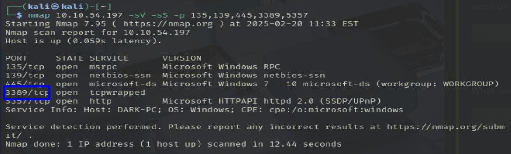
> puerto 3389

What service did nmap identify as running on port 8000? (First word of this service)
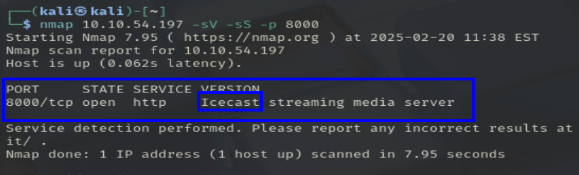
> icecast

What does Nmap identify as the hostname of the machine? (All caps for the answer)
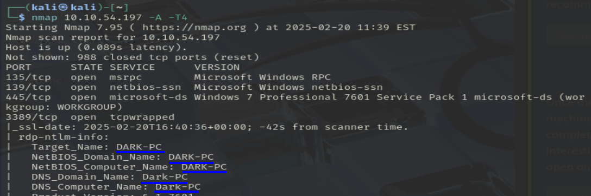

What is the Impact Score for this vulnerability? Use [site](https://www.cvedetails.com) for this question and the next.
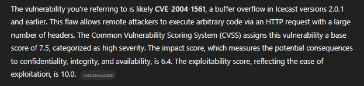
> 6.4
> CVE-2004-1561

What is the full path (starting with exploit) for the exploitation module?
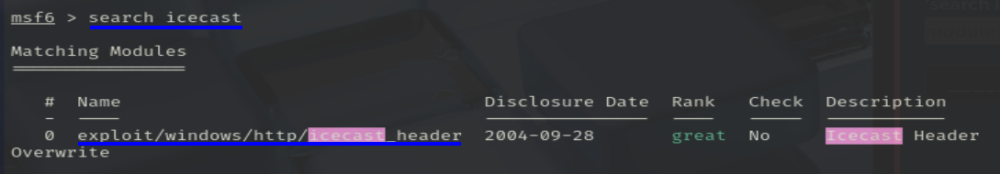

Following selecting our module, we now have to check what options we have to set. Run the command `show options`. What is the only required setting which currently is blank?
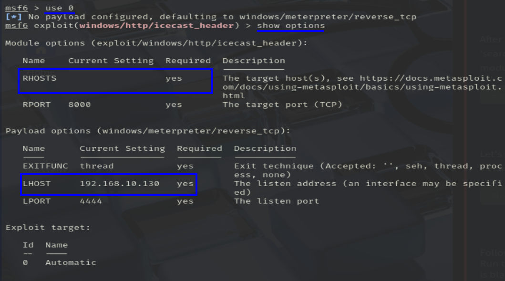

First let's check that the LHOST option is set to our tun0 IP 
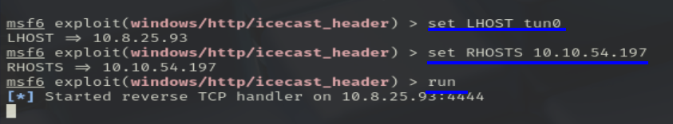
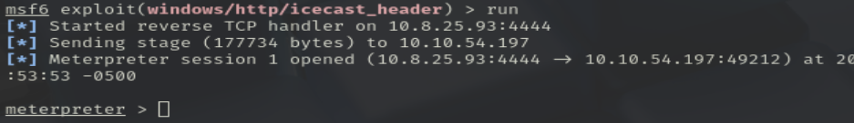

Woohoo! We've gained a foothold into our victim machine! What's the name of the shell we have now?
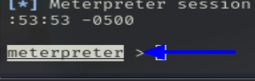

What user was running that Icecast process? The commands used in this question and the next few are taken directly from the 'Metasploit' module.
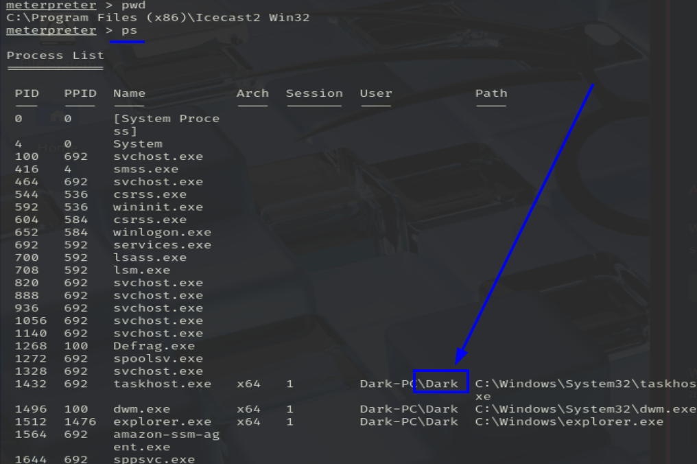

What build of Windows is the system?
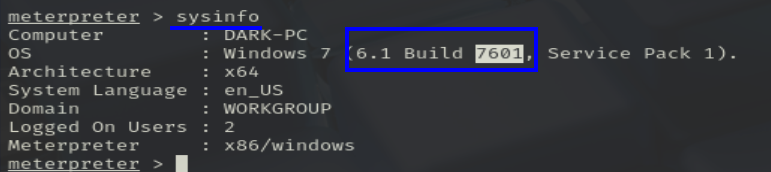

Now that we know some of the finer details of the system we are working with, let's start escalating our privileges. First, what is the architecture of the process we're running?
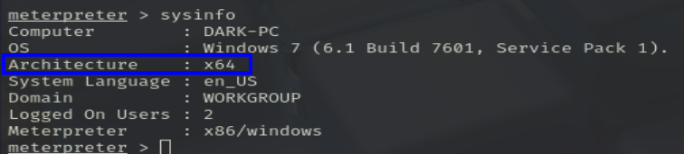

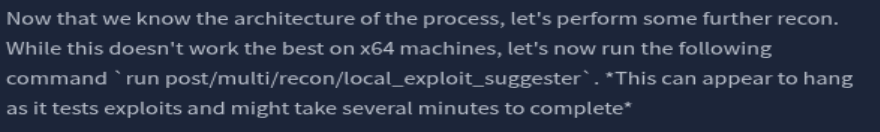
> run post/multi/recon/local_exploit_suggester

Running the local exploit suggester will return quite a few results for potential escalation exploits. What is the full path (starting with exploit/) for the first returned exploit?
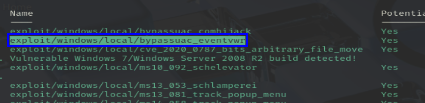
> exploit/windows/local/bypassuac_eventvwr

Now that we have an exploit in mind for elevating our privileges, let's background our current session using the command `background` or `CTRL + z`. Take note of what session number we have, this will likely be 1 in this case. We can list all of our active sessions using the command `sessions` when outside of the meterpreter shell.
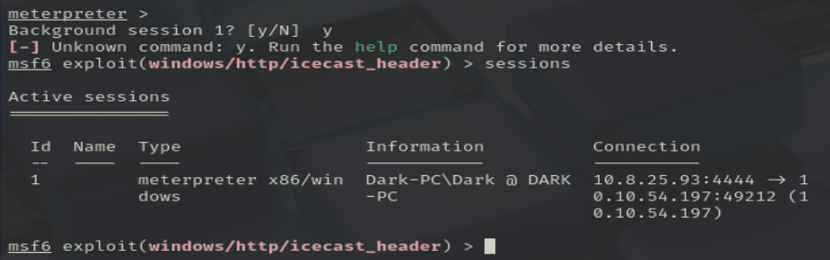

Go ahead and select our previously found local exploit for use using the command `use FULL_PATH_FOR_EXPLOIT`
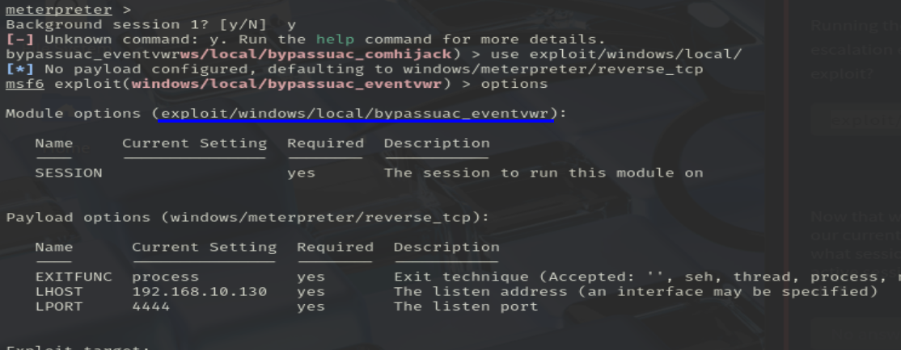

Local exploits require a session to be selected (something we can verify with the command `show options`), set this now using the command `set session SESSION_NUMBER`
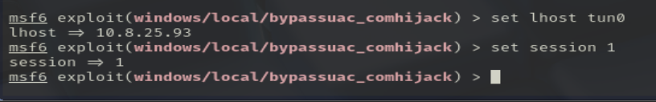

La siguiente respuesta es: "LHOST"

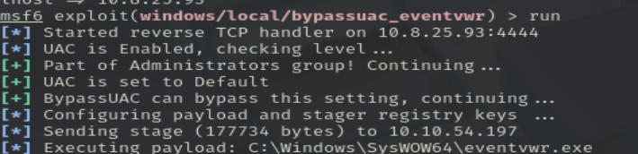

We can now verify that we have expanded permissions using the command `getprivs`. What permission listed allows us to take ownership of files?
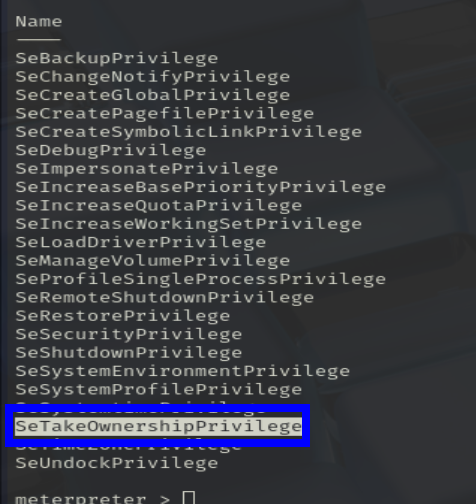

First, let's list the processes using the command `ps`. Note, we can see processes being run by NT AUTHORITY\SYSTEM as we have escalated permissions (even though our process doesn't). 
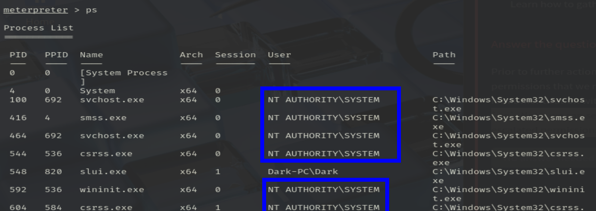

The printer spool service happens to meet our needs perfectly for this and it'll restart if we crash it! What's the name of the printer service?
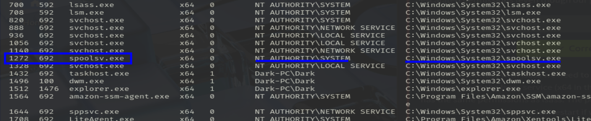

Migrate to this process now with the command `migrate -N PROCESS_NAME`
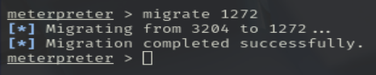

Let's check what user we are now with the command `getuid`. What user is listed?
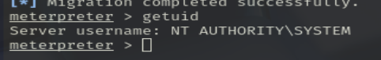

Now that we've made our way to full administrator permissions we'll set our sights on looting. Mimikatz is a rather infamous password dumping tool that is incredibly useful. Load it now using the command `load kiwi` (Kiwi is the updated version of Mimikatz)
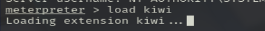

Which command allows up to retrieve all credentials?
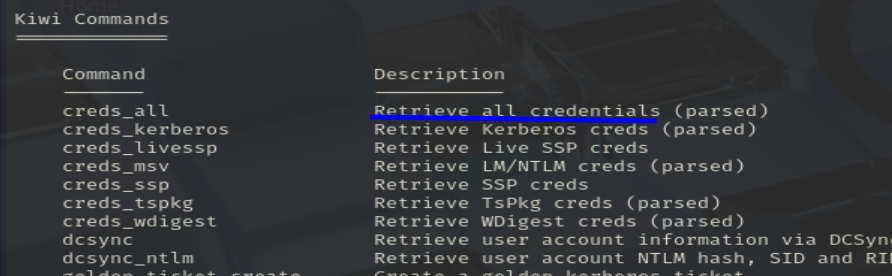

En teoría, debemos usar creds_all para sacar la contraseña de Dark:
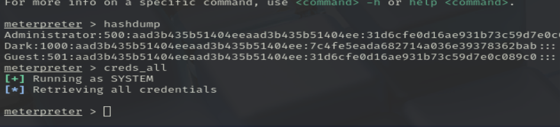
> No me funciona

Lo hago con john
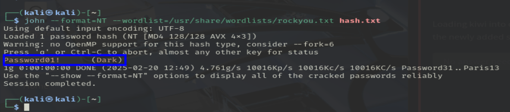

What command allows us to dump all of the password hashes stored on the system?
> hashdump

While more useful when interacting with a machine being used, what command allows us to watch the remote user's desktop in real time?
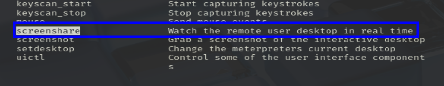

How about if we wanted to record from a microphone attached to the system?
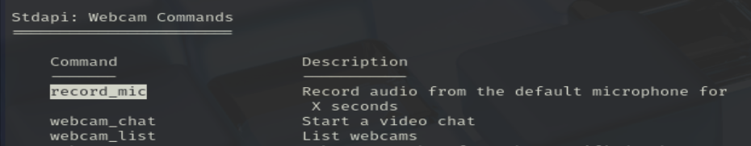

To complicate forensics efforts we can modify timestamps of files on the system. What command allows us to do this? 
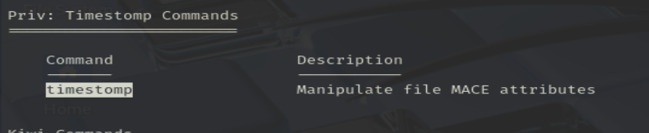

Mimikatz allows us to create what's called a `golden ticket`, allowing us to authenticate anywhere with ease. What command allows us to do this?
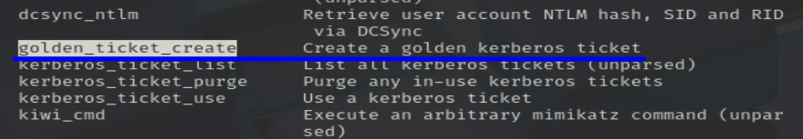

run post/windows/manage/enable_rdp
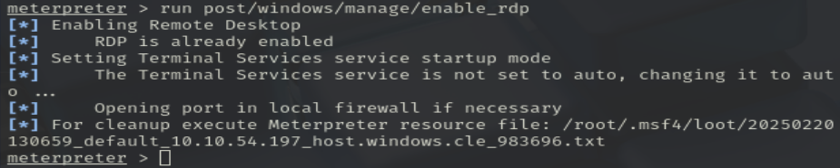

