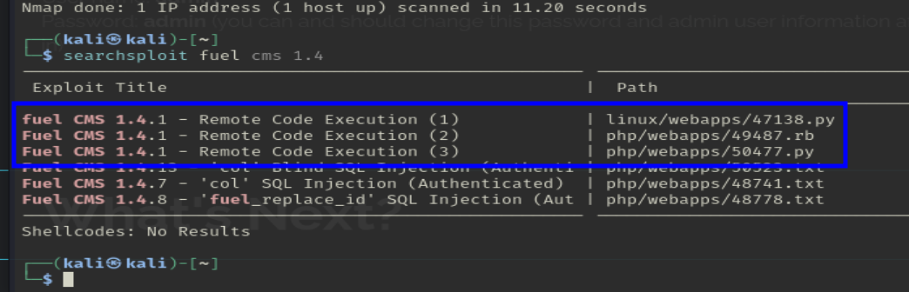
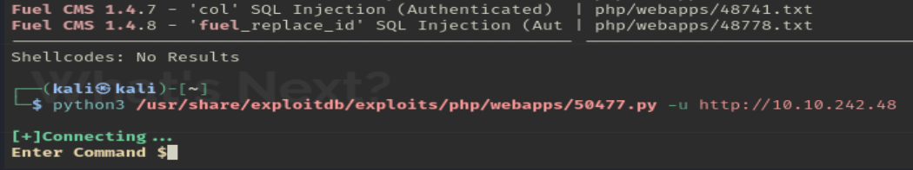
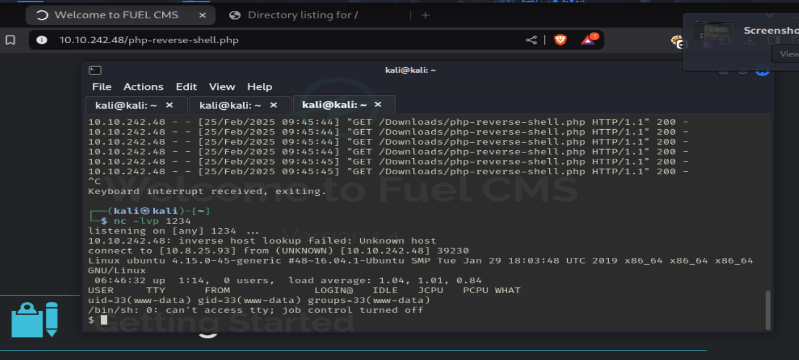
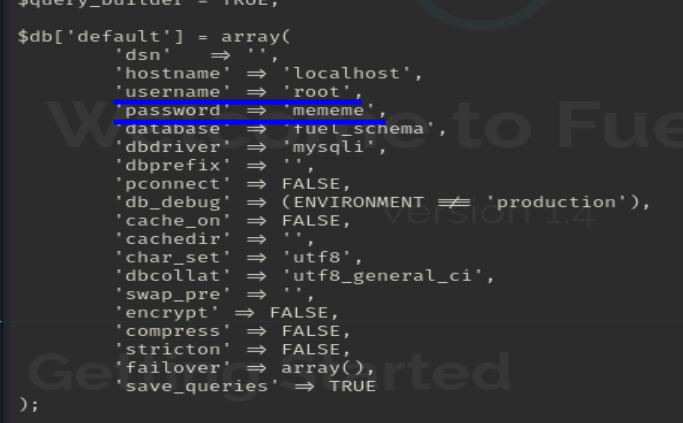

# Ignite

Esta máquina la hicimos en clase, por lo que no está muy bien explicada, haré el esfuerzo...

# Análisis

Empezamos el análisis con un escaneo de puertos:


 
Encontramos el puerto 80 abierto con servicio Apache httpd 2.4.18 en él.

Si análizamos la web, encontramos esto en la portada:


> Fuel CMS 1.4

Con esta información, podemos buscar algún exploit para este tipo de CMS:


> Encontramos varios exploits disponibles para hacer una misma cosa, los probamos todos.

Ejcutamos el siguiente exploit:


> Si pone `Enter Command $` el exploit habrá funcionado.

Ahora mismo estamos dentro del sistema con el usuario `www-data`, usuario por defecto de los sistemas apache.

Encontramos la primera flag:


Ahora tendremos que escalar privilegios, pero primero, vamos a mejorar la shell instalando una reverse shell en el servidor.
Lo primero que haremos es descargarnos la siguiente [reverse shell](https://github.com/pentestmonkey/php-reverse-shell/blob/master/php-reverse-shell.php
)

Modificamos los siguientes parámetros:


> Ponemos nuestra IP del tunel y un puerto que queramos poner en escucha en nuestra máquina.

Ahora tenemos que abrir un servidor en nuestra máquina con la que podamos entrar desde el servidor:


Desde la terminal que conseguimos antes, hacemos un `wget` al archivo:


Perfecto, ahora que lo tenemos instaldo en el servidor, podemos cerrar el python, y ahora tenemos que poner un puerto en escucha con `nc -lvp 1234`
> 1234 es el puerto que pusimos anteriormente.

Lo dejamos ahí, y en el navegador, tenemos que acceder a ese archivo:
`http://{ip_host}/php-reverse-shell.php`
> Recomiendo cambiar el nombre del archivo antes de subirlo...


> Ya estaríamos dentro de la máquina, pero parece un /bin/sh raro.
> Es una shell simulada con python

Mejoramos la shell con el siguiente comando:

```bash
python3 -c 'import pty;pty.spawn("/bin/bash")'
```

Genial, de esta forma tenemos una shell mucho más cómoda y fácil de usar que la anterior.
Recordemos que en el servidor hay un CMS instalado, por lo que probablemente haya una base de datos en el sistema. Hacemos una busqueda de algún archivo que nos pueda ayudar:

```bash
find /var -type f -iname "*database*" 2>/dev/null
```
> Esto buscará todos los archivos que contengan la palabra *database* en la carpeta */var*.



> Encontramos que el usuario `root` tiene la contraseña `mememe`.

Iniciamos sesión con `su root`, ponemos la contraseña `mememe` y ya estaría:


Encontramos también la root flag:


# Usuario Si
# Root Si