# Kenobi

Esta room te guía bastante por todo el desarrollo de esta.

# Proceso

Empecemos con un escaneo de todos los puertos y uno simple se servicios:
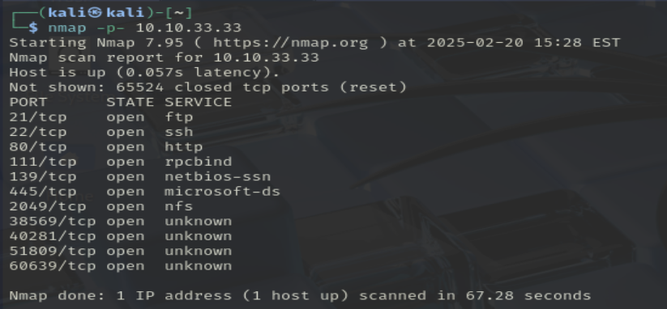
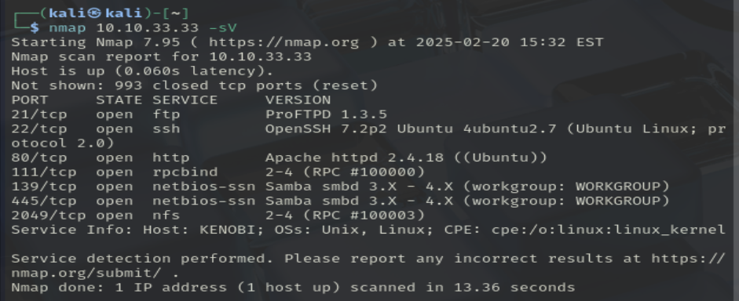
<br>

¿Cosas a destacar?, vemos que existe un smb en el puerto 139 y 445

Podemos usar este comando para sacar un poco más de información y enumerar las carpetas compartidas:

```bash
nmap -p 445 --script=smb-enum-shares.nse,smb-enum-users.nse {ip_target}
```

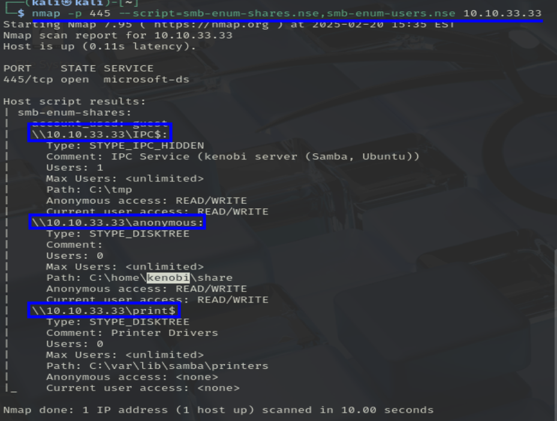
<br>

Vemos que podemos logearnos con un anonymous, vamos a intentar conectarnos desde nuestra kali:
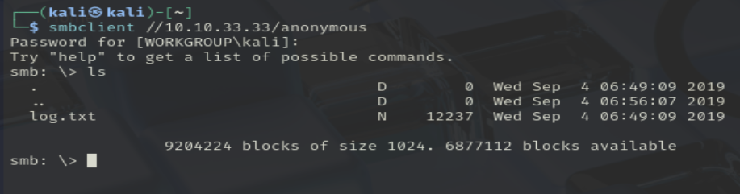
<br>

Al listar los archivos, vemos que existe un archivo log.txt. Podemos descargarlo con `get log.txt`

En el archivo podemos encontrar información relevante como:

- Claves SSG
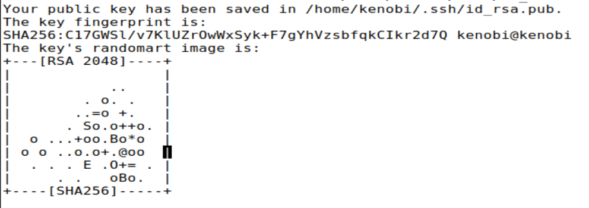

<br>

- Información sobre el servidor ProFTPD
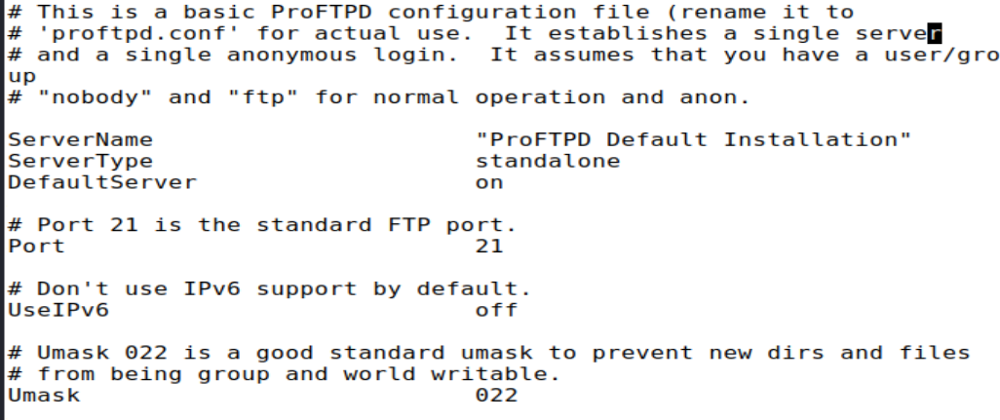
> El servidor FTP se está ejecutando en el puerto 21

<br>

Antes vimos que el puerto 111 estaba abierto con el servicio **RCP**. Vamos a sacar un poco más de información con el siguiente comando:

```bash
nmap -p 111 --script=nfs-ls,nfs-statfs,nfs-showmount {ip_target}
```

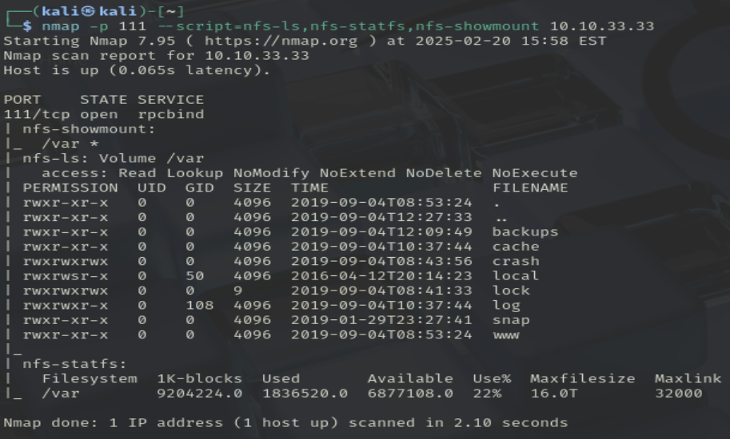
> Vemos que la aplicación tiene montado el directorio /var

<br>

Sigamos viendo el servicio FTP y veamos que versión de ProFTPD tiene instalado:
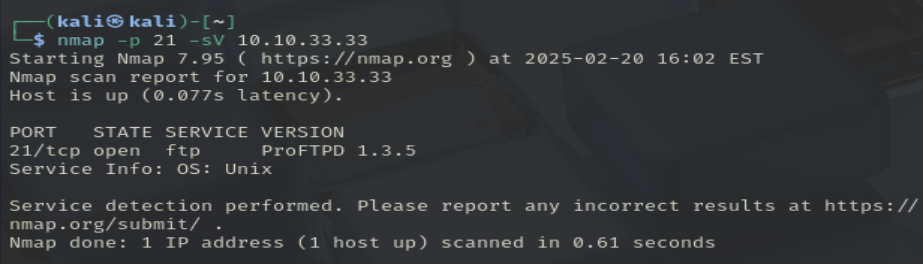

<br>

Es una versión bastante antigua del servicio, podemos buscar a ver si existe algún exploit para esta versión:
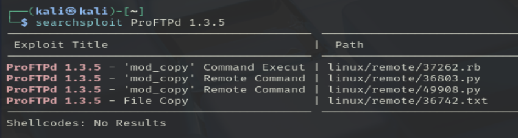
> Tiene 4 en total

<br>

En el log.txt, vimos que existe un usuario *kenobi*, que lo podemos usar en el **FTP**.

<br>

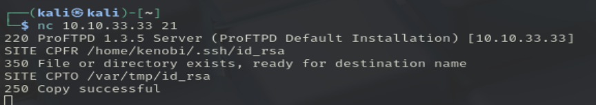
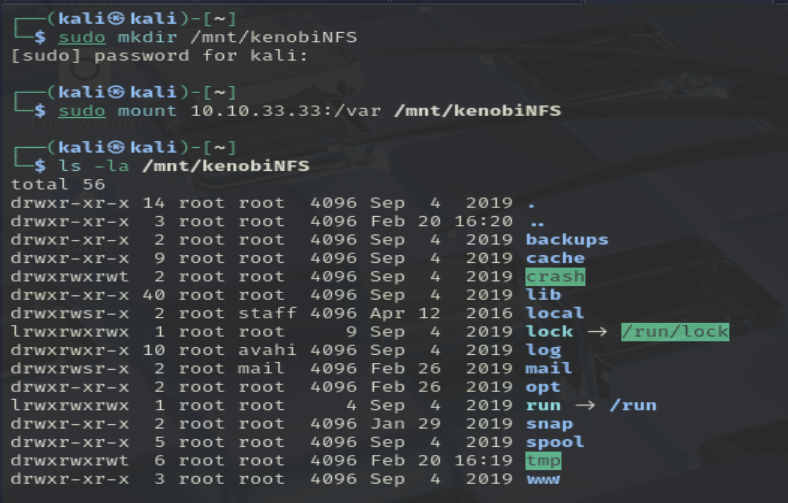

De esta forma, conseguimos copiar los archivos *key* de ssh de la otra máquina a nuestro **PC**.
Nos la copiamos a nuestro directorio, le cambiamos los permisos e iniciamos sesión con ella por ssh:
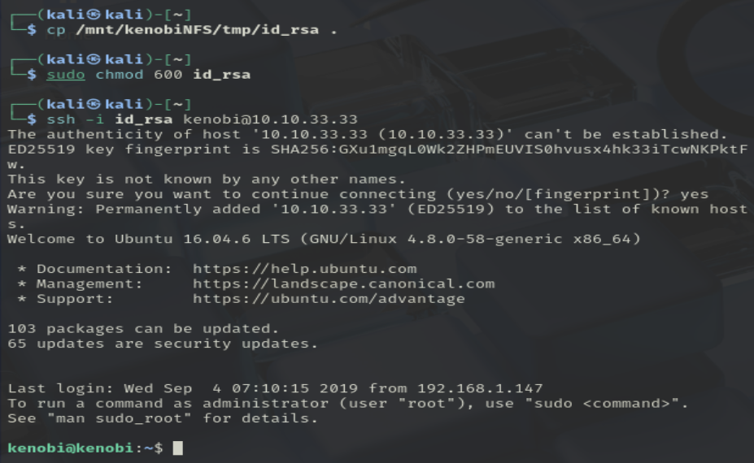

<br>

Sacamos la flag del usuario kenobi:
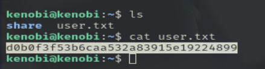
> d0b0f3f53b6caa532a83915e19224899

<br>

Intentemos ahora escalar privilegios. La máquina está preparada para escalar privilegios con permisos de los archivos. Vamos a buscar algún archivo con el SUID activado(esto permite que cualquier usuario pueda ejecutar el archivo con los mismos permisos que el creador de este). Vamos a buscar algún archivo con estas caracteristicas:
```bash
find / -perm -u=s -type f 2>/dev/null
```

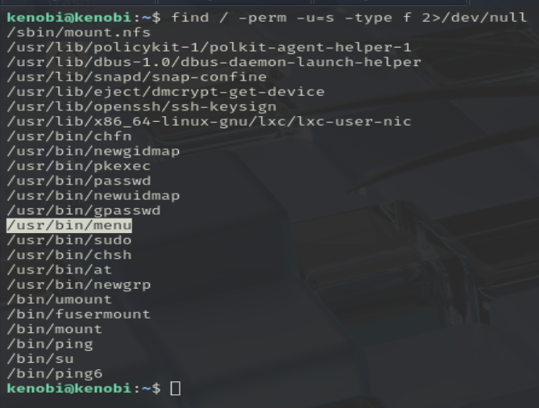

<br>

El único destacable, al menos porque no me suena de nada, es *menu*, voy a ejecutarlo a ver que pasa:
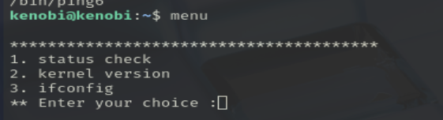

<br>

Parece que este *menu* está ejecutando los siguientes comandos:
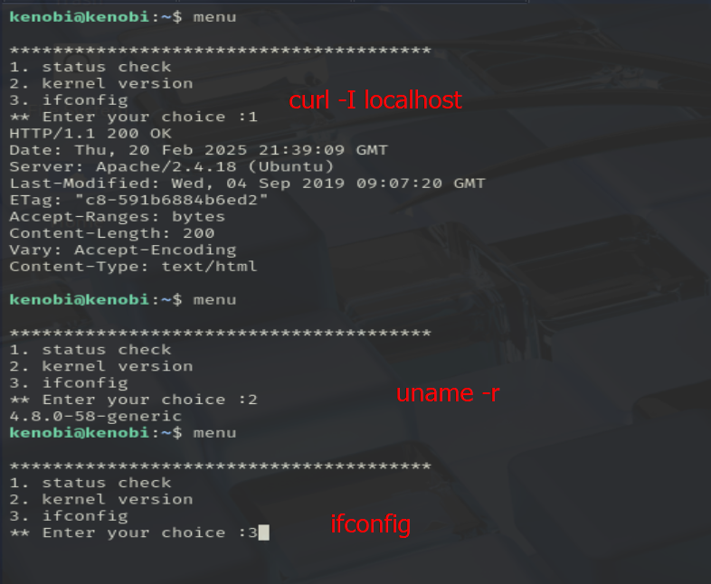

<br>

Ponemos los siguientes comandos en la terminal:
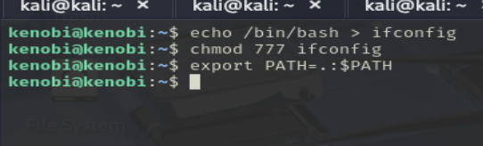

<br>

Esto basicamente esta creando un *script* con el contenido /bin/bash, le da todos los permisos para que la aplicación *menu* lo pueda ejecutar, y exporto el el directorio actual al PATH.

Y si ahora ejecutamos el *menu* y ponemos la opción 3:
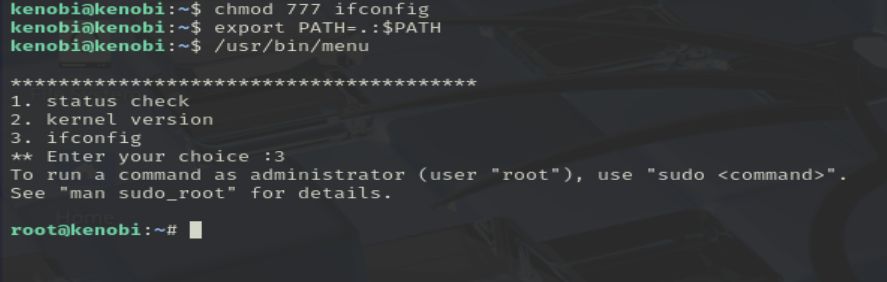

<br>

Somos root.
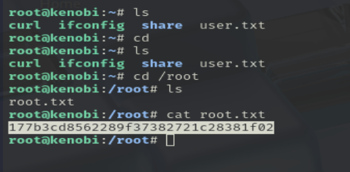